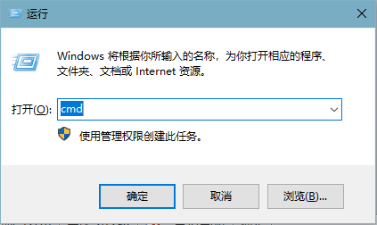
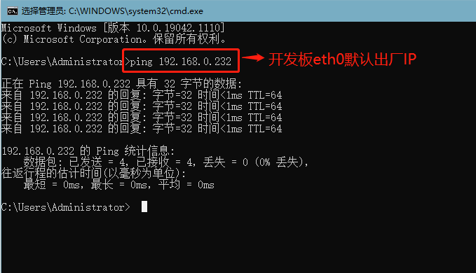
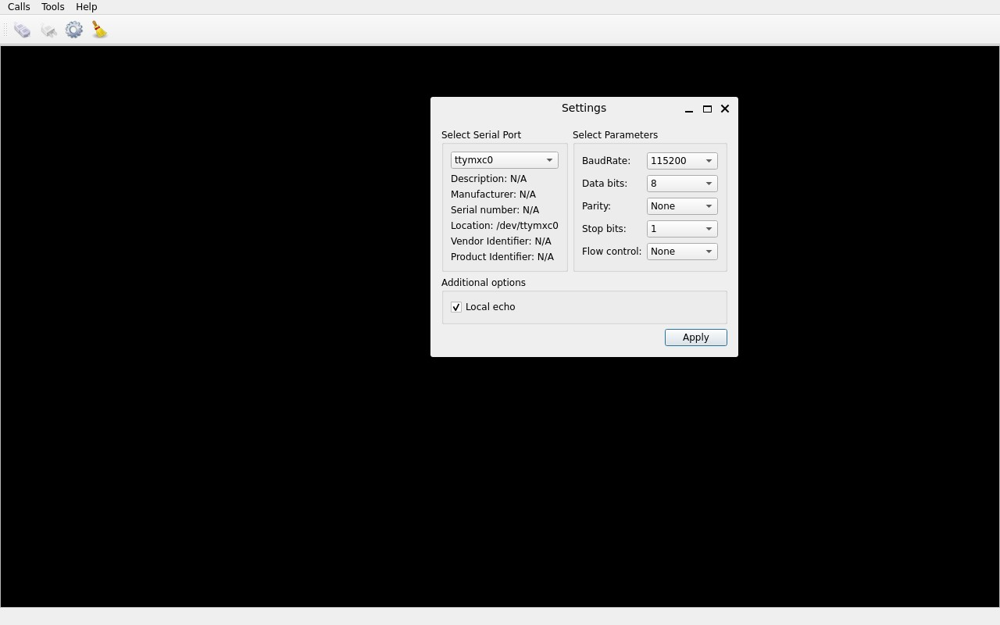
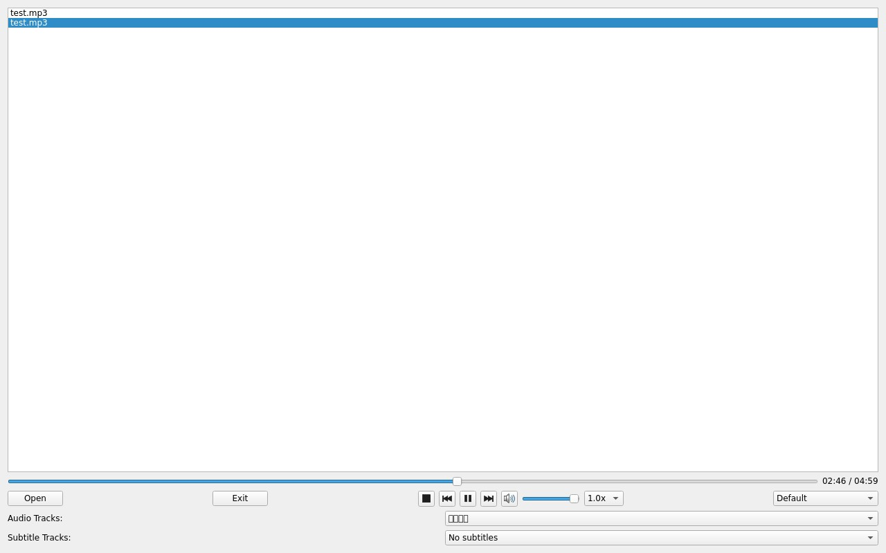
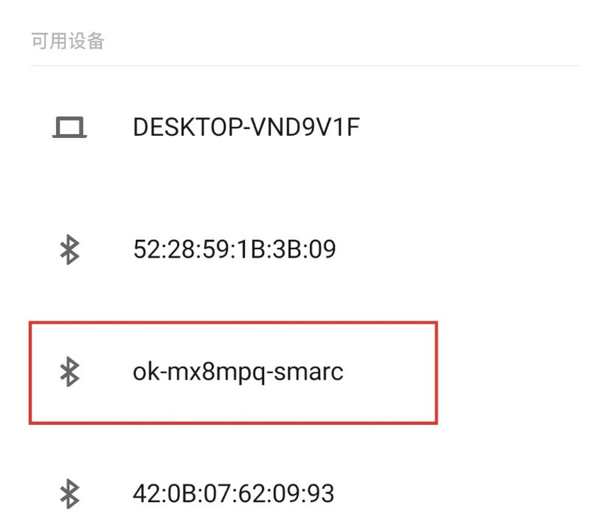

# OK-MX8MPQ-SMARC_Linux6.1.36_User‘s Manual_V1.0

## 1. Development Board Description

### 1.1 OK-MX8MPQ-SMARC Development Board Description

The OK-MX8MPQ-SMARC development board uses a SoM + carrier board architecture, designed based on the NXP i.MX 8M Plus industrial-grade processor. It features a quad-core Arm® Cortex®-A53 CPU with an integrated Neural Processing Unit (NPU) delivering up to 2.3 TOPS of performance and a maximum CPU frequency of 1.6GHz. Supports real-time control via Cortex-M7. Features a powerful control network with CAN FD and dual Gigabit Ethernet, supporting Time-Sensitive Networking (TSN).   
The SoM comes in two options: 2GB LPDDR4 with 16GB eMMC, and 4GB LPDDR4 with 32GB eMMC. OK-MX8MPQ-SMARC development board is rich in interface resources, providing a variety of peripheral interfaces, such as NIC, audio Codec, ADC, TF Card, LVDS, MIPI, WIFI, 4G, 5G, PCIE, serial port, CAN and other functional interfaces.


**Note：**   

**This software manual does not cover hardware specifications. Before using it for software development, please read the hardware manual in the “02-User Documents\\03-Hardware Documents\\02-Manual\\” directory to understand the product naming rules and hardware configuration. This will help you better use the product.**

### 1.2 Introduction to Linux 6.1.36 System Software Resources

| Device| Location of driver source code in the kernel| Device Name
|----------|----------|----------
| NIC Driver| drivers/net/ethernet/freescale/fec\_main.c| /sys/class/net/eth0
| Supports TSN (Time-Sensitive Networking).| drivers/net/ethernet/stmicro/stmmac/dwmac-imx.c| /sys/class/net/eth1
| LCD Backlight Driver| drivers/video/backlight/pwm\_bl.c| /sys/class/backlight/
| LED Driver| drivers/leds/leds-gpio.c| /sys/class/leds/
| USB| drivers/usb/dwc3/| 
| 4/5G| drivers/net/usb/gobi\_net| 
| TF Driver| drivers/mmc/host/sdhci-esdhc-imx.c| /dev/block/mmcblk1pX
| serial port driver| drivers/tty/serial/imx.c| /dev/ttymxc
| watchdog driver| drivers/watchdog/imx2\_wdt.c| /dev/watchdog
| WIFI| drivers/net/wireless/nxp| mlan0
| Audio Driver| sound/soc/codecs/nau8822.c| /dev/snd/
| ecspi| drivers/spi/spi-imx.c| 
| Flexspi| drivers/spi/spi-nxp-fspi.c| 
| I2C driver| drivers/i2c/busses/i2c-imx.c| /dev/i2c
| PWM Driver| drivers/pwm/pwm-imx27.c| /sys/class/pwm/
| GT928 Touch Driver| drivers/input/touchscreen/goodix.c| /dev/input/event
| ft5x06 Touch Driver| drivers/input/touchscreen/edt-ft5x06.c| /dev/input/event
| RTC Driver| drivers/rtc/rtc-pcf8563.c| /dev/rtc0

### 1.3 Flashing and Boot Settings

It supports OTG programming and can boot U-Boot from eMMC, TF card, QSPI Flash (Module SPI), and SPI Flash (Carrier SPI).   
The startup dial-up code is as follows:

| **BOOT**| **4**| **3**| **2**| **1**
|----------|----------|----------|----------|----------
| Carrier SD Card| OFF| **ON**| **ON**| OFF
| Carrier SPI (CS0#)| OFF| **ON**| OFF| OFF
| Module eMMC Flash| OFF| OFF| OFF| **ON**
| Module SPI| OFF| OFF| OFF| OFF
| USB Serial Download| **ON**| X| X| X

Please refer to the “<font style="color:red;">System Flashing</font>" section for specific flashing procedures.

## 2. Fast Startup

### 2.1 Preparation Before Startup

The OK-MX8MPQ-SMARC development board has two system login methods, serial and network login.  

Hardware preparation before system startup:

+ 12V3A DC Power Cable;
+ Debugging serial port cable (used for serial login): The debugging serial port USB Type-C port on the development board allows you to connect the development board and PC using a Type-A to Type-C cable to view the status information of the development board;
+ Network cable (for network login);
+ According to the development board interface to connect the screen (Based on display needs);
+ Check the start mode DIP switch. Please check the DIP switch on your development board and make sure it is set to the desired boot mode. Please refer to the startup mode settings.“<font style="color:blue;">Flashing and Startup Configuration</font>”


### 2.2 Serial Login

#### 2.2.1 Serial Login

**Description:**

+ **Serial port settings: baud rate 115200, data bit 8, stop bit 1, no parity bit, no flow control;**
+ **Serial terminal login as root user, no password, login without account**;
+ **Software: Windows PC requires Super Terminal; choose a familiar serial terminal software.**

Here is an example using Putty to explain how to configure the terminal:   
**Step 1:** Connect the development board and the PC using a serial cable, and verify the serial port number recognized by the computer through the “Device Manager”. The port number recognized by the computer should be considered as the accurate one;   
**Description:**

+ Two serial ports will be generated, and SERIAL-B is the debugging serial port on the Linux side.

**Step 2:** Open and configure PuTTY; set the serial line to match the COM port of your computer with a baud rate of 115200.   


**Step 3:** Turn on the power switch of the development board, and serial port print information will be output until "Welcome to forlinx ok-mx8mpq-smarc" appears, indicating that the boot process is complete. The system defaults to the root account with no password, so you do not need to enter any login information.

#### 2.2.2 Serial Login Common Problems

Common problem troubleshooting points for logging in using the serial port are as follows:

**Case 1:** No information is printed after the serial port is connected:

1. First, check whether the DIP switch is correct;
2. Re-open the serial port;
3. Change a serial port cable to test it;
4. If all of the above still does not work, check the status of the SoM's LED, if it is not a heartbeat light or does not light up, suspect that the system does not start normally, you need to check the system startup, or rewrite it!

**Case 2:** Command cannot be input after serial port is connected:

1. Re-open the serial port;
2. Replace the USB serial port cable with a new USB port on the computer, view the corresponding COM port in the device management, and reopen the serial port;
3. Replace a serial port cable.

**Case 3:** The port was not recognised by Device Manager:

1. Serial port driver is not installed. Try to install serial port driver.

### 2.3 Network Login Methods

#### 2.3.1 Network Connection Test

**Description:**

+ **The default factory IP of eth0 is 192.168. 0. 232 (carrier board GBE1 network port);**
+ **The computer and board should be on the same network segment for testing.**

Before login, ensure the network connection between the computer and the development board is normal, and use the ping command to test the connection status. The specific method of operation is as follows:

1. Connect the development board's GBE1 port to the computer using an Ethernet cable. Power on the board and boot the kernel. Confirm the blue heartbeat LED is blinking. Check the network card connection, ensuring its LED flashes rapidly. Once confirmed, proceed with testing the network connection.

2\. Close the computer firewall (General computer operations, not described here in detail), then open the computer's run command.

****

3\. Use cmd to open the computer administrator interface, and use the ping command to test the network connection status of the computer and the development board.       



The data is returned, and the network connection is normal.

#### 2.3.2 SSH server

**Description:**

+ **Default factory account root for SSH login with no password;**
+ **The default factory IP for eth0 (carrier board GBE1) is 192.168.0.232, and eth1 (carrier board GBE0) uses DHCP to obtain the IP;**
+ **File transfers can be performed with scp or sftp.**   
Plug the Ethernet cable into the GBE0 port on the carrier board to obtain the eth1 IP address.

```plain
root@ok-mx8mpq-smarc:~# ifconfig
eth0: flags=4099<UP,BROADCAST,MULTICAST>  mtu 1500
        ether ae:ae:f7:61:20:20  txqueuelen 1000  (Ethernet)
        RX packets 0  bytes 0 (0.0 B)
        RX errors 0  dropped 0  overruns 0  frame 0
        TX packets 0  bytes 0 (0.0 B)
        TX errors 0  dropped 0 overruns 0  carrier 0  collisions 0

eth1: flags=4163<UP,BROADCAST,RUNNING,MULTICAST>  mtu 1500
        inet 192.168.1.3  netmask 255.255.255.0  broadcast 192.168.1.255
        inet6 2408:8207:78d0:9310:acae:f7ff:fe61:201f  prefixlen 64  scopeid 0x0<global>
        inet6 fe80::acae:f7ff:fe61:201f  prefixlen 64  scopeid 0x20<link>
        ether ae:ae:f7:61:20:1f  txqueuelen 1000  (Ethernet)
        RX packets 6217  bytes 1241331 (1.1 MiB)
        RX errors 0  dropped 0  overruns 0  frame 0
        TX packets 247  bytes 25763 (25.1 KiB)
        TX errors 0  dropped 0 overruns 0  carrier 0  collisions 0
        device interrupt 227

lo: flags=73<UP,LOOPBACK,RUNNING>  mtu 65536
        inet 127.0.0.1  netmask 255.0.0.0
        inet6 ::1  prefixlen 128  scopeid 0x10<host>
        loop  txqueuelen 1000  (Local Loopback)
        RX packets 323  bytes 461862 (451.0 KiB)
        RX errors 0  dropped 0  overruns 0  frame 0
        TX packets 323  bytes 461862 (451.0 KiB)
        TX errors 0  dropped 0 overruns 0  carrier 0  collisions 0

root@ok-mx8mpq-smarc:~#
```


Click "Open", the following dialog box will appear, click "accept" to enter the login interface.


```plain
login as: root
Last login: Sat Mar  4 16:21:40 2023  //root without password
root@ok-mx8mpq-smarc:~#
```

Files can be copied via SFTP using FileZilla (software must be installed by yourself).


### 2.4 System Partition

#### 2.4.1 eMMC Version

The following table is the eMMC memory partition information of Linux operating system:

| **Device Nodes**| **Initial Address**| **Size**| **Partition**| **File system**| **Content**
|----------|----------|----------|----------|----------|----------
| mmcblk2boot0| 0| 4MB| No| No| Uboot Image
| mmcblk2| 0x700000| 0x4000| No| No| Uboot environment variable
| mmcblk2| 0x800000| 120MB| mmcblk2p1| Vfat| Kernel image and device tree, etc
| mmcblk2| 0x8000000| Full eMMC capacity remaining| mmcblk2p2| Ext4| root file system

Use the df command to view disk usage on a system. The following image shows the default disk usage at factory settings (eMMC size: 16GB with a QT file system). This is for reference only; actual parameters may vary.

```plain
root@ok-mx8mpq-smarc:~# df -Th
Filesystem     Type      Size  Used Avail Use% Mounted on
/dev/root      ext4       14G  6.9G  6.0G  54% /
devtmpfs       devtmpfs  589M  4.0K  589M   1% /dev
tmpfs          tmpfs     831M  5.9M  825M   1% /dev/shm
tmpfs          tmpfs     333M  9.3M  323M   3% /run
tmpfs          tmpfs     4.0M     0  4.0M   0% /sys/fs/cgroup
tmpfs          tmpfs     831M  112K  831M   1% /tmp
tmpfs          tmpfs     831M  308K  830M   1% /var/volatile
/dev/mmcblk2p1 vfat      120M   36M   84M  31% /run/media/Boot-mmcblk2p1
tmpfs          tmpfs     167M  4.0K  167M   1% /run/user/0
```

Use the free command to check memory usage. As shown in the figure below, this is the memory usage without any external devices connected (DDR size is 2GB). This is for reference only; please refer to actual parameters for precise information.

```plain
root@ok-mx8mpq-smarc:~# free -m
               total        used        free      shared  buff/cache   available
Mem:            1660         366        1063          24         343        1293
Swap:              0           0           0
```

### 2.5 System Shutdown

In general, the power can be turned off directly, if there is data storage, function use and other operations, do not arbitrarily disconnect the power during the operation, in order to prevent irreversible damage to the file, you can only re-burn the firmware. To ensure the data is completely written, enter the sync command to synchronize the data before turning off the power.   
The command ‘reboot’ can be used to restart the development board. You can also restart the hardware by pressing the RESET key or directly power off and restart.   
Note: If the product designed by the user based on the core board has an abnormal system shutdown due to an accidental power loss in use, measures such as power-down protection can be incorporated into the design.

## 3. Platform Interface Function Use and Test

**Description:**

+ **Users should follow this section when using the screen with the QT file system, but can skip it for non- QT operations;**
+ **This chapter focuses on describing the functionalities in Qt. It is assumed that the default device is connected properly and the drivers are loaded correctly during testing. It is recommended to test the command line functionalities before testing the interface functionalities;**
+ **QT test program source code path:okmx8mp-smarc-appsrc.tar.zst**;
+ **Path to the test program in the development board file system: /usr/bin/fltest\_qt\_\***.

This chapter mainly explains the usage of the expansion interfaces on the development board in QT interface. The testing program is only for reference, and users need to make adjustments based on their actual situations when using it.

### 3.1 Introduction to Interface Function

The desktop is displayed as follows after the board is booted:   
**Note: Icon order may vary.**

### 3.2 Network Configuration Test

**Description:**

+ **By default, only the eth0 network interface (GBE1 port on the carrier board) is set to STATIC mode;**

+ **The set IP and other information will be saved to the relevant configuration file (/etc/systemd/network directory) of the system, so the network information set this time will be used every time the system is restarted.**   

  Icon

   Clicking on the network configuration icon will open a interface program that supports two modes: STATIC and DHCP.

**STATIC Mode** 

After clicking on the network configuration icon, select the STATIC mode as shown in the figure. You can then configure the IP address, subnet mask, gateway, and DNS settings. Once you have set the parameters, click on "Apply and Restart Network".

| **Relevant Parameter**| **Meaning**
|----------|----------
| interface| 0 Set up the network card
| ip| Set the IP address
| netmask| Set the subnet mask
| gateway| Set up the gateway
| dns| Set DNS


The DHCP mode interface is as follows:   
**Note: The test must be conducted under a router that can automatically assign IP addresses.**

Select DHCP, then choose the network card device to be configured in the "interface". Click "Apply and Restart Network" at the bottom of the interface, and the network will automatically restart and an IP address will be automatically obtained.   
Restart the development board, and you can see that the network configuration is in effect.   
**Note: If you configure eth0 with a static IP and eth1 with a dynamic IP simultaneously, it may cause routing abnormalities. If you encounter network connectivity issues, it is recommended to check the routing table. It is recommended to configure only one network port at a time.**

### 3.3 OpenGL Test

Icon：   
OK-MX8MPQ-SMARC supports EGL 1.5，OpenGL ES2.0.   
Click the icon to enter the OpenGL test interface.

### 3.4 4G/5G Test

Icon：   
"4G" test program is used to test the OK-MX8MPQ-SMARC external 4G module (EM05-CE), 5G module (RM500U-CN, RM500Q-GL). Before the test, please power off the development board, connect the module, insert the SIM card (pay attention to the direction of the SIM card), toggle the switch (S4) to select the 4G, 5G mode, and start the development board to open the test application. This test takes 4G as an example:   
  
Click the "connect" button, the program will automatically enter the dial-up process and get the IP settings DNS, etc., wait a few seconds, and click the ping button to test.

### 3.5 UART Test

Icon：   
In this test, the carrier board uart3 (ttymxc0) and the carrier board USB to UART (/dev/ttyCH343USB) are used, and the pins 1 and 2 of the pin header of the development board P27 are short-circuited with pins 4 and 5 respectively to conduct the serial port test.

1. Click the UART test icon to enter the test application interface, click the gear iconsetting button in the upper left corner, and set the serial port parameters as shown in the figure below:

| **Relevant Parameter**| **Meaning**
|----------|----------
| Select Serial Port| Set the serial port (select ttymxc0)
| BaudRate| Set baud rate (115200)
| Data bits| Set data bits (8 bits)
| Parity| Set parity bit (no parity)
| Stop bits| Set stop bit (1 bit)
| Flow control| Set flow control (no flow control)



2. After setting the serial port parameters, click theconnection button in the upper left corner. At this time, the test program can carry out the data receiving and sending test.   

3. Run the serial port send test command in the terminal. The received data will be displayed on the screen.

```plain
root@ok-mx8mpq-smarc:~# fltest_uarttest -d /dev/ttyCH343USB  -w 
tx_0: XEiNKcpIXrzQF4t9PqirDCTqWKgLnKoK
```


4. Run the serial port receive test command in the terminal. When you click the test interface, a virtual keyboard will appear. After entering 32 consecutive characters, the terminal will print the data sent by QT.

```plain
root@ok-mx8mpq-smarc:~# fltest_uarttest -d /dev/ttyCH343USB  -r
rx_0: 12345678901234567890123456789012
root@ok-mx8mpq-smarc:~#
```

**Note: The data input by the soft keyboard will not be displayed on the test interface until the Enter key is pressed.**

### 3.6 WIFI Test

**Description:**

+ **The OK-MX8MPQ-SMARC SoM is soldered with the AW-CM276 NF WiFi chip and supports 2.4 GHz/5 GHz.**

"WIFI" is a tool for configuring and testing the STA (station) mode of Wi-Fi.   
1\. Click on the iconto enter the test interface. From the dropdown menu, select the corresponding module. In the SSID, input the name of the router you want to connect. In the PAWD, input the router's password. Then, click "connect" to establish a WiFi connection with the router.   
2. “Click” ping to test the network after a successful connection.

### 3.7 RTC Test

**Note: Ensure that button cell batteries are installed on the board and the battery voltage is normal.** 

Icon：   
RTC test includes setting time, power cycling, rerunning test software, and verifying RTC sync.   
Run the RTC test software to view and set the current system time with the following interface:   
After SET, users can set the time and click Save to finish the settings. After powering off and waiting, reboot and rerun the RTC test software to synchronize and confirm the RTC test is normal.

### 3.8 Watchdog Test

Icon：   
"WatchDog” tests the functionality of the watchdog feature. Interface as follows:   
Check ” feed dog and click the open watchdog key, then the watchdog will be activated, the program will carry out the feeding operation, and the system will not reboot under normal circumstances; when unchecking ” feed dog and clicking open watchdog key, the watchdog function will be activated, the program will not carry out the feeding operation, and the system enters into a reboot after the watchdog is activated for about 10s, which indicates that the watchdog function is normal.

### 3.9 Ping Test

Icon：   
"Ping" is a graphical tool for network testing, offering a user-friendly interface for ping operations.   
Write the target ip needing ping in the hostname field;  after clicking the ping button, the RESULT column will indicate the result, click stop to end the ping test and clear to clean the information in the result.   
As shown in the figure, the network connection is smooth.

### 3.10 Camera Test

Icon：   
Click the icon to enter the camera test program and insert the USB camera.   
**Note: if the CSI ov5645 camera is used, please disconnect the power and plug it; the current test program does not support basler \_ camera.**  
  
Please select camera video to set the device node, camera resolution to set the resolution, click the start button to start camera acquisition, click the stop button to stop camera acquisition, click the picture button to take a picture, and save the path and file name of the picture.   
Take the Logitech UVC camera as an example to conduct the camera test.   
After Start, click the picture button to take a picture, the file save directory is /home/root/, and the format is jpg, please select the appropriate tool on Windows to view.

### 3.11 Backlight Test

Icon：   
"BackLight" is an LCD backlight adjustment App with a left-right progress bar for brightness control. Click to open the interface as follows:   
Drag the slider corresponding to the screen in the interface to set the Lcd backlight brightness, level 1 is the lowest brightness, and 255 is the highest brightness. Forlinx has made restrictions on this application. It is not allowed to use the QT application to completely turn off the backlight. If you want to completely turn off the backlight, please use the command line program or modify the QT test routine.

### 3.12 Play/Record Test

Icon：   
Before conducting the audio recording test, please insert the prepared microphone into the mic port. Click the icon to enter the recording test application, which can be used to check if the sound card recording function is working properly.   
Select the location to save the recording file, press the "Start" button to start recording, press the "Stop" button to stop recording, click the Audio Codec radio box to select "Wave", click the FILE Container radio box to select "Wave File", click the Channels radio box to select 2, and the interface is as follows:   
Click the Record button to test the recording. The recording file is saved to the/tmp/record \_ \*.wav file in the root directory.   
Note: The/TMP directory is tmpfs and the files in it are not saved after reboot.

### 3.13 Music Play Test

Icon：   
"music player" is a simple audio test application that can be used to test the function of the sound card or as a simple audio player.   
  
Application interface 

Click the button in the lower left corner and select Test Audio/home/forlinx/audio/test.mp3. 

Please note the audio device during playback, which is HDMI by default.

### 3.14 Qml Video Playback Test

Icon：   
Qml Video supports video playback in H264 and H265 formats, with a maximum of 1080p 60fps.   
The qml video test program can play video based on qml. Click the icon to enter the test program interface.   
Click Select File 1 at the top to select the video file. The path of the test video file is shown in the following figure:   
Click Full Screen-inverted to start playing the video in full screen.

### 3.15 Browser Test

Icon：   
**Note: Before testing, check whether the time of the development board is accurate. If the time of the development board is abnormal, it will cause certificate problems. Check the network.**   
Click the icon to enter the browser interface and enter the official website of forlinx by default.

## 4. Command Line Tool Application and Test

OK-MX8MPQ-SMARC platform has a wealth of built-in command line tools and FORLINX test programs available to users.   
FORLINX test program source code path：okmx8mp-smarc-appsrc.tar.zst  
test program path：/usr/bin

### 4.1 System Information Query

To view the kernel information, enter the following command:

```plain
root@ok-mx8mpq-smarc:~# uname -a
Linux ok-mx8mpq-smarc 6.1.36 #5 SMP PREEMPT Thu Mar 21 18:26:21 CST 2024 aarch64 GNU/Linux
```

To view CPU information:

```plain
root@ok-mx8mpq-smarc:~# cat /proc/cpuinfo
processor       : 0
BogoMIPS        : 16.00
Features        : fp asimd evtstrm aes pmull sha1 sha2 crc32 cpuid
CPU implementer : 0x41
CPU architecture: 8
CPU variant     : 0x0
CPU part        : 0xd03
CPU revision    : 4

processor       : 1
BogoMIPS        : 16.00
Features        : fp asimd evtstrm aes pmull sha1 sha2 crc32 cpuid
CPU implementer : 0x41
CPU architecture: 8
CPU variant     : 0x0
CPU part        : 0xd03
CPU revision    : 4

processor       : 2
BogoMIPS        : 16.00
Features        : fp asimd evtstrm aes pmull sha1 sha2 crc32 cpuid
CPU implementer : 0x41
CPU architecture: 8
CPU variant     : 0x0
CPU part        : 0xd03
CPU revision    : 4

processor       : 3
BogoMIPS        : 16.00
Features        : fp asimd evtstrm aes pmull sha1 sha2 crc32 cpuid
CPU implementer : 0x41
CPU architecture: 8
CPU variant     : 0x0
CPU part        : 0xd03
CPU revision    : 4
```

View environment variable information:

```plain
root@ok-mx8mpq-smarc:~# env
SHELL=/bin/sh
EDITOR=vi
QTWEBENGINE_DISABLE_SANDBOX=1
PWD=/home/root
LOGNAME=root
XDG_SESSION_TYPE=tty
MOTD_SHOWN=pam
HOME=/home/root
LANG=en_US.utf8
WAYLAND_DISPLAY=/run/wayland-0
QT_QPA_PLATFORM=wayland
XDG_SESSION_CLASS=user
TERM=linux
USER=root
SHLVL=1
XDG_SESSION_ID=c2
XDG_RUNTIME_DIR=/run/user/0
PS1=\u@\h:\w\$ 
LC_ALL=en_US.utf8
HUSHLOGIN=FALSE
PATH=/usr/local/bin:/usr/bin:/bin:/usr/local/sbin:/usr/sbin:/sbin
DBUS_SESSION_BUS_ADDRESS=unix:path=/run/user/0/bus
MAIL=/var/spool/mail/root
_=/usr/bin/env
```

### 4.2 Frequency Test

**Note: This process changes all CPU cores at the same time.**   
1\. All cpufreq governor types supported in the current kernel:

```plain
root@ok-mx8mpq-smarc:~# cat \
/sys/devices/system/cpu/cpufreq/policy0/scaling_available_governors
conservative ondemand userspace powersave performance schedutil
```

The default mode is ondemand. In this mode, the CPU frequency will be adjusted according to the demand. Check the current CPU freq governor type:

```plain
root@ok-mx8mpq-smarc:~# cat /sys/devices/system/cpu/cpufreq/policy0/scaling_governor
ondemand
```

To view the current frequency:

```plain
root@ok-mx8mpq-smarc:~# cat /sys/devices/system/cpu/cpufreq/policy0/scaling_cur_freq
1200000
```

2\. To view the frequency gears supported by the CPU:

```plain
root@ok-mx8mpq-smarc:~# cat \
/sys/devices/system/cpu/cpufreq/policy0/scaling_available_frequencies
1200000 1600000
```

3\. You can adjust the CPU frequency directly, setting governor to userspace

```plain
root@ok-mx8mpq-smarc:~# echo userspace > \
/sys/devices/system/cpu/cpufreq/policy0/scaling_governor
```

Set frequency and view:

```plain
root@ok-mx8mpq-smarc:~# echo 1600000 > \
/sys/devices/system/cpu/cpufreq/policy0/scaling_setspeed
root@ok-mx8mpq-smarc:~# cat /sys/devices/system/cpu/cpufreq/policy0/scaling_cur_freq
1600000
```

### 4.3 Temperature Test

View the temperature value:

```plain
root@ok-mx8mpq-smarc:~# cat /sys/class/thermal/thermal_zone0/temp
64000
```

The temperature value is 64°C.

### 4.4 DDR Bandwidth Test:

```plain
root@ok-mx8mpq-smarc:~# fltest_memory_bandwidth.sh
L1 cache bandwidth rd test with # process
0.008192 22223.96
0.008192 22476.32
0.008192 22313.32
0.008192 22485.39
0.008192 22367.47
L2 cache bandwidth rd test
0.131072 9715.20
0.131072 9754.08
0.131072 9699.33
0.131072 9713.46
0.131072 9705.50
Main mem bandwidth rd test
52.43 2865.59
52.43 2865.27
52.43 2853.42
52.43 2861.37
52.43 2862.46
L1 cache bandwidth wr test with # process
0.008192 19519.52
0.008192 19523.07
0.008192 19526.63
0.008192 19503.99
0.008192 19525.18
L2 cache bandwidth wr test
0.131072 10508.58
0.131072 11262.22
0.131072 11534.91
0.131072 11543.55
0.131072 11526.86
Main mem bandwidth wr test
52.43 1237.20
52.43 1235.22
52.43 1267.74
52.43 1255.57
52.43 1248.81
```

The lpDDR4 bandwidth of the OK-MX8MPQ-SMARC is shown above, with a read bandwidth of about 2800M/s and a write bandwidth of about 1250M/s.

### 4.5 Watchdog Test

Watchdog is a frequently used function in embedded systems, and the device node for the watchdog in OK-MX8MPQ-SMARC is /dev/watchdog.   
Use fltest\_watchdog to start the watchdog, set the reset time to 10s, and feed the dog regularly. This command will turn on the watchdog and perform the dog-feeding operation, so the system will not reboot.

```plain
root@ok-mx8mpq-smarc:~# fltest_watchdog -t10 -c
Watchdog Ticking Away!
```

When ctrl + C is used to end the test procedure, the dog feeding is stopped, the watchdog is in the open state, and the system is reset after 10s; If you do not want to reset, please enter the command to close the watchdog within 10 seconds after the end of the program:

```plain
root@ok-mx8mpq-smarc:~# fltest_watchdog -d                      //Turn off the watchdog
```

Start the watchdog, set the reset time for 10s, and do not feed the dog. This command turns on the watchdog, but does not feed the dog, and the system restarts after 10 seconds.

```plain
root@ok-mx8mpq-smarc:~# fltest_watchdog -t10 -e
```

### 4.6 RTC Function Test

**Note: Ensure that button cell batteries are installed on the board and the battery voltage is normal.**   
RTC test: The main way to set the software and hardware time is by using the date and hwclock utilities. When performing the board power-down and power-up test, the software clock reads whether the RTC clock is synchronized or not.

```plain
root@ok-mx8mpq-smarc:~# date -s "2024-03-22 11:59:30"	           //Set the software time
Fri Mar 22 11:59:30 AM CST 2024
root@ok-mx8mpq-smarc:~# hwclock -w			           //Synchronize software time to hardware time
root@ok-mx8mpq-smarc:~# hwclock -r			                       //Display hardware time
2024-03-22 12:00:07.037836+08:00
```

Then power off and power on the development board, read the system time after entering the system, and you can see that the time has been synchronized.

```plain
root@ok-mx8mpq-smarc:~# date
Fri Mar 22 12:01:22 PM CST 2024
```

### 4.7 UART Test

OK-MX8MPQ-SMARC development board is equipped with 4 UART ports, which are labeled on the board as follows:

| **UART**| **Device Nodes**| **Description**
|----------|----------|----------
| UART3| ttymxc0| RS485 level, can be used for this test.
| UART1| ttymxc1| The debug serial port cannot be used for this test.
| UART0| ttymxc2| The Bluetooth interface cannot be used for this test.
| UART2| ttymxc3| The debug serial port cannot be used for this test.
| CH343USB| ttyCH343USB| RS485 level, can be used for this test.

The maximum baud rate supported by 485 is 4000000, supports parity check, CS5, CS6, CS7, CS8, and 1bit and 2bit stop bits.   
In this test, ttymxc0 and ttymxc2 are used to test the serial port by short-circuiting pins 1 and 4, pins 2 and 5, pins 3 and 6 of P27 respectively.


```plain
root@ok-mx8mpq-smarc:~# fltest_uarttest -d /dev/ttymxc0 -r &
[2]1166
root@ok-mx8mpq-smarc:~# fltest_uarttest -d /dev/ttyCH343USB0 -w
tx_0: wmfUOEUt097eLdSudH1ByJCY67DOP0DL
rx_0: wmfUOEUt097eLdSudH1ByJCY67DOP0DL
[2]+  Done                    fltest_uarttest -d /dev/ttymxc0 -r
root@ok-mx8mpq-smarc:~#
```

### 4.8 PCIE

Before powering up the system, insert the PCIE module into the PCIE card slot on the carrier board. After powering on and starting Linux, you can see that the corresponding device is enumerated successfully through lspci. Taking the Intel 82574L NIC as an example, the successful enumeration is shown below:

```plain
root@ok-mx8mpq-smarc:~# lspci
00:00.0 PCI bridge: Synopsys, Inc. DWC_usb3 / PCIe bridge (rev 01)
01:00.0 Ethernet controller: Intel Corporation 82574L Gigabit Network Connection
```

Due to the many types of pcie devices, it may not be supported by the kernel by default, so you need to add the corresponding driver for the compiled device by yourself.

### 4.9 TF Test

**Description:**

+ **The SD card mount directory is /run/media/ and supports hot-swapping;**
+ **If the file system doesn't support NTFS, format the TF card as FAT32 before use, especially if unsure of its current format.**
+ **After inserting the TF card, the device node is "/dev/mmcblk1 \*". **

1. Insert the TF card into the TF card slot on the carrier board. The printed information is as follows:

```plain
[ 4075.276047] mmc1: host does not support reading read-only switch, assuming write-enable
[ 4075.311963] mmc1: new ultra high speed SDR104 SDHC card at address 5048
[ 4075.328510] mmcblk1: mmc1:5048 SD32G 29.7 GiB 
[ 4075.334519]  mmcblk1: p1
```

2. Check the mount directory:   

The TF card mount directory is as follows:

```plain
root@ok-mx8mpq-smarc:~# ls /run/media/               //List files in the/run/media directory
boot-mmcblk1p1  Boot-mmcblk2p1
```

3. Write test:   

**Note: Please ensure that there is enough space in the TF card partition before writing**.

```plain
root@ok-mx8mpq-smarc:~# dd if=/dev/zero of=/run/media/boot-mmcblk1p1/test.bin \
bs=1M count=200 conv=fsync oflag=direct
200+0 records in
200+0 records out
209715200 bytes (210 MB, 200 MiB) copied, 10.7905 s, 19.4 MB/s
```

4. Read test:                                                                          

**Note: To make sure the data is accurate, please restart the development board and test the reading speed.**

```plain
root@ok-mx8mpq-smarc:~# dd if=/run/media/boot-mmcblk1p1/test.bin of=/dev/null \
bs=1M count=200 iflag=direct
200+0 records in
200+0 records out
209715200 bytes (210 MB, 200 MiB) copied, 2.59015 s, 81.0 MB/s
```

5. After using the TF card, uninstall it with umount before ejecting it.

```plain
root@ok-mx8mpq-smarc:~# umount /run/media/boot-mmcblk1p1
```

**Note: Plug and unplug the TF card after exiting the TF card mounting path.**

### 4.10 EMMC Test

The OK-MX8MPQ-SMARC platform eMMC runs in HS400 mode 200MHz clock by default. The following is a simple eMMC read/write speed test: taking the read/write ext4 file system as an example.   
Write test:

```plain
root@ok-mx8mpq-smarc:~# dd if=/dev/zero of=/data.img bs=1M count=500 conv=fsync oflag=direct
500+0 records in
500+0 records out
524288000 bytes (524 MB, 500 MiB) copied, 4.43111 s, 118 MB/s
```

Read test：   
**Note: To make sure the data is accurate, please restart the development board and test the reading speed**.

```plain
root@ok-mx8mpq-smarc:~# dd if=/data.img of=/dev/null bs=1M count=500 iflag=direct
500+0 records in
500+0 records out
524288000 bytes (524 MB, 500 MiB) copied, 2.80064 s, 187 MB/s
```

### 4.11 USB

The OK-MX8MPQ-SMARC supports 1 x USB 3.0 port, 3 x USB 2.0 ports, and 1 x OTG port (which only supports Host mode; Device mode is only available for firmware flashing). Users can connect USB mouse, USB keyboard, U disk and other devices on the on-board USB HOST interface, and support the hot plug of the above devices.   
**Description:**

+ **Support hot-plugging of USB flash drive devices;**
+ **If NTFS isn't supported and you're unsure of the USB drive's format, it's best to format it to FAT32 before using it.**

#### 4.11.1 USB2.0

Connect the USB mouse to the USB interface of the OK-MX8MPQ-SMARC platform, and the print information of the serial port terminal is as follows:

```plain
[   28.641316] usb 3-1.1: new low-speed USB device number 4 using xhci-hcd
[   28.805272] input: Elan Lenovo USB Optical Mouse as /devices/platform/soc@0/32f10108.usb/38200000.usb/xhci-hcd.1.auto/usb3/3-1/3-1.1/3-1.1:1.0/0003:17EF:608D.0001/input/input4
[   28.821934] hid-generic 0003:17EF:608D.0001: input: USB HID v1.11 Mouse [Elan Lenovo USB Optical Mouse] on usb-xhci-hcd.1.auto-1.1/input0
```

At this time, the arrow cursor appears on the screen, the mouse can work normally.   
Next, take the U disk as an example for demonstration.   
The terminal prints information about the USB flash drive, and since many types of USB flash drives exist, the information displayed may vary:   

1. After the development board starts, insert the USB disk into the USB2.0 host interface on the development board.   
   Serial port information: 

```plain
[  343.438673] usb 3-1.1: new high-speed USB device number 4 using xhci-hcd
[  343.547026] usb-storage 3-1.1:1.0: USB Mass Storage device detected
[  343.553832] scsi host0: usb-storage 3-1.1:1.0
[  344.581363] scsi 0:0:0:0: Direct-Access     SCSI     DISK             1.00 PQ: 0 ANSI: 4
[  344.590662] sd 0:0:0:0: [sda] 31223936 512-byte logical blocks: (16.0 GB/14.9 GiB)
[  344.598526] sd 0:0:0:0: [sda] Write Protect is off
[  344.603887] sd 0:0:0:0: [sda] No Caching mode page found
[  344.609236] sd 0:0:0:0: [sda] Assuming drive cache: write through
[  344.617388]  sda: sda1
[  344.620171] sd 0:0:0:0: [sda] Attached SCSI removable disk
```

2. Check the mount directory:

```plain
root@ok-mx8mpq-smarc:~# ls /run/media/
Boot-mmcblk2p1  sda1
```

sda1 is the first partition of the first connected USB storage device, and so on.  

3. View the contents of the USB flash drive.：

```plain
root@ok-mx8mpq-smarc:~# ls -l /run/media/sda1
total 4096000
-rwxrwx--- 1 root disk 4194304000 Mar 22 16:34 test
```

4. Write test: Write speeds are limited by the specific storage device:

```plain
root@ok-mx8mpq-smarc:~# dd if=/dev/zero of=/run/media/sda1/test bs=100M count=40 \
conv=fsync oflag=direct
40+0 records in
40+0 records out
4194304000 bytes (4.2 GB, 3.9 GiB) copied, 354.351 s, 11.8 MB/s
```

5. Read test:   

**Note: To make sure the data is accurate, please restart the development board and test the reading speed.**

```plain
root@ok-mx8mpq-smarc:~# dd if=/run/media/sda1/test of=/dev/null bs=100M iflag=direct
40+0 records in
40+0 records out
4194304000 bytes (4.2 GB, 3.9 GiB) copied, 172.192 s, 24.4 MB/s
```

6. Before removing the USB flash drive, it's necessary to unmount it using ''umount''.

```plain
root@ok-mx8mpq-smarc:~# umount /run/media/sda1
```

Unmount the path before removing the USB flash drive.

#### 4.11.2 USB3.0

Use mounting a USB flash drive as an example for demonstration.   
The terminal prints information about the USB flash drive, and since many types of USB flash drives exist, the information displayed may vary:   

1. After the development board starts up, insert the USB flash drive into the USB 3.0 port of the board.   
   Serial port information:

```plain
[  163.749673] usb 4-1: new SuperSpeed USB device number 2 using xhci-hcd
[  163.798105] usb-storage 4-1:1.0: USB Mass Storage device detected
[  163.806026] scsi host0: usb-storage 4-1:1.0
[  164.838542] scsi 0:0:0:0: Direct-Access     Kingston DataTraveler 3.0      PQ: 0 ANSI: 6
[  164.847731] sd 0:0:0:0: [sda] 241660916 512-byte logical blocks: (124 GB/115 GiB)
[  164.855892] sd 0:0:0:0: [sda] Write Protect is off
[  164.861012] sd 0:0:0:0: [sda] Write cache: disabled, read cache: enabled, doesn't support DPO or FUA
[  164.872657]  sda: sda1
[  164.875497] sd 0:0:0:0: [sda] Attached SCSI removable disk
```

2. Check the mount directory:

```plain
root@ok-mx8mpq-smarc:~# ls /run/media/
Boot-mmcblk2p1  sda1
```

sda1 is the first partition of the first connected USB storage device, and so on.  

3. View the contents of the USB flash drive.：：

```plain
root@ok-mx8mpq-smarc:~# ls -l /run/media/sda1
total 4096000
-rwxrwx--- 1 root disk 4194304000 Mar 22 16:34 test
```

4. Write test: Write speeds are limited by the specific storage device:

```plain
root@ok-mx8mpq-smarc:~# dd if=/dev/zero of=/run/media/sda1/test bs=100M count=40 \
conv=fsync oflag=direct
40+0 records in
40+0 records out
4194304000 bytes (4.2 GB, 3.9 GiB) copied, 197.547 s, 21.2 MB/s
```

5. Read test:   

**Note: To make sure the data is accurate, please restart the development board and test the reading speed.**

```plain
root@ok-mx8mpq-smarc:~# dd if=/run/media/sda1/test of=/dev/null bs=100M iflag=direct
40+0 records in
40+0 records out
4194304000 bytes (4.2 GB, 3.9 GiB) copied, 37.7027 s, 111 MB/s
```

6. Before removing the USB flash drive, it's necessary to unmount it using ''umount''.   

root@ok-mx8mpq-smarc:~# umount /run/media/sda1  
**Note: Unplug the USB flash disk after exiting the mount path.**

#### 4.11.3 Micro-USB

Micro-USB can be used as the HOST side; for example, this is demonstrated by mounting a USB flash drive.   

1. After the development board starts, connect the USB flash drive to the Micro-USB port using a USB cable.   
   Serial port information:

```plain
[  109.407327] usb 1-1: new high-speed USB device number 2 using xhci-hcd
[  109.564425] usb-storage 1-1:1.0: USB Mass Storage device detected
[  109.571876] scsi host0: usb-storage 1-1:1.0
[  110.597987] scsi 0:0:0:0: Direct-Access      USB      SanDisk 3.2Gen1 1.00 PQ: 0 ANSI: 6
[  110.607733] sd 0:0:0:0: [sda] 60125184 512-byte logical blocks: (30.8 GB/28.7 GiB)
[  110.616255] sd 0:0:0:0: [sda] Write Protect is off
[  110.621442] sd 0:0:0:0: [sda] Write cache: disabled, read cache: enabled, doesn't support DPO or FUA
[  110.645161]  sda: sda1
[  110.647846] sd 0:0:0:0: [sda] Attached SCSI removable disk
```

2. Check the mount directory:

```plain
root@ok-mx8mpq-smarc:~# ls /run/media/
Boot-mmcblk2p1  sda1
```

"sda1" represents the first partition of the first USB storage device inserted, and so forth. 

3. Write test: The write speed is limited by the specific storage device.

```plain
root@ok-mx8mpq-smarc:~# dd if=/dev/zero of=/run/media/sda1/test bs=100M count=40 \
conv=fsync oflag=direct
40+0 records in
40+0 records out
4194304000 bytes (4.2 GB, 3.9 GiB) copied, 283.871 s, 14.8 MB/s
```

4. Read the test:   

**Note: To make sure the data is accurate, please restart the development board and test the reading speed.**

```plain
root@ok-mx8mpq-smarc:~# dd if=/run/media/sda1/test of=/dev/null bs=100M iflag=direct
40+0 records in
40+0 records out
4194304000 bytes (4.2 GB, 3.9 GiB) copied, 131.639 s, 31.9 MB/s
```

```plain
root@ok-mx8mpq-smarc:~# umount /run/media/sda1
```

5. Before removing the USB flash drive, it's necessary to unmount it using ''umount''.   

**Note: Unplug the USB disk after exiting the mount path.**

The Micro-USB port can also be used as a device interface. To enable this, modify the dr\_mode of the usb\_dwc3\_0 node in the device tree to peripheral, then recompile the device tree, replace it on the development board, and reboot the board. After this, the board will function as a USB device.   
**Note: The otg function is not supported. You can only switch between the host side and the device side by modifying the device tree.**  
Insert an SD card into the SD card slot, and connect the development board’s Micro-USB port to the PC using a suitable USB cable. Make sure the SD card’s file system format is supported and recognized by the PC. Execute the following command:

```plain
root@ok-mx8mpq-smarc:~# insmod /lib/modules/`uname -a | awk '{print \
$3}'`/kernel/drivers/usb/gadget/legacy/g_mass_storage.ko removable=1 file=/dev/mmcblk1p1
[59133.219684] Mass Storage Function, version: 2009/09/11
[59133.224922] LUN: removable file: (no medium)
[59133.229373] LUN: removable file: /dev/mmcblk1p1
[59133.234021] Number of LUNs=1
[59133.237080] g_mass_storage gadget.0: Mass Storage Gadget, version: 2009/09/11
[59133.244324] g_mass_storage gadget.0: userspace failed to provide iSerialNumber
[59133.251568] g_mass_storage gadget.0: g_mass_storage ready
```

You can see that the PC mounts the SD card as a USB drive.

### 4.12 Ethernet Configuration

OK-MX8MPQ-SMARC has two Gigabit NICs on board, and when plugging in the network cable to connect to the network, eth0 is factory configured with the Gigabit NIC as static IP 192.168.0.232 by default. The network card of OK-MX8MPQ-SMARC can be configured through the configuration file /etc/systemd/network/10-eth.network.   
**Note: eth0 and eth1 are opposite to the silkscreen labels on the carrier board. eth0 corresponds to the GBE1 port on the carrier board, and eth1 corresponds to the GBE0 port.**

#### 4.12.1 Gigabit Ethernet Static IP Configuration

**Note: The Gigabit Ethernet cards in the kernel are eth0 and eth1, and the default IP of eth0 is 192.168.0.232.** 

 After the development board is powered on and started normally, execute the following command to open the network configuration file/etc/systemd/network/10-eth. network.

```plain
root@ok-mx8mpq-smarc:~# vi /etc/systemd/network/10-eth.network
```

Content as follows (slight differences may occur after software version updates; users should refer to actual information):

```plain
[Match]
Name=eth0
KernelCommandLine=!root=/dev/nfs

[Network]
Address=192.168.0.232/24
Gateway=192.168.0.1
DNS=114.114.114.114
```

Name is used to specify the network card with fixed IP; 

Address is used to specify the IP address to be fixed; 

Gateway is used to specify the gateway; 

DNS is used to specify the name resolution server.   
Set eth0 to get IP automatically, just delete /etc/systemd/network/10-eth.network. The 10-eth. network can also be modified to follow the 11-eth. network.   
/etc/systemd/network/11-eth.network is the configuration file that controls eth1 and is configured to obtain the IP automatically by default. You can modify 11-eth.network by referring to 10-eth.network and configure eth1 with a fixed IP address.

#### 4.12.2 Ethernet Speed Test

**Description:**

+ **Test the communication speed between the development board and the computer to ensure that they can communicate properly;**
+ **This test assumes iperf3 is pre-installed on Windows by default.**   

To test the network speed of OK-MX8MPQ-SMARC's eth1 interface, you can use the network speed testing tool iperf3.   
Run iperf3 in server mode from the cmd command terminal on Windows:

```plain
D:\iperf-3.1.3-win64\iperf-3.1.3-win64>iperf3.exe -s
```

Connect the network cable to the eth1 interface. After the system starts, eth1 will automatically obtain an IP address. Then, enter the following command in the OK-MX8MPQ-SMARC serial debugging terminal:

```plain
root@ok-mx8mpq-smarc:~# iperf3 -c 192.168.1.165       //Please fill in the server IP address according to the actual situation
Connecting to host 192.168.1.165, port 5201
[  5] local 192.168.1.22 port 59328 connected to 192.168.1.165 port 5201
[ ID] Interval           Transfer     Bitrate         Retr  Cwnd
[  5]   0.00-1.00   sec   113 MBytes   948 Mbits/sec    0    232 KBytes       
[  5]   1.00-2.00   sec   113 MBytes   951 Mbits/sec    0    232 KBytes
[  5]   2.00-3.00   sec   113 MBytes   949 Mbits/sec    0    232 KBytes       
[  5]   3.00-4.00   sec   113 MBytes   948 Mbits/sec    0    232 KBytes       
[  5]   4.00-5.00   sec   113 MBytes   951 Mbits/sec    0    232 KBytes       
[  5]   5.00-6.00   sec   113 MBytes   950 Mbits/sec    0    232 KBytes       
[  5]   6.00-7.00   sec   113 MBytes   948 Mbits/sec    0    232 KBytes       
[  5]   7.00-8.00   sec   113 MBytes   948 Mbits/sec    0    232 KBytes       
[  5]   8.00-9.00   sec   113 MBytes   950 Mbits/sec    0    232 KBytes
[  5]   9.00-10.00  sec   113 MBytes   950 Mbits/sec    0    232 KBytes       
- - - - - - - - - - - - - - - - - - - - - - - - -
[ ID] Interval           Transfer     Bitrate         Retr
[  5]   0.00-10.00  sec  1.11 GBytes   949 Mbits/sec    0             sender
[  5]   0.00-10.00  sec  1.10 GBytes   948 Mbits/sec                  receiver

iperf Done.       
[root@ok-mx8mpq-smarc:~# iperf3 -c 192.168.1.165 -R
Connecting to host 192.168.1.165, port 5201
Reverse mode, remote host 192.168.1.165 is sending
[  5] local 192.168.1.22 port 54008 connected to 192.168.1.165 port 5201
[ ID] Interval           Transfer     Bitrate
[  5]   0.00-1.00   sec   112 MBytes   936 Mbits/sec                  
[  5]   1.00-2.00   sec   112 MBytes   941 Mbits/sec                  
[  5]   2.00-3.00   sec   112 MBytes   941 Mbits/sec                  
[  5]   3.00-4.00   sec   112 MBytes   940 Mbits/sec                  
[  5]   4.00-5.00   sec   112 MBytes   940 Mbits/sec                  
[  5]   5.00-6.00   sec   112 MBytes   942 Mbits/sec                  
[  5]   6.00-7.00   sec   112 MBytes   938 Mbits/sec                  
[  5]   7.00-8.00   sec   112 MBytes   942 Mbits/sec                  
[  5]   8.00-9.00   sec   112 MBytes   941 Mbits/sec                  
[  5]   9.00-10.00  sec   112 MBytes   939 Mbits/sec                  
- - - - - - - - - - - - - - - - - - - - - - - - -
[ ID] Interval           Transfer     Bitrate
[  5]   0.00-10.00  sec  1.09 GBytes   940 Mbits/sec                  sender
[  5]   0.00-10.00  sec  1.09 GBytes   940 Mbits/sec                  receiver

iperf Done.
```

The OK-MX8MPQ-SMARC eth1 Gigabit network achieved an upload bandwidth of 948 Mbps and a download bandwidth of 940 Mbps.

### 4.13 Network Services

**Description:**

+ **The default IP for eth0 is 192.168.0.232**.

#### 4.13.1 Web Services

**Note: To properly use this feature, the PC's IP address must be in the same network segment as the development board's.**   
OK-MX8MPQ-SMARC development board comes pre-installed with a lighttpd web server, which automatically starts on system boot. Simply input the development board's IP address in your browser to access the web pages. 

As shown in the following figure:

#### 4.13.2 SFTP

See <font style="color:blue;">[2.3.2 SSH Server](../02_快速开机启动/02_快速开机启动.md#chapter2_2.3.2)</font>

### 4.14 WIFI Bluetooth Test

**Description:**

+ **The OK-MX8MPQ-SMARC SoM is equipped with an AW-CM276NF WiFi and Bluetooth module, supporting 2.4 GHz and 5 GHz frequency bands.**

#### 4.14.1 WIFI STA Mode

**Description:**

+ **The network environment is different, so please set it according to the actual situation when you do this experiment;**
+ **The development board supports the connection of 2.4G and 5G wireless hotspots.**

This mode connects to the wireless network as a client. In the following test, the router uses wpa encryption, and the connected wifi hotspot name is: H3C\_708, and the password is: 123456785.... Due to the different network environments, users should set up according to the actual situation when conducting this test:

1. Enter the following command in the development board terminal:   

The meanings of the related parameters in the command are as follows:

| Parameter| Meaning
|----------|----------
| -i| Wireless NIC Node Name
| -s| Actual wifi hotspot connected
| -p| The following parameter Password refers to the actual wifi hotspot password to connect to;

The serial port prints as follows:

```plain
root@ok-mx8mpq-smarc:~# fltest_sta.sh -i mlan0 -s H3C_708 -p 123456785.
[  182.357745] imx-dwmac 30bf0000.ethernet eth1: Link is Down
[  182.387409] imx-dwmac 30bf0000.ethernet eth1: FPE workqueue stop
[  182.488699] imx-dwmac 30bf0000.ethernet eth1: yt8521_config_init done, phy addr: 1, chip mode = 0, polling mode = 2
[  182.499218] imx-dwmac 30bf0000.ethernet eth1: PHY [stmmac-0:01] driver [YT8521 Ethernet] (irq=POLL)
[  182.508306] imx-dwmac 30bf0000.ethernet eth1: configuring for phy/rgmii-id link mode
wifi mlan0
ssid H3C_708
pasw 123456785.
waiting...
[  183.773786] wlan: mlan0 START SCAN
wpa connect failed, retry
wpa connect failed, retry
[  188.092133] wlan: SCAN COMPLETED: scanned AP count=10
[  188.107031] wlan: HostMlme mlan0 send auth to bssid 14:XX:XX:XX:fc:84
[  188.115056] mlan0: 
[  188.115066] wlan: HostMlme Auth received from 14:XX:XX:XX:fc:84
[  188.128227] CMD_RESP: cmd 0x121 error, result=0x2
[  188.132972] IOCTL failed: 00000000e3845a7f id=0x200000, sub_id=0x200024 action=2, status_code=0x3
[  188.142136] Get multi-channel policy failed
[  188.156780] wlan: HostMlme mlan0 Connected to bssid 14:XX:XX:XX:fc:84 successfully
[  188.166711] mlan0: 
[  188.166727] wlan: Send EAPOL pkt to 14:XX:XX:XX:fc:84
[  188.176669] mlan0: 
[  188.176681] wlan: Send EAPOL pkt to 14:XX:XX:XX:fc:84
[  188.193730] IPv6: ADDRCONF(NETDEV_CHANGE): mlan0: link becomes ready
[  188.201087] woal_cfg80211_set_rekey_data return: gtk_rekey_offload is DISABLE
udhcpc: started, v1.36.1
Dropped protocol specifier '.udhcpc' from 'mlan0.udhcpc'. Using 'mlan0' (ifindex=6).
udhcpc: broadcasting discover
udhcpc: broadcasting discover
udhcpc: broadcasting select for 192.168.1.27, server 192.168.1.1
udhcpc: lease of 192.168.1.27 obtained from 192.168.1.1, lease time 86400
/etc/udhcpc.d/50default: Adding DNS 192.168.1.1
Dropped protocol specifier '.udhcpc' from 'mlan0.udhcpc'. Using 'mlan0' (ifindex=6).
connect ok
```

2. Check whether it can ping the external network and enter the following command in the terminal:

```plain
root@ok-mx8mpq-smarc:~# ping -I mlan0 qq.com -c 3    //指定mlan0网卡ping3次
PING qq.com (157.255.219.143) from 192.168.1.26 mlan0: 56(84) bytes of data.
64 bytes from 157.255.219.143 (157.255.219.143): icmp_seq=1 ttl=52 time=47.3 ms
64 bytes from 157.255.219.143 (157.255.219.143): icmp_seq=2 ttl=52 time=123 ms
64 bytes from 157.255.219.143 (157.255.219.143): icmp_seq=3 ttl=52 time=61.0 ms

--- qq.com ping statistics --
3 packets transmitted, 3 received, 0% packet loss, time 2003ms
rtt min/avg/max/mdev = 47.291/76.960/122.622/32.766 ms
```

The WiFi module requires loading the configuration file wifi\\\_mod\\\_para.conf. If the WiFi module firmware fails to load, try the following command to reload the WiFi module.

```plain
root@ok-mx8mpq-smarc:~# rmmod moal
root@ok-mx8mpq-smarc:~# systemctl  restart obex
```

#### 4.14.2 WIFI AP Mode

**Description:**

+ **Ensure that the Gigabit LAN card is eth1 connected to the network before performing this test.**

The hotspot name and password can be viewed in the /etc/hostapd-2.4g.conf\*\* or /etc/hostapd-5g.conf files.

```plain
root@ok-mx8mpq-smarc:~# fltest_hostapd.sh -B 5g
BAND 5g
waiting...
uap0: interface state UNINITIALIZED->COUNTRY_UPDATE
[  143.810799] wlan: Starting AP
[  143.815711] CMD_RESP: cmd 0x121 error, result=0x2
[  143.820446] IOCTL failed: 000000009c917059 id=0x200000, sub_id=0x200024 action=2, status_code=0x2
[  143.829335] Get multi-channel policy failed
[  143.834510] fw doesn't support 11ax
[  143.849902] IPv6: ADDRCONF(NETDEV_CHANGE): uap0: link becomes ready
[  143.857435] wlan: AP started
[  143.861954] wlan: HostMlme uap0 send deauth/disassoc
[  143.867602] Set AC=3, txop=47 cwmin=3, cwmax=7 aifs=1
[  143.874873] Set AC=2, txop=94 cwmin=7, cwmax=15 aifs=1
[  143.882732] Set AC=0, txop=0 cwmin=15, cwmax=63 aifs=3
[  143.890600] Set AC=1, txop=0 cwmin=15, cwmax=1023 aifs=7
enable ap ok
udhcpd: started, v1.36.1
```

You can then use a mobile phone or other devices to connect to OK8MP\_WIFI\_5G\_AP.

#### 4.14.3 Bluetooth Test

Bluetooth Configuration

```plain
root@ok-mx8mpq-smarc:~# bluetoothctl                  //Turn on the BlueZ Bluetooth device           
Agent registered
[CHG] Controller 1C:CE:51:0D:88:92 Pairable: yes
[bluetooth]# power on          //Enable the bluetooth device
Changing power on succeeded
[bluetooth]# pairable on       //Set to Matchable Mode
Changing pairable on succeeded
[bluetooth]# discoverable on   //Set to discoverable mode
Changing discoverable on succeeded
[CHG] Controller 1C:CE:51:0D:88:92 Discoverable: yes
[bluetooth]# agent on        //Enable the agent
Agent is already registered
[bluetooth]# default-agent    //Set the current agent as the default agent
Default agent request successful
[bluetooth]#
```

Development Board Passive Pairing. After the above settings, open the mobile phone Bluetooth search, and a device named "ok-mxmpq-smarc" will appear. Click this Bluetooth to try to pair.At the same time, the information printed on the development board is as follows. Enter yes:

```plain
[CHG] Device 14:16:9E:62:39:BD Connected: yes
Request confirmation
[agent] Confirm passkey 153732 (yes/no): yes
```

Then, tap on Bluetooth on your phone to initiate pairing.   

2. View and remove connected devices:

```plain
[bluetooth]# devices Paired                                //View connected Bluetooth device
Device 14:16:9E:62:39:BD zzy
[bluetooth]# remove 14:16:9E:62:39:BD                         //Remove the device
[DEL] Device 14:16:9E:62:39:BD zzy
Device has been removed
```

3. Development Board Active: Pairing In addition to passive pairing, you can also send a request for active pairing at the development board terminal.

```plain
bluetooth]# scan on        //Scan on
Discovery started
[CHG] Controller E8:FB:1C:66:FA:A6 Discovering: yes
[NEW] Device 7B:01:59:ED:69:50 7B-01-59-ED-69-50
[NEW] Device 7C:71:13:5F:A3:8F 7C-71-13-5F-A3-8F
[NEW] Device 14:16:9E:62:39:BD zzy  //Locate the device to pair
[NEW] Device 2C:DB:07:C7:4F:F6 DESKTOP-VND9V1F
[CHG] Device 14:16:9E:62:39:BD RSSI: -74
[bluetooth]# scan off        //Scan off
Discovery stopped
[CHG] Device 2C:DB:07:C7:4F:F6 TxPower is nil
[CHG] Device 2C:DB:07:C7:4F:F6 RSSI is nil
[CHG] Device 14:16:9E:62:39:BD RSSI is nil
[CHG] Device 7C:71:13:5F:A3:8F TxPower is nil
[CHG] Device 7C:71:13:5F:A3:8F RSSI is nil
[CHG] Device 7B:01:59:ED:69:50 RSSI is nil
[CHG] Controller E8:FB:1C:66:FA:A6 Discovering: no
[bluetooth]# pair 14:16:9E:62:39:BD        //Pair with the specified device
Attempting to pair with 14:16:9E:62:39:BD
[CHG] Device 14:16:9E:62:39:BD Connected: yes
Request confirmation
[agent] Confirm passkey 807166 (yes/no): yes        //Confirm the key
[CHG] Device 14:16:9E:62:39:BD Modalias: bluetooth:v000Fp1200d1436
[CHG] Device 14:16:9E:62:39:BD UUIDs: 00001105-0000-1000-8000-00805f9b34fb
......
[CHG] Device 14:16:9E:62:39:BD UUIDs: fa88c0d0-afac-11de-8a99-0800200c9a67
[CHG] Device 14:16:9E:62:39:BD ServicesResolved: yes
[CHG] Device 14:16:9E:62:39:BD Paired: yes
Pairing successful
[CHG] Device 14:16:9E:62:39:BD ServicesResolved: no
[CHG] Device 14:16:9E:62:39:BD Connected: no
[bluetooth]#
```

At the same time, the pairing request appears on the mobile phone interface. Click the pairing button, and the board end prints and inputs yes. The pairing on the mobile phone end is successful.   

4. Development Board Receives Files                        

After successful pairing, files can be sent from the mobile device to the board via Bluetooth.   
Start obexd at the board end.

```plain
root@ok-mx8mpq-smarc:~# /usr/libexec/bluetooth/obexd -a -r /tmp &
```

By default, received files are saved in the /tmp/ directory.   
When receiving is complete, close obexd.

```plain
root@ok-mx8mpq-smarc:~# killall obexd
```

5. Sending Files from Development Board Similarly, you can use the development board to send files to the mobile phone, the test method is as follows:

```plain
root@ok-mx8mpq-smarc:~# bluetoothctl 
Agent registered
[CHG] Controller 1C:CE:51:0D:88:92 Pairable: yes
[bluetooth]# devices  Paired        //View paired device
Device 14:16:9E:62:39:BD zzy
[bluetooth]# exit
root@ok-mx8mpq-smarc:~# /usr/libexec/bluetooth/obexd -a -r /tmp &
root@ok-mx8mpq-smarc:~# obexctl 
[NEW] Client /org/bluez/obex 
[obex]# connect   14:16:9E:62:39:BD     //Link the specified device
Attempting to connect to 14:16:9E:62:39:BD
[NEW] Session /org/bluez/obex/client/session0 [default]
[NEW] ObjectPush /org/bluez/obex/client/session0 
Connection successful
[14:16:9E:62:39:BD]# send /home/forlinx/logo/logo-1920x1080.bmp  //Send files
Attempting to send /home/forlinx/logo/logo-1920x1080.bmp to /org/bluez/obex/client/session0
[NEW] Transfer /org/bluez/obex/client/session0/transfer0
Transfer /org/bluez/obex/client/session0/transfer0
        Status: queued
        Name: logo-1920x1080.bmp
        Size: 6220854
        Filename: /home/forlinx/logo/logo-1920x1080.bmp
        Session: /org/bluez/obex/client/session0
[CHG] Transfer /org/bluez/obex/client/session0/transfer0 Status: active
[CHG] Transfer /org/bluez/obex/client/session0/transfer0 Transferred: 65477 (@65KB/s 01:34)
[CHG] Transfer /org/bluez/obex/client/session0/transfer0 Transferred: 131005 (@65KB/s 01:32)
.....
[CHG] Transfer /org/bluez/obex/client/session0/transfer0 Status: complete
[DEL] Transfer /org/bluez/obex/client/session0/transfer0
[14:16:9E:62:39:BD]# exit
root@ok-mx8mpq-smarc:~#
```

The phone will receive the incoming file request and click Accept to transfer the file.

### 4.15 4G/5G Test

**Description:**

+ **The driver supports the 4G module of EM05 and the 5G module of RM500U-CN and RM500Q-GL;**
+ **Before powering on the device, set the S4 dial-up code to be the same as the plug-in module.**

Access the module before starting the OK-MX8MPQ-SMARC development board, install the antenna, insert the SIM card, set the S4 dial to the 4G end, start the development board, and perform dial-up Internet access. Take 4G as an example..   

1. After connecting the module and powering up the development board and the module, you can use the lsusb command to see if the module is recognized.

```plain
root@ok-mx8mpq-smarc:~# lsusb
Bus 004 Device 001: ID 1d6b:0003 Linux Foundation 3.0 root hub
Bus 003 Device 003: ID 1a86:7523 QinHeng Electronics CH340 serial converter
Bus 003 Device 004: ID 2c7c:0125 Quectel Wireless Solutions Co., Ltd. EC25 LTE modem
Bus 003 Device 002: ID 0424:2517 Microchip Technology, Inc. (formerly SMSC) Hub
Bus 003 Device 001: ID 1d6b:0002 Linux Foundation 2.0 root hub
Bus 002 Device 001: ID 1d6b:0003 Linux Foundation 3.0 root hub
Bus 001 Device 001: ID 1d6b:0002 Linux Foundation 2.0 root hub
```

2. After the equipment is successfully identified, the dial-up Internet access test can be conducted.

```plain
root@ok-mx8mpq-smarc:~# fltest_quectel.sh &
```

Printing information is as follows:

```plain
[1] 1078
[03-26_12:14:20:191] Quectel_QConnectManager_Linux_V1.6.0.24
[03-26_12:14:20:192] Find /sys/bus/usb/devices/3-1.2 idVendor=0x2c7c idProduct=0x125, bus=0x003, dev=0x004
[03-26_12:14:20:193] Auto find qmichannel = /dev/qcqmi0
[03-26_12:14:20:193] Auto find usbnet_adapter = usb0
[03-26_12:14:20:193] netcard driver = GobiNet, driver version = V1.6.2.14
[03-26_12:14:20:193] Modem works in QMI mode
[03-26_12:14:20:223] Get clientWDS = 7
[03-26_12:14:20:256] Get clientDMS = 8
[03-26_12:14:20:288] Get clientNAS = 9
[03-26_12:14:20:320] Get clientUIM = 10
[03-26_12:14:20:353] Get clientWDA = 11
[03-26_12:14:20:385] requestBaseBandVersion EM05CEFCR06A02M1G_ND
[03-26_12:14:20:513] requestGetSIMStatus SIMStatus: SIM_READY
[03-26_12:14:20:545] requestGetProfile[1] cmnet///0
[03-26_12:14:20:577] requestRegistrationState2 MCC: 460, MNC: 1, PS: Attached, DataCap: LTE
[03-26_12:14:20:609] requestQueryDataCall IPv4ConnectionStatus: DISCONNECTED
[03-26_12:14:20:609] ifconfig usb0 0.0.0.0
[03-26_12:14:20:624] ifconfig usb0 down
[   50.315332] GobiNet 3-1.2:1.4: Runtime PM usage count underflow!
[03-26_12:14:20:705] requestSetupDataCall WdsConnectionIPv4Handle: 0x86d0ee80
[03-26_12:14:20:865] ifconfig usb0 up
[03-26_12:14:20:883] busybox udhcpc -f -n -q -t 5 -i usb0
udhcpc: started, v1.36.1
Dropped protocol specifier '.udhcpc' from 'usb0.udhcpc'. Using 'usb0' (ifindex=9).
[   50.645653] IPv6: ADDRCONF(NETDEV_CHANGE): usb0: link becomes ready
[   50.754730] GobiNet 3-1.2:1.4: Runtime PM usage count underflow!
[   50.776986] audit: type=1334 audit(1711426461.092:18): prog-id=15 op=LOAD
[   50.784633] audit: type=1334 audit(1711426461.100:19): prog-id=16 op=LOAD
udhcpc: broadcasting discover
udhcpc: broadcasting select for 10.223.229.79, server 10.223.229.80
udhcpc: lease of 10.223.229.79 obtained from 10.223.229.80, lease time 7200
[03-26_12:14:21:471] /etc/udhcpc.d/50default: Adding DNS 123.123.123.123
[03-26_12:14:21:471] /etc/udhcpc.d/50default: Adding DNS 123.123.123.124
Dropped protocol specifier '.udhcpc' from 'usb0.udhcpc'. Using 'usb0' (ifindex=9)
root@ok-mx8mpq-smarc:~#
```

If you can automatically assign IP and add DNS, the dialling is successful.   

3. After successfully dialing, use the ifconfig command to check the network interface, which is typically named usb0 (the interface name may vary depending on the actual situation). Then, test the network status using the ping command.

```plain
root@ok-mx8mpq-smarc:~# ping -I usb0 www.forlinx.com -c 3
PING s-526319.gotocdn.com (211.149.226.120) from 10.230.5.117 usb0: 56(84) bytes of data.
64 bytes from 211.149.226.120 (211.149.226.120): icmp_seq=1 ttl=51 time=63.5 ms
64 bytes from 211.149.226.120 (211.149.226.120): icmp_seq=2 ttl=51 time=80.5 ms
64 bytes from 211.149.226.120 (211.149.226.120): icmp_seq=3 ttl=51 time=61.9 ms

--- s-526319.gotocdn.com ping statistics ---
3 packets transmitted, 3 received, 0% packet loss, time 2004ms
rtt min/avg/max/mdev = 61.945/68.625/80.452/8.385 ms
```

### 4.16 Play/Record Test

**Description:**   
**OK-MX8MPQ-SMARC provides 1 x 3.5mm audio jack and 2 x PH2.0 speaker connectors. The earphone mic and the carrier board mic correspond to the left and right channels of the recording, respectively. By default, the sound is played by the speakers, and after plugging in the headphones, it is switched to play by the headphones and mute the speakers.**

1. Use aplay to play audio 

Check the device number corresponding to the audio chip NAU88C22:

```plain
root@ok-mx8mpq-smarc:~# aplay -l
**** List of PLAYBACK Hardware Devices ****
card 0: audiohdmi [audio-hdmi], device 0: i.MX HDMI i2s-hifi-0 [i.MX HDMI i2s-hifi-0]
  Subdevices: 1/1
  Subdevice #0: subdevice #0
card 1: nau88c22audio [nau88c22-audio], device 0: HiFi nau8822-hifi-0 [HiFi nau8822-hifi-0]
Subdevices: 1/1
  Subdevice #0: subdevice #0
card 1: nau88c22audio [nau88c22-audio], device 1: HiFi-ASRC-FE (*) []
  Subdevices: 1/1
  Subdevice #0: subdevice #0
```

As above, when playing, the device corresponding to nau88c88 is card1, and either device0 or device1 can be used. (The equipment number may be different in actual use) 

 Playback test:

```plain
root@ok-mx8mpq-smarc:~# aplay -D hw:1,0 -f cd /home/forlinx/audio/30s.wav
```

2. Use the gstreamer playback audio device to view the available sound cards

```plain
root@ok-mx8mpq-smarc:~# pactl list sinks
Sink #0
        State: SUSPENDED
        Name: alsa_output.platform-sound-hdmi.stereo-fallback
......
Sink #1
        State: SUSPENDED
        Name: alsa_output.platform-sound-nau88c22.stereo-fallback
......
```

Set nau88c22 as the default sound card for playback

```plain
root@ok-mx8mpq-smarc:~# pactl set-default-sink 1
```

Video play

```plain
root@ok-mx8mpq-smarc:~# gst-play-1.0 /home/forlinx/audio/30s.mp3
```

Pressing the up and down keys on the keyboard adjusts the volume level, while the left and right keys control fast-forwarding or rewinding. The spacebar is used to start or pause playback.

3. Recording Test   

Check the device number corresponding to the audio chip NAU88C22:

```plain
root@ok-mx8mpq-smarc:~# arecord -l
**** List of CAPTURE Hardware Devices ****
card 1: nau88c22audio [nau88c22-audio], device 0: HiFi nau8822-hifi-0 [HiFi nau8822-hifi-0]
  Subdevices: 1/1
  Subdevice #0: subdevice #0
card 1: nau88c22audio [nau88c22-audio], device 1: HiFi-ASRC-FE (*) []
  Subdevices: 1/1
  Subdevice #0: subdevice #0
```

As mentioned, the device corresponding to nau88c88 is card1, device0. (**Note: In actual use, the device numbers may vary.**)

```plain
root@ok-mx8mpq-smarc:~# arecord -D hw:1,0 -c2 -f cd -d 10 mic.wav
Recording WAVE 'mic.wav' : Signed 16 bit Little Endian, Rate 48000 Hz, Stereo
```

-c2, dual channel 

 -f cd, 16 bit little endian, 44100, stereo 

 -d10, record for 10 second 

The default recording will capture the headphone mic and the carrier board mic as the left and right channels of the recording respectively.

### 4.17 Closing the Desktop

```plain
root@ok-mx8mpq-smarc:~# systemctl stop matrix                      //Turn off the desktop
root@ok-mx8mpq-smarc:~# systemctl start matrix                      //Turn on the desktop
```

### 4.18 LED Test

The OK-MX8MPQ-SMARC SoM has a controllable blue LED light. When the board is powered on, the blue LED light will blink.   
The testing method is as follows:   

1. To view trigger conditions:

```plain
root@ok-mx8mpq-smarc:~# cat /sys/class/leds/heartbeat/trigger
none rc-feedback rfkill-any kbd-scrolllock kbd-numlock kbd-capslock kbd-kanalock kbd-shiftlock kbd-altgrlock kbd-ctrllock kbd-altlock kbd-shiftllock kbd-shiftrlock kbd-ctrlllock kbd-ctrlrlock mmc0 mmc1 mmc2 timer oneshot [heartbeat] gpio cpu cpu0 cpu1 cpu2 cpu3 cpu4 cpu5 default-on rfkill0 bluetooth-power hci0-power rfkill1
```

Where \[heartbeat] indicates that the current trigger condition is the system heartbeat light. Write the above string in trigger to modify the trigger condition.   

2. User Control When the led trigger condition is set to none, the user can control the on and off of the led lamp through the command:

```plain
root@ok-mx8mpq-smarc:~# echo none > /sys/class/leds/heartbeat/trigger
root@ok-mx8mpq-smarc:~# echo 1 > /sys/class/leds/heartbeat/brightness
root@ok-mx8mpq-smarc:~# echo 0 > /sys/class/leds/heartbeat/brightness
```

3. Change the LED light to heartbeat light

```plain
root@ok-mx8mpq-smarc:~# echo heartbeat > /sys/class/leds/heartbeat/trigger
```

At this time, the LED light becomes a heartbeat light.

### 4.19 SQLite3 Test

SQLite3 is a lightweight, ACID-compliant relational database management system with a low footprint. The OK-MX8MPQ-SMARC development board is ported with version 3.41.0 of sqlit3.

```plain
root@ok-mx8mpq-smarc:~# sqlite3
SQLite version 3.41.0 2023-02-21 18:09:37
Enter ".help" for usage hints.
Connected to a transient in-memory database.
Use ".open FILENAME" to reopen on a persistent database.
sqlite> create table tbl1 (one varchar(10), two smallint);         //Create table tbl1
sqlite> insert into tbl1 values('hello!',10);                      //Insert data hello!|10 in table tbl1 
sqlite> insert into tbl1 values('goodbye', 20);                  //Insert dataoodbye|20 in table tbl1
sqlite> select * from tbl1;                                   //Query the content in table tbl1
hello!|10
goodbye|20
sqlite> delete from tbl1 where one = 'hello!';                  //Delete the data
sqlite> select * from tbl1;                                   //Query the content in table tbl1
goodbye|20
sqlite> .quit 			                                     //Exit the database (or use the.exit command)
root@ok-mx8mpq-smarc:~#
```

### 4.20 PWM Test

The OK-MX8MPQ-SMARC development board has a total of 3 x PWM. PWM1 and PWM2 are used for the backlight of the LVDS0 and LVDS1 displays, respectively. PWM3 is used as a cooling fan on the carrier board.

#### 4.20.1 Screen Backlight Test

The brightness of the screen backlight is set in the range of (0-255) 255 means the highest brightness and 0 means the backlight is completely off. After entering the system, input the following command at the terminal for backlight test 

1. View lvds1 screen backlight:

```plain
root@ok-mx8mpq-smarc:~# cat /sys/class/backlight/lvds1_backlight/brightness
250
```

2. Turn off the backlight of the LVDS1 screen.

```plain
root@ok-mx8mpq-smarc:~# echo 0 > /sys/class/backlight/lvds1_backlight/brightness
```

3. Switch on the LVDS1 screen backlight.

```plain
root@ok-mx8mpq-smarc:~# echo 255 > /sys/class/backlight/lvds1_backlight/brightness
```

### 4.21 CAN Test

#### 4.21.1 CAN Test

There are 2 x CAN buses on the carrier board, both supporting CAN FD, routed to the P27 connector. The maximum bitrate supported is 1m   
Short H, L, and GND of can0 and can1, respectively, to test.   
Set the Can service：

```plain
root@ok-mx8mpq-smarc:~# ip link set can0 up type can bitrate 1000000
root@ok-mx8mpq-smarc:~# ip link set can1 up type can bitrate 1000000
```

Set can0 to receive and can1 to send:

```plain
root@ok-mx8mpq-smarc:~# candump can0 &
[1] 1305
root@ok-mx8mpq-smarc:~# cangen  can1
  can0  290   [3]  07 7C 1A
  can0  242   [5]  D5 DA F1 05 1B
  can0  46F   [8]  42 12 71 2D 68 14 83 49
  can0  725   [8]  03 E8 6B 02 A5 7A 03 36
  can0  025   [6]  85 55 A3 77 90 32
  can0  5D1   [6]  F3 02 C1 61 D9 67
  can0  078   [0]
```

Set up the CAN FD service.

```plain
root@ok-mx8mpq-smarc:~# ip link set can0 up type can bitrate 1000000 dbitrate 4000000 fd on
root@ok-mx8mpq-smarc:~# ip link set can1 up type can bitrate 1000000 dbitrate 4000000 fd on
```

Set can1 to receive and can0 to send:

```plain
root@ok-mx8mpq-smarc:~# candump can1 &
[1] 1326
root@ok-mx8mpq-smarc:~# cangen  can0 -f
  can1  1D9  [02]  00 6A
  can1  475  [32]  86 1D 18 43 84 89 76 37 86 1D 18 43 84 89 76 37 86 1D 18 43 84 89 76 37 86 1D 18 43 84 89 76 37
  can1  261  [07]  A9 88 2D 3D BF 8A 31
  can1  606  [06]  37 65 17 0B A2 4D
  can1  0C8  [04]  DF 60 79 3F
  can1  50B  [02]  C4 46
  can1  40A  [16]  71 8F F5 22 51 67 3C 6B 71 8F F5 22 51 67 3C 6B
  can1  29A  [02]  3C 58
  can1  294  [32]  FA DF 4D 02 09 D7 84 31 FA DF 4D 02 09 D7 84 31 FA DF 4D 02 09 D7 84 31 FA DF 4D 02 09 D7 84 31
  can1  16A  [00] 
  can1  537  [06]  8A 4E 51 19 3E 1B
  can1  28D  [01]  E0
```

#### 4.21.2 Other Common Commands

Check CAN bus status:

```plain
root@ok-mx8mpq-smarc:~# ip -details -statistics link show can0
4: can0: <NOARP,UP,LOWER_UP,ECHO> mtu 72 qdisc pfifo_fast state UP mode DEFAULT group default qlen 10
    link/can  promiscuity 0  allmulti 0 minmtu 0 maxmtu 0 
    can <FD> state ERROR-ACTIVE (berr-counter tx 0 rx 0) restart-ms 0 
          bitrate 1000000 sample-point 0.750
          tq 25 prop-seg 14 phase-seg1 15 phase-seg2 10 sjw 1 brp 1
          flexcan: tseg1 2..96 tseg2 2..32 sjw 1..16 brp 1..1024 brp_inc 1
          dbitrate 8000000 dsample-point 0.600
          dtq 25 dprop-seg 1 dphase-seg1 1 dphase-seg2 2 dsjw 1 dbrp 1
          flexcan: dtseg1 2..39 dtseg2 2..8 dsjw 1..4 dbrp 1..1024 dbrp_inc 1
          clock 40000000 
          re-started bus-errors arbit-lost error-warn error-pass bus-off
          0          0          0          0          0          0         numtxqueues 1 numrxqueues 1 gso_max_size 65536 gso_max_segs 65535 tso_max_size 65536 tso_max_segs 65535 gro_max_size 65536 parentbus platform parentdev 308c0000.can 
    RX:  bytes packets errors dropped  missed   mcast           
          2176     309      0       0       0       0 
    TX:  bytes packets errors dropped carrier collsns           
           679      54      0       0       0       0
```

Set the bus-off reset time of the bus:

```plain
root@ok-mx8mpq-smarc:~# ifconfig can0 down
root@ok-mx8mpq-smarc:~# ip link set can0 type can restart-ms 100
root@ok-mx8mpq-smarc:~# ip -details -statistics link show can0
4: can0: <NOARP,ECHO> mtu 72 qdisc pfifo_fast state DOWN mode DEFAULT group default qlen 10
    link/can  promiscuity 0  allmulti 0 minmtu 0 maxmtu 0
    can <FD> state STOPPED (berr-counter tx 0 rx 0) restart-ms 100 
          bitrate 500000 sample-point 0.875
          tq 25 prop-seg 37 phase-seg1 32 phase-seg2 10 sjw 1 brp 1
          flexcan: tseg1 2..96 tseg2 2..32 sjw 1..16 brp 1..1024 brp_inc 1
          dbitrate 2000000 dsample-point 0.750
          dtq 25 dprop-seg 7 dphase-seg1 7 dphase-seg2 5 dsjw 1 dbrp 1
          flexcan: dtseg1 2..39 dtseg2 2..8 dsjw 1..4 dbrp 1..1024 dbrp_inc 1
          clock 40000000 
          re-started bus-errors arbit-lost error-warn error-pass bus-off
          0          0          0          0          0          0         numtxqueues 1 numrxqueues 1 gso_max_size 65536 gso_max_segs 65535 tso_max_size 65536 tso_max_segs 65535 gro_max_size 65536 parentbus platform parentdev 308c0000.can 
    RX:  bytes packets errors dropped  missed   mcast           
           281      31      0       0       0       0 
    TX:  bytes packets errors dropped carrier collsns           
           174      13      0       0       0       0
```

Set send queue length:

```plain
root@ok-mx8mpq-smarc:~# ip link set dev can0 txqueuelen 100
root@ok-mx8mpq-smarc:~# ip -details -statistics link show can0
4: can0: <NOARP,ECHO> mtu 72 qdisc pfifo_fast state DOWN mode DEFAULT group default qlen 100                                              //Set the queue length to 100
    link/can  promiscuity 0  allmulti 0 minmtu 0 maxmtu 0 
    can <FD> state STOPPED (berr-counter tx 0 rx 0) restart-ms 100 
          bitrate 500000 sample-point 0.875
          tq 25 prop-seg 37 phase-seg1 32 phase-seg2 10 sjw 1 brp 1
          flexcan: tseg1 2..96 tseg2 2..32 sjw 1..16 brp 1..1024 brp_inc 1
          dbitrate 2000000 dsample-point 0.750
          dtq 25 dprop-seg 7 dphase-seg1 7 dphase-seg2 5 dsjw 1 dbrp 1
          flexcan: dtseg1 2..39 dtseg2 2..8 dsjw 1..4 dbrp 1..1024 dbrp_inc 1
          clock 40000000
          re-started bus-errors arbit-lost error-warn error-pass bus-off
          0          0          0          0          0          0         numtxqueues 1 numrxqueues 1 gso_max_size 65536 gso_max_segs 65535 tso_max_size 65536 tso_max_segs 65535 gro_max_size 65536 parentbus platform parentdev 308c0000.can 
    RX:  bytes packets errors dropped  missed   mcast           
           281      31      0       0       0       0
           TX:  bytes packets errors dropped carrier collsns           
           174      13      0       0       0       0
```

### 4.22 SPI Test

2 x SPI buses are led out form the OK-MX8MPQ-SMARC carrier board, which are connected to flash w25q128fw.   
The following are the read and write tests for the two flashes respectively.   

1. Read qspi flash

```plain
root@ok-mx8mpq-smarc:~# dd if=/dev/urandom of=./test bs=100k count=1 conv=fsync oflag=direct
1+0 records in
1+0 records out
102400 bytes (102 kB, 100 KiB) copied, 0.003907 s, 26.2 MB/s
root@ok-mx8mpq-smarc:~# dd if=./test of=/dev/mtdblock0 bs=100k count=1 conv=fsync oflag=direct
1+0 records in
1+0 records out
102400 bytes (102 kB, 100 KiB) copied, 0.612079 s, 167 kB/s
root@ok-mx8mpq-smarc:~# dd if=/dev/mtdblock0 of=./test2 bs=100k count=1 conv=fsync iflag=direct 
1+0 records in
1+0 records out
102400 bytes (102 kB, 100 KiB) copied, 0.0080315 s, 12.7 MB/s
root@ok-mx8mpq-smarc:~# md5sum test test2
76910dd75b6a88bff3ac4a303815f939  test
76910dd75b6a88bff3ac4a303815f939  test2
```

The identical MD5 values indicate that the data written to the QSPI flash matches the data read out.   

2. Read and write spi flash

```plain
root@ok-mx8mpq-smarc:~# dd if=./test of=/dev/mtdblock1 bs=100k count=1 conv=fsync oflag=direct
1+0 records in
1+0 records out
102400 bytes (102 kB, 100 KiB) copied, 0.874812 s, 117 kB/s
root@ok-mx8mpq-smarc:~# 
root@ok-mx8mpq-smarc:~# dd if=/dev/mtdblock1 of=./test3 bs=100k count=1 conv=fsync iflag=direct 
1+0 records in
1+0 records out
102400 bytes (102 kB, 100 KiB) copied, 0.0630821 s, 1.6 MB/s
root@ok-mx8mpq-smarc:~# 
root@ok-mx8mpq-smarc:~# md5sum test test3
76910dd75b6a88bff3ac4a303815f939  test
76910dd75b6a88bff3ac4a303815f939  test3
```

The MD5 values are the same, indicating that the data written into the SPI flash is consistent with the data read out.

### 4.23 GPIO

The GPIO on the OK-MX8MPQ-SMARC carrier board are extended via an I2C-to-GPIO chip.   
The GPIO on P32 are extended through chip5, and the GPIO on P34 are extended through chip6.   
  
  
You can see both chips via a command.

```plain
root@ok-mx8mpq-smarc:~# gpiodetect 
gpiochip0 [30200000.gpio] (32 lines)
gpiochip1 [30210000.gpio] (32 lines)
gpiochip2 [30220000.gpio] (32 lines)
gpiochip3 [30230000.gpio] (32 lines)
gpiochip4 [30240000.gpio] (32 lines)
gpiochip5 [0-0023] (24 lines)
gpiochip6 [5-0022] (24 lines)
```

Use the gpioset command to set the output level (high or low) of a GPIO.   
The command format is: gpioset -C chipindex \< line = value > 

The chipindex is set to the specific chip serial number, the line is set to the gpio serial number under the chip, and the value is set to the output level.   

1. Set GPIO on chip 5   
   The pins are connected as follows:Take the setting of GPIO7 as an example. GPIO7 is the GPIO20 \_ EXP on the SoM TCA6424IO expansion chip, and the chip is mounted on I2C1. So the corresponding chipindex is 5; the line is calculated as tens digit of the sequence number × 8 + units digit. For GPIO20\_EXP, the line is 2 × 8 + 0 = 16.   
   To set GPIO7 to output a high level:

```plain
root@ok-mx8mpq-smarc:~# gpioset -c 5 16=1
```

To set GPIO7 to output a low level:

```plain
root@ok-mx8mpq-smarc:~# gpioset -c 5 16=0
```

2. Set gpio of chip6. 

 Set GPIO P15 OUT as an example, chipindex = 6; line = 1 \* 8 + 5 = 13.   
To set GPIO P15 OUT to output a high level:

```plain
root@ok-mx8mpq-smarc:~# gpioset -c 6 13=1
```

To set GPIO P15 OUT to output a low level:

```plain
root@ok-mx8mpq-smarc:~# gpioset -c 6 13=0
```

### 4.24 Sleep Wake-up Test

The OK-MX8MPQ-SMARC platform supports sleep wake-up, currently supports serial wake-up, supports pwr key wake-up, and supports gpio wake-up   
Enable serial port wake-up:

```plain
root@ok-mx8mpq-smarc:~# echo enabled > /sys/class/tty/ttymxc1/power/wakeup
```

Sleep:

```plain
root@ok-mx8mpq-smarc:~# echo mem > /sys/power/state 
[12842.317424] PM: suspend entry (deep)
[12842.330144] Filesystems sync: 0.009 seconds
[12842.335039] Freezing user space processes
[12842.340999] Freezing user space processes completed (elapsed 0.001 seconds)
[12842.347997] OOM killer disabled.
[12842.351222] Freezing remaining freezable tasks
[12842.356944] Freezing remaining freezable tasks completed (elapsed 0.001 seconds)
[12842.364357] printk: Suspending console(s) (use no_console_suspend to debug)
```

Serial port input and enter to wake up:

```plain
[  903.218278] wlan: Received disassociation request on mlan0, reason: 3
[  903.218289] wlan: REASON: (Deauth) Sending STA is leaving (or has left) IBSS or ESS
[  903.243426] sd 0:0:0:0: [sda] Synchronizing SCSI cache
[  903.246522] None of the WOWLAN triggers enabled
[  903.246559] Suspend not allowed and retry again
......
[  907.149034] PM: resume devices took 3.372 seconds
[  907.345797] OOM killer enabled.
[  907.348945] Restarting tasks ... done.
[  907.355540] random: crng reseeded on system resumption
[  907.360827] PM: suspend exit
```

The system can also be woken up by a short press of the carrier board Power key or the K3 key.。

### 4.25 IPv6 Test

The OK-MX8MPQ-SMARC platform supports IPv6 on the Ethernet port. The test commands are as follows:

```plain
root@ok-mx8mpq-smarc:~# ping ipw.cn
PING ipw.cn(2408:8719:3000:a:41::18 (2408:8719:3000:a:41::18)) 56 data bytes
64 bytes from 2408:8719:3000:a:41::18 (2408:8719:3000:a:41::18): icmp_seq=1 ttl=57 time=14.8 ms
64 bytes from 2408:8719:3000:a:41::18 (2408:8719:3000:a:41::18): icmp_seq=2 ttl=57 time=16.0 ms
```

## 5\. Multimedia Test

Some application layer software for audio and video on the OK-MX8MPQ-SMARC platform uses Gstreamer, which supports hardware codecs. All examples in this section based on the GStreamer command line form. If users need a player with an interface, they can also use qt's multimedia classes, which also support codecs, see the Qt Tests chapter.

The OK-MX8MPQ-SMARC platform has an internal video processing unit, the VPU, which supports hard codecs for video in the following formats:   
Video Decoding: H264, H265, VP8, VP9，maximum support 1080p 60fps  
Video Encoding： H264, H265; maximum support 1080p 60fps.

Table of hardware codec parameters for the OK-MX8MPQ-SMARC platform:

| Video Decoder| Format| Profile| Resolution| Frame rate| Bitrate
|----------|----------|----------|----------|----------|----------
| | HEVC| main/main 10| 1920x1080| 60 fps| 160Mbps
| | H.264| HP/MP/BP| 1920x1080| 60 fps| 60Mbps
| | VP9| Profile 0,2| 1920x1080| 60 fps| 100Mbps
| | VP8| \-| 1920x1080| 60 fps| 60Mbps
| Video Encoder| H.264| HP/MP/BP| 1920x1080| 60 fps| 60Mbps
| | H265| \-| 1920x1080| 60 fps| 60Mbps

### 5.1 Audio and Video Playback

1. Use the Gplay player

Gplay is an audio - video player implemented based on Gstreamer. It can automatically select appropriate plugins for audio - video playback according to the hardware. It is also very simple to run；

```plain
root@ok-mx8mpq-smarc:~# gst-play-1.0 /home/forlinx/video/1080p_60fps_h264-30S.mp4
```

2. Use gst - launch to play audio and video

gst - launch is a commonly used debugging tool for developers during the development phase. Compared with Gplay, it is more flexible, but of course, it is also relatively more complicated to use.

```plain
root@ok-mx8mpq-smarc:~# gst-launch-1.0 filesrc location=/home/forlinx/audio/30s.mp3 ! id3demux ! queue ! mpegaudioparse ! decodebin ! audioconvert ! audioresample ! pulsesink
```

Play video only:

```plain
root@ok-mx8mpq-smarc:~# gst-launch-1.0 filesrc location=/home/forlinx/video/1080p_60fps_h264-30S.mp4 typefind=true ! video/quicktime ! aiurdemux ! queue max-size-time=0 ! vpudec ! imxvideoconvert_g2d ! video/x-raw, format=RGB16, width=1024, height=600 ! waylandsink
```

Play audio and video simultaneously:

```plain
root@ok-mx8mpq-smarc:~# gst-launch-1.0 filesrc location=/home/forlinx/video/1080p_60fps_h264-30S.mp4 typefind=true ! video/quicktime ! aiurdemux name=demux demux. ! queue max-size-buffers=0 max-size-time=0 ! vpudec !  imxvideoconvert_g2d ! video/x-raw, format=RGB16, width=1024, height=600 ! waylandsink demux. ! queue max-size-buffers=0 max-size-time=0 ! decodebin ! audioconvert ! audioresample ! pulsesink
```

### 5.2 Video Hardware Encoding

OK-MX8MPQ-SMARC supports video encoding in H264, H265 formats up to 1080p 60fps.   

1. H.264 Hardware Encoding                                         

Encode the YUV420 format video into H264 format video, and use videotestsrc as the data source:

```plain
root@ok-mx8mpq-smarc:~# gst-launch-1.0 videotestsrc num-buffers=300 ! "video/x-raw,format=YUY2,width=1920,height=1080,framerate=60/1" ! vpuenc_h264 ! queue ! h264parse ! qtmux ! filesink location=yuv2h264.mp4
```

Play encoded H264 video:

```plain
root@ok-mx8mpq-smarc:~# gst-play-1.0 yuv2h264.mp4 
```

You can see the video playing on the screen.   

2. H.265 Hardware Encoding                                      

Encode YUV420 video to H.265 format video:

```plain
root@ok-mx8mpq-smarc:~# gst-launch-1.0 videotestsrc num-buffers=300 ! "video/x-raw,format=YUY2,width=1920,height=1080,framerate=60/1" ! vpuenc_hevc ! queue ! h265parse ! qtmux ! filesink location=yuv2h265.mp4
```

Play encoded H265 video:

```plain
root@ok-mx8mpq-smarc:~# gst-launch-1.0 filesrc location=yuv2h265.mp4 ! qtdemux ! queue ! vpudec ! waylandsink
```

You can see the video playing on the screen.

### 5.3 Video Hardware Decoding

OK-MX8MPQ-SMARC supports H264, H265, VP8, VP9 video hard decoding up to 1080p 60fps.   
OK-MX8MPQ-SMARC uses the vpudec component for video hard decoding. Its output formats are: NV12, I420, YV12.   

1. H264 Decoding                                                          

Decode and play H264 video files:

```plain
root@ok-mx8mpq-smarc:~# gst-launch-1.0 filesrc location=/home/forlinx/video/1080p_60fps_h264-30S.mp4 typefind=true ! video/quicktime ! aiurdemux ! queue max-size-time=0 ! vpudec ! imxvideoconvert_g2d ! video/x-raw, format=RGB16, width=1024, height=600 ! waylandsink
```

Decode and play H264 video files with audio:

```plain
root@ok-mx8mpq-smarc:~# gst-launch-1.0 filesrc location=/home/forlinx/video/1080p_60fps_h264-30S.mp4 typefind=true ! video/quicktime ! aiurdemux name=demux demux. ! queue max-size-buffers=0 max-size-time=0 ! vpudec ! imxvideoconvert_g2d ! video/x-raw, format=RGB16, width=1024, height=600 ! waylandsink demux. ! queue max-size-buffers=0 max-size-time=0 ! decodebin ! audioconvert ! audioresample ! pulsesink
```

2. H265 Decoding                                                          

Decode and play H265 video files:

```plain
root@ok-mx8mpq-smarc:~# gst-launch-1.0 filesrc location=/home/forlinx/video/1080p_30fps_h265-30S.mp4 typefind=true ! video/quicktime ! aiurdemux ! queue max-size-time=0 ! vpudec ! imxvideoconvert_g2d ! video/x-raw, format=RGB16, width=1024, height=600 ! waylandsink
```

Decode and play H265 video files with audio:

```plain
root@ok-mx8mpq-smarc:~# gst-launch-1.0 filesrc location=/home/forlinx/video/1080p_30fps_h265-30S.mp4 typefind=true ! video/quicktime ! aiurdemux name=demux demux. ! queue max-size-buffers=0 max-size-time=0 ! vpudec ! imxvideoconvert_g2d ! video/x-raw, format=RGB16, width=1024, height=600 ! waylandsink demux. ! queue max-size-buffers=0 max-size-time=0 ! decodebin ! audioconvert ! audioresample ! pulsesink
```

3. VP8 Decoding                                                          

Decode and play VP8 video files:

```plain
root@ok-mx8mpq-smarc:~# gst-launch-1.0 filesrc location=/home/forlinx/video/1080p_60fps_vp8-30S.webm typefind=true ! video/x-matroska ! aiurdemux ! queue max-size-time=0 ! vpudec ! imxvideoconvert_g2d ! video/x-raw, format=RGB16,width=1024, height=600 ! waylandsink
```

Gst-launch-1.0 does not currently support playing OPUS audio.   

4. VP9 Decoding                                                          

Decode and play VP9 video files:

```plain
root@ok-mx8mpq-smarc:~# gst-launch-1.0 filesrc location=/home/forlinx/video/1080p_30fps_vp9.webm typefind=true ! video/x-matroska ! aiurdemux ! queue max-size-time=0 ! vpudec ! imxvideoconvert_g2d ! video/x-raw, format=RGB16,width=1024, height=600 ! waylandsink
```

Decode and play VP9 video files with audio:

```plain
root@ok-mx8mpq-smarc:~# gst-launch-1.0 filesrc location=/home/forlinx/video/1080p_30fps_vp9.webm typefind=true ! video/x-matroska ! aiurdemux name=demux demux. ! queue max-size-buffers=0 max-size-time=0 ! vpudec ! imxvideoconvert_g2d ! video/x-raw, format=RGB16,width=1024, height=600 ! waylandsink demux. ! queue max-size-buffers=0 max-size-time=0 ! decodebin ! audioconvert ! audioresample ! pulsesink
```

### 5.4 Video Conversion (Color Space Conversion and Rotation Scaling)

The OK-MX8MPQ-SMARC provides a video conversion component: imxvideoconvert\_g2d, which supports the following features:

+ Video color space conversion
+ Video scaling
+ Video Rotation

When performing video color space conversion, imxvideoconvert\_g2d only supports converting videos of other formats to RGB format.

1. Video color space conversion  
   Convert the built-in NV12 format video source of gstreamer to RGB16 format video:

```plain
root@ok-mx8mpq-smarc:~# gst-launch-1.0 videotestsrc ! video/x-raw,format=NV12 ! imxvideoconvert_g2d ! video/x-raw,format=RGB16 ! waylandsink
```

2. After decoding the h264 video, use imxvideoconvert \_ g2d to convert it to RGB16 video:

```plain
root@ok-mx8mpq-smarc:~# gst-launch-1.0 filesrc location=/home/forlinx/video/1080p_60fps_h264-30S.mp4 ! qtdemux ! queue ! h264parse ! vpudec ! imxvideoconvert_g2d ! video/x-raw, format=RGB16, width=1920, height=1080 ! waylandsink
```

The way of color space conversion after video decoding in other formats is the same, which is not repeated here.   

3. Video scaling (adjust the resolution of the video) Convert the gstreamer's own NV12 format 1280 \* 720 video source to RGB16 format 640 \* 480 video:

```plain
root@ok-mx8mpq-smarc:~# gst-launch-1.0 videotestsrc ! video/x-raw,format=NV12,width=1280,height=720 ! imxvideoconvert_g2d ! video/x-raw, format=RGB16, width=640, height=480 ! waylandsink
```

4. Video rotation  

Rotate the built-in video source of gstreamer by 90 degrees:

```plain
root@ok-mx8mpq-smarc:~# gst-launch-1.0 videotestsrc ! imxvideoconvert_g2d rotation=1 ! waylandsink
```

5. Rotate the video source that comes with gstreamer by 180 degrees:

```plain
root@ok-mx8mpq-smarc:~# gst-launch-1.0 videotestsrc ! imxvideoconvert_g2d rotation=2 ! waylandsink
```

### 5.5 Video Compositing

OK-MX8MPQ-SMARC uses the imxcompositor \_ g2d component for video compositing. It uses hardware acceleration for video compositing. It can only output video in RGB format.   

1. Combine two gstreamer's own video sources into one:

```plain
root@ok-mx8mpq-smarc:~# gst-launch-1.0 imxcompositor_g2d name=comp sink_1::xpos=160 sink_1::ypos=480 ! glimagesink videotestsrc ! comp.sink_0 videotestsrc ! comp.sink_1
```

2. Combine two gstreamer's own video sources into one, using a red background color:

```plain
root@ok-mx8mpq-smarc:~# gst-launch-1.0 imxcompositor_g2d background=0x000000FF name=comp sink_1::xpos=160 sink_1::ypos=480 ! glimagesink videotestsrc ! comp.sink_0 videotestsrc ! comp.sink_1
```

3. Combine two gstreamer's own video sources into one, using CSC, resize, and rotate:

```plain
root@ok-mx8mpq-smarc:~# gst-launch-1.0 imxcompositor_g2d name=comp sink_0::width=640 sink_0::height=480 sink_1::xpos=160 sink_1::ypos=500 sink_1::width=640 sink_1::height=480 sink_1::rotate=1 ! video/x-raw,format=RGB16 ! glimagesink videotestsrc ! video/x-raw,format=NV12,width=320,height=240 ! comp.sink_0 videotestsrc ! video/x-raw,format=I420,width=320,height=240 ! comp.sink_1
```

4. Combine three gstreamer native video sources into one, using CSC, resize, rotate, alpha, z-order, and maintaining the aspect ratio:

```plain
root@ok-mx8mpq-smarc:~# gst-launch-1.0 imxcompositor_g2d name=comp sink_0::width=640 sink_0::height=480 sink_0::alpha=0.5 sink_0::z-order=3 sink_1::alpha=0.8 sink_1::z-order=2 sink_1::xpos=160 sink_1::ypos=120 sink_1::width=640 sink_1::height=480 sink_1::rotate=1 sink_2::xpos=320 sink_2::ypos=240 sink_2::width=500 sink_2::height=500 sink_2::alpha=0.6 sink_2::keep-ratio=true ! video/x-raw,format=RGB16 ! glimagesink videotestsrc ! video/x-raw,format=NV12,width=320,height=240 ! comp.sink_0 videotestsrc ! video/x-raw,format=I420,width=320,height=240 ! comp.sink_1 videotestsrc ! video/x-raw,format=RGB16,width=320,height=240 ! comp.sink_2
```

### 5.6 NPU Test

The OK-MX8MPQ-SMARC development board is equipped with an iMX8MPLUS processor, which integrates an NPU with a computing power of up to 2.3 TOPS inside the CPU.   

TensorFlow Lite testing  
Demo recognizes information such as people, animals, plants, and places in the input image (grace\_copper. bp).

  
Run the demo on the CPU.

```plain
root@ok-mx8mpq-smarc:~# cd /usr/bin/tensorflow-lite-2.11.1/examples/
root@ok-mx8mpq-smarc:/usr/bin/tensorflow-lite-2.11.1/examples# ./label_image -m mobilenet_v1_1.0_224_quant.tflite -i grace_hopper.bmp -l labels.txt
INFO: Loaded model mobilenet_v1_1.0_224_quant.tflite
INFO: resolved reporter
INFO: invoked
INFO: average time: 44.656 ms
INFO: 0.764706: 653 military uniform
INFO: 0.121569: 907 Windsor tie
INFO: 0.0156863: 458 bow tie
INFO: 0.0117647: 466 bulletproof vest
INFO: 0.00784314: 835 suit
```

NPU test demo

```plain
root@ok-mx8mpq-smarc:/usr/bin/tensorflow-lite-2.11.1/examples#./label_image -m mobilenet_v1_1.0_224_quant.tflite  -l grace_hopper.bmp  -l labels.txt 
--external_delegate_path=/usr/lib/libvx_delegate.so
INFO: Loaded model mobilenet_v1_1.0_224_quant.tflite
INFO: resolved reporter
Vx delegate: allowed_cache_mode set to 0.
Vx delegate: device num set to 0.
Vx delegate: allowed_builtin_code set to 0.
Vx delegate: error_during_init set to 0.
Vx delegate: error_during_prepare set to 0.
Vx delegate: error_during_invoke set to 0.
EXTERNAL delegate created.
INFO: Applied EXTERNAL delegate.
W [HandleLayoutInfer:291]Op 162: default layout inference pass.
INFO: invoked
INFO: average time: 2.801 ms
INFO: 0.768627: 653 military uniform
INFO: 0.105882: 907 Windsor tie
INFO: 0.0196078: 458 bow tie
INFO: 0.0117647: 466 bulletproof vest
INFO: 0.00784314: 835 suit
```

In both runs, the recognized classifications were military uniforms, Windsor ties, bow ties, and suits. When running on the CPU, the average time consumption was 44.656 ms. When running on the NPU, the average time consumption was 2.801 ms.

### 5.7 Camera Test

**Note: The OK - MX8MPQ - SMARC development board supports the installation of multiple cameras. When different cameras are installed, the serial numbers of the video nodes may vary. Please select the correct video node according to the actual situation.**

#### 5.7.1 USB Camera Test

Check whether the UVC Camera device node is identified, as shown in the following figure/dev/video4 node, and check the format and resolution supported by the camera:

```plain
root@ok-mx8mpq-smarc:~# v4l2-ctl --list-devices
 ():
        /dev/v4l-subdev0
        /dev/v4l-subdev1

 ():
        /dev/v4l-subdev2
        /dev/v4l-subdev3

VIV (platform:viv0):
        /dev/video2

VIV (platform:viv1):
        /dev/video3

vsi_v4l2dec (platform:vsi_v4l2dec):
        /dev/video1

vsi_v4l2enc (platform:vsi_v4l2enc):
        /dev/video0

viv_media (platform:vvcam-video.0):
        /dev/media0

UVC Camera (046d:0825) (usb-xhci-hcd.1.auto-1.1):
        /dev/video4
        /dev/video5
        /dev/media1
root@ok-mx8mpq-smarc:~# 

root@ok-mx8mpq-smarc:~# v4l2-ctl --list-formats-ext -d /dev/video4
ioctl: VIDIOC_ENUM_FMT
        Type: Video Capture

        [0]: 'YUYV' (YUYV 4:2:2)
                Size: Discrete 640x480
                        Interval: Discrete 0.033s (30.000 fps)
                        Interval: Discrete 0.040s (25.000 fps)
                        Interval: Discrete 0.050s (20.000 fps)
                        Interval: Discrete 0.067s (15.000 fps)
                        Interval: Discrete 0.100s (10.000 fps)
                        Interval: Discrete 0.200s (5.000 fps)
                Size: Discrete 160x120
                        Interval: Discrete 0.033s (30.000 fps)
                        Interval: Discrete 0.040s (25.000 fps)
                        Interval: Discrete 0.050s (20.000 fps)
                        Interval: Discrete 0.067s (15.000 fps)
                        Interval: Discrete 0.100s (10.000 fps)
                        Interval: Discrete 0.200s (5.000 fps)
                Size: Discrete 176x144
.....
```

1. Camera preview:

```plain
root@ok-mx8mpq-smarc:~# gst-launch-1.0 v4l2src device=/dev/video4 io-mode=2 ! video/x-raw, format=YUY2, width=640, height=480,framerate=30/1 ! imxvideoconvert_g2d ! queue ! video/x-raw, format=RGB16, width=640, height=480 ! waylandsink
[  608.974755] enter isp_mi_stop
[  609.010524] enter isp_mi_stop
[  609.250587] usb 3-1.1: reset high-speed USB device number 3 using xhci-hcd
Setting pipeline to PAUSED ...
Pipeline is live and does not need PREROLL ...
Pipeline is PREROLLED ...
Setting pipeline to PLAYING ...
New clock: GstSystemClock
Redistribute latency...
^Chandling interrupt.
Interrupt: Stopping pipeline ...
Execution ended after 0:00:06.775960375
Setting pipeline to NULL ...
Total showed frames (141), playing for (0:00:06.775873375), fps (20.809).
Freeing pipeline ...
root@ok-mx8mpq-smarc:~#
```

You can see a preview of the camera on the screen. Press CTRL + C at the terminal to stop the preview.   

2. Camera to Take Pictures

```plain
root@ok-mx8mpq-smarc:~# gst-launch-1.0 v4l2src device=/dev/video4 io-mode=2 num-buffers=1 ! video/x-raw,format=YUY2,width=640,height=480,framerate=30/1 ! jpegenc ! filesink location=usb.jpeg
[  512.810753] enter isp_mi_stop
[  512.842836] enter isp_mi_stop
[  513.090557] usb 3-1.1: reset high-speed USB device number 3 using xhci-hcd
Setting pipeline to PAUSED ...
Pipeline is live and does not need PREROLL ...
Pipeline is PREROLLED ...
Setting pipeline to PLAYING ...
New clock: GstSystemClock
Redistribute latency...
Got EOS from element "pipeline0".
Execution ended after 0:00:02.380040000
Setting pipeline to NULL ...
Freeing pipeline ...
root@ok-mx8mpq-smarc:~#
```

After running it, it will generate usb.jpeg in the current directory. You can use the following commands to play:

```plain
root@ok-mx8mpq-smarc:~# gst-play-1.0 usb.jpeg --wait-on-eos
```

3. Camera recording:

```plain
root@ok-mx8mpq-smarc:~# gst-launch-1.0 v4l2src device=/dev/video4 io-mode=2 num-buffers=300 ! video/x-raw, format=YUY2, width=640, height=480,framerate=30/1 ! imxvideoconvert_g2d ! tee name=t ! queue ! vpuenc_hevc ! queue ! h265parse ! qtmux ! filesink location=usb.mp4 t. ! queue ! waylandsink
Setting pipeline to PAUSED ...
====== VPUENC: 4.8.1 build on Aug  4 2023 01:42:29. ======
        wrapper: 3.0.0 (VPUWRAPPER_ARM64_LINUX Build on Aug 30 2023 01:43:48)
        vpulib: 1.1.1
        firmware: 1.1.1.43690
Pipeline is live and does not need PREROLL ...
Pipeline is PREROLLED ...
Setting pipeline to PLAYING ...
New clock: GstSystemClock
Redistribute latency...
Redistribute latency...
Redistribute latency...
Got EOS from element "pipeline0".
Execution ended after 0:00:12.136800375
Setting pipeline to NULL ...
Total showed frames (300), playing for (0:00:12.136757875), fps (24.718).
Freeing pipeline ...
```

After using the above command, turn on the camera preview and recording. After recording 300 frames, stop recording, and the file usb.mp4 will be generated in the current directory.

#### 5.7.2 OV5645 Test

Check whether the OV5645 device node is identified, as shown in the following figure/dev/video2 node, and check the format and resolution supported by the camera:

```plain
root@ok-mx8mpq-smarc:~# v4l2-ctl --list-devices
 ():
        /dev/v4l-subdev0
        /dev/v4l-subdev3
        /dev/v4l-subdev4

 ():
        /dev/v4l-subdev1
        /dev/v4l-subdev5
        /dev/v4l-subdev6

FSL Capture Media Device (platform:32c00000.bus:camera):
        /dev/media0

mxc-isi-cap (platform:32e00000.isi:cap_devic):
        /dev/video2

VIV (platform:viv0):
        /dev/video3

VIV (platform:viv1):
        /dev/video4

vsi_v4l2dec (platform:vsi_v4l2dec):
        /dev/video1

vsi_v4l2enc (platform:vsi_v4l2enc):
        /dev/video0

viv_media (platform:vvcam-video.0):
        /dev/media1
root@ok-mx8mpq-smarc:~# 
root@ok-mx8mpq-smarc:~# v4l2-ctl --list-formats-ext -d /dev/video2
ioctl: VIDIOC_ENUM_FMT
        Type: Video Capture Multiplanar

        [0]: 'RGBP' (16-bit RGB 5-6-5)
                Size: Discrete 1280x960
                Size: Discrete 1920x1080
                Size: Discrete 2592x1944
[1]: 'RGB3' (24-bit RGB 8-8-8)
                Size: Discrete 1280x960
                Size: Discrete 1920x1080
                Size: Discrete 2592x1944
        [2]: 'BGR3' (24-bit BGR 8-8-8)
                Size: Discrete 1280x960
                Size: Discrete 1920x1080
                Size: Discrete 2592x1944
        [3]: 'YUYV' (YUYV 4:2:2)
                Size: Discrete 1280x960
                Size: Discrete 1920x1080
                Size: Discrete 2592x1944
        [4]: 'YUV4' (32-bit A/XYUV 8-8-8-8)
                Size: Discrete 1280x960
                Size: Discrete 1920x1080
                Size: Discrete 2592x1944
.....
```

1. Camera preview:

```plain
root@ok-mx8mpq-smarc:~# gst-launch-1.0 v4l2src device=/dev/video2 io-mode=4 ! video/x-raw, format=YUY2, width=1280, height=960,framerate=30/1 ! imxvideoconvert_g2d ! queue ! video/x-raw, format=RGB16, width=1024, height=600 ! waylandsink
[  888.282312] enter isp_mi_stop
[  888.314419] enter isp_mi_stop
[  888.382960] mxc-mipi-csi2.1: mipi_csis_imx8mp_phy_reset, No remote pad found!
Setting pipeline to PAUSED ...
Pipeline is live and does not need PREROLL ...
Pipeline is PREROLLED ...
Setting pipeline to PLAYING ...
New clock: GstSystemClock
[  889.142655] bypass csc
[  889.145029] input fmt YUV4
[  889.147811] output fmt YUYV
Redistribute latency...
0:00:01.8 / 99:99:99.
root@ok-mx8mpq-smarc:~#
```

You can see a preview of the camera on the screen. Press CTRL + C at the terminal to stop the preview.   
Note: Using the OV5645 to shoot a light source may cause abnormal automatic white balance and make the picture appear greenish. If there is a need, please contact Forlinx or modify the ISP parameters of the OV5645 by yourself.   

2. Camera to Take Pictures

```plain
root@ok-mx8mpq-smarc:~# gst-launch-1.0 v4l2src device=/dev/video2 io-mode=4 num-buffers=10 ! video/x-raw,format=YUY2,width=1280,height=960,framerate=30/1 ! jpegenc ! filesink location=5645.jpeg
[ 1120.986895] enter isp_mi_stop
[ 1121.018716] enter isp_mi_stop
[ 1121.086983] mxc-mipi-csi2.1: mipi_csis_imx8mp_phy_reset, No remote pad found!
Setting pipeline to PAUSED ...
Pipeline is live and does not need PREROLL ...
Pipeline is PREROLLED ...
Setting pipeline to PLAYING ...
New clock: GstSystemClock
[ 1121.605557] bypass csc
[ 1121.607943] input fmt YUV4
[ 1121.610721] output fmt YUYV
Redistribute latency...
Got EOS from element "pipeline0".
Execution ended after 0:00:03.473213875
Setting pipeline to NULL ...
Freeing pipeline ...
root@ok-mx8mpq-smarc:~#
```

After running, a file named 5645.jpeg will be generated in the current directory.

```plain
root@ok-mx8mpq-smarc:~# gst-play-1.0 5645.jpeg --wait-on-eos
```

3. Camera recording:

```plain
root@ok-mx8mpq-smarc:~# gst-launch-1.0 v4l2src device=/dev/video2 io-mode=4 num-buffers=300 ! video/x-raw, format=YUY2, width=1280, height=960,framerate=30/1 ! imxvideoconvert_g2d ! tee name=t ! queue ! vpuenc_hevc ! queue ! h265parse ! qtmux ! filesink location=5645.mp4 t. ! queue ! waylandsink
[66149.712587] enter isp_mi_stop
[66149.779959] mxc-mipi-csi2.0: mipi_csis_imx8mp_phy_reset, No remote pad found!
[66149.958241] usb 3-1.4: reset high-speed USB device number 4 using xhci-hcd
Setting pipeline to PAUSED ...
====== VPUENC: 4.8.1 build on Aug  4 2023 01:42:29. ======
        wrapper: 3.0.0 (VPUWRAPPER_ARM64_LINUX Build on Aug 30 2023 01:43:48)
        vpulib: 1.1.1
        firmware: 1.1.1.43690
Pipeline is live and does not need PREROLL ...
Pipeline is PREROLLED ...
Setting pipeline to PLAYING ...
New clock: GstSystemClock
[66150.940636] bypass csc
[66150.943011] input fmt YUV4
[66150.945737] output fmt YUYV
Redistribute latency...
Redistribute latency...
Redistribute latency...
Got EOS from element "pipeline0".
Execution ended after 0:00:10.601885000
Setting pipeline to NULL ...
Total showed frames (301), playing for (0:00:10.601830625), fps (28.391).
Freeing pipeline ...
```

After using the above command, turn on the camera preview and recording. After recording 300 frames, stop recording, and the file 5645.mp4 will be generated in the current directory.

#### 5.7.3 BASLER CAMERA Test

Forlinx has adapted a BASLER CAMERA on the MIPI CSI1 of the carrier board. It is a MIPI camera without an ISP.   

1. Check if the BASLER device node is recognized; check the formats and resolutions supported by the camera.

```plain
root@ok-mx8mpq-smarc:~# v4l2-ctl --list-devices
[  101.475839] enter isp_mi_stop
 ():
        /dev/v4l-subdev0
        /dev/v4l-subdev4
        /dev/v4l-subdev5

 ():
        /dev/v4l-subdev1

 (csi0):
        /dev/v4l-subdev2

FSL Capture Media Device (platform:32c00000.bus:camera):
        /dev/media0

mxc-isi-cap (platform:32e02000.isi:cap_devic):
        /dev/video2

VIV (platform:viv0):
        /dev/video3

vsi_v4l2dec (platform:vsi_v4l2dec):
        /dev/video1

vsi_v4l2enc (platform:vsi_v4l2enc):
        /dev/video0

viv_media (platform:vvcam-video.0):
        /dev/media1
root@ok-mx8mpq-smarc:~# 
root@ok-mx8mpq-smarc:~# v4l2-ctl --list-formats-ext -d /dev/video3
ioctl: VIDIOC_ENUM_FMT
        Type: Video Capture

        [0]: 'YUYV' (YUYV 4:2:2)
                Size: Stepwise 176x144 - 4096x3072 with step 16/8
        [1]: 'NV12' (Y/UV 4:2:0)
                Size: Stepwise 176x144 - 4096x3072 with step 16/8
        [2]: 'NV16' (Y/UV 4:2:2)
                Size: Stepwise 176x144 - 4096x3072 with step 16/8
        [3]: 'BA12' (12-bit Bayer GRGR/BGBG)
                Size: Stepwise 176x144 - 4096x3072 with step 16/8
.....
```

2. Camera preview:

```plain
root@ok-mx8mpq-smarc:~# gst-launch-1.0 v4l2src device=/dev/video3 ! waylandsink
Setting pipeline to PAUSED ...
Pipeline is live and does not need PREROLL ...
Pipeline is PREROLLED ...
Setting pipeline to PLAYING ...
New clock: GstSystemClock
[   81.090388] enter isp_mi_stop
[   81.871383] enter isp_s_comp
[   81.874287] enter isp_s_comp
[   81.877193] enter isp_s_comp
[   81.895727] enter wdr3_hw_init
[   81.898794] wdr3 res: 3840 2160 
[   81.976426] enter isp_set_stream 1
[   81.996258] enter isp_mi_start
Redistribute latency...
^Chandling interrupt.
Interrupt: Stopping pipeline [   82.864815] enter isp_set_stream 0
...
Execution ended after 0:00:02.042127875
Setting pipeline to NULL ...
Total showed frames (22), playing for (0:00:02.042045875), fps (10.774).
[   82.896490] enter isp_mi_stop
[   83.088542] enter isp_mi_stop
Freeing pipeline ...
```

You can see a preview of the camera on the screen. Press CTRL + C at the terminal to stop the preview.   

3. Camera to Take Pictures

```plain
root@ok-mx8mpq-smarc:~# gst-launch-1.0 v4l2src device=/dev/video3 io-mode=4 num-buffers=10 ! video/x-raw,format=YUY2,width=4096,height=3072,framerate=30/1 ! jpegenc ! filesink location=pic.jpeg
[  101.511726] enter isp_mi_stop
Setting pipeline to PAUSED ...
Pipeline is live and does not need PREROLL ...
Pipeline is PREROLLED ...
Setting pipeline to PLAYING ...
New clock: GstSystemClock
[  101.987998] enter isp_mi_stop
[  102.509139] enter isp_s_comp
[  102.512058] enter isp_s_comp
[  102.514942] enter isp_s_comp
[  102.531964] enter wdr3_hw_init
[  102.535032] wdr3 res: 3840 2160 
[  102.601141] enter isp_set_stream 1
[  102.620656] enter isp_mi_start
Redistribute latency...
Got EOS from element "pipeline0".[  133.044545] enter isp_set_stream 0

Execution ended after 0:00:31.424440000
Setting pipeline to NULL ...
[  133.075339] enter isp_mi_stop
[  133.284930] enter isp_mi_stop
Freeing pipeline ...
root@ok-mx8mpq-smarc:~#
```

After running, a pic. jpeg will be generated in the current directory.   

4. Camera recording:

```plain
root@ok-mx8mpq-smarc:~# gst-launch-1.0 v4l2src device=/dev/video3 io-mode=4 num-buffers=300 ! video/x-raw, format=YUY2, width=4096, height=3072, framerate=30/1 ! imxvideoconvert_g2d ! video/x-raw, width=1920, height=1080 ! tee name=t ! queue ! vpuenc_hevc ! queue ! h265parse ! qtmux ! filesink location=basler.mp4 t. ! queue ! waylandsink
[ 2236.675847] enter isp_mi_stop
Setting pipeline to PAUSED ...  
====== VPUENC: 4.8.1 build on Aug  4 2023 01:42:29. ======
        wrapper: 3.0.0 (VPUWRAPPER_ARM64_LINUX Build on Aug 30 2023 01:43:48)
        vpulib: 1.1.1
        firmware: 1.1.1.43690
Pipeline is live and does not need PREROLL ...
Pipeline is PREROLLED ...
Setting pipeline to PLAYING ...
New clock: GstSystemClock
[ 2237.293609] enter isp_mi_stop
[ 2237.837093] enter isp_s_comp
[ 2237.840036] enter isp_s_comp
[ 2237.842921] enter isp_s_comp
[ 2237.859662] enter wdr3_hw_init
[ 2237.862729] wdr3 res: 3840 2160 
[ 2237.939575] enter isp_set_stream 1
[ 2237.958881] enter isp_mi_start
Redistribute latency...
Redistribute latency...
Redistribute latency...
Got EOS from element "pipeline0".
Execution ended after 0:00:11.805224875
Setting pipeline to[ 2248.745429] enter isp_set_stream 0
 NULL ...
Total showed frames (301), playing for (0:00:11.805166125), fps (25.497).
[ 2248.776180] enter isp_mi_stop
[ 2248.968523] enter isp_mi_stop
Freeing pipeline ...
```

After using the above command, turn on the camera preview and recording. After recording 300 frames, stop recording, and the file basler.mp4 will be generated in the current directory. Because the encoder only supports 1080p, the imxvideoconvert \_ g2d plugin was used for image scaling.

## 6. System Settings

### 6.1 Updating Logo

The OK-MX8MPQ-SMARC platform has two types of logo displays: U-Boot display and Weston display.   

1. The logo under uboot displays:   
   Currently, uboot supports mipi display and LVDS display, but does not support HDMI display. The method to replace the logo displayed under uboot is as follows: replace the picture in/run/media/Boot-mmcblk2p1 after the development board is started, and replace the MIPI screen with 1024x600 resolution 

​      Logo-1024x600.bmp, LVDS screen 1280x800 resolution replaces logo-1280 x800.bmp.   

2. Weston's logo shows:   
   The principle of Weston's logo display is to replace the background of Weston with the logo image, modify the weston configuration file /etc/xdg/weston/weston.ini, replace background-image=/home/forlinx/logo/logo-1920x1080.png with the user's logo path.

### 6.2 Self-starting Program Settings

Forlinx has preset the boot script/etc/autorun. sh through systemd, and this script will run automatically after booting. Users can modify this script to implement the application boot self-start function.   
Users can also set up a new systemd service to realize the automatic startup function of the application.

### 6.3 EEPROM Test

The FET-MX8MPQ-SMARC SoM integrates an EEPROM with a capacity of 32KB. The space allocation in the EEPROM is shown in the following table:

| Initial Address| Size| Content
|----------|----------|----------
| 0x0| 0x80| Header
| 0x80| 0x380| Board Config
| 0x400| 0x5000| DDR Param
| 0x5400| 0x400| Forlinx Reserved
| 0x5800| 0x2800| UserData

**Note: Please do not modify the data offset before 0x5800 in EEPROM, or it may cause the failure of uboot startup.**

Board Config stores the mac addresses of the two network ports, and the default mac address is calculated based on the CPUID.   In the EEPROM, 10KB space is reserved for the user, and the user can read and write the data in the UserData through the eep \_ getuserdata () and the eep \_ setuserdata (). There are examples in the okmx8mp \_ smarc. c file.

### 6.4 Starting the Watchdog Under Uboot

UBoot environment supports watchdog function. By default, the watchdog is not enabled. It can be activated by setting the following environment variables to initiate the watchdog’s default startup. Alternatively, the watchdog’s default startup can also be configured by modifying the device tree or the code.

```plain
u-boot=> setenv wdt_start 1
u-boot=> setenv wdt_timeout 10
u-boot=> saveenv
Saving Environment to MMC... Writing to MMC(2)... OK
```

Afterward, restart the board and you can see the following print in the startup printout, indicating that the watchdog has started:

```plain
WDT:   Started watchdog@30280000 with servicing every 1000ms (10s timeout)
```

After starting the watchdog, there is dog feeding under the uboot, so the watchdog reboot will not be triggered under uboot. After uboot starts the kernel, if the kernel does not reinitialize the watchdog or feed the watchdog, the watchdog will restart the system after 10 seconds.   
The default device tree for OK-MX8MPQ-SMARC reinitializes the watchdog.

### 6.5 Kernel and Device Tree Loading via Uboot

OK-MX8MPQ-SMARC supports data transfer via TFTP under uboot. Supports ethernet@30be0000 (GBE1 port on the baseboard) and ethernet@30bf0000 (GBE0 port on the baseboard). Please select the appropriate port according to the actual network cable connection.   
A common application scenario is to load the kernel and device tree through TFTP. Please set up the TFTP server in advance. The reference command is as follows:

```plain
u-boot=> setenv ethact ethernet@30be0000
u-boot=> setenv gatewayip 192.168.1.1
u-boot=> setenv ipaddr 192.168.1.166
u-boot=> setenv netmask 255.255.255.0
u-boot=> setenv serverip 192.168.1.165
u-boot=> ping 192.168.1.165
Using ethernet@30be0000 device
host 192.168.1.165 is alive
u-boot=> tftp ${fdt_addr_r} ok-mx8mp-smarc-2gb.dtb
Using ethernet@30be0000 device
TFTP from server 192.168.1.165; our IP address is 192.168.1.166
Filename 'ok-mx8mp-smarc-2gb.dtb'.
Load address: 0x43000000
Loading: #####
         5.6 MiB/s
done
Bytes transferred = 70367 (112df hex)
u-boot=> tftp ${loadaddr} Image
Using ethernet@30be0000 device
TFTP from server 192.168.1.165; our IP address is 192.168.1.166
Filename 'Image'.
Load address: 0x40400000
Loading: #################################################################
......
        ################
         8.3 MiB/s
done
Bytes transferred = 32674304 (1f29200 hex)
u-boot=> setenv bootargs console=ttymxc1,115200 root=/dev/mmcblk2p2 rootwait rw
u-boot=> booti ${kernel_addr_r} - ${fdt_addr_r}
## Flattened Device Tree blob at 43000000
   Booting using the fdt blob at 0x43000000
Working FDT set to 43000000
   Using Device Tree in place at 0000000043000000, end 00000000430142de
Working FDT set to 43000000

Starting kernel ...
```

### 6.6 Display Settings

The OK-MX8 MPQ-SMARC has 4 x display interfaces (DSI0, LVDS0, LVDS1, HDMI).   
According to the SMARC protocol specification, DSI0 and LVDS0 share a set of channels and can only use one peripheral at a time. In order to fully verify the peripheral performance of the CPU, the OK-MX8 MPQ-SMARC development board separates the DSI0 signal from the LVDS0 signal through a Switch chip U18, which can be used to verify their respective peripherals.   
At present, OK-MX8MPQ-SMARC can be multiplexed into DSI0 or LVDS0 display channels through LVDS0 \_ TX0 signal. On the SoM, switch between the two interfaces by modifying the resistor (see the hardware manual of the SoM for details). On the carrier board, switch between the two interfaces by using the S5 switch. Therefore, the display of OK-MX8MPQ-SMARC can be divided into two groups of modes.   
mode1, DSI0, LVDS1 Different display on three screens.   
mode2: LVDS0 and LVDS1 display together, HDMI display differently.   
MIPIDSI0 is currently configured with a resolution of 1024x600 and supports a maximum resolution of 2560x1440.   
Both LVDS0 and LVDS1 are currently configured at 1280x800 and support a maximum resolution of 1366x768.   
The maximum resolution supported by HDMI is 3840x2160.

#### 6.6.1 Dual LVDS Display Configuration

The OK-MX8MPQ-SMARC supports merging 2 x 4lanes LVDS displays into a single 8lanes dual-channel LVDS display, where the two channels output odd and even pixels respectively, with a maximum resolution of 1920×1080.   
To enable dual-channel LVDS, you need to modify the fsl,duplicate-channel attribute in the device tree to fsl,dual-channel, and modify the panel-timing of lvds0\_panel to match the timing of the new screen. fsl,duplicate-channel is used to output the data from LVDS0 to LVDS1 simultaneously, to realise the dual-screen heterodyne display. Enabling the “fsl,dual-channel” property activates the SPLIT mode for LVDS, with LVDS0 and LVDS1 channels outputting the odd and even pixels of the same display image respectively.   
There is a pre-configured device tree file in the kernel, named ok-mx8mp-smarc-lvds8lanes.dts, available for reference.

### 6.7 Separate Compilation of U-Boot and Kernel

The OK-MX8MP-SMARC uses Yocto for compilation by default, but U-Boot, the kernel, and other components can also be compiled separately.   
Uboot ：  
config：okmx8mp-smarc\_defconfig  
Cross-compilation：aarch64-linux-gnu-gcc  
Arch：arm

Kernel：   
Config：ok-mx8mp-smarc\_defconfig  
Dts：ok-mx8mp-smarc.dts、ok-mx8mp-smarc-2gb.dts  
Cross-compilation：aarch64-linux-gnu-gcc  
Arch：arm64

## 7. System Flashing

The OK-MX8MPQ-SMARC development board currently supports USB flashing via the UUU tool, and also supports flashing via a TF card. The appropriate flashing tool is provided in the user documentation.

#### 7.1 Image Required for Flashing

Image Path: 02-User Profile\\01-Software Profile\\03-Mirror \& Source Code\\01-Mirror File

| Image| Description
|----------|----------
| ok-mx8mp-uboot.bin| uboot
| ok8mp-linux-fs.sdcard.a\*| The entire file system in eMMC, the file obtained after split.
| ramdisk.img.gz| Virtual file system for TF card flashing
| Image| Kernel image
| ok-mx8mp-smarc.dtb| This is the device tree used for development boards equipped with 4GB DDR.
| ok-mx8mp-smarc-2gb.dtb| This is the device tree used for development boards equipped with 2GB DDR.

The files ok8mp - linux - fs.sdcard.a\* are obtained after splitting ok8mp - linux - fs.sdcard. The purpose is to avoid bugs caused by some file systems not supporting overly large files. Combine ok8mp-linux- fs. sdcard. a \* to get ok8mp-linux- fs. sdcard. ok8mp-linux-fs.sdcard is the complete file system from the eMMC. Please note the distinction between ok8mp-linux-fs.sdcard, which is the merged file, and ok8mp-linux-fs.sdcard.a\*, which are the split files.   
The reference commands for merging ok8mp-linux-fs. sdcard. a \* under Linux system are as follows:

```plain
root@5d90dd71f33a:~# cat ok8mp-linux-fs.sdcard.a* > ok8mp-linux-fs.sdcard
```

### 7.2 Flashing U-Boot via USB

#### 7.2.1 Flashing Uboot to eMMC.

Use a USB cable to connect the development board's Micro-USB port to the PC. Switch the board's DIP switch to USB Serial Download mode, then power on the board.   
The PC side runs the cmd program with administrator privileges. In the cmd program, use uuu.exe to flash U-Boot to the eMMC. The command is as follows:

```plain
D:\work\8MP_SMARC\image>uuu.exe -b emmc ok-mx8mp-uboot.bin
```

Flashing is completed as shown below:   
The uboot is flashed to boot0 partition in emmc.

#### 7.2.2 Flashing Uboot to SD

Use a USB cable to connect the development board's Micro-USB port to the PC. Switch the board's DIP switch to USB Serial Download mode, then power on the board.   
The PC side runs the cmd program with administrator privileges. In the cmd program, use uuu.exe to flash U-Boot to the eMMC. The command is as follows:

```plain
D:\work\8MP_SMARC\image>uuu.exe -b sd ok-mx8mp-uboot.bin
```

Flashing is completed as shown below:   
The uboot is flashed to a 32KB offset on the SD card.

#### 7.2.3 Flashing Uboot to QSPIFLASH

Use a USB cable to connect the development board's Micro-USB port to the PC. Switch the board's DIP switch to USB Serial Download mode, then power on the board.   
The PC side runs the cmd program with administrator privileges. In the cmd program, use uuu.exe to flash U-Boot to the eMMC. The command is as follows:

```plain
D:\work\8MP_SMARC\image>uuu.exe -b qspi ok-mx8mp-uboot.bin
```

Flashing is completed as shown below:   
The U-Boot is flashed to the 4KB offset of the QSPI flash.

### 7.3 Flashing the File System via USB

Use a USB cable to connect the development board's Micro-USB port to the PC. Switch the board's DIP switch to USB Serial Download mode, then power on the board.   
The PC side runs the cmd program with administrator privileges. In the cmd program, use uuu.exe to flash U-Boot and file system to the eMMC. The command is as follows:

```plain
D:\work\8MP_SMARC\image>uuu.exe -b emmc_all ok-mx8mp-uboot.bin ok8mp-linux-fs.sdcard
```

Flashing is completed as shown below:

### 7.4 Flashing Uboot in File System

Currently, U-Boot can only be flashed to the SPI flash via the file system and does not support OTG flashing.

#### 7.4.1 Flashing Uboot to SPIFLASH

Copy the U-Boot image to the /home/root/ directory of the development board. Then, execute the following command to flash the U-Boot image (ok-mx8mp-uboot.bin) to the SPI flash.

```plain
root@ok-mx8mpq-smarc:~# dmesg  | grep spi                         
[    1.455837] spi-nor spi0.0: w25q128fw (16384 Kbytes)
[    1.461007] 1 fixed-partitions partitions found on MTD device 30bb0000.spi
[    1.467899] Creating 1 MTD partitions on "30bb0000.spi":
[    1.473221] 0x000000000000-0x000001000000 : "qspiflash"
[    3.245186] spi-nor spi1.0: w25q128fw (16384 Kbytes)
[    3.250336] 1 fixed-partitions partitions found on MTD device spi1.0
[    3.256699] Creating 1 MTD partitions on "spi1.0":
[    3.261498] 0x000000000000-0x000001000000 : "spiflash"
root@ok-mx8mpq-smarc:~# dd if=ok-mx8mp-uboot.bin of=/dev/mtdblock1
4225+1 records in
4225+1 records out
2163632 bytes (2.2 MB, 2.1 MiB) copied, 16.7952 s, 129 kB/s
```

The uboot is flashed to spiflash, and no offset.

### 7.5 Flashing via TF Card

#### 7.5.1 Making Flashing Card

Please use a TF card with a capacity of 16GB or above to make a flashing card.   
Two steps are required to make a flashing card:   

1. Re-partition the TF card, reserve enough space for uboot image and environment variables in front of the 0 partition, reserve enough space for flashing image in the 0th partition, and format the 0 partition into vfat format. For example, if the device node of the TF card is /dev/mmcblk1, the reference commands are as follows:   
   Clean up the partition table and possible environment variables.

```plain
root@5d90dd71f33a:dd if=/dev/zero of=/dev/mmcblk1 bs=1M count=100 conv=fsync
```

Replug the TF card and create a new partition table.

```plain
root@5d90dd71f33a:fdisk /dev/mmcblk1 << EOF
n
p
1
16384

w
EOF
```

Format the partition

```plain
root@5d90dd71f33a:mkfs.vfat -F 32 -n "boot" /dev/mmcblk1p1
```

2. Flash the U-Boot image to the position with an offset of 32KB on the TF card. For example, if the device node of the TF card is /dev/mmcblk1, the reference commands are as follows:

```plain
root@5d90dd71f33a:dd if=ok-mx8mp-uboot.bin of=/dev/mmcblk1 bs=1K seek=32 conv=fsync
```

The flashing card is made and next you need to copy the image to the flashing card.

#### 7.5.2 Copying the Required Image to The Flashing Card

Copy ok-mx8mp-uboot.bin, ok8mp-linux-fs.sdcard.a\*, Image, ok-mx8mp-smarc-2gb.dtb, ok-mx8mp-smarc.dtb, ramdisk.img.gzto tf card.   
ramdisk.img.gz is already packaged by Forlinx, with a built-in flash script update.sh, which will be executed by default during the file system initialisation process. Users can also make their own ramdsik through tools such as busybox.   
Note: The kernel Image and dtb finally flashed into the eMMC are the ones packaged in ok8mp-linux-fs.sdcard.a. The kernel Image and dtb in the TF card are used for TF card flashing and booting. Users can also modify the flash script in ramdisk to copy the kernel Image and dtb from the tf card to the emmc after flashing the emmc.

#### 7.5.3 Flashing EMMC With TF Card

Adjust the DIP switch on the development board to TF card boot mode, insert the flashing card, and then power on the development board.   
Uboot will boot from the TF card, and if the ramdisk. img. gz is read successfully, select to boot the file system through the ramdisk. img. gz. It is written in uboot environment variable.   
The update.sh script in the /etc directory is executed after the filesystem is booted, which is used for flashing the filesystem, and a successful flash printout is shown below.

```plain
update start...
......

Command (m for help): The partition table has been altered.
Calling ioctl() to re-read partition table
[  213.591198]  mmcblk2: p1 p2
[Done] 208s
Please remove SD CARD!!!, wait for reboot.
```