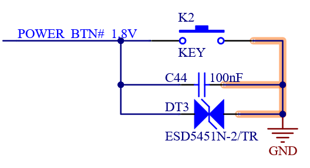
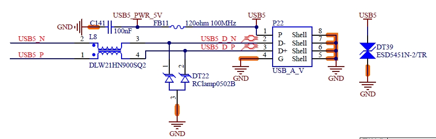
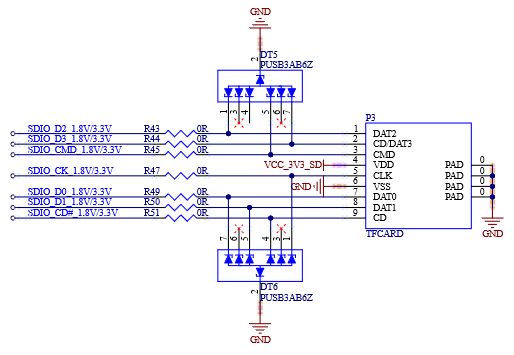

# 01_Overview

# 1.1 SoM Function Description

The FET-MX8MPQ-SMARC is a module compliant with the SMARC 2.1 standard, featuring the high-performance i.MX 8M Plus processor. It combines advanced multimedia capabilities with optimized low-power consumption, making it suitable for machine learning applications.

It pairs with the OK-MX8MPQ-SMARC carrier board and connects to the mainboard via a 314-pin MXM connector.

It integrates a wide range of functional interfaces and is widely used in fields such as smart cities, industrial IoT, smart healthcare, and intelligent transportation, meeting the diverse needs of various applications.

# 1.2 i.MX8MP Series Processors

The i.MX 8M Plus series processors focus on machine learning, vision, advanced multimedia, and industrial automation, offering high reliability. They are designed to meet the needs of smart home, building, city, and Industry 4.0 applications.   
· Featuring powerful quad-core or dual-core Arm® Cortex®-A53 processors and an integrated Neural Processing Unit (NPU) capable of up to 2.3 TOPS.   
·Dual Image Signal Processors (ISP) and support for two camera inputs enable efficient, advanced vision systems.   
·Multimedia capabilities include video encoding (including H.265) and decoding, 3D/2D graphics acceleration, and a wide range of audio and voice features.   
·Real-time control is handled by a Cortex-M7 core, supporting dual CAN FD, dual Gigabit Ethernet, and Time-Sensitive Networking (TSN) functionality.   
·Designed for high industrial reliability, supporting DRAM inline ECC.

The FET-MX8MPQ-SMARC core board is compatible with the CPU models listed in the table below, with the default model being MIMX8ML8CVNKZAB:

For more details about the MX8M Plus series, please visit the official NXP website:

[https://www.nxp.com.cn/products/processors-and-microcontrollers/arm-processors/i-mx-applications-processors/i-mx-8-processors/i-mx-8m-plus-arm-cortex-a53-machine-learning-vision-multimediaand-industrial-iot:IMX8MPLUS](https://www.nxp.com.cn/products/processors-and-microcontrollers/arm-processors/i-mx-applications-processors/i-mx-8-processors/i-mx-8m-plus-arm-cortex-a53-machine-learning-vision-multimediaand-industrial-iot:IMX8MPLUS)

# 02_FET-MX8MPQ-SMARC Description

# 2.1 SoM Appearance

Front

Back

# 2.2 Technical Specifications

Processors  
i.MX 8M Plus Quad

+ Supports NPU, ISP, VPU, HiFi 4, CAN-FD
+ 4 x Cortex-A53 up to 1.6 GHz
+ Cortex-M7 up to 800 MHz

Graphic Processing Unit (GPU)

+ GC7000UL supports OpenCL and Vulkan
+ 2 shaders
+ 166 million triangles/sec
+ 1.0 giga pixel/sec
+ 16 GFLOPs 32-bit
+ Supports OpenGL ES 1.1, 2.0, 3.0, OpenCL 1.2, Vulkan
+ Core clock frequency of 1000 MHz
+ Shader clock frequency of 1000 MHz
+ GC520L for 2D acceleration
+ Render target compatibility between 3D and 2D GPU (super tile status buffer)

Video Processing Unit (VPU)

Video Decoding

+ 1080p60 HEVC/H.265 Main, Main 10 (up to level 5.1)
+ 1080p60 VP9 Profile 0, 2
+ 1080p60 VP8
+ 1080p60 AVC/H.264 Baseline, Main, High decoder  video encoding.
+ 1080p60 AVC/H.264 encoder
+ 1080p60 HEVC/H.265 encoder

Neutral Processing Unit (NPU)  
2.3 TOP/s Neutral Processing Unit (NPU)

+ Keyword detect, noise reduction, beamforming
+ Speech recognition (i.e. Deep Speech 2)
+ Image recognition (i.e. ResNet-50)

Image Sensor Processor (ISP)  
375 Mpixel/s HDR ISP, supporting 12Mp@30fps, 4kp45 or 2x 1080p80 etc.

Memory (Memory) 
  
 Soldered LPDDR4-4266 memory, 32-bit interface, optional 2GB and 4GB

Storage 
  
 Solder eMMC 5.1 with 16GB and 32GB options

Video output Interfaces（Video output connector）  
1 x HDMI 2.0a Tx

+ Resolution 720 x 480p60, 1280 x 720p60, 1920 x 1080p60, 1920 x 1080p120,3840 x  2160p30
+ Pixel clock up to 297 MHz 1 X LVDS 18/24-bit single-/dual-channel (factory-optional) 1 X MIPI DSI (multiplexed with one of the LVDS channels, factory-optional)
+ Maximum resolution limited by a 250 MHz pixel clock and an effective pixel rate of 200 Mpixel/s for 24-bit RGB.
+ Supported resolutions include:

• 1080 p60  
• WUXGA (1920x1200) at 60 Hz  
• 1920x1440 at 60 Hz  
• UWHD (2560x1080) at 60 Hz  
• MIPI DSI: WQHD (2560x1440)                                Supported by reducing blanking intervals

Camera  
1 x 4-lanes CSI camera interfaces  
1 x 2-lanes CSI camera interfaces

Audio Interfaces  
Cadence® Tensilica® HiFi 4 DSP, maximum support 800 MHz

2 x I2S Audio interface

+ All ports support 49.152 MHz BCLK

Connectivity （Communication interface）  
1 x PCIe Express (PCIe) single chanel, supports PCIe Gen3

Networking 
  
 2 x Gigabit Ethernet interface 
  
 On-board IEEE 802.11 2X2 WiFi 5 MIMO Wireless LAN + Bluetooth 5 3 Combo LGA Module (factory optional)

USB  
1 x USB2.0 OTG (directly to CPU)  
3 x USB2.0 Host  
2 x USB3.0 Host

Serial ports  
2 x UART Tx / Rx / RTS / CTS  
2 x UART Tx / Rx

2 x CAN Bus

- The communication controller supports the CAN FD protocol and the CAN 2.0B protocol specification.

Other Interfaces  
1 x SD 1-bit/4-bit SDIO 3.0 interface  
5 x I2C Bus  
1 x SPI interface  
1 x QuadSPI interface  
14 x GPIOs  
Startup option configuration signal 
  
 Power management signal

Power Voltage: +5VDC  
RTC Voltage: 3.3V  
Operating Temperature: Industrial version -40 ° C ~ + 85 ° C  
  
 Size: 50 x82 mm  
The actual temperature will be widely dependent on the application, enclosure, and/or environment. **Customers should consider application-specific cooling solutions for the final system to maintain the heatsink temperature within the specified range.**

# 2.3 FET-MX8MPQ-SMARC Module Structure

Figure 2-3：FET-MX8MPQ-SMARC (Top)

Figure 2-4：FET-MX8MPQ-SMARC 

To prevent board warping, a 6mm diameter pad connected to the GND network is reserved inside the bottom layer of the board.   
When designing the carrier board, users can add appropriate standoffs at the specified pad location to support the core module.

SoM Dimension: 82mm x 50mm

Fixing hole spacing: 74mm x 34mm

Fixing hole diameter: 2.7mm

PCB Layers: 10 layer PCB

PCB thickness: 1.2mm

Connector 314p Gold Finger for detailed dimensions of the module structure, refer to “SMARC 2.1.1 Specification 2020-05-20” 5.3 Module Outline – 82x50mm Module.

Figure 2-5: SMARC 2.1.1 82 x 50mm Module Outline

When using connectors of different heights, please consider that according to the SMARC specification, the maximum component height on the bottom side of the module is 1.3mm. When selecting the height of the MXM connector, please pay attention to the above point if you need to place components on the carrier board below the SMARC module. 

# 2.4 FET-MX8MPQ-SMARC Block Diagram

Figure 2-6: FET-MX8MPQ-SMARC Block Diagram

# 03_FET-MX8MPQ-SMARC Interface Description

# 3.1 SoM Connector

## 3.1.1 Golden-finger

Figure 3-1 SoM Connector

## 3.1-2 MXM 3.0 Connector

The carrier board connector is a 314-pin, 0.5mm pitch right-angle component, designed for use with a 1.2mm thick PCB and features an appropriate edge finger pattern. This connector is commonly used in MXM3 graphics cards. The SMARC module uses this connector differently than the MXM3 standard.

Figure 3-2 MXM 3.0 Carrier Board Connector

## 3.1.3 Wi-Fi \& BT Antenna Connector

I-PEX MHF4 Connector Socket (20449) Main： Wi-Fi --> TX/RX  
Aux： Wi-Fi/Bluetooth --> TX/RX

Figure 3-3 Module Antenna Configuration

Figure 3-4 Module Antenna Configuration

## 3.1.4 JTAG  Connector

The processor’s JTAG interface is connected via a 7Pin, 1mm pitch connector.   
The JTAG IO voltage level is 1.8V.

Figure 3-5 JTAG Connector Line Sequence

# 3.2 FET-MX8MPx-SMARC Connector Pin Out

## 3.2. 1 SMARC P-PIN Connector Output List

Table 3-1 SMARC P-PIN Connector Signal Output

| **PIN**| **Primary (Top) Side**| **I/O Type**| **I/O Level**| **PU / PD**
|:----------:|:----------:|:----------:|:----------:|:----------:
| P1| SMB\_ALERT#| I CMOS| 1.8V| PU 2k2
| P2| GND| -| -| -
| P3| CSI1\_CK+| ID-PHY| -| -
| P4| CSI1\_CK-| ID-PHY| -| -
| P5| GBE1\_SDP| I/O OD CMOS| 3.3V \*_1_| -
| P6| GBE0\_SDP| I/O OD CMOS| 3.3V \*_1_| -
| P7| CSI1\_RX0+| ID-PHY| -| -
| P8| CSI1\_RX0-| ID-PHY| -| -
| P9| GND| -| -| -
| P10| CSI1\_RX1+| ID-PHY| -| -
| P11| CSI1\_RX1-| ID-PHY| -| -
| P12| GND| -| -| -
| P13| CSI1\_RX2+| ID-PHY| -| -
| P14| CSI1\_RX2-| ID-PHY| -| -
| P15| GND| -| -| -
| P16| CSI1\_RX3+| ID-PHY| -| -
| P17| CSI1\_RX3-| ID-PHY| -| -
| P18| GND| -| -| -
| P19| GBE0\_MDI3-| I/O GBE MDI| -| -
| P20| GBE0\_MDI3+| I/O GBE MDI| -| -
| P21| GBE0\_LINK100#| O OD CMOS| 3.3V| -
| P22| GBE0\_LINK1000#| O OD CMOS| 3.3V| -
| P23| GBE0\_MDI2-| I/O GBE MDI| -| -
| P24| GBE0\_MDI2+| I/O GBEMDI| -| -
| P25| GBE0\_LINK\_ACT#| O OD CMOS| 3.3V| -
| P26| GBE0\_MDI1-| I/O GBE MDI| -| -
| P27| GBE0\_MDI1+| I/O GBE MDI| -| -
| P28| NC| -| -| -
| P29| GBE0\_MDI0-| I/O GBE MDI| -| -
| P30| GBE0\_MDI0+| I/O GBE MDI| -| -
| P31| SPI0\_CS1#| O CMOS| 1.8V| -
| P32| GND| -| -| -
| P33| SDIO\_WP| I OD CMOS| 1.8V / 3.3V| PU 22k \*_2_
| P34| SDIO\_CMD| I/O CMOS| 1.8V / 3.3V| -
| P35| SDIO\_CD#| I OD CMOS| 1.8V / 3.3V| PU 22k \*_2_
| P36| SDIO\_CK| O CMOS| 1.8V / 3.3V| -
| P37| SDIO\_PWR\_EN| O CMOS| 3.3V| PU 4k7
| P38| GND| -| -| -
| P39| SDIO\_D0| I/O CMOS| 1.8V / 3.3V| -
| P40| SDIO\_D1| I/O CMOS| 1.8V / 3.3V| -
| P41| SDIO\_D2| I/O CMOS| 1.8V / 3.3V| -
| P42| SDIO\_D3| I/O CMOS| 1.8V / 3.3V| -
| P43| SPI0\_CS0#| O CMOS| 1.8V| -
| P44| SPI0\_CK| O CMOS| 1.8V| -
| P45| SPI0\_DIN| I CMOS| 1.8V| -
| P46| SPI0\_DO| O CMOS| 1.8V| -
| P47| GND| -| -| -
| P48| NC| -| -| -
| P49| NC| -| -| -
| P50| GND| -| -| -
| P51| NC| -| -| -
| P52| NC| -| -| -
| P53| GND| -| -| -
| P54| QSPI\_CS0#| O CMOS| 1.8V| -
| P55| QSPI\_CS1#| O CMOS| 1.8V| -
| P56| QSPI\_CK| O CMOS| 1.8V| -
| P57| QSPI\_IO\_1| I/O CMOS| 1.8V| -
| P58| QSPI\_IO\_0| O CMOS| 1.8V| -
| P59| GND| -| -| -
| P60| USB0+| I/O USB| USB| -
| P61| USB0-| I/O USB| USB| -
| P62| USB0\_EN\_OC#| I/O OD CMOS| 3.3V| PU 10k
| P63| USB0\_VBUS\_DET| I USB VBUS 5V| USB VBUS 5V| -
| P64| USB0\_OTG\_ID| I OD CMOS| 3.3| PU 10k
| P65| USB1+| I/O USB| USB| -
| P66| USB1-| I/O USB| USB| -
| P67| USB1\_EN\_OC#| I/O OD CMOS| 3.3V| PU 1k
| P68| GND| -| -| -
| P69| USB2+| I/O USB| USB| -
| P70| USB2-| I/O USB| USB| -
| P71| USB2\_EN\_OC#| I/O OD CMOS| 3.3V| PU 1k
| P72| NC| -| -| -
| P73| NC| -| -| -
| P74| USB3\_EN\_OC#| I/O OD CMOS| 3.3V| PU 1k
| \*\*_Key_| | | | 
| \*\*_Key_| | | | 
| \*\*_Key_| | | | 
| P75| PCIE\_A\_RST#| O CMOS| 3.3V| -
| P76| USB4\_EN\_OC#| I/O OD CMOS| 3.3V| PU 1k
| P77| NC| -| | -
| P78| PCIE\_A\_CKREQ#| I/O OD CMOS| 3.3V| PU 10k
| P79| GND| -| -| -
| P80| NC| -| -| -
| P81| NC| -| -| -
| P82| GND| -| -| -
| P83| PCIE\_A\_REFCK+| O PCIE| -| -
| P84| PCIE\_A\_REFCK-| O PCIE| -| -
| P85| GND| -| -| -
| P86| PCIE\_A\_RX+| I PCIE| -| -
| P87| PCIE\_A\_RX-| I PCIE| -| -
| P88| GND| -| -| -
| P89| PCIE\_A\_TX+| O PCIE| -| -
| P90| PCIE\_A\_TX-| O PCIE| -| -
| P91| GND| -| -| -
| P92| HDMI\_D2+| O TMDS HDMI| -| -
| P93| HDMI\_D2-| O TMDS HDMI| -| -
| P94| GND| -| -| -
| P95| HDMI\_D1+| O TMDS HDMI| -| -
| P96| HDMI\_D1-| O TMDS HDMI| -| -
| P97| GND| | -| -
| P98| HDMI\_D0+| O TMDS HDMI| -| -
| P99| HDMI\_D0-| O TMDS HDMI| -| -
| P100| GND| | -| -
| P101| HDMI\_CK+| O TMDS HDMI| -| -
| P102| HDMI\_CK-| O TMDS HDMI| -| -
| P103| GND| | -| -
| P104| HDMI\_HPD| I CMOS| 1.8V| -
| P105| HDMI\_CTRL\_CK| I/O OD CMOS| 1.8V| PU 22k \*_2_
| P106| HDMI\_CTRL\_DAT| I/O OD CMOS| 1.8V| PU 22k \*_2_
| P107| DP1\_AUX\_SEL| I/O CMOS| 1.8V| - \*_3_
| P108| GPIO0 / CAM0\_PWR#| O CMOS| 1.8V| - \*_4_
| P109| GPIO1 / CAM1\_PWR#| O CMOS| 1.8V| - \*_4_
| P110| GPIO2 / CAM0\_RST#| O CMOS| 1.8V| - \*_4_
| P111| GPIO3 / CAM1\_RST#| O CMOS| 1.8V| - \*_4_
| P112| GPIO4 / HDA\_RST#| O CMOS| 1.8V| - \*_4_
| P113| GPIO5 / PWM\_OUT| O CMOS| 1.8V| - \*_4_
| P114| GPIO6 / TACHIN| I CMOS| 1.8V| - \*_4_
| P115| GPIO7| I/O CMOS| 1.8V| - \*_4_
| P116| GPIO8| I/O CMOS| 1.8V| - \*_4_
| P117| GPIO9| I/O CMOS| 1.8V| - \*_4_
| P118| GPIO10| I/O CMOS| 1.8V| - \*_4_
| P119| GPIO11| I/O CMOS| 1.8V| - \*_4_
| P120| GND| -| -| -
| P121| I2C\_PM\_CK| O OD CMOS| 1.8V| PU 2k2
| P122| I2C\_PM\_DAT| I/O OD CMOS| 1.8V| PU 2k2
| P123| BOOT\_SEL0#| I OD CMOS| 1.8V| PU 10k
| P124| BOOT\_SEL1#| I OD CMOS| 1.8V| PU 10k
| P125| BOOT\_SEL2#| I OD CMOS| 1.8V| PU 10k
| P126| RESET\_OUT#| O CMOS| 1.8V| -
| P127| RESET\_IN#| I OD CMOS| 1.8V| PU 100k
| P128| POWER\_BTN#| I OD CMOS| 1.8V| PU 100k
| P129| SER0\_TX| O CMOS| 1.8V| -
| P130| SER0\_RX| I CMOS| 1.8V| - \*_4_
| P131| SER0\_RTS#| O CMOS| 1.8V| -
| P132| SER0\_CTS#| I CMOS| 1.8V| - \*_4_
| P133| GND| -| -| -
| P134| SER1\_TX| O CMOS| 1.8V| -
| P135| SER1\_RX| I CMOS| 1.8V| - \*_4_
| P136| SER2\_TX| O CMOS| 1.8V| -
| P137| SER2\_RX| I CMOS| 1.8V| - \*_4_
| P138| SER2\_RTS#| O CMOS| 1.8V| -
| P139| SER2\_CTS#| I CMOS| 1.8V| - \*_4_
| P140| SER3\_TX| O CMOS| 1.8V| -
| P141| SER3\_RX| I CMOS| 1.8V| - \*_4_
| P142| GND| -| -| -
| P143| CAN0\_TX| O CMOS| 1.8V| -
| P144| CAN0\_RX| I CMOS| 1.8V| -
| P145| CAN1\_TX| O CMOS| 1.8V| -
| P146| CAN1\_RX| I CMOS| 1.8V| -
| P147| VDD\_IN| Analog| 5V| -
| P148| VDD\_IN| Analog| 5V| -
| P149| VDD\_IN| Analog| 5V| -
| P150| VDD\_IN| Analog| 5V| -
| P151| VDD\_IN| Analog| 5V| -
| P152| VDD\_IN| Analog| 5V| -
| P153| VDD\_IN| Analog| 5V| -
| P154| VDD\_IN| Analog| 5V| -
| P155| VDD\_IN| Analog| 5V| -
| P156| VDD\_IN| Analog| 5V| -

## 3.2.2 SMARC S-PIN Connector Pin Out List

Table 3-2 SMARC S-PIN Connector Pin Output

| **PIN**| **Secondary (BOTTOM) Side**| **I/O Type**| **I/O Level**| **PD / PU**
|:----------:|:----------:|:----------:|:----------:|:----------:
| S1| I2C\_CAM1\_CK| IO OD CMOS| 1.8V| PU 2k2
| S2| I2C\_CAM1\_DAT| IO OD CMOS| 1.8V| PU 2k2
| S3| GND| -| -| -
| S4| NC| -| -| -
| S5| I2C\_CAM0\_CK| IO OD CMOS| 1.8V| PU 2k2
| S6| CAM\_MCK| O CMOS| 1.8V| -
| S7| I2C\_CAM0\_DAT| IO OD CMOS| 1.8V| PU 2k2
| S8| CSI0\_CK+| I D-PHY| -| -
| S9| CSI0\_CK-| I D-PHY| -| -
| S10| GND| -| -| -
| S11| CSI0\_RX0+| I D-PHY| -| -
| S12| CSI0\_RX0-| I D-PHY| -| -
| S13| GND| -| -| -
| S14| CSI0\_RX1+| I D-PHY| -| -
| S15| CSI0\_RX1-| I D-PHY| -| -
| S16| GND| -| -| -
| S17| GBE1\_MDI0+| I/O GBE MDI| -| -
| S18| GBE1\_MDI0-| I/O GBE MDI| -| -
| S19| GBE1\_LINK100#| O OD CMOS| 3.3V| -
| S20| GBE1\_MDI1+| I/O GBE MDI| -| -
| S21| GBE1\_MDI1-| I/O GBE MDI| -| -
| S22| GBE1\_LINK1000#| O OD CMOS| 3.3V| -
| S23| GBE1\_MDI2+| I/O GBE MDI| -| -
| S24| GBE1\_MDI2-| I/O GBE MDI| -| -
| S25| GND| -| -| -
| S26| GBE1\_MDI3+| I/O GBE MDI| -| -
| S27| GBE1\_MDI3-| I/O GBE MDI| -| -
| S28| NC| -| -| -
| S29| NC| -| -| -
| S30| NC| -| -| -
| S31| GBE1\_LINK\_ACT#| O OD CMOS| 3.3V| -
| S32| NC| -| -| -
| S33| NC| -| -| -
| S34| GND| -| -| -
| S35| USB4+| I/O USB| USB| -
| S36| USB4-| I/O USB| USB| -
| S37| NC| -| -| -
| S38| AUDIO\_MCK| O CMOS| 1.8V| -
| S39| I2S0\_LRCK| I/O CMOS| 1.8V| -
| S40| I2S0\_SDOUT| O CMOS| 1.8V| -
| S41| I2S0\_SDIN| I CMOS| 1.8V| -
| S42| I2S0\_CK| I/O CMOS| 1.8V| -
| S43| NC| -| -| -
| S44| NC| -| -| -
| S45| NC| -| -| -
| S46| NC| -| -| -
| S47| GND| -| -| -
| S48| I2C\_GP\_CK| I/O OD CMOS| 1.8V| PU 2k2
| S49| I2C\_GP\_DAT| I/O OD CMOS| 1.8V| PU 2k2
| S50| I2S2\_LRCK \*_5_| I/OCMOS| 1.8V/1.5V| -
| S51| I2S2\_SDOUT \*_5_| O CMOS| 1.8V/1.5V| -
| S52| I2S2\_SDIN \*_5_| I CMOS| 1.8V/1.5V| -
| S53| I2S2\_CK \*_5_| O CMOS| 1.8V/1.5V| -
| S54| NC| -| -| -
| S55| USB5\_EN\_OC#| I/OODCMOS| 3.3V| PU 1k
| S56| QSPI\_IO\_2| I/OCMOS| 1.8V| -
| S57| QSPI\_IO\_3| I/OCMOS| 1.8V| -
| S58| NC| -| -| -
| S59| USB5+ \*_6_| I/O USB| USB| -
| S60| USB5- \*_6_| I/O USB| USB| -
| S61| GND| -| -| -
| S62| USB3\_SSTX+ \*_6_| O USB SS| USB SS| -
| S63| USB3\_SSTX- \*_6_| O USB SS| USB SS| -
| S64| GND| -| -| -
| S65| USB3\_SSRX+ \*_6_| I USB SS| USB SS| -
| S66| USB3\_SSRX- \*_6_| I USB SS| USB SS| -
| S67| GND| -| -| -
| S68| USB3+ \*_6_| I/O USB| USB| -
| S69| USB3- \*_6_| I/O USB| USB| -
| S70| GND| -| -| -
| S71| USB2\_SSTX+ \*_6_| O USB SS| USB SS| -
| S72| USB2\_SSTX- \*_6_| O USB SS| USB SS| -
| S73| GND| -| -| -
| S74| USB2\_SSRX+ \*_6_| I USB SS| USB SS| -
| S75| USB2\_SSRX- \*_6_| I USB SS| USB SS| -
| \*\*_Key_| | | | 
| \*\*_Key_| | | | 
| \*\*_Key_| | | | 
| S76| NC| -| -| -
| S77| NC| -| -| -
| S78| NC| -| -| -
| S79| NC| -| -| -
| S80| GND| -| -| -
| S81| NC| -| -| -
| S82| NC| -| -| -
| S83| GND| -| -| -
| S84| NC| -| -| -
| S85| NC| -| -| -
| S86| GND| -| -| -
| S87| NC| -| -| -
| S88| NC| -| -| -
| S89| GND| -| -| -
| S90| NC| -| -| -
| S91| NC| -| -| -
| S92| GND| -| -| -
| S93| NC| -| -| -
| S94| NC| -| -| -
| S95| NC| -| -| -
| S96| NC| -| -| -
| S97| NC| -| -| -
| S98| NC| -| -| -
| S99| NC| -| -| -
| S100| NC| -| -| -
| S101| GND| -| -| -
| S102| NC| -| -| -
| S103| NC| -| -| -
| S104| NC| -| -| -
| S105| NC| -| -| -
| S106| NC| -| -| -
| S107| LCD1\_BKLT\_EN| O CMOS| 1.8V| -
| S108| LVDS1\_CK+| O LVDS| -| -
| S109| LVDS1\_CK-| O LVDS| -| -
| S110| GND| -| -| -
| S111| LVDS1\_0+| O LVDS| -| -
| S112| LVDS1\_0-| O LVDS| -| -
| S113| NC| -| -| -
| S114| LVDS1\_1+| O LVDS| -| -
| S115| LVDS1\_1-| O LVDS| -| -
| S116| LCD1\_VDD\_EN| O CMOS| 1.8V| -
| S117| LVDS1\_2+| O LVDS| -| -
| S118| LVDS1\_2-| O LVDS| -| -
| S119| GND| -| -| -
| S120| LVDS1\_3+| O LVDS| -| -
| S121| LVDS1\_3-| O LVDS| -| -
| S122| LCD1\_BKLT\_PWM| O CMOS| 1.8V| -
| S123| GPIO13| I/O CMOS| 1.8V| - \*_4_
| S124| GND| -| -| -
| S125| LVDS0\_0+ / DSI0\_D0+| O LVDS / O D-PHY| -| -
| S126| LVDS0\_0- / DSI0\_D0-| O LVDS / O D-PHY| -| -
| S127| LCD0\_BKLT\_EN| O CMOS| 1.8V| -
| S128| LVDS0\_1+ / DSI0\_D1+| O LVDS / O D-PHY| -| -
| S129| LVDS0\_1- / DSI0\_D1-| O LVDS / O D-PHY| -| -
| S130| GND| -| -| -
| S131| LVDS0\_2+ / DSI0\_D2+| O LVDS / O D-PHY| -| -
| S132| LVDS0\_2- / DSI0\_D2-| O LVDS / O D-PHY| -| -
| S133| LCD0\_VDD\_EN| O CMOS| 1.8V| -
| S134| LVDS0\_CK+ / DSI0\_CLK+| O LVDS / O D-PHY| -| -
| S135| LVDS0\_CK- / DSI0\_CLK| O LVDS / O D-PHY| -| -
| S136| GND| -| -| -
| S137| LVDS0\_3+ / DSI0\_D3+| O LVDS / O D-PHY| -| -
| S138| LVDS0\_3- / DSI0\_D3-| O LVDS / O D-PHY| -| -
| S139| I2C\_LCD\_CK| I/O OD CMOS| 1.8V| PU 2k2
| S140| I2C\_LCD\_DAT| I/O OD CMOS| 1.8V| PU 2k2
| S141| LCD0\_BKLT\_PWM| O CMOS| 1.8V| -
| S142| GPIO12| I/O CMOS| 1.8V| - \*_4_
| S143| GND| -| -| -
| S144| DSI0\_TE| I CMOS| 1.8V| PD 10k
| S145| WDT\_TIME\_OUT#| O CMOS| 1.8V| -
| S146| PCIE\_WAKE#| I OD CMOS| 3.3V| -
| S147| VDD\_RTC| Analog| 2.0V to 3.25V| -
| S148| LID#| I OD CMOS| 1.8V| PU 10k
| S149| SLEEP#| I OD CMOS| 1.8 to 5V| PU 10k
| S150| VIN\_PWR\_BAD#| I OD CMOS| VDD\_IN| PU 100k
| S151| CHARGING#| I OD CMOS| 1.8to5V| PU 10k
| S152| CHARGER\_PRSNT#| I OD CMOS| 1.8to5V| PU 10k
| S153| CARRIER\_STBY#| O CMOS| 1.8V| PU 10k
| S154| CARRIER\_PWR\_ON| O CMOS| 1.8V| -
| S155| FORCE\_RECOV#| I OD CMOS| 1.8V| PU 10k
| S156| BATLOW#| I OD CMOS| 1.8to5V| PU 10k
| S157| TEST#| I OD CMOS| 1.8to5V| PU 10k
| S158| GND| -| -| -

1: Configuring this pin for the output function requires adding an additional pull-up resistor to the 3.3 V supply. The resistance value depends on the IO drive capability required by the receiver. When the pin is configured as an input function, the CPU needs to be internally configured as a pull-up.

2 : Depending on the internal pull-up of the i.MX8 MP SOC, the module itself has no pull-up or pull-down resistor.

3 : 在模块上，此引脚通过0Ω电阻器连接到MX8MP SOC的HDMI-CEC，默认为0Ω电阻器的空焊。

4 : Depending on the internal pull-up of the i.MX8 MP SOC, the module itself has no pull-up or pull-down resistor.

5 ：This set of I2S signals can be configured as PCM signals to communicate with the WIFI \& BT module on the SoM, and by default, they are routed to the gold fingers of the FET-MX8MP-SMARC.

These two sets of USB 2.0 and USB 3.0 TX/RX interfaces can be combined separately to form a fully functional USB 3.0 connection.

# 04_Hardware Interface

# 4.1 HDMI

## 4.1.1 HDMI TX Controller

### 4.1.1.1 Overview

High-Definition Multimedia Interface (HDMI) TX is a wired digital interconnection that replaces analog TV output or VGA output. HDMI allows the transmission of uncompressed video, audio, and data through a single cable and is compatible with the HDMI v2.0a specification.

### 4.1.1.2 Features

Compatible with HDMI v2.0 a specification Refer to i.MX 8M Plus Applications Processor Reference Manual.

**NOTE:**   
**The HDCP function is not supported.**

## 4.1.2 HDMI TX PHY

### 4.1.2.1 Overview

The HDMI (High-Definition Multimedia Interface) TX PHY is compatible with the HDMI v1.4/v2.0 specification and supports 4Kp30 video resolution. It accepts TransitionMinimized Differential Signaling (TMDS) encoded parallel data from the HDMI link layer and transmits it serially into the HDMI cable.

### 4.1.2.2 Features

+ Supports 25 MHz to 594 MHz TMDS clock.
+ 20-bit parallel data interface with transfer frequencies up to 297 MHz.
+ All DTV video formats for PC up to 1080p/12-bit, 3D, 4K X 2K/60 Hz and VGA/XGA/SXGA/UXGA formats).

Refer to i.MX 8M Plus Applications Processor Reference Manual for more details.

## 4.1.3 HDMI External Signal

Table 4-1 HDMI Interface Signal

| **Number**| **Name**| **Description**
|----------|----------|----------
| **P92**| HDMI\_D2+| Positive  HDMI Tx Differential Data2
| **P93**| HDMI\_D2-| Negative  HDMI Tx Differential Data2
| **P95**| HDMI\_D1+| Positive  HDMI Tx Differential Data1
| **P96**| HDMI\_D1-| Negative  HDMI Tx Differential Data1
| **P98**| HDMI\_D0+| Positive  HDMI Tx Differential Data0
| **P99**| HDMI\_D0-| Negative  HDMI Tx Differential Data0
| **P101**| HDMI\_CK+| Positive  HDMI Tx Differential Clock
| **P102**| HDMI\_CK-| Negative  HDMI Tx Differential Clock
| **P104**| HDMI\_HPD| Hot  Plug Detect Input signal
| **P105**| HDMI\_CTRL\_CK| DDC  Clock line for HDMI panel
| **P106**| HDMI\_CTRL\_DAT| DDC  Data line for HDMI panel
| **P107**| HDMI\_CEC  \***1**| Consumer Electronics Control for HDMI panel

\* 1 P107 is NC (not connected) by default. If you want to configure it for HDMI-CEC function, please contact Forlinx and select HDMI-CEC version.

# 4.2 LVDS Interface

The FET-MX8MP-SMARC SoM supports LVDS0 and LVDS1. LVDS0 and DSI0 are optional and cannot be used together. The default configuration is LVDS0. If DSI0 is required, please contact Forlinx and select the DSI0 version.

## 4.2.1 Overview

The LVDS display bridge (LDB) is connected to an external LVDS display interface. The function of LDB is to support the synchronous transmission of RGB data streams to external display devices via the LVDS interface.

## 4.2.2 Features

+ Connect to display-related devices with an LVDS receiver.
+ Arrange the data according to the requirements of the external display receiver and LVDS display standard;
+ Synchronization and control functions;

## 4.2.3 SoM Function Description

+ Single-channel (4-channel) output, with pixel clock and LVDS clock up to 80 MHz. This supports resolutions up to 1366×768p60.
+ For 4-channel LVDS, either Channel 0 or Channel 1 can be used.
+ Dual asynchronous channels (8 data, 2 clock). This is used for a single panel with two interfaces, transmitting data through two channels (even pixels / odd pixels). It is supported with a pixel clock up to 160 MHz (with LVDS clock up to 80 MHz, as each LVDS clock transmits 2 pixels), enabling resolutions higher than 1366×768p60, up to 1080p60.

The pixel mapper divides and reorders pixels from a single LCDIF display output to form odd and even pixel streams. This division and reordering are designed to match the speed and channel requirements of LVDS displays. Both VESA and JEIDA pixel mapping are supported.

The pixel mapper supports the following modes:

Table 4-2 Pixel Mapping Modes.

| **Use Case**| **LVDS Channel 0**| **LVDS Channel 1**
|----------|----------|----------
| Singles0| Display Interface(DI) of LCDIF| Disabled
| Single1| Disabled| Display Interface(DI) of LCDIF
| Dual| Display Interface(DI) of LCDIF| Display Interface(DI) of LCDIF
| Split| Display Interface(DI) of LCDIF| Display Interface(DI) of LCDIF

## 4.2.4 LVDS External Signal

Table 4-3 LVDS0 Interface Signals

| **Number**| **Name**| **Description**
|----------|----------|----------
| **S125**| LVDS0\_0+| LVDS0  Positive Data0 Signal
| **S126**| LVDS0\_0-| LVDS0  Negative Data0 Signal
| **S128**| LVDS0\_1+| LVDS0  Positive Data1 Signal
| **S129**| LVDS0\_1-| LVDS0  Negative Data1 Signal
| **S131**| LVDS0\_2+| LVDS0  Positive Data2 Signal
| **S132**| LVDS0\_2-| LVDS0  Negative Data2 Signal
| **S134**| LVDS0\_CK+| LVDS0  Positive Clock Signal
| **S135**| LVDS0\_CK-| LVDS0  Negative Clock Signal
| **S137**| LVDS0\_3+| LVDS0  Positive Data3 Signal
| **S138**| LVDS0\_3-| LVDS0  Negative Data3 Signal
| **S127**| LCD0\_BKLT\_EN| Primary  LVDS Channel Backlight Enable
| **S133**| LCD0\_VDD\_EN| Primary  LVDS Channel Power Enable
| **S141**| LCD0\_BKLT\_PWM| Primary  LVDS Channel Brightness Control

Table 4-4 LVDS1 Interface Signals

| **Number**| **Name**| **Description**
|----------|----------|----------
| **S108**| LVDS1\_CK+| LVDS1  Positive Clock Signal
| **S109**| LVDS1\_CK-| LVDS1  Negative Clock Signal
| **S111**| LVDS1\_0+| LVDS1  Positive Data0 Signal
| **S112**| LVDS1\_0-| LVDS1  Negative Data0 Signal
| **S114**| LVDS1\_1+| LVDS1  Positive Data1 Signal
| **S115**| LVDS1\_1-| LVDS1  Negative Data1 Signal
| **S117**| LVDS1\_2+| LVDS1  Positive Data2 Signal
| **S118**| LVDS1\_2-| LVDS1  Negative Data2 Signal
| **S120**| LVDS1\_3+| LVDS1  Positive Data3 Signal
| **S121**| LVDS1\_3-| LVDS1  Negative Data3 Signal
| **S107**| LCD1\_BKLT\_EN| Secondary  LVDS Channel Backlight Enable
| **S116**| LCD1\_VDD\_EN| Secondary  LVDS Channel Power Enable
| **S122**| LCD1\_BKLT\_PWM| Secondary  LVDS Channel Brightness Control
| **S139**| I2C\_LCD\_CK| DDC  Clock Line Used for Flat Panel Detection and Control
| **S140**| I2C\_LCD\_DAT| DDC  Data Line Used for Flat Panel Detection and Control

# 4.3 MIPI Interface

The FET-MX8MP-SMARC does not support MIPI DSI functionality by default. A selection must be made between MIPI DSI0 and LVDS0.

## 4.3.1 Overview

The MIPI Display Serial Interface (DSI) is a flexible, high-performance core that enables communication with peripherals compliant with the MIPI DSI standard.

## 4.3.2 Block Diagram

Figure 4-1 MIPI DSI Master System Block Diagram

## 4.3.3 Features

+ Compliant with MIPI DSI standard specification V1.01r11
+ The maximum resolution supported can reach up to WQHD (2560×1440).
+ Supports 1, 2, 3, or 4 data lanes
+ Supported pixel formats: 16bpp, 18bpp packed, 18bpp loosely packed (3 byte format), and 24bpp
+ Compliant with the PHY Interface Protocol (PPI) in 1.0Gbps/1.5Gbps MIPI DPHY.

Refer to i.MX 8M Plus Applications Processor Reference Manual for more details.

## 4.3.4 MIPI DSI External Signal

Table 4-5 MIPI DSI0 Interface Signals

| **Number**| **Name**| **Description**
|----------|----------|----------
| **S125**| DSI0\_D0+| MIPI  DSI0 Positive Data0 Signal
| **S126**| DSI0\_D0-| MIPI  DSI0 Negative Data0 Signal
| **S128**| DSI0\_D1+| MIPI  DSI0 Positive Data1 Signal
| **S129**| DSI0\_D1-| MIPI  DSI0 Negative Data1 Signal
| **S131**| DSI0\_D2+| MIPI  DSI0 Positive Data2 Signal
| **S132**| DSI0\_D2-| MIPI  DSI0 Negative Data2 Signal
| **S134**| DSI0\_CLK+| MIPI  DSI0 Positive Clock Signal
| **S135**| DSI0\_CLK| MIPI  DSI0 Negative Clock Signal
| **S137**| DSI0\_D3+| MIPI  DSI0 Positive Data3 Signal
| **S138**| DSI0\_D3-| MIPI  DSI0 Negative Data3 Signal

# 4.4  MIPI CSI

## 4.4.1 Overview

The MIPI Camera Serial Interface (MIPI\_CSI2) is the camera interface of this chip. It works in conjunction with the MIPI DPHY module and connects to the host processor. When used in conjunction with output to the ISI (Image Sensor Interface) or ISP (Image Signal Processor), MIPI\_CSI2 supports RAW, YUV, and RGB image formats.

## 4.4.2 Features

+ Compliant with the MIPI D-PHY V1.2 specification.
+ Compliant with the MIPI CSI2 Specification V1.3, except for C-PHY functionality.
+ Supports primary and secondary image formats.
  - YUV420, YUV420 (Legacy), YUV420 (CSPS), YUV422 of 8-bits and 10-bits
  - RGB565, RGB666, RGB888
  - RAW6, RAW7, RAW8, RAW10, RAW12, RAW14
+ Supports up to 4 lanes of D-PHY.
+ Compatible with the PPI (Protocol to PHY Interface) defined in the MIPI D-PHY specification.

Refer to i.MX 8M Plus Applications Processor Reference Manual for more details.

## 4.4.3 MIPI CSI External Signal

Table 4-6 MIPI CSI0 Interface Signals

| **Number**| **Name**| **Description**
|----------|----------|----------
| **S5**| I2C\_CAM0\_CK| I2C  clock for serial camera data support
| **S7**| I2C\_CAM0\_DAT| I2C  data for serial camera data support link
| **P108**| CAM0\_PWR#| Camera  0 Power Enable, active low output
| **P110**| CAM0\_RST#| Camera  0 reset, active low output
| **S8**| CSI0\_CK+| Positive  MIPI CSI0 Differential Clock
| **S9**| CSI0\_CK-| Negative MIPI CSI0 Differential Clock
| **S11**| CSI0\_RX0+| Positive  MIPI CSI0 Differential Data0
| **S12**| CSI0\_RX0-| Negative MIPI CSI0 Differential Data0
| **S14**| CSI0\_RX1+| Positive  MIPI CSI0 Differential Data1
| **S15**| CSI0\_RX1-| Negative MIPI CSI0 Differential Data1

Table 4-7 MIPI CSI1 Interface Signals

| **Number**| **Name**| **Description**
|----------|----------|----------
| **S1**| I2C\_CAM1\_CK| I2C  clock for serial camera data support
| **S2**| I2C\_CAM1\_DAT| I2C  data for serial camera data support link
| **P109**| CAM1\_PWR#| Camera  1 Power Enable, active low output
| **P111**| CAM1\_RST#| Camera  1 reset, active low output
| **P3**| CSI1\_CK+| Positive  MIPI CSI1 Differential Clock
| **P4**| CSI1\_CK-| Negative MIPI CSI1 Differential Clock
| **P7**| CSI1\_RX0+| Positive  MIPI CSI1 Differential Data0
| **P8**| CSI1\_RX0-| Negative MIPI CSI1 Differential Data0
| **P10**| CSI1\_RX1+| Positive  MIPI CSI1 Differential Data1
| **P11**| CSI1\_RX1-| Negative MIPI CSI1 Differential Data1
| **P13**| CSI1\_RX2+| Positive  MIPI CSI1 Differential Data2
| **P14**| CSI1\_RX2-| Negative MIPI CSI1 Differential Data2
| **P16**| CSI1\_RX3+| Positive  MIPI CSI1 Differential Data3
| **P17**| CSI1\_RX3-| Negative MIPI CSI1 Differential Data3

# 4.5 Audio

## 4.5.1 SAI Overview

The Synchronous Audio Interface (SAI) provides an interface that supports a full-duplex serial connection, featuring frame-synchronized formats such as I2S, AC97, TDM, as well as codec/DSP interfaces.

The FET-MX8MP-SMARC has two audio interfaces, I2S0 and I2S2. The I2S0 interface is managed by the SAI3 signal group of the SoC and the I2S2 interface is managed by the SAI5 signal group of the SoC.

## 4.5.2 Features

+ The transmitter features independent bit clock and frame synchronization.
+ The receiver is equipped with independent bit clock and frame synchronization.
+ Each data line supports a maximum frame size of 32 words.
+ 8- to 32-bit word size

Refer to i.MX 8M Plus Applications Processor Reference Manual for more details.

## 4.5.3 I2S External Signal

Table 4-7 I2S0 Interface Signals

| **Number**| **Name**| **Description**
|----------|----------|----------
| **S38**| AUDIO\_MCK| Master  Clock Output to I2S Codec(s)
| **S39**| I2S0\_LRCK| I2S0  Left \& Right Synchronization Clock
| **S40**| I2S0\_SDOUT| I2S0  Digital Audio Output
| **S41**| I2S0\_SDIN| I2S0  Digital Audio Input
| **S42**| I2S0\_CK| I2S0  Digital Audio Clock

Table 4-8 I2S2 Interface Signals

| **Number**| **Name**| **Description**
|----------|----------|----------
| **S38**| AUDIO\_MCK| Master  Clock Output to I2S Codec(s)
| **S50**| I2S2\_LRCK| I2S2  Left \& Right Synchronization Clock
| **S51**| I2S2\_SDOUT| I2S2  Digital Audio Output
| **S52**| I2S2\_SDIN| I2S2  Digital Audio Input
| **S53**| I2S2\_CK| I2S2  Digital Audio Clock

# 4.6 PCIe

## 4.6.1 Overview

The PCI Express interface complies with the PCI Express™ Base Specification Revision 4.0, Version 0.7 (available at http://www.pcisig.com). This manual does not cover the complex details of the PCI Express protocol.

## 4.6.2 Features

+ Supports Root Complex (RC) and Endpoint (EP) configurations
+ Maximum link speed up to Gen3 (8 GT/s)
+ x1 link width

Refer to  i.MX 8M Plus Applications Processor Reference Manual for more details.

## 4.6.3 PCIe x 1 External Signal

Table 4-9 PCIe x1 Interface Signals

| **Number**| **Name**| **Description**
|----------|----------|----------
| **P83**| PCIE\_A\_REFCK+| Positive PCIe link A Differential clock output
| **P84**| PCIE\_A\_REFCK-| Negative PCIe link A Differential clock output
| **P86**| PCIE\_A\_RX+| Positive PCIe link A Differential receive data
| **P87**| PCIE\_A\_RX-| Negative PCIe link A Differential receive data
| **P89**| PCIE\_A\_TX+| Positive PCIe link A Differential transmit data
| **P90**| PCIE\_A\_TX-| Negative PCIe link A Differential transmit data
| **P75**| PCIE\_A\_RST#| PCIe  Port A reset output
| **P78**| PCIE\_A\_CKREQ#| PCIe  Port A clock request
| **S146**| PCIE\_WAKE#| PCIe  wake up interrupt to host – common to PCIe links A

# 4.7 Ethernet

## 4.7.1 Overview

The iMX 8M Plus implements two Ethernet controllers, both capable of running simultaneously. It features a tri-speed 10/100/1000-Mbit/s Ethernet MAC compliant with the IEEE 802.3-2002 standard.

The FET-MX8MP-SMARC module includes 2 x on-board gigabit Ethernet transceivers. Highly integrated Ethernet transceivers comply with 10BASE-Te, 100BASE-TX, and 1000BASE-T IEEE 802.3 standards. It provides all the physical layer functions necessary for sending and receiving Ethernet packets over CAT.5E unshielded twisted-pair cables.

## 4.7.2 Ethernet External Signal

Table 4-10 GBE0 Interface Signals

| **Number**| **Name**| **Description**
|----------|----------|----------
| **P29**| GBE0\_MDI0-| Negative GEB0 Differential Media-dependent interface 0
| **P30**| GBE0\_MDI0+| Positive GEB0 Differential Media-dependent interface 0
| **P26**| GBE0\_MDI1-| Negative GEB0 Differential Media-dependent interface 1
| **P27**| GBE0\_MDI1+| Positive GEB0 Differential Media-dependent interface 1
| **P23**| GBE0\_MDI2-| Negative GEB0 Differential Media-dependent interface 2
| **P24**| GBE0\_MDI2+| Positive GEB0 Differential Media-dependent interface 2
| **P19**| GBE0\_MDI3-| Negative GEB0 Differential Media-dependent interface 3
| **P20**| GBE0\_MDI3+| Positive GEB0 Differential Media-dependent interface 3
| **P21**| GBE0\_LINK100#| Link  Speed Indication LED for GBE0 100Mbps
| **P22**| GBE0\_LINK1000#| Link  Speed Indication LED for GBE0 1000Mbps
| **P25**| GBE0\_LINK\_ACT#| Link  / Activity Indication LED Driven Low on Link (10, 100 or 1000 Mbps) Blinks on  Activity
| **P6**| GBE0\_SDP| IEEE  1588 Trigger Signal for Hardware Implementation of PTP (Precision Time  Protocol)

Table 4-11 GBE1 Interface Signals

| **Number**| **Name**| **Description**
|----------|----------|----------
| **S18**| GBE1\_MDI0-| Negative GEB0 Differential Media-dependent interface 0
| **S17**| GBE1\_MDI0+| Positive GEB0 Differential Media-dependent interface 0
| **S21**| GBE1\_MDI1-| Negative GEB0 Differential Media-dependent interface 1
| **S20**| GBE1\_MDI1+| Positive GEB0 Differential Media-dependent interface 1
| **S24**| GBE1\_MDI2-| Negative GEB0 Differential Media-dependent interface 2
| **S23**| GBE1\_MDI2+| Positive GEB0 Differential Media-dependent interface 2
| **S27**| GBE1\_MDI3-| Negative GEB0 Differential Media-dependent interface 3
| **S26**| GBE1\_MDI3+| Positive GEB0 Differential Media-dependent interface 3
| **S19**| GBE1\_LINK100#| Link  Speed Indication LED for GBE0 100Mbps
| **S22**| GBE1\_LINK1000#| Link  Speed Indication LED for GBE0 1000Mbps
| **S31**| GBE1\_LINK\_ACT#| Link  / Activity Indication LED Driven Low on Link (10, 100 or 1000 Mbps) Blinks on  Activity
| **P5**| GBE1\_SDP| IEEE  1588 Trigger Signal for Hardware Implementation of PTP (Precision Time  Protocol)

# 4.8 USB

## 4.8.1 Overview

The USB interfaces supported by FET-MX8MP-SMARC are as follows:

+ 1 x USB 2.0 OTG
+ 3 x USB 2.0 HOST
+ 2 x USB 3.0 HOST

## 4.8.2 Features

The USB 3.0 module includes the following features:

+ Comply with USB specification rev 3.0
+ Super-speed (5 Gbit/s), high-speed (480 Mbit/s), full-speed (12 Mbit/s), and low speed (1.5 Mbit/s) operations

The USB 2.0 module includes the following features:

+ Comply with USB specification rev 2.0
+ High-speed (480 Mbit/s), full-speed (12 Mbit/s), and low speed (1.5 Mbit/s) operations
+ USB 2.0 OTG supports dual-role operation and can be configured as a host or device

USB \[0:5] \_ EN \_ OC # is the muxing function pin, which is pulled up to the 3.3 V power rail on the SoM. The carrier board can realize the OC # (over-current) overcurrent detection function through the open-drain driver.

## 4.8.3 USB External Signal

Table 4-12 USB0 Port Signals

| **Number**| **Name**| **Description**
|----------|----------|----------
| **P60**| USB0+| USB PHY Data Plus for  Port 0
| **P61**| USB0-| USB PHY Data Minus for Port 0
| **P62**| USB0\_EN\_OC#| USB  Over-Current Sense for Port 0
| **P63**| USB0\_VBUS\_DET| USB  Port 0 Host Power Detection
| **P64**| USB0\_OTG\_ID| Input  Pin to Announce OTG Device Insertion on USB 2.0 Port

Table 4-13 USB1 Port Signals

| **Number**| **Name**| **Description**
|----------|----------|----------
| **P65**| USB1+| USB PHY Data Plus for  Port 1
| **P66**| USB1-| USB PHY Data Minus for Port 1
| **P67**| USB1\_EN\_OC#| USB  Over-Current Sense for Port 1

Table 4-14 USB2 Port Signals

| **Number**| **Name**| **Description**
|----------|----------|----------
| **P69**| USB2+| USB PHY Data Plus for  Port 2
| **P70**| USB2-| USB PHY Data Minus for Port 2
| **S71**| USB2\_SSTX+| USB  PHY 3.0 Transmit Data (positive)
| **S72**| USB2\_SSTX-| USB  PHY 3.0 Transmit Data (negative)
| **S74**| USB2\_SSRX+| USB  PHY 3.0 Receive Data (positive)
| **S75**| USB2\_SSRX-| USB  PHY 3.0 Receive Data (negative)
| **P71**| USB2\_EN\_OC#| USB  Over-Current Sense for Port 2

Table 4-15 USB3 OTG Port Interface Signal

| **Number**| **Name**| **Description**
|----------|----------|----------
| **S68**| USB3+| USB PHY Data Plus for  Port 3
| **S69**| USB3-| USB PHY Data Minus for Port 3
| **S62**| USB3\_SSTX+| USB  PHY 3.0 Transmit Data (positive)
| **S63**| USB3\_SSTX-| USB  PHY 3.0 Transmit Data (negative)
| **S65**| USB3\_SSRX+| USB  PHY 3.0 Receive Data (positive)
| **S66**| USB3\_SSRX-| USB  PHY 3.0 Receive Data (negative)
| **P74**| USB3\_EN\_OC#| USB  Over-Current Sense for Port 3

Table 4-16 USB4 Port Signals

| **Number**| **Name**| **Description**
|----------|----------|----------
| **S35**| USB4+| USB PHY Data Plus for  Port 4
| **S36**| USB4-| USB PHY Data Minus for Port 4
| **P76**| USB4\_EN\_OC#| USB  Over-Current Sense for Port 4

Table 4-17 USB5 Port Signals

| **Number**| **Name**| **Description**
|----------|----------|----------
| **S59**| USB5+| USB PHY Data Plus for  Port 5
| **S60**| USB5-| USB PHY Data Minus for Port 5
| **S55**| USB5\_EN\_OC#| USB  Over-Current Sense for Port 5

# 4.9 UART

## 4.9.1 Overview

The Universal Asynchronous Receiver/Transmitter (UART) provides the serial communication capability with external devices. It offers low-speed IrDA compatibility through a level shifter and an RS - 232 cable, or by using an external circuit that converts infrared signals into electrical signals (for receiving) or converts electrical signals into signals to drive an infrared LED (for sending). 

UART supports NRZ encoding format, RS485 compatible 9-bit data format, and IrDA-compatible infrared Slow Infrared (SIR) data rates.

## 4.9.2 Features

+ High-speed TIA/EIA-232-F compatible
+ Serial IR interface at low speed, IrDA compatible (up to 115.2 Kbit/s)
+ Supports 9-bit or multi-point mode (RS-485) with automatic slave address detection
+ RS-232 characters support 7 or 8-bit data, or RS-485 format supports 9-bit data
+ 1 or 2 stop bits

_Refer to_  i.MX 8M Plus Applications Processor Reference Manual for more details.

## 4.9.3 UART External Signal

Table 4-18 UART Interface Signal

| **Number**| **Name**| **Description**
|----------|----------|----------
| **P129**| SER0\_TX| Asynchronous Serial Data Output Port 0
| **P130**| SER0\_RX| Asynchronous  Serial Data Input Port 0
| **P131**| SER0\_RTS#| Request  to Send Handshake Line for Port 0
| **P132**| SER0\_CTS#| Clear  to Send Handshake Line for Port 0
| **P134**| SER1\_TX| Asynchronous Serial Data Output Port 1
| **P135**| SER1\_RX| Asynchronous  Serial Data Input Port 1
| **P136**| SER2\_TX| Asynchronous Serial Data Output Port 2
| **P137**| SER2\_RX| Asynchronous  Serial Data Input Port 2
| **P138**| SER2\_RTS#| Request  to Send Handshake Line for Port 2
| **P139**| SER2\_CTS#| Clear  to Send Handshake Line for Port 2
| **P140**| SER3\_TX| Asynchronous Serial Data Output Port 3
| **P141**| SER3\_RX| Asynchronous  Serial Data Input Port 3

# 4.10 FlexCAN

## 4.10.1 Overview

The FlexCAN module is a communication controller implementing the CAN protocol according to the ISO 11898-1 standard and the CAN 2.0 B protocol specification.

The CAN protocol is primarily designed as a serial data bus for vehicles, meeting specific real-time processing and reliable operation requirements in the vehicle’s electromagnetic interference environment. The FlexCAN module fully implements the CAN protocol specification, Flexible Data-rate CAN (CAN FD) protocol, and CAN 2.0 protocol, supporting both standard and extended message frames as well as long data payloads.

## 4.10.2 Features

+ Fully implements the Flexible Data-Rate CAN (CAN FD) protocol specification and the CAN protocol specification version 2.0 B.
  - Standard Data Frames
  - Extended Data Frames
  - Data length from 0 to 64 bytes.
  - Content-related addressing
+ Compliant with the ISO 11898-1 standard.

Refer to i.MX 8M Plus Applications Processor Reference Manual for more details.

## 4.10.3 FlexCAN External Signals

Table 4-19 CAN- FD Port Signal

| **Number**| **Name**| **Description**
|----------|----------|----------
| **P143**| CAN0\_TX| CAN  Port 0 Transmit Output
| **P144**| CAN0\_RX| CAN  Port 0 Receive Input
| **P145**| CAN1\_TX| CAN  Port 1 Transmit Output
| **P146**| CAN1\_RX| CAN  Port1 Receive Input

# 4.11 uSDHC

## 4.11.1 Overview

The FET-MX8MP-SMARC exposes a 4-bit interface of the uSDHC2 controller to support communication between the host system and SD/SDIO/MMC cards.

Key Features of uSDHC2:

+ Compliant with SD/SDIO standard, up to version 3.0.
+ Compliant with MMC standard, up to version 5.1.
+ Supports 1.8 V and 3.3 V operation modes.
+ 1-bit/4-bit SD and SDIO modes, as well as 1-bit/4-bit MMC mode.
+ Supports up to SDR104 baud rate.

## 4.11.2 Features

+ Compliant with SD Host Controller Standard Specification version 2.0/3.0.
+ Compatible with MMC System Specification versions 4.2/4.3/4.4/4.41/4.5/5.0/5.1.
+ Compatible with SD memory card specification version 3.0 and supports extended-capacity SD memory cards.
+ Compatible with SDIO card specification version 2.0/3.
+ Designed to work with SD memory cards, miniSD memory cards, SDIO, miniSDIO, SD combo cards, MMC, MMC plus, and MMC RS cards
+ Card bus clock frequency up to 208 MHz.
+ Supports 1-bit/4-bit SD and SDIO modes, as well as 1-bit/4-bit MMC mode

# 4.12 uSDHC External Signal

Table 4-20 TF Interface Signal

| **Number**| **Name**| **Description**
|----------|----------|----------
| **P39**| SDIO\_D0| SDIO  Data0 lines
| **P40**| SDIO\_D1| SDIO  Data1 lines
| **P41**| SDIO\_D2| SDIO  Data2 lines
| **P42**| SDIO\_D3| SDIO  Data3 lines
| **P33**| SDIO\_WP| SDIO  Write Protect
| **P34**| SDIO\_CMD| SDIO  Command/Response
| **P35**| SDIO\_CD#| SDIO  Card Detect
| **P36**| SDIO\_CK| SDIO  Clock
| **P37**| SDIO\_PWR\_EN| SDIO  Power Enable

# 4.13 I2C

## 4.13.1 Overview

I2C is a two-wire bidirectional serial bus that provides a simple, efficient method of data exchange that minimizes interconnections between devices. The bus is suitable for applications that require occasional communication over short distances between multiple devices. The flexible I2C standard allows additional devices to be connected to the bus for expansion and system development.

### 4.13.2 Features

+ Compatible with I2C bus standard.
+ Multi-host operation.
+ Start and stop signal generation/detection                                
+ Repeated start signal generation
+ Response bit generation/detection 
+ Bus busy detection

Refer to i.MX 8M Plus Applications Processor Reference Manual for more details.

## 4.13.3 I2C External Signal

Table 4-21 I2C\_PM Interface Signals

| **Number**| **Name**| **Description**
|----------|----------|----------
| **P121**| I2C\_PM\_CK| Power  management I2C bus CLK
| **P122**| I2C\_PM\_DAT| Power  management I2C bus DATA

Table 4-22 I2C\_CAM0 Interface Signals

| **Number**| **Name**| **Description**
|----------|----------|----------
| **S5**| I2C\_CAM0\_CK| I2C  clock for serial camera data support link
| **S7**| I2C\_CAM0\_DAT| I2C  data for serial camera data support link

Table 4-23 I2C\_CAM1 Interface Signals

| **Number**| **Name**| **Description**
|----------|----------|----------
| **S1**| I2C\_CAM1\_CK| I2C  clock for serial camera data support link
| **S2**| I2C\_CAM1\_DAT| I2C  data for serial camera data support link

Table 4-24 I2C\_GP Interface Signals

| **Number**| **Name**| **Description**
|----------|----------|----------
| **S48**| I2C\_GP\_CK| General  Purpose I2C Clock Signal
| **S49**| I2C\_GP\_DAT| General  Purpose I2C Data Signal

Table 4-25 I2C\_LCD Interface Signals

| **Number**| **Name**| **Description**
|----------|----------|----------
| **S139**| I2C\_LCD\_CK| DDC  Clock Line Used for Flat Panel Detection and Control
| **S140**| I2C\_LCD\_DAT| DDC  Data Line Used for Flat Panel Detection and Control

# 4.14 ECSPI \& FlexSPI

## 4.14.1 Overview

The Enhanced Configurable Serial Peripheral Interface (ECSPI) is a full-duplex, synchronous, four-wire serial communication module.

ECSPI includes a 64×32 receive buffer (RXFIFO) and a 64×32 transmit buffer (TXFIFO). By leveraging a data FIFO (First-In-First-Out) buffer, the Enhanced Configurable Serial Peripheral Interface (ECSPI) can achieve high-speed data communication while significantly reducing software interrupt frequency.

## 4.14.2 ECSPI Features

+ Full-duplex synchronous serial interface.
+ Can be configured as master/slave
+ A chip select (SS) signal
+ The continuous transfer feature allows data transmission of unlimited length.
+ Both transmit and receive data use 32-bit wide, 64-entry FIFO.
+ The polarity and phase of both the Chip Select (SS) and SPI Clock (SCLK) signals can be configured into 4 different modes.
+ Supports Direct Memory Access (DMA)
+ Data rates up to 52 Mbit/s.

## 4.14.3 FlexSPI Overview

+ FlexSPI lanes support single/dual/quad mode data transfer (1/2/4 bidirectional data lines).
+ FlexSPI supports communication with serial flash and serial RAM devices

## 4.14.4 FlexSPI Features

+ Flexible timing (LUT table) supports various vendor devices:
  - Serial NOR Flash or other devices with SPI protocol similar to Serial NOR Flash
  - Serial NAND Flash
  - FPGA Device
+ Flash Access Modes
  - Single/Dual/Quad Mode
  - SDR/DDR mode
  - Independent/Parallel Mode

Refer to i.MX 8M Plus Applications Processor Reference Manual for more details.

## 4.14.5 FlexSPI External Signals

Table 4-26 SPI0 Interface Signals

| **Number**| **Name**| **Description**
|----------|----------|----------
| **P31**| SPI0\_CS1#| SPI0  Master Chip Select 1
| **P43**| SPI0\_CS0#| SPI0  Master Chip Select 0
| **P44**| SPI0\_CK| SPI0  Clock
| **P45**| SPI0\_DIN| SPI0  Master input / Slave output
| **P46**| SPI0\_DO| SPI0  Master output / Slave input

Table 4-27 QSPI Interface Signal

| **Number**| **Name**| **Description**
|----------|----------|----------
| **P54**| QSPI\_CS0#| QSPI  Master Chip Select 0
| **P55**| QSPI\_CS1#| QSPI  Master Chip Select 1
| **P56**| QSPI\_CK| QSPI  Clock
| **P58**| QSPI\_IO\_0| QSPI  Data2 input / output
| **P57**| QSPI\_IO\_1| QSPI  Data1 input / output
| **S56**| QSPI\_IO\_2| QSPI  Data2 input / output
| **S57**| QSPI\_IO\_3| QSPI  Data3 input / output

# 4.15 PWM

## 4.15.1 Overview

The Pulse Width Modulation (PWM) has a 16-bit counter and is optimized to generate sound from stored sample audio images or to produce tones. It uses 16-bit resolution and a 4 × 16 data FIFO.

## 4.15.2 Features

+ 16-bit up counter with selectable clock source.
+ 4×16 FIFO to minimize interrupt overhead.
+ 12-bit prescaler for clock division
+ Sound and melody generation
+ Configurable for active-high or active-low output.
+ Programmable to operate in low-power mode.

Refer to i.MX 8M Plus Applications Processor Reference Manual for more details.

## 4.15.3 PWM External Signal

Table 4-28 PWM Interface Signal

| **Number**| **Name**| **Description**
|----------|----------|----------
| **P113**| PWM\_OUT| Fan Speed Control
| **S122**| LCD1\_BKLT\_PWM| Secondary  LVDS Channel Brightness Control
| **S141**| LCD0\_BKLT\_PWM| Primary  LVDS Channel Brightness Control

# 4.16 GPIO

The FET-MX8MP-SMARC provides IO pins that can be used as GPIO.

## 4.16.1 GPIO Signals

Table 4-29 GPIO Interface Signal

| **Number**| **Name**| **Description**
|----------|----------|----------
| **P108**| GPIO0| GPIO Pin 0 Preferred Output
| **P109**| GPIO1| GPIO Pin 1 Preferred Output
| **P110**| GPIO2| GPIO Pin 2 Preferred Output
| **P111**| GPIO3| GPIO Pin 3 Preferred Output
| **P112**| GPIO4| GPIO Pin 4 Preferred Output
| **P113**| GPIO5| GPIO Pin 5 Preferred Output
| **P114**| GPIO6| GPIO Pin 6 Preferred Output
| **P115**| GPIO7| GPIO Pin 7 Preferred Output
| **P116**| GPIO8| GPIO Pin 8 Preferred Output
| **P117**| GPIO9| GPIO Pin 9 Preferred Output
| **P118**| GPIO10| GPIO Pin 10 Preferred Output
| **P119**| GPIO11| GPIO Pin 11 Preferred Output
| **S142**| GPIO12| GPIO Pin 12 Preferred Output
| **S123**| GPIO13| GPIO Pin 13 Preferred Output

# 4.17 Management IO

Management IO complies with the SMARC specification and is used for power management and other functions on the carrier board.

## 4.17.1 IO External Signal Management 

Table 4-30 GPIO Interface Signal

| **Number**| **Name**| **Description**
|----------|----------|----------
| **P1**| SMB\_ALERT#| SMBus Alert # (interrupt) signal.
| **S145**| WDT\_TIME\_OUT#| Watchdog timer output, active low.
| **S148**| LID#| Module cover open/close indicator.
| **S149**| SLEEP#| On-board sleep indicator
| **S151**| CHARGING#| When the battery is charging, the carrier board pulls this signal low.
| **S152**| CHARGER\_PRSNT#| If the DC input of the battery charger is present, the carrier board pulls this signal low.
| **S153**| CARRIER\_STBY#| The module should pull this signal low when the system is in standby power state
| **S156**| BATLOW#| Low battery indication for the module
| **S157**| TEST#| The carrier board pulls this signal low to enter the test mode (no such mode by default, which can be customized according to the requirements).

# 4.18 JTAG

## 4.18.1 Overview

The SJC provides a JTAG interface to the internal logic (designed to be compatible with the JTAG TAP standard). The i.MX 8M Plus series processors use the JTAG port for production, testing, and system debugging. In addition, the SJC provides standard support for Boundary Scan Registers (BSR), with a design compatible with the IEEE 1149.1 and IEEE 1149.6 standards.

During initial platform lab debugging, manufacturing testing, troubleshooting, and software debugging by authorized entities, access to the JTAG port must be available. The i.MX 8M Plus SJC integrates three security modes to prevent unauthorized access. These modes are selected through eFUSE configuration.

## 4.18.2 JTAG External Signals

Table 4-31 JTAG Interface Signal

| **Number**| **Name**| **Description**
|----------|----------|----------
| **U22-1**| VDD\_1V8| 1.8V  Power
| **U22-2**| JTAG\_TMS| JTAG  mode select
| **U22-3**| JTAG\_TCK| JTAG  clock
| **U22-4**| JTAG\_TDO| JTAG  data out
| **U22-5**| JTAG\_TDI| JTAG  data in
| **U22-6**| JTAG\_TRST#| JTAG  reset, active low
| **U22-7**| GND| GND

# 4.19 RTC

## 4.19.1 Overview

The FET-MX8MPQ-SMARC uses a low-power real-time clock chip that supports programmable clock outputs, interrupt outputs, and low voltage detection. All addresses and data are transferred serially via a two-wire bidirectional I2C bus at a maximum speed of 400 kbps. After each data byte is read or written, the register address is automatically incremented.

## 4.19.2 Features

+ Based on a 32.768 kHz crystal oscillator, it provides year, month, day, weekday, hour, minute, and second timekeeping.
+ Century Logo
+ Clock operating voltage: 1.0-5.5V (room temperature)
+ Low standby current; typical 0.25 μA（VDD = 3.0 V，Tamb = 25 °C）
+ Alarm and timer functions.

## 4.19.3 RTC Power

Table 4- 32 RTC Power

| **Number**| **Name**| **Description**
|----------|----------|----------
| **S147**| VDD\_RTC| Low  current RTC circuit backup power – 3.0V nominal

# 4.20 Wi-Fi \& BT

Table 4-33 General Specifications

| **Features**| **Description**
|----------|----------
| Product Description| IEEE  802.11 2X2 WiFi 5 MIMO Wireless LAN + Bluetooth 5.3 Combo LGA Module
| Major Chipset| NXP  88W8997
| Host Interface| WiFi  + BT  • SDIO3.0 + UART
| Dimension| 12  mm X 16 mm x 1.85 mm(Max)
| Antenna| I-PEX  MHF4 Connector Receptacle (20449)  Main： WiFi -> TX/RX  Aux： WiFi/Bluetooth -> TX/RX

Table 4-34 WLAN Specifications

| **Features**| **Description**
|----------|----------
| WLAN Standard| IEEE  802.11 a/b/g/n/ac
| WLAN VID/PID| 1B4B/2B42
| WLAN SVID/SPID| N/A
| Frequency Range| 2.4  GHz： 2.412 ~  2.484 GHz  5  GHz： 5.18  ~5.825GHz
| Modulation| DSSS,  OFDM, DBPSK, DQPSK, CCK, 16-QAM, 64-QAM, 256-QAM
| Number of Channels| 2.4GHz  •  USA, NORTH AMERICA, Canada and Taiwan – 1 ~ 11  •  China, Australia, Most European Countries, Japan – 1 ~ 13  5GHz  • USA, EUROPE  –36,40,44,48,52,56,60,64,100,104,108,112,116,120, 124,128,132,136,140,149,153,157,161,165
| Data Rate| • 802.11b: 1, 2, 5.5, 11Mbps  • 802.11a/g: 6, 9, 12, 18, 24, 36, 48,  54Mbps  • 802.11n: up to 150Mbps-single
| **Security**| •  WAPI  • WEP 64-bit and 128-bit encryption with  H/W TKIP processing  • WPA/WPA2/WPA3 (Wi-Fi Protected Access)  AES-CCMP hardware implementation as part of 802.11i security standard

Table 4-35 Bluetooth Specification

| **Features**| **Description**
|----------|----------
| Bluetooth Standard| Bluetooth  2.1 and 3.0+Enhanced Data Rate (EDR) + BT 5.3
| Bluetooth VID/PID| 1286/204E
| Frequency Rage| 2402MHz~2480MHz
| Modulation| Header  GFSK  Payload  2M: π/4-DQPSK  Payload  3M: 8DPSK
| Output Power| 2  dBm
| Receiver Sensitivity| -83  dBm

Table 4-36 Operating Conditions

| **Features**| **Description**
|----------|----------
| **Operating Conditions**| 
| Voltage| 3.3V+-5%
| Operating Temperature| -30  ℃~ 85℃
| Operating Humidity| less  than 85% R.H.
| Storage Temperature| -40  ℃~ 125℃
| Storage Humidity| less  than 60% R.H.
| **ESD Protection**| 
| Human Body Model| +-2kV
| Changed Device Model| +-500V

# 4.21 Power Supply

## 4.21.1 Power Signals

Table 4- 37 Power

| **Number**| **Name**| **Description**
|----------|----------|----------
| **P147**  **P148**  **P149**  **P150**  **P151**  **P152**  **P153**  **P154**  **P155**  **P156**| VDD\_IN| 
| **S147**| VDD\_RTC| 
| **P2**  **P9**  **P12**  **P15**  **P18**  **P32**  **P38**  **P47**  **P50**  **P53**  **P59**  **P68**  **P79**  **P82**  **P85**  **P88**  **P91**  **P94**  **P97**  **P100**  **P103**  **P120**  **P133**  **P142**  **S3**  **S10**  **S13**  **S16**  **S25**  **S34**  **S47**  **S61**  **S64**  **S67**  **S70**  **S73**  **S80**  **S83**  **S86**  **S89**  **S92**  **S101**  **S110**  **S119**  **S124**  **S130**  **S136**  **S143**  **S158**| GND| 

# 4.22 General System Control

## 4.22. 1 General System Control Signals

Table 4-38 General System Control Signals

| **Number**| **Name**| **Description**
|----------|----------|----------
| **S154**| CARRIER\_PWR\_ON| Carrier  Board circuits (apart from power management and power path circuits) should  not be powered up until the Module asserts the CARRIER\_PWR\_ON signal
| **P126**| RESET\_OUT#| General  purpose reset output to Carrier Board
| **P127**| RESET\_IN#| Reset  input from Carrier Board
| **P128**| POWER\_BTN#| Power-button  input from Carrier Board
| **S150**| VIN\_PWR\_BAD#| Power  bad indication from Carrier Board

## 4.22.2 Boot Configuration

The SMARC hardware specification defines three SMARC pins, named BOOT\\\_SEL0# to BOOT\\\_SEL2#, which are used to indicate from which physical device the module should boot. The SMARC BOOT\\\_SELx# pins are used to abstract SoC-specific definitions into a universal SMARC standard. The following table is taken from the SMARC Hardware Specification document.

The FET-MX8MP-SMARC module supports the following device boot methods:

+ On-board SD Card Boot
+ Onboard SPI Flash Start
+ Module integration eMMC startup
+ QSPI Flash Start
+ USB Serial Download

Table 4-39 Boot Pin

| **Number**| **Name**| **Description**
|----------|----------|----------
| **P123**| BOOT\_SEL0#| Input  straps determine the Module boot device
| **P124**| BOOT\_SEL1#| 
| **P125**| BOOT\_SEL2#| 
| **S155**| FORCE\_RECOV#| Low  on this pin allows non-protected segments of Module boot device to be  rewritten

Table 4- 40 Boot Configuration

| **BOOT\_SEL\[2:0]**| **MODE2**| **MODE1**| **MODE0**| **FORCE\_RECOV#**
|----------|----------|----------|----------|----------
| **Carrier SD Card**| L| L| H| H
| **Carrier SPI (CS0#)**| L| H| H| H
| **Module eMMC Flash**| H| H| L| H
| **QSPI**| H| H| H| H
| **USB Serial  Download**| X| X| X| L

# 05_SoC to Connector Pin Fan-out

Based on the pin multiplexing capabilities of the i.MX 8M, some signals available on the SMARC edge connector can be reprogrammed to support different functions.

This table displays a list of connector signals connected to the SoC, including the corresponding SoC pads and their names. For the multiplexing capabilities of the listed pads, please refer to the i.MX 8M documentation.

Table 5-1 SMARC P-PIN Connector Pin Output

| **PIN nr.**| **FET-MX8MP-SMARC name**| **I**． **MX8M Plus Ball mane**| **SoC pad**
|----------|----------|----------|----------
| P1| \-| \-| \-
| P2| \-| \-| \-
| P3| CSI1\_CK+| MIPI\_CSI2\_CLK\_P| A23
| P4| CSI1\_CK-| MIPI\_CSI2\_CLK\_P| B23
| P5| GBE1\_SDP| | AH8
| P6| GBE0\_SDP| | B8
| P7| CSI1\_RX0+| | A25
| P8| CSI1\_RX0-| | B25
| P9| \-| \-| \-
| P10| CSI1\_RX1+| | A24
| P11| CSI1\_RX1-| | B24
| P12| \-| \-| \-
| P13| CSI1\_RX2+| | A22
| P14| CSI1\_RX2-| | B22
| P15| \-| \-| \-
| P16| CSI1\_RX3+| | A21
| P17| CSI1\_RX3-| | B21
| P18| \-| \-| \-
| P19| \-| \-| \-
| P20| \-| \-| \-
| P21| \-| \-| \-
| P22| \-| \-| \-
| P23| \-| \-| \-
| P24| \-| \-| \-
| P25| \-| \-| \-
| P26| \-| \-| \-
| P27| \-| \-| \-
| P28| \-| \-| \-
| P29| \-| \-| \-
| P30| \-| \-| \-
| P31| SPI0\_CS1#| | F6
| P32| \-| \-| \-
| P33| SDIO\_WP| | AC26
| P34| SDIO\_CMD| | AB28
| P35| SDIO\_CD#| | AD29
| P36| SDIO\_CK| | AB29
| P37| SDIO\_PWR\_EN| | AD28
| P38| \-| \-| \-
| P39| SDIO\_D0| | AC28
| P40| SDIO\_D1| | AC29
| P41| SDIO\_D2| | AA26
| P42| SDIO\_D3| | AA25
| P43| SPI0\_CS0#| | AE20
| P44| SPI0\_CK| | AF20
| P45| SPI0\_DIN| | AD20
| P46| SPI0\_DO| | AC20
| P47| \-| \-| \-
| P48| \-| \-| \-
| P49| \-| \-| \-
| P50| \-| \-| \-
| P51| \-| \-| \-
| P52| \-| \-| \-
| P53| \-| \-| \-
| P54| QSPI\_CS0#| | L26
| P55| QSPI\_CS1#| | A5
| P56| QSPI\_CK| | N25
| P57| QSPI\_IO\_1| | L25
| P58| QSPI\_IO\_0| | R25
| P59| \-| \-| \-
| P60| USB0+| | D10
| P61| USB0-| | E10
| P62| USB0\_EN\_OC#| | A6
| P63| USB0\_VBUS\_DET| | A11
| P64| USB0\_OTG\_ID| | B7
| P65| \-| \-| \-
| P66| \-| \-| \-
| P67| \-| \-| \-
| P68| \-| \-| \-
| P69| \-| \-| \-
| P70| \-| \-| \-
| P71| \-| \-| \-
| P72| \-| \-| \-
| P73| \-| \-| \-
| P74| \-| \-| \-
| **Key**| | | 
| **Key**| | | 
| **Key**| | | 
| P75| PCIE\_A\_RST#| | A8
| P76| \-| \-| \-
| P77| \-| \-| \-
| P78| PCIE\_A\_CKREQ#| | AJ5
| P79| \-| \-| \-
| P80| \-| \-| \-
| P81| \-| \-| \-
| P82| \-| \-| \-
| P83| \-| \-| \-
| P84| \-| \-| \-
| P85| \-| \-| \-
| P86| PCIE\_A\_RX+| | A14
| P87| PCIE\_A\_RX-| | B14
| P88| \-| \-| \-
| P89| PCIE\_A\_TX+| | A15
| P90| PCIE\_A\_TX-| | B15
| P91| \-| \-| \-
| P92| HDMI\_D2+| | AH27
| P93| HDMI\_D2-| | AJ27
| P94| \-| \-| \-
| P95| HDMI\_D1+| | AH26
| P96| HDMI\_D1-| | AJ26
| P97| \-| \-| \-
| P98| HDMI\_D0+| | AH25
| P99| HDMI\_D0-| | AJ25
| P100| \-| \-| \-
| P101| HDMI\_CK+| | AH24
| P102| HDMI\_CK-| | AJ24
| P103| \-| \-| \-
| P104| HDMI\_HPD| | AE22
| P105| HDMI\_CTRL\_CK| | AC22
| P106| HDMI\_CTRL\_DAT| | AF22
| P107| \-| \-| \-
| P108| \-| \-| \-
| P109| \-| \-| \-
| P110| \-| \-| \-
| P111| \-| \-| \-
| P112| GPIO4  / HDA\_RST#| | AF14
| P113| GPIO5  / PWM\_OUT| | A4
| P114| GPIO6  / TACHIN| | U26
| P115| \-| \-| \-
| P116| \-| \-| \-
| P117| \-| \-| \-
| P118| \-| \-| \-
| P119| \-| \-| \-
| P120| \-| \-| \-
| P121| I2C\_PM\_CK| | AC14
| P122| I2C\_PM\_DAT| | AD14
| P123| \-| \-| \-
| P124| \-| \-| \-
| P125| \-| \-| \-
| P126| RESET\_OUT#| | AJ4
| P127| \-| \-| \-
| P128| \-| \-| \-
| P129| SER0\_TX| | AA28
| P130| SER0\_RX| | U25
| P131| SER0\_RTS#| | W26
| P132| SER0\_CTS#| | W25
| P133| \-| \-| \-
| P134| SER1\_TX| | AH4
| P135| SER1\_RX| | AF6
| P136| SER2\_TX| | AJ21
| P137| SER2\_RX| | AH21
| P138| SER2\_RTS#| | AH20
| P139| SER2\_CTS#| | AJ22
| P140| SER3\_TX| | AJ3
| P141| SER3\_RX| | AD6
| P142| \-| \-| \-
| P143| CAN0\_TX| | AJ16
| P144| CAN0\_RX| | AH15
| P145| CAN1\_TX| | AH16
| P146| CAN1\_RX| | AJ15
| P147| \-| \-| \-
| P148| \-| \-| \-
| P149| \-| \-| \-
| P150| \-| \-| \-
| P151| \-| \-| \-
| P152| \-| \-| \-
| P153| \-| \-| \-
| P154| \-| \-| \-
| P155| \-| \-| \-
| P156| \-| \-| \-

Table 5-2 SMARC S-PIN Connector Pin Fan-out

| **PIN nr.**| **FET-MX8MP-SMARC name**| **I**． **MX8M Plus pin name**| **SoC pad**
|----------|----------|----------|----------
| S1| I2C\_CAM1\_CK| | AH6
| S2| I2C\_CAM1\_DAT| | AE8
| S3| \-| \-| \-
| S4| \-| \-| \-
| S5| I2C\_CAM0\_CK| | AJ7
| S6| CAM\_MCK| | B5
| S7| I2C\_CAM0\_DAT| | AJ6
| S8| CSI0\_CK+| | D22
| S9| CSI0\_CK-| | E22
| S10| \-| \-| \-
| S11| CSI0\_RX0+| | D18
| S12| CSI0\_RX0-| | E18
| S13| \-| \-| \-
| S14| CSI0\_RX1+| | D20
| S15| CSI0\_RX1-| | E20
| S16| \-| \-| \-
| S17| \-| \-| \-
| S18| \-| \-| \-
| S19| \-| \-| \-
| S20| \-| \-| \-
| S21| \-| \-| \-
| S22| \-| \-| \-
| S23| \-| \-| \-
| S24| \-| \-| \-
| S25| \-| \-| \-
| S26| \-| \-| \-
| S27| \-| \-| \-
| S28| \-| \-| \-
| S29| \-| \-| \-
| S30| \-| \-| \-
| S31| \-| \-| \-
| S32| \-| \-| \-
| S33| \-| \-| \-
| S34| \-| \-| \-
| S35| \-| \-| \-
| S36| \-| \-| \-
| S37| \-| \-| \-
| S38| AUDIO\_MCK| | AJ20
| S39| I2S0\_LRCK| | AC16
| S40| I2S0\_SDOUT| | AH18
| S41| I2S0\_SDIN| | AF18
| S42| I2S0\_CK| | AH19
| S43| \-| \-| \-
| S44| \-| \-| \-
| S45| \-| \-| \-
| S46| \-| \-| \-
| S47| \-| \-| \-
| S48| I2C\_GP\_CK| | AE18
| S49| I2C\_GP\_DAT| | AD18
| S50| I2S2\_LRCK| | AD16
| S51| I2S2\_SDOUT| | AE14
| S52| I2S2\_SDIN| | AE16
| S53| I2S2\_CK| | AF16
| S54| \-| \-| \-
| S55| \-| \-| \-
| S56| QSPI\_IO\_2| | L24
| S57| QSPI\_IO\_3| | N24
| S58| \-| \-| \-
| S59| \-| \-| \-
| S60| \-| \-| \-
| S61| \-| \-| \-
| S62| USB3\_SSTX+| | A13
| S63| USB3\_SSTX-| | B13
| S64| \-| | 
| S65| USB3\_SSRX+| | A12
| S66| USB3\_SSRX-| | B12
| S67| \-| | \--
| S68| \-| \-| \-
| S69| \-| \-| \-
| S70| \-| | 
| S71| USB2\_SSTX+| | A10
| S72| USB2\_SSTX-| | B10
| S73| \-| \-| \-
| S74| USB2\_SSRX+| | A9
| S75| USB2\_SSRX-| | B9
| **Key**| | | 
| **Key**| | | 
| **Key**| | | 
| S76| \-| \-| \-
| S77| \-| \-| \-
| S78| \-| \-| \-
| S79| \-| \-| \-
| S80| \-| \-| \-
| S81| \-| \-| \-
| S82| \-| \-| \-
| S83| \-| \-| \-
| S84| \-| \-| \-
| S85| \-| \-| \-
| S86| \-| \-| \-
| S87| \-| \-| \-
| S88| \-| \-| \-
| S89| \-| \-| \-
| S90| \-| \-| \-
| S91| \-| \-| \-
| S92| \-| \-| \-
| S93| \-| \-| \-
| S94| \-| \-| \-
| S95| \-| \-| \-
| S96| \-| \-| \-
| S97| \-| \-| \-
| S98| \-| \-| \-
| S99| \-| \-| \-
| S100| \-| \-| \-
| S101| \-| \-| \-
| S102| \-| \-| \-
| S103| \-| \-| \-
| S104| \-| \-| \-
| S105| \-| \-| \-
| S106| \-| \-| \-
| S107| LCD1\_BKLT\_EN| | A7
| S108| LVDS1\_CK+| | A28
| S109| LVDS1\_CK-| | B28
| S110| \-| \-| \-
| S111| LVDS1\_0+| | A26
| S112| LVDS1\_0-| | B26
| S113| \-| \-| \-
| S114| LVDS1\_1+| | A27
| S115| LVDS1\_1-| | B27
| S116| LCD1\_VDD\_EN| | AH5
| S117| LVDS1\_2+| | B29
| S118| LVDS1\_2-| | C28
| S119| \-| \-| \-
| S120| LVDS1\_3+| | C29
| S121| LVDS1\_3-| | D28
| S122| LCD1\_BKLT\_PWM| | D8
| S123| \-| \-| \-
| S124| \-| \-| \-
| S125| LVDS0\_0+ / DSI0\_D0+| | D29 /  A16
| S126| LVDS0\_0-  / DSI0\_D0-| | E28 / B16
| S127| LCD0\_BKLT\_EN| | A3
| S128| LVDS0\_1+  / DSI0\_D1+| | E29 / A17
| S129| LVDS0\_1- / DSI0\_D1-| | F28 /  B17
| S130| \-| \-| \-
| S131| LVDS0\_2+ / DSI0\_D2+| | G29 /  A19
| S132| LVDS0\_2-  / DSI0\_D2-| | H28 / B19
| S133| LCD0\_VDD\_EN| | B4
| S134| LVDS0\_CK+  / DSI0\_CLK+| | D29 / A18
| S135| LVDS0\_CK- / DSI0\_CLK| | G28 /  B18
| S136| \-| \-| \-
| S137| LVDS0\_3+ / DSI0\_D3+| | H29 /  A20
| S138| LVDS0\_3-  / DSI0\_D3-| | J28 / B20
| S139| I2C\_LCD\_CK| | AF8
| S140| I2C\_LCD\_DAT| | AD8
| S141| LCD0\_BKLT\_PWM| | E8
| S142| \-| \-| \-
| S143| \-| \-| \-
| S144| \-| \-| \-
| S145| WDT\_TIME\_OUT#| | B6
| S146| PCIE\_WAKE#| | AA29
| S147| \-| \-| \-
| S148| \-| \-| \-
| S149| \-| \-| \-
| S150| \-| \-| \-
| S151| \-| \-| \-
| S152| \-| \-| \-
| S153| CARRIER\_STBY#| | AJ17
| S154| \-| \-| \-
| S155| \-| \-| \-
| S156| \-| \-| \-
| S157| \-| \-| \-
| S158| \-| \-| \-

# 06_Power Consumption of the Whole Development Board

| Status:| Configuration| 
|----------|----------|----------
| | i.MX 8M Plus Quad 2GB LPDDR4 16GB eMMC| i.MX 8M Plus Quad 4GB LPDDR4 32GB eMMC
| Idle (USB HUB Operating)| 3W| 3.3W
| Same as above (VPU at full load when GPU is active)| 4.7W| 5.2W
| The same as above, and with the CPU and LPDDR4 operating at full load.| 5.7W| 6W
| Same as above, with 2 x GbE, Wi-Fi, and 2 x USB 3.0e.| 7.4W| 7.7W
| RTC power consumption on VDD\_RTC (VDD\_IN is off)| 0.25 μ A| 

# 07_Environmental Specification

Table 7- 1 Environment Specification

| **Parameter**| **Min.**| **Max.**
|----------|----------|----------
| Industrial  Operating Temperature Range| -40 ℃ \***1**| 85℃
| Storage temperature| -40℃| 125℃
| Relative humidity (operation)| 10%| 90%
| Relative humidity (storage)| 5%| 95%

The operating temperature range of the WIFI and BT modules is -30 ℃ to 85 ℃.

The FET-MX8MP-SMARC module integrates a high-performance processor, memory, storage, PMIC, USB HUB, ENET PHY, and other functional modules in a small footprint.

It offers very high performance and a wide range of interfaces, while also generating significant heat.

To ensure the CPU operates within the allowable temperature range, it is necessary to dissipate this heat.

Customers are required to evaluate processor workload, device enclosure, airflow, and thermal analysis.

Perform accurate evaluation and develop suitable thermal solutions accordingly.

Forlinx can provide a heatsink for the FET-MX8MP-SMARC module, but please keep in mind that its usage must be accurately evaluated within the final system and that it should only be considered as part of a more comprehensive cooling solution.

# 08_OK-MX8MPQ-SMARX Development Board Description

# 8.1 Development Board Interface Diagram

Figure 8-1  OK-MX8MPQ-SMARC Embedded Development Platform Interface Diagram

# 8.2 Development Board Dimension

Figure 8-2 OK-MX8MPQ-SMARC Development Board Dimension Diagram

Development board PCB dimensions: 130 mm × 190 mm. For more detailed dimensions, please refer to the user documentation DXF file.  
Mounting hole dimensions: spacing 120 mm × 180 mm, hole diameter 3.2 mm. Plate making process: thickness of 1.6mm, 4-layer PCB;
  
Supply voltage: DC 12 V;

# 8.3 Development Board Naming Rules

| Field| Field Description| Value| Description
|----------|----------|----------|----------
| A| Acceptance Level| PC| Prototype Sample
| Empty| Mass Production| | 
| B| Product line identification| OK| Forlinx Embedded development board
| C| CPU Type| MX6UL| i.MX6UL
| \-| Segment Identification| \-| 
| D| Connection| Cx| Board-to-board Connector
| \+| Segment Identification| \+| This identifier is followed by the configuration parameter.
| I| Operating Temperature| C| 0 to 70°C Commercial Grade
| I| -40 to 85°C Industrial Grade| | 
| K| PCB Version| 11| V1.1
| xx| Vx.x| | 
| :M| Manufacturer's Internal Logo| :X| It is manufacturer's internal logo without influence on use.

# 8.4 Development Board  Resources

The interface functions and quantities used on the OK-MX8MPQ-SMARC development board are determined based on a combination of the SMARC specification requirements and the resources provided by the processor.

| Function| Quantity:| Parameter
|----------|----------|:----------
| USB 3.0| 1| USB Type A connector: Serves only as HOST. Load switch with over - voltage and over - current protection.
| USB 2.0| 3| USB Type A connector: Serves only as HOST. Load switch with over - voltage and over - current protection.
| USB 2.0 OTG| 1| The USB Type C connector is led out. The HOST/SLAVE function is switched through the DIP switch, and the load switch is provided with overvoltage and overcurrent protection; it can be used for USB burning;
| MIPI CSI| 2| CSI1: Supports daA3840-30mc-IMX8MP-EVK camera module set, resolution 3840X2160; CSI0: uses double data channels, led out through a 26Pin FPC row; support OV5645 module set;
| MIPI DSI| 1| According to the SMARC specification, the development board uses a switch chip to toggle between DSI0 and LVDS0 functions; the 4-lane MIPI DSI interface is routed out via an FPC connector; it is compatible with the Forlinx 7-inch MIPI display, with a resolution of 1024 x 600 @ 30fps.
| LVDS| 2| According to the SMARC specification, the development board uses a switch chip to toggle between DSI0 and LVDS0 functions. It supports 2 x sets of 4-lane LVDS 1080P displays, with LVDS0 and DSI0 sharing the same data channel. It is compatible with Forlinx's 10.1-inch LVDS display.
| HDMI| 1| Support HDMI 2.0a with resolution up to 3840 x 2160@30fps;
| Ethernet| 2| Support 10/100/1000Mbps self-adaption, which is led out through RJ45 interface, and 1 x supports TSN;
| PCIE x1| 1| The development board uses standard PCIE x1 card interface and supports PCI Express Gen3;
| TF Card| 1| Dev board supports 1 x SDIO for UHS - I TF cards, up to 104MB/s.
| 4G/5G| 1| The M.2 B-KEY slot is reserved for the development board, and one of 4G and 5G functions can be used; 4G supports EC20 by default; 5G supports RM500Q by default; the SIM card is inserted into the onboard MicroSIM card slot;
| I2S| 2| The development board utilizes one set of I2S interfaces connected to the CODEC chip for the following audio functions, while providing another set of I2S interfaces through pin headers for expansion.
| Audio| 1| Default on-board NAU88C22YG chip, I2S interface; support headphone output and MIC input, integrated in a 3.5mm headphone interface; support 2 x 1 W 8Ω speaker output, led out through XH2.54 white terminal;
| CANFD| 2| Industrial-grade isolated CANFD chip; compliant with CAN protocol version 2.0B specification, with DG128 green terminal led out.
| RS485| 2| Industrial-grade isolated RS485 chip, supporting speeds up to 4Mbps, with DG128 green terminal led out.
| QSPI| 1| Dev board features 2 pcs 16MB FLASH chips, 1 using QSPI for communication.
| SPI| 1| The development board is equipped with 2 x 16MB FLASH storage chips, one of which uses SPI communication; can be configured as SPI startup;
| RTC| 1| The development board is equipped with a CR2032 coin cell battery to supply RTC power for the SoM. After the development board is powered off, the coin cell battery can be used to record time.
| I2C| 4| It is used to mount devices such as audio, cameras, and touchscreens on the development board.
| Debug UART| 2| Convert 2 x serial ports to 1 x USB for device debugging; the development board uses UART1 and UART2 as debug functions;
| UART| 2| The development board uses UART0 and UART3 for RS485 functionality.
| PWM| 5| Used to adjust the backlight brightness of the display screen and LED breathing lights;
| GPIO| \\| Multiple GPIO pins on the pin headers, including special - function pins specified by the SMARC protocol.

Note: The parameters in the table are the theoretical values of hardware design or CPU;

# 8.5 Development Board  Resources Block Diagram

Figure 8-3 OK-MX8MPQ-SMARC Development Board Resources Block Diagram

# 09_OK-MX8MPQ-SMARC Schematic Diagram

This chapter presents the schematic diagrams of the module interfaces and the connector pin assignments for the OK-MX8MPQ-SMARC development board, along with explanatory notes and important information that requires attention.   
**Note: The component UID with "\_DNP" mark in the diagram below represents it is not soldered by  
default**

# 9.1 Development Board Power

DC 12V Power Supply: A 12V adapter is connected via P5, and after being switched on by S1, power passes through a TVS diode, resettable fuse, reverse protection diode, and filter capacitors to supply power to the subsequent circuits, as shown in the figure.

Figure 9-1 12V Adapter Power Input

The VCC12V\_DCIN voltage is converted to VSYS\_5V by the switching power supply U2, providing direct power to the SoM, as shown in the figure.

Figure 9-2 Switching Power Supply Output VSYS\_5V to SoM

Once the SoM is successfully powered on, the CARRIER\_PWR\_ON\_1.8V power control signal from the SoM goes high, sequentially enabling transistor Q1 and PMOS chip U8. The PMOS chip subsequently outputs VCC\_5V to power the peripherals of the development board. If the VCC\_5V power supply is functioning properly, LED D3 will light up, indicating that the development board is powered normally. As shown in the figure below:

Figure 9-3: MOS Switch Output VCC\_5V to Power Carrier Board Peripherals

VCC\_5V is converted by the switching regulator U3 to produce VCC\_3V3, which powers certain peripherals on the development board and also provides input power for downstream linear regulators. No additional enable control is needed for the U3 chip. As shown in the figure below:

Figure 9-4: Switching Power Supply Output VCC\_3V3 to Power Carrier Board Peripherals

The VCC\_3V3 voltage passes through the low-dropout linear regulator U1 to generate the VCC\_1V8 voltage. The driving capability of VCC\_1V8 is relatively weak, and it is mainly used to provide a 1.8V pull-up voltage for the signal lines on the development board. As shown in the figure below:

Figure 9-5: LDO Switch Output VCC\_1V8 to Provide Pull-up Power for Carrier Board Peripherals

## 9.1. 1 Power Connector Pin Description

Table 9-1 P5 Interface Pin Function Description

| **Pin**| **Development Board Signal**| **Type**| **Description**
|----------|----------|----------|----------
| **1**| VCC\_12V| P| 12V power input
| **2**| GND| P| Ground
| **3**| \\| \\| \\

**Note: The 12 V supplied by the adapter supplies 12 V to the PCIe device through the PMOS power switch, so try to use the power adapter provided with the development board.**

# 9.2 Control Key

The OK-MX8MPQ-SMARC development board is configured with a reset button and a power control button. Press the reset button for a short time to reset the whole machine after power failure.

Press the power control button for more than 6 seconds to realize the startup and shutdown function (this function is optional).

The reset and power-on/off signals have been reserved for 1.8 V pull-up in the SoM version, so there is no need to add a pull-up level on the development board, and only need to consider anti-jitter and anti-static treatment. As shown in the figure below:

Figure 9.2-1 Reset Button

Figure 9.2-2 On/off Button

# 3.5.9.3 Boot Configuration

Figure 9.3-1 BOOT DIP Switch Mode Selection

The OK-MX8MPQ-SMARC development board supports the following device boot modes:

+ Onboard SD Card Startup
+ Onboard SPI Flash Start
+ SoM eMMC startup (the system default startup configuration of the development board is eMMC startup)
+ USB Flashing

**The startup method of the OK-MX8MPQ-SMARC development board needs to comply with the SMARC protocol requirements.**   
**The BOOT pin on the SoM is default pulled up, so the signal pin of the S2 dip switch on the development board does not need to be pulled up.**

| **BOOT\_SEL\[2:0]**| **MODE2**| **MODE1**| **MODE0**| **FORCE\_RECOV#**
|----------|----------|----------|----------|----------
| Carrier SD Card| GND| GND| Float| Float
| Carrier SPI (CS0#)| GND| Float| Float| Float
| Module eMMC Flash| Float| Float| GND| Float
| Module SPI| Float| Float| Float| Float
| USB Serial Download| X| X| X| GND

# 9.4 Debugging Serial Port

The i.MX8M Plus has multiple Cortex-A53 cores and 1 x Cortex-M7 core, so each core uses its own serial port for debugging.

The UART1 of SMARC interface is from the UART2 of I.MX8MP, which is mainly used for debugging Cortex-A53 core (Mainly used); 

The UART2 of SMARC interface is from UART4 of I.MX8MP, which is for debugging Cortex-M7 core;

The digital level converter U10 plays a role in equal level conversion and isolation protection, preventing external power from entering the SoM through debugging when the development board is powered off. U9 is a linear regulator that provides isolated power supply for level converters, and the DEBUG\_5V power supply comes from external devices. This part of the circuit is shown in the figure.

Figure 9.4-1 Debug External Power Supply and Level Conversion

The development board converts two common debug serial ports into USB signals through U11, and the USB signals are led out from the Type-C socket (P2). In this way, only 1 x Type-C interface can be used to debug 2 x debug ports. Positive and negative sensing is not required, so two CC pins can be pulled down to ground. The circuit for converting two serial ports to USB is shown in the figure.

Figure 9.4-2 Dual TTL Serial Port to USB

## 9.4.1 Debug Connector Pin Description

Table 9.4-1 P2 Interface Pin Function Description

| **Pin**| **Development Board Signal**| **Type**| **Description**
|----------|----------|----------|----------
| **A1/B12**| GND| P| Ground
| **B1/A12**| GND| P| Ground
| **A4/B9**| VBUS| P| 5V power input
| **B4/A9**| VBUS| P| 5V power input
| **A5**| CC1| \\| \\
| **B5**| CC2| \\| \\
| **A6**| DP1| DSIO| USB Data Positive
| **B6**| DP2| DSIO| USB Data Positive
| **A7**| DM1| DSIO| USB Data Negative
| **B7**| DM2| DSIO| USB Data Negative
| **E1**| GND| P| SHIELD  pin reference
| **E2**| GND| P| SHIELD  pin reference
| **E3**| GND| P| SHIELD  pin reference
| **E4**| GND| P| SHIELD  pin reference

# 9.5 USB 3.0

The OK-MX8MPQ-SMARC development board supports 1 x USB 3.0 Type-A interface P18, as shown in Figure 6.5-1. Only used for HOST function. Add TVS devices to the USB signal cable and USB power supply for electrostatic protection and plug and unplug protection, as shown in the figure.

Figure 9.5-1 USB 3.0 Type-A Interface

Figure 9.5-2 Static Protection of USB 3.0 Interface

The external power supply voltage of the USB3.0 Type-A interface on the development board is from VCC \_ 5V, and the VCC \_ 5V performs 1A overcurrent protection on the USB output power supply voltage USB3 \_ PWR \_ 5V through the load switch U19. USB3 \_ EN \_ OC # is normally output to the CPU at high level. When the overcurrent event occurs, the signal is pulled low, and the CPU will control the GPIO \_ P10 \_ USB3 \_ EN signal to cut off the external output of the USB3.0 Type-A interface, as shown in the figure.

Figure 9.5.3 USB Load Switch

## 9.5.1 USB3.0 Connector Pin Description

Table 9.5-1 P18 Interface Pin Function Description

| **Pin**| **Development Board Signal**| **Type**| **Description**
|----------|----------|----------|----------
| **1**| USB3\_PWR\_5V| P| VBUS  power
| **2**| USB3\_D\_N| DSIO| Non-SuperSpeed  diff. pair, negative
| **3**| USB3\_D\_P| DSIO| Non-SuperSpeed  diff. pair, positive
| **4**| GND| P| Digital  Ground
| **5**| USB3\_SSRX\_R\_N| DSI| SuperSpeed  diff. pair, RX, negative
| **6**| USB3\_SSRX\_R\_P| DSI| SuperSpeed  diff. pair, RX, positive
| **7**| GND| P| Digital  Ground
| **8**| USB3\_SSTX\_T\_N| DSO| SuperSpeed  diff. pair, TX, negative
| **9**| USB3\_SSTX\_T\_P| DSO| SuperSpeed  diff. pair, TX, positive
| **SH**| GND| P| SHIELD  pin reference
| **SH**| GND| P| SHIELD  pin reference

# 9.6 USB2.0

The OK-MX8 MPQ-SMARC development board supports 3 x USB2.0 Type-A interfaces P20, P21, and P22, and is only used for the HOST function. Add TVS devices to USB signal cables and USB power supplies for electrostatic protection and plug and unplug protection.

The power supply voltage of each USB2.0 Type-A interface is from VCC \_ 5V, and the overvoltage and overcurrent load switch provides 0.5A current limiting protection for the USB2.0 Type-A interface. If an overcurrent situation occurs, the normally high OC pin will pull low to alert the CPU, and the CPU will perform power-off protection on the load switch. As shown in the figure, there are three sets of USB 2.0 Type-A interfaces and load switch protection circuits that are externally connected.

Figure 9.6-1 USB 2.0-1 Type-A Interface

Figure 9.6-2 USB 2.0-1 USB Load Switch

Figure 9.6-3 USB 2.0-4 Type-A Interface

Figure 9.6-4 USB 2.0-4 USB Load Switch

Figure 9.6-5 USB 2.0-5 Type-A Interface

Figure 9.6-6 USB 2.0-5 USB Load Switch

## 9.6.1 USB2.0 Connector Pin Description

Table 9.6-1 P20 Interface Pin Function Description

| **Pin**| **Development Board Signal**| **Type**| **Description**
|----------|----------|----------|----------
| **1**| USB1\_PWR\_5V| P| VBUS  power
| **2**| USB1\_D\_N| DSIO| Non-SuperSpeed  diff. pair, negative
| **3**| USB1\_D\_P| DSIO| Non-SuperSpeed  diff. pair, positive
| **4**| GND| P| Digital  Ground
| **5**| GND| P| SHIELD  pin reference
| **6**| GND| P| SHIELD  pin reference
| **7**| GND| P| SHIELD  pin reference
| **8**| GND| P| SHIELD  pin reference

Table 9.6-2 P21 Interface Pin Function Description

| **Pin**| **Development Board Signal**| **Type**| **Description**
|----------|----------|----------|----------
| **1**| USB4\_PWR\_5V| P| VBUS  power
| **2**| USB4\_D\_N| DSIO| Non-SuperSpeed  diff. pair, negative
| **3**| USB4\_D\_P| DSIO| Non-SuperSpeed  diff. pair, positive
| **4**| GND| P| Digital  Ground
| **5**| GND| P| SHIELD  pin reference
| **6**| GND| P| SHIELD  pin reference
| **7**| GND| P| SHIELD  pin reference
| **8**| GND| P| SHIELD  pin reference

Table 9.6-3 P22 Interface Pin Function Description

| **Pin**| **Development Board Signal**| **Type**| **Description**
|----------|----------|----------|----------
| **1**| USB5\_PWR\_5V| P| VBUS  power
| **2**| USB5\_D\_N| DSIO| Non-SuperSpeed  diff. pair, negative
| **3**| USB5\_D\_P| DSIO| Non-SuperSpeed  diff. pair, positive
| **4**| GND| P| Digital  Ground
| **5**| GND| P| SHIELD  pin reference
| **6**| GND| P| SHIELD  pin reference
| **7**| GND| P| SHIELD  pin reference
| **8**| GND| P| SHIELD  pin reference

# 9.7 USB2.0 OTG

The OK-MX8MPQ-SMARC development board supports 1 x USB 2.0 OTG connection to a micro USB interface. Add TVS devices to USB signal cables and USB power supplies for electrostatic protection and plug and unplug protection. As shown in the figure below:

Figure 9.7-1 USB 2.0 Type-C Interface

Figure 9.7-2 Selection of DIP Switch Mode

Figure 9.7-3 VBUS External Power Supply

Figure 9.7-4 VBUS Voltage Detection

CARRIER\_PWR\_ON\_1.8V is the power enable pin for the development board. When the board is powered normally, both switch transistors Q18 and Q19 are turned on. The USB0\_VBUS\_DET pin of the SoM reads the VBUS\_TYPEC voltage to detect the current power status and supply voltage of the USB 2.0 Type-C port

# 9.8 4G/ 5G Module

The OK-MX8MPQ-SMARC development board provides 1 x M.2 B-KEY slot for optional 4G/5G modules. The board uses DIP switch S4 and NMOS switch Q26 to adjust the feedback resistance ratio of U13, thereby changing the power output voltage

Optional 4G module Quectel'EM05, transmitting data through USB 2.0 signal, typically powered by 3.3V; When the DIP switch S4 is on, the gate of the NMOS is pulled low, the drain and source are disconnected, and R141 does not participate in the feedback loop of the switching power supply. At this time, the output voltage is 3.3V;

Optional 5G module Quectel-RM500Q\_5G, transmitting data through USB 3.0 signal, with a conventional 3.7V power supply; When the DIP switch S4 is Off, the gate of the NMOS is pulled high, and the drain and source are turned on. R141 participates in the feedback loop of the switching power supply, and outputs a voltage of 3.7V at this time;

The switch power supply controlled by dip switch S4 is shown in the diagram.

Figure 9.8-1 Switching Power Supply Output VCC \_ 4G/5G

Figure 9.8-2 4G/5G Module M.2 \_ B-KEY Slot

Figure 9.8-3 Micro SIM Card Slot

# 9.9. Gigabit Network Port

The OK-MX8MPQ-SMARC development board supports dual 1000M/100M/10M network ports, and the PHY of the Gigabit network port is integrated on the SoM. Therefore, only the differential pair of the MDI interface needs to be led out through the RJ45 interface with its own isolation transformer, and TVS devices need to be added for electrostatic protection.

Figure 9.9-1 GBE0 Interface Connection Diagram

Figure 9.9-2 GBE1 Interface Connection Diagram

According to the SMARC protocol, the 2 x LED on the RJ45 connector are the link activity indicator and the 1 x Gbps/100 Mbps link speed indicator. Series resistors are reserved on the GBE\_LINK100# and GBE\_LINK1000# signals to provide current-limiting protection, though they also reduce the brightness of the Ethernet port LEDs. This design is based on the SMARC design guidelines, as shown in the figure.

Figure 9.9-3: Ethernet Port Connection in the SMARC Design Guide

## 9.9.1 Gigabit Ethernet RJ45 Connector

Table 9.9-1 P4 Interface Pin Function Description

| **Pin**| **Development Board Signal**| **Type**| **Description**
|----------|----------|----------|----------
| **1**| GND| P| Ground
| **2**| NC| \\| \\
| **3**| GBE0\_MDI3\_P| DSIO| Bi-directional diff. positive
| **4**| GBE0\_MDI3\_N| DSIO| Bi-directional  diff. negative
| **5**| GBE0\_MDI2\_P| DSIO| Bi-directional diff. positive
| **6**| GBE0\_MDI2\_N| DSIO| Bi-directional  diff. negative
| **7**| GBE0\_MDI1\_P| DSIO| Bi-directional diff. positive
| **8**| GBE0\_MDI1\_N| DSIO| Bi-directional  diff. negative
| **9**| GBE0\_MDI0\_P| DSIO| Bi-directional diff. positive
| **10**| GBE0\_MDI0\_N| DSIO| Bi-directional  diff. negative
| **11**| GBE0\_LINK\_ACT#| IO| Activity  LED Cathode
| **12**| GBE0\_3V3| I| Activity  LED Anode
| **13**| GBE0\_LINK100#| IO| Link  100 LED
| **14**| GBE0\_LINK1000#| IO| Link  1000 LED
| **SH1**| PE| P| SHIELD  pin reference
| **SH2**| PE| P| SHIELD  pin reference

Table 9.9-2 P10 Interface Pin Function Description

| **Pin**| **Development Board Signal**| **Type**| **Description**
|----------|----------|----------|----------
| **1**| GND| P| Ground
| **2**| NC| \\| \\
| **3**| GBE1\_MDI3\_P| DSIO| Bi-directional diff. positive
| **4**| GBE1\_MDI3\_N| DSIO| Bi-directional  diff. negative
| **5**| GBE1\_MDI2\_P| DSIO| Bi-directional diff. positive
| **6**| GBE1\_MDI2\_N| DSIO| Bi-directional  diff. negative
| **7**| GBE1\_MDI1\_P| DSIO| Bi-directional diff. positive
| **8**| GBE1\_MDI1\_N| DSIO| Bi-directional  diff. negative
| **9**| GBE1\_MDI0\_P| DSIO| Bi-directional diff. positive
| **10**| GBE1\_MDI0\_N| DSIO| Bi-directional  diff. negative
| **11**| GBE1\_LINK\_ACT#| IO| Activity  LED Cathode
| **12**| GBE1\_3V3| I| Activity  LED Anode
| **13**| GBE1\_LINK100#| IO| Link  100 LED
| **14**| GBE1\_LINK1000#| IO| Link  1000 LED
| **SH1**| PE| P| SHIELD  pin reference
| **SH2**| PE| P| SHIELD  pin reference

# 9.10 Audio

The OK - MX8MPQ - SMARC development board is equipped with the NAU88C22 24 - bit stereo audio codec U29. It externally provides a stereo headphone with a built - in microphone, a microphone, and 2 x 1W 8Ω speaker outputs. These are led out through the XH2.54 white terminal. The corresponding circuit is shown in the figure.

Figure 9.10-1 Audio Circuit Diagram

## 9.10.1 Audio Connector Pin Description

Table 9.10-1 P31 Interface Pin Function Description

| **Pin**| **Development Board Signal**| **Type**| **Description**
|----------|----------|----------|----------
| **1**| LMIC\_P| I| Microphone  Data
| **2**| GND| P| Digital  Ground
| **3**| HP\_R| O| Headphone  out Right
| **4**| \\| \\| \\
| **5**| HP\_L| O| Headphone  out Left
| **6**| \\| \\| \\
| **7**| GPIO\_P03\_CODEC\_DET| I| Hot  swap detection
| **8**| \\| \\| \\

Table 9.10-2 P28 Interface Pin Function Description

| **Pin**| **Development Board Signal**| **Type**| **Description**
|----------|----------|----------|----------
| **1**| LSPKOUT| O| Speaker  left channel output
| **2**| RSPKOUT| O| Speaker right channel output

Table 9.10-3 P29 Interface Pin Function Description

| **Pin**| **Development Board Signal**| **Type**| **Description**
|----------|----------|----------|----------
| **1**| LSPKOUT| O| Speaker  left channel output
| **2**| GND| P| Digital  Ground
| **3**| RSPKOUT| O| Speaker right channel output
| **4**| GND| P| Digital  Ground

# 9.11 RTC

In accordance with the SMARC specification, the development board is only required to provide the RTC backup power supply, VDD\_RTC. Both the RTC chip and the crystal oscillator are installed on the SoM.

Figure 9.11-1: CR2032 Battery Holder

# 9.12 LVDS

The OK-MX8MPQ-SMARC development board supports dual LVDS outputs routed to 2.0mm pitch dual-row headers, compatible with the Forlinx 10.1-inch LVDS display, and supports screen brightness adjustment and capacitive touch.

1 x is a dedicated 4-lane LVDS1 interface, as shown in the figure.

The other 4-lane LVDS0 channel shares the data path with DSI0 and switches between them via a Switch chip (see Section 11.13).

Figure 9.12-1 Independent 4-lane LVDS Connector

## 9.12.1 LVDS Connector Pin Description

Table 9.12-1 P15 Interface Pin Function Description

| **Pin**| **Development Board Signal**| **Type**| **Description**
|----------|----------|----------|----------
| **1**| LVDS1\_5V| P| Display  power 5V
| **2**| LVDS1\_5V| P| Display  power 5V
| **3**| LVDS1\_5V| P| Display  power 5V
| **4**| GND| P| Digital  Ground
| **5**| GND| P| Digital  Ground
| **6**| GND| P| Digital  Ground
| **7**| LVDS1\_TX0\_N| DSO| LVDS1  Data0 Diff. Negative
| **8**| LVDS1\_TX0\_P| DSO| LVDS1  Data0 Diff. Positive
| **9**| LVDS1\_TX1\_N| DSO| LVDS1  Data1 Diff. Negative
| **10**| LVDS1\_TX1\_P| DSO| LVDS1  Data1 Diff. Positive
| **11**| LVDS1\_TX2\_N| DSO| LVDS1  Data2 Diff. Negative
| **12**| LVDS1\_TX2\_P| DSO| LVDS1  Data2 Diff. Positive
| **13**| GND| P| Digital  Ground
| **14**| GND| P| Digital  Ground
| **15**| LVDS1\_CLK\_N| DSO| LVDS1  CLK Diff. Negative
| **16**| LVDS1\_CLK\_P| DSO| LVDS1  CLK Diff. Positive
| **17**| LVDS1\_TX3\_N| DSO| LVDS1  Data3 Diff. Negative
| **18**| LVDS1\_TX3\_P| DSO| LVDS1  Data3 Diff. Positive
| **19**| \\| \\| \\
| **20**| \\| \\| \\
| **21**| \\| \\| \\
| **22**| \\| \\| \\
| **23**| \\| \\| \\
| **24**| \\| \\| \\
| **25**| GND| P| Digital  Ground
| **26**| GND| P| Digital  Ground
| **27**| \\| \\| \\
| **28**| \\| \\| \\
| **29**| \\| \\| \\
| **30**| \\| \\| \\
| **31**| \\| \\| \\
| **32**| \\| \\| \\
| **33**| LCD1\_BKLT\_PWM\_3.3V| O| Backlight  Brightness Control
| **34**| GPIO\_P05\_LVDS1\_INT| I| LVDS  Touch Interrupt, active low
| **35**| GPIO\_P12\_LVDS1\_RST| O| LVDS Reset,  active low
| **36**| \\| \\| \\
| **37**| I2C\_GP\_DAT\_3.3V| IO| I2C  Data
| **38**| I2C\_GP\_CK\_3.3V| O| I2C  Clock

# 9.13 MIPI DSI \& LVDS

According to the SMARC protocol specification, DSI0 and LVDS0 share a set of channels and can only use one peripheral at a time. In order to fully verify the peripheral performance of the CPU, the OK-MX8 MPQ-SMARC development board separates the DSI0 signal from the LVDS0 signal through a Switch chip U18, which can be used to verify their respective peripherals.

**Note: For more information on the SMARC protocol, please refer to”Smart  Mobility  ARChitecture  Hardware  Specification”**

Figure 9.13-1 SMARC Hardware Specification Interface Description

Figure 9.13-2 LVDS0 and DSI0 Data Channel Switching Chip

The separated LVDS0 differential signal group is connected to a 2.0mm spacing dual pin, compatible with Forlinx 10.1-inch LVDS screen, as shown in the figure.

Figure 9.13-3 Separated 4-lane LVDS0 Connector

The separated DSI0 differential signal group is connected to the FPC seat to adapt to the 7-inch MIPI screen of Forlinx, as shown in the figure.

Figure 9.13-4 Separated 4-lane DS0 Connector

## 9.13.1 MIPI DSI \& LVDS Connector Pin Description

Table 9.13-1 P16 LVDS0 Interface Pin Function Description

| **Pin**| **Development Board Signal**| **Type**| **Description**
|----------|----------|----------|----------
| **1**| LVDS0\_5V| P| Display  power 5V
| **2**| LVDS0\_5V| P| Display  power 5V
| **3**| LVDS0\_5V| P| Display  power 5V
| **4**| GND| P| Digital  Ground
| **5**| GND| P| Digital  Ground
| **6**| GND| P| Digital  Ground
| **7**| LVDS0\_TX0\_N| DSO| LVDS0  Data0 Diff. Negative
| **8**| LVDS0\_TX0\_P| DSO| LVDS0  Data0 Diff. Positive
| **9**| LVDS0\_TX1\_N| DSO| LVDS0  Data1 Diff. Negative
| **10**| LVDS0\_TX1\_P| DSO| LVDS0  Data1 Diff. Positive
| **11**| LVDS0\_TX2\_N| DSO| LVDS0  Data2 Diff. Negative
| **12**| LVDS0\_TX2\_P| DSO| LVDS0  Data2 Diff. Positive
| **13**| GND| P| Digital  Ground
| **14**| GND| P| Digital  Ground
| **15**| LVDS0\_CLK\_N| DSO| LVDS0  CLK Diff. Negative
| **16**| LVDS0\_CLK\_P| DSO| LVDS0  CLK Diff. Positive
| **17**| LVDS0\_TX3\_N| DSO| LVDS0  Data3 Diff. Negative
| **18**| LVDS0\_TX3\_P| DSO| LVDS0  Data3 Diff. Positive
| **19**| \\| \\| \\
| **20**| \\| \\| \\
| **21**| \\| \\| \\
| **22**| \\| \\| \\
| **23**| \\| \\| \\
| **24**| \\| \\| \\
| **25**| GND| P| Digital  Ground
| **26**| GND| P| Digital  Ground
| **27**| \\| \\| \\
| **28**| \\| \\| \\
| **29**| \\| \\| \\
| **30**| \\| \\| \\
| **31**| \\| \\| \\
| **32**| \\| \\| \\
| **33**| LCD1\_BKLT\_PWM\_3.3V| O| Backlight  Brightness Control
| **34**| GPIO\_P05\_LVDS0\_INT| I| LVDS  Touch Interrupt, active low
| **35**| GPIO\_P12\_LVDS0\_RST| O| LVDS Reset,  active low
| **36**| \\| \\| \\
| **37**| I2C\_GP\_DAT\_3.3V| IO| I2C  Data
| **38**| I2C\_GP\_CK\_3.3V| O| I2C  Clock

Table 9.13-2 P17 MIPI DSI0 Interface Pin Function Description

| **Pin**| **Development Board Signal**| **Type**| **Description**
|----------|----------|----------|----------
| **1**| VCC\_5V| P| Display  power 5V
| **2**| VCC\_5V| P| Display  power 5V
| **3**| VCC\_5V| P| Display  power 5V
| **4**| VCC\_5V| P| Display  power 5V
| **5**| GND| P| Digital  Ground
| **6**| GND| P| Digital  Ground
| **7**| GND| P| Digital  Ground
| **8**| LCD0\_BKLT\_PWM\_3.3V| O| Backlight  Brightness Control
| **9**| LCD0\_VDD\_EN\_3.3V| O| LCD Power  Enable
| **10**| GND| P| Digital  Ground
| **11**| DSI0\_TX3\_P| DSO| DSI0  Data3 Diff. Positive
| **12**| DSI0\_TX3\_N| DSO| DSI0  Data3 Diff. Negative
| **13**| GND| P| Digital  Ground
| **14**| DSI0\_TX2\_P| DSO| DSI0  Data2 Diff. Positive
| **15**| DSI0\_TX2\_N| DSO| DSI0  Data2 Diff. Negative
| **16**| GND| P| Digital  Ground
| **17**| DSI0\_CLK\_P| DSO| DSI0  CLK Diff. Positive
| **18**| DSI0\_CLK\_N| DSO| DSI0  CLK Diff. Negative
| **19**| GND| P| Digital  Ground
| **20**| DSI0\_TX1\_P| DSO| DSI0  Data1 Diff. Positive
| **21**| DSI0\_TX1\_N| DSO| DSI0  Data1 Diff. Negative
| **22**| GND| P| Digital  Ground
| **23**| DSI0\_TX0\_P| DSO| DSI0  Data0 Diff. Positive
| **24**| DSI0\_TX0\_N| DSO| DSI0  Data0 Diff. Negative
| **25**| GND| P| Digital  Ground
| **26**| DSI0\_SCL\_B| O| I2C  Clock
| **27**| DSI0\_SDA\_B| IO| I2C  Data
| **28**| GND| P| Digital  Ground
| **29**| GPIO\_P14\_DSI0\_RST| O| DSI0 Reset,  active low
| **30**| GPIO\_P06\_DSI0\_INT| O| DSI0 Touch Interrupt, active low

# 9.14×MIPI CSI

The OK-MX8 MPQ-SMARC development board complies with the SMARC protocol and has two sets of MIPI CSI interfaces The main control chip supports 2 x ISP. A single ISP can support up to 12MP (4096x3072) @ 30fps. When dual ISPs are used, it can support up to 1080p (1936x1188) @ 80fps;

Use the MIPI CSI0 of 2-lane to access the 26pin FPC seat, and the OV5645 camera is adapted by default, as shown in the figure;

The MIPI CSI1 with single ISP 4-lane is connected to the Molex075783 connector, and the daA3840-30mc-IMX8MP-EVK camera module is adapted by default, with a maximum resolution of 4K;

Using dual ISP, the maximum supported is 1080p@80fps. For more detailed description, please refer to Chapter 13 of the 'i.MX 8M Plus Applications Processor Reference Manual' on the NXP official website.

Figure 9.14-1 MIPI CSI0 Connector Schematic

Figure 9.14-2 IMX8MP-EVK Camera Module Connector

## 9.14.1 MIPI CS Connector Pin Description

Table 9.14-1 P12 MIPI CSI0 Interface Pin Function Description

| **Pin**| **Development Board Signal**| **Type**| **Description**
|----------|----------|----------|----------
| **1**| GND| P| Digital  Ground
| **2**| MIPI\_CSI0\_CK\_P| DSI| CSI0  Port CLK; Positive
| **3**| MIPI\_CSI0\_CK\_N| DSI| CSI0  Port CLK; Negative
| **4**| GND| P| Digital  Ground
| **5**| MIPI\_CSI0\_RX0\_P| DSI| CSI0  Port Lane0; Positive
| **6**| MIPI\_CSI0\_RX0\_N| DSI| CSI0  Port Lane0; Negative
| **7**| GND| P| Digital  Ground
| **8**| MIPI\_CSI0\_RX1\_P| DSI| CSI0  Port Lane1; Positive
| **9**| MIPI\_CSI0\_RX1\_N| DSI| CSI0  Port Lane1; Negative
| **10**| GND| P| Digital  Ground
| **11**| \\| \\| \\
| **12**| \\| \\| \\
| **13**| GND| P| Digital  Ground
| **14**| \\| \\| \\
| **15**| \\| \\| \\
| **16**| GND| P| Digital  Ground
| **17**| I2C\_CAM0\_DAT\_1.8V| IO| I2C  Data
| **18**| I2C\_CAM0\_CK\_1.8V| O| I2C  CLK
| **19**| GPIO2\_CAM0\_RST#\_1.8V| O| Camera  Reset signal
| **20**| GPIO0\_CAM0\_PWR#\_1.8V| O| Camera  Power down signal
| **21**| CSI0\_MCLK\_1.8V| O| Camera  MCLK
| **22**| VCC1V8\_CSI0| P| Base  board 1.8V
| **23**| VCC2V8\_CSI0| P| Base  board 2.8V
| **24**| VCC2V8\_CSI0| P| Base  board 2.8V
| **25**| VCC1V5\_CSI0| P| Base  board 1.5V
| **26**| GND| P| Digital  Ground

Table 9.14-2 P13 MIPI CSI1 Interface Pin Function Description

| **Pin**| **Development Board Signal**| **Type**| **Description**
|----------|----------|----------|----------
| **A1**| GND| P| Digital  Ground
| **A2**| MIPI\_CSI1\_CLK\_N| DSI| CSI1  Port CLK; Negative
| **A3**| MIPI\_CSI1\_CLK\_P| DSI| CSI1  Port CLK; Positive
| **A4**| GND| P| Digital  Ground
| **A5**| VCC\_1V8| P| Base  board 1.8V
| **A6**| VCC\_1V8| P| Base  board 1.8V
| **A7**| GND| P| Digital  Ground
| **A8**| \\| \\| \\
| **A9**| \\| \\| \\
| **A10**| GPIO12\_CSI1\_SYNC\_1.8V| | 
| **A11**| GPIO1\_CAM1\_PWR#\_1.8V| | 
| **A12**| GND| P| Digital  Ground
| **A13**| VCC\_3V3| P| Base  board 3.3V
| **A14**| VCC\_3V3| P| Base  board 3.3V
| **A15**| GND| P| Digital  Ground
| **A16**| VCC\_5V| P| Base  board 5V
| **A17**| VCC\_5V| P| Base  board 5V
| **A18**| GND| P| Digital  Ground
| **B1**| GND| P| Digital  Ground
| **B2**| MIPI\_CSI1\_RX0\_N| DSI| CSI1  Port Lane0; Negative
| **B3**| MIPI\_CSI1\_RX0\_P| DSI| CSI1  Port Lane0; Positive
| **B4**| GND| P| Digital  Ground
| **B5**| MIPI\_CSI1\_RX1\_N| DSI| CSI1  Port Lane1; Negative
| **B6**| MIPI\_CSI1\_RX1\_P| DSI| CSI1  Port Lane1; Positive
| **B7**| GND| P| Digital  Ground
| **B8**| CAM\_MCK\_1.8V| O| Camera  MCLK
| **B9**| GPIO3\_CAM1\_RST#\_1.8V| O| Camera  Reset signal
| **B10**| I2C\_CAM1\_DAT\_1.8V| IO| I2C  Data
| **B11**| I2C\_CAM1\_CK\_1.8V| O| I2C  CLK
| **B12**| GND| P| Digital  Ground
| **B13**| MIPI\_CSI1\_RX2\_N| DSI| CSI1  Port Lane2; Negative
| **B14**| MIPI\_CSI1\_RX2\_P| DSI| CSI1  Port Lane2; Positive
| **B15**| GND| P| Digital  Ground
| **B16**| MIPI\_CSI1\_RX3\_N| DSI| CSI1  Port Lane3; Negative
| **B17**| MIPI\_CSI1\_RX3\_P| DSI| CSI1  Port Lane3; Positive
| **B18**| GND| P| Digital  Ground
| **SH1**| PE| P| EARTH
| **SH2**| PE| P| EARTH
| **SH3**| PE| P| EARTH
| **SH4**| PE| P| EARTH
| **SH5**| PE| P| EARTH
| **SH6**| PE| P| EARTH

# 9.15 PCIe x 1

The OK-MX8MPQ-SMARC development board is equipped with a standard PCIe x1 slot, supporting PCI Express Gen3. It features an independent DC-DC power supply configuration, making it convenient for users to connect various PCIe devices.

It supports both RC (Root Complex) and EP (Endpoint) modes, with a maximum link speed of Gen3 (8 GT/s).

Figure 9.15-1 PCIE x1 Connector

Figure 9.15-2 Switching Power Supply Output PCIE\_3V3 Power for PCIe Module

Figure 9.15-3 MOSFET Used as a Switch to Output 12V Power for PCIe Module

Note:

+ For PCIe 3.0 TX/RX, AC coupling capacitors are required to be between 180nF and 265nF, with 0.22µF commonly selected. The TX coupling capacitors are placed on the SoC side, while the RX coupling capacitors are placed on the device side.
+ PCIe uses stripline routing with an impedance requirement of 100 Ohms, and the length matching should be controlled within 10 mils. If signal traces change layers, two ground vias should accompany each of the TX\_P/N and RX\_P/N pairs.
+ If multiple connectors are cascaded in a PCIe connection, special attention must be paid to impedance continuity and signal integrity; otherwise, it will severely affect the PCIe signals. If the PCIe signals pass through multiple connector transitions, it may prevent the signals from achieving the 8Gbps data rate required for PCIe 3.0.
+ When connecting PCIe interfaces, it is especially important to avoid connecting TX to TX. The correct connection is TX to RX, with clear identification of which side is the host and which is the device.

## 9.15.1 PCIe x1 Connector Pin Description

Table 9.15-1 P11 PCIe x1 Interface Pin Function Description

| **Pin**| **Development Board Signal**| **Type**| **Description**
|----------|----------|----------|----------
| **A1**| PRSNT1#| O| Hot-Plug presence detect
| **A2**| VCC12V\_PCIE30| P| Base  board 12V
| **A3**| VCC12V\_PCIE30| P| Base  board 12V
| **A4**| GND| P| Digital  Ground
| **A5**| \\| \\| \\
| **A6**| \\| \\| \\
| **A7**| \\| \\| \\
| **A8**| \\| \\| \\
| **A9**| PCIE\_3V3| P| Base  board 3.3V
| **A10**| PCIE\_3V3| P| Base  board 3.3V
| **A11**| PCIE\_A\_RST#| O| PCIe  Reset signal
| **A12**| GND| P| Digital  Ground
| **A13**| PCIE\_A\_REFCK\_P| DSO| PCIe  Clock Diff. Positive; 100MHz HCSL
| **A14**| PCIE\_A\_REFCK\_N| DSO| PCIe  Clock Diff. Negative; 100MHz HCSL
| **A15**| GND| P| Digital  Ground
| **A16**| PCIE\_A\_RX\_P| DSI| PCIe  Receive Lane Diff. Positive
| **A17**| PCIE\_A\_RX\_N| DSI| PCIe  Receive Lane Diff. Negative
| **A18**| GND| P| Digital  Ground
| **B1**| VCC12V\_PCIE30| P| Base  board 12V
| **B2**| VCC12V\_PCIE30| P| Base  board 12V
| **B3**| VCC12V\_PCIE30| P| Base  board 12V
| **B4**| GND| P| Digital  Ground
| **B5**| \\| \\| \\
| **B6**| \\| \\| \\
| **B7**| GND| P| Digital  Ground
| **B8**| PCIE\_3V3| P| Base  board 3.3V
| **B9**| \\| \\| \\
| **B10**| VCC\_3V3| P| +3.3V  auxiliary power
| **B11**| PCIE\_WAKE#| O| PCIe  Wake
| **B12**| PCIE\_A\_CKREQ#| O| Clock  Request Signal
| **B13**| GND| P| Digital  Ground
| **B14**| PCIE\_A\_TX\_P| DSO| PCIe  Transmit Lane Diff. Positive
| **B15**| PCIE\_A\_TX\_N| DSO| PCIe  Transmit Lane Diff. Negative
| **B16**| GND| P| Digital  Ground
| **B17**| GPIO\_P02\_PCIE\_PRSNT| I| Hot-Plug presence detect
| **B18**| GND| P| Digital  Ground

# 9.16 CANFD \& RS485

The OK-MX8MPQ-SMARC development board is equipped with 2 x CANFD converters and 2 x RS485 converters with quarantine power supply, which are connected side by side to the 2EDGRC-3.81 green terminal through 120 ohm matching resistors, common mode inductors, TVS, resettable fuse, and anti-detonator.

The CANFD circuit complies with or exceeds the technical specifications of the ISO11898-2 standard. It integrates a 5V isolated power supply and supports logic level conversion between 3.3V and 5V on the logic side, with a signal transmission rate of up to 5 Mbps.

RS485 is an isolated half-duplex enhanced transceiver that complies with the TIA/EIA-485A standard. The bus receiver uses a 1/8 unit load design, allowing a bus load capacity of up to 256 nodes, meeting the requirements of multi-node designs. The bus transmission rate can reach up to 4 Mbps.

Figure 9.16-1 CANFD Module Circuit Diagram

Figure 9.16-2 RS485 Module Circuit Diagram

Figure 9.16-3 2EDGRC-3.81 Connector Outputting CANFD and RS485 Signals

## 9.16.1 CANFD \& RS485 Connector Pin Description

Table 9.16-1 P27 CANFD \& RS485 Interface Pin Function Description

| **Pin**| **Development Board Signal**| **Type**| **Description**
|----------|----------|----------|----------
| **1**| 485\_B1| IO| RS485  Signal-B Differential signal
| **2**| 485\_A1| IO| RS485  Signal-A Differential signal
| **3**| GND\_485\_1| P| GND\_485
| **4**| 485\_B0| IO| RS485  Signal-B Differential signal
| **5**| 485\_A0| IO| RS485  Signal-A Differential signal
| **6**| GND\_485\_0| P| GND\_485
| **7**| PE| P| EARTH
| **8**| CAN1\_L| IO| CAN  Low Differential signal
| **9**| CAN1\_H| IO| CAN  High Differential signal
| **10**| GND\_CAN\_1| P| GND\_CAN
| **11**| CAN0\_L| IO| CAN  Low Differential signal
| **12**| CAN0\_H| IO| CAN  High Differential signal
| **13**| GND\_CAN\_0| P| GND\_CAN

# 9.17 HDMI

The OK-MX8MPQ-SMARC development board provides 1 x HDMI output via P14, supporting HDMI 2.0a. Compatible with the HDMI v2.0a specification, it supports decoding/encoding of the following video modes. All 2D video formats are described in the CEA-861-F specification, with resolutions up to 4K\\@30fps.

Although the MIMX8ML8CVNKZAB processor's HDMI interface supports the HDMI 2.1 eARC feature, the development board removes the eARC functionality to comply with the SMARC specification requirements.

Figure 9.17-1 HDMI Interface and Protection Circuit

## 9.17.1 HDMI Connector Pin Description

Table 9.17-1 P14 HDMI Interface Pin Function Description

| **Pin**| **Development Board Signal**| **Type**| **Description**
|----------|----------|----------|----------
| **1**| HDMI\_D2\_P| DSO| HDMI  TMDS Diff. Data 2; Positive
| **2**| D2\_SHIELD| P| Digital  Ground
| **3**| HDMI\_D2\_N| DSO| HDMI  TMDS Diff. Data 2; Negative
| **4**| HDMI\_D1\_P| DSO| HDMI  TMDS Diff. Data 1; Positive
| **5**| D1\_SHIELD| P| Digital  Ground
| **6**| HDMI\_D1\_N| DSO| HDMI  TMDS Diff. Data 1; Negative
| **7**| HDMI\_D0\_P| DSO| HDMI  TMDS Diff. Data 0; Positive
| **8**| D0\_SHIELD| P| Digital  Ground
| **9**| HDMI\_D0\_N| DSO| HDMI  TMDS Diff. Data 0; Negative
| **10**| HDMI\_CLK\_P| DSO| HDMI  TMDS Diff. Clock; Positive
| **11**| CK\_SHIELD| P| Digital  Ground
| **12**| HDMI\_CLK\_N| DSO| HDMI  TMDS Diff. Clock; Negative
| **13**| HDMI\_CEC\_3.3V| IO| HDMI  Consumer Electronics Control
| **14**| HEC| \\| \\
| **15**| HDMI\_SCL\_5V| O| I2C  Clock for HDMI DDC
| **16**| HDMI\_SDA\_5V| IO| I2C  Data for HDMI DDC
| **17**| GND| P| Digital  Ground
| **18**| VCC5V\_HDMI| P| Base  board 5V
| **19**| HDMI\_HPD\_5V| I| HDMI  Hot Plug Detect
| **20**| PE| P| SHIELD  pin reference

# 9.18 TF CARD

The OK-MX8MPQ-SMARC development board reserves a TF card slot, with added electrostatic protection components. Signal lines include reserved 0Ω resistors for debugging purposes.

Figure 9.18-1 TF Card Connector Interfaces

The 3.3V power supply for the TF card is controlled by two sets of MOSFET switches, managed by the reset output signal RESET\_OUT#\_3.3V (active low) and the power enable signal SDIO\_PWR\_EN.

Figure 9.18-2 TF Card Power Supply Circuit

## 9.18.1 TF Card Connector Pin Description

Table 9.18-1 P27 TF Card Interface Pin Function Description

| **Pin**| **Development Board Signal**| **Type**| **Description**
|----------|----------|----------|----------
| **1**| SDIO\_D2\_1.8V/3.3V| IO| SD  Parallel Data2
| **2**| SDIO\_D3\_1.8V/3.3V| IO| SD  Parallel Data3
| **3**| SDIO\_CMD\_1.8V/3.3V| IO| SD  Command
| **4**| VCC\_3V3\_SD| P| SD  card 3.3V supply
| **5**| SDIO\_CK\_1.8V/3.3V| O| SD  Clock
| **6**| GND| P| Digital  Ground
| **7**| SDIO\_D0\_1.8V/3.3V| IO| SD  Parallel Data0
| **8**| SDIO\_D1\_1.8V/3.3V| IO| SD  Parallel Data1
| **9**| SDIO\_CD#\_1.8V/3.3V| I| SD  Card Detect
| **PAD**| GND| P| SHIELD  pin reference
| **PAD**| GND| P| SHIELD  pin reference
| **PAD**| GND| P| SHIELD  pin reference
| **PAD**| GND| P| SHIELD  pin reference

# 9.19 QSPI \& SPI

The OK-MX8MPQ-SMARC development board is equipped with 2 x 16MB FLASH memory chips, using QSPI and SPI interfaces respectively.

Figure 9.19-1 QSPI Module Circuit Diagram

Figure 9.19-2 SPI Module Circuit Diagram

# 9.20 PWM

The OK-MX8MPQ-SMARC development board outputs a PWM breathing light signal through the GPIO5\_PWM\_OUT\_1.8V pin to control an NPN transistor that lights an LED. The LED brightness can be adjusted by changing the PWM duty cycle.

Figure 9.20-1 PWM LED Circuit Diagram

# 9.21 I/O expand

The soM's available I/O pins are insufficient to meet the development board's pin requirements, so a GPIO expansion chip is used on the SoM.

Figure 9.21-1 GPIO Expansion Chip

# 9.22 FAN

The FAN speed is controlled using the GPIO5\_PWM\_OUT\_1.8V pin.

Figure 9.22-1 FAN Control Circuit

# 10_OK-MX8MPQ-SMARC Hardware Design Guide

1\. Power Design

+ The 12V/2A adapter supplies power directly to the SoM after filtering.
+ For DC/DC switching power supply, the switching circuit shall be as small as possible, and multi-capacitance capacitors shall be placed for filtering;
+ In LDO design, it is essential to ensure that the power rating is not excessively high and that the difference between the input and output voltages is also not too large.
+ For IC designs that are sensitive to voltage or have high instantaneous power consumption, it is necessary to place capacitors with sufficient capacitance near the pins to mitigate voltage transients.
+ When a MOSFET is used as a power supply switch in a circuit, it is necessary to consider adding a MOSFET soft-start capacitor or resistor to prevent instantaneous power supply voltage drops.

**2.**   **I2C Design**

+ Multiple slave devices can be connected on a single I2C bus, ensuring no address conflicts.
+ Pull-up resistors need to be added to the I2C bus, and the bus loading conditions must be taken into account. Avoid using multiple resistors for pull-up purposes.
+ Please ensure level matching between the I2C on the SoM side and the I2C of the slave device.

**3. High-Speed Differential Signal Design**

+ In order to meet the eye diagram requirements of high-speed signals, the routing length of differential lines shall be controlled within 6 inches as far as possible (different signals shall be analyzed differently);
+ High-speed differential signals require a complete reference ground plane. If signal punching is required, a ground via is added around the hole as a return path;
+ The characteristic impedance values of different signals are different, generally 100Ω, 90Ω for USB and 85Ω for PCIe. Refer to the SoM design for details;
+ Consider equal length within, equal length between groups (high-speed serial buses, such as PCIe, etc., without equal length between groups)
+ Long-distance differential wiring needs to consider the glass fiber braiding effect of the PCB, and 10 ° wiring is used;
+ If the high-speed signal lines are required to be designed to ground, ground holes shall be drilled at the same spacing, and the signal lines shall be spaced at a sufficient distance; 
+ when the high-speed differential signal passes through the bonding pad, the reference plane area under the bonding pad may be partially hollowed out to ensure continuous impedance.

**4. SoM Reference Ground Design**

+ The unused signal pins of the SoM can be left floating, but please make sure to connect all the GND pins.
+ It is recommended not to use a large-area copper pour for continuous power pins on the SoM. Instead, route the power from the pads and then apply copper pour along the traces.

**5. Single-ended High-speed Signal Design**

+ For SDIO, QSPI and other single-ended signals with high speed, pay attention to the reference plane, equal length and signal line spacing;
+ If CLK is selected for grounding, it is necessary to add ground vias at least within a certain interval.

# 11_Connector Dimension Diagram

Carrier Board Connector Model: AS0B821-S78B, SoM Dimension:

Figure 11.1-1 MXM 3.0 Connector Dimension

Figure 11.1-2 MXM 3.0 Carrier Packaging Connector

