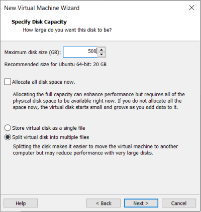
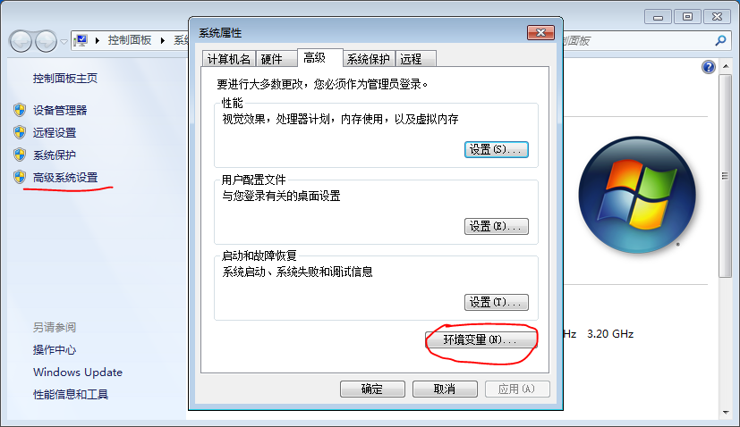

# Android 12.0_User’s Compilation Manual_V 1.0

Document classification: □ Top secret □ Secret □ Internal information ■ Open

## Copyright Notice

The copyright of this manual belongs to Baoding Folinx Embedded Technology Co., Ltd. Without the written permission of our company, no organizations or individuals have the right to copy, distribute, or reproduce any part of this manual in any form, and violators will be held legally responsible.

Forlinx adheres to copyrights of all graphics and texts used in all publications in original or license-free forms.

The drivers and utilities used for the components are subject to the copyrights of the respective manufacturers. The license conditions of the respective manufacturer are to be adhered to. Related license expenses for the operating system and applications should be calculated/declared separately by the related party or its representatives.

## Overview

<font style="color:#333333;">This manual is designed to enable users of the Forlinx Embedded development board to quickly understand the</font><font style="color:#333333;">compilation process</font><font style="color:#333333;">of the products and familiarize themselves with the </font><font style="color:#333333;">compilation</font><font style="color:#333333;">methods</font><font style="color:#333333;">of</font><font style="color:#333333;">Forlinx</font><font style="color:#333333;"> products. The application needs to be cross-compiled on an </font><font style="color:#333333;">ubuntu</font><font style="color:#333333;">host before it can run on the development board.</font> By following the methods provided in the compilation manual and performing practical operations, you will be able to successfully compile you own software code.

The manual will provide instructions for setting up the environment but there may be some unforeseen issues during the environment setup process. For beginners, it is recommended to use the pre-configured development environment provided by us. This will allow you to quickly get started and reduce development time.

Linux systems are typically installed in three ways: Dual system on a real machine, single system on a real machine, and virtual machine. Different installation methods have their advantages and disadvantages. This manual only provides methods to build ubuntu in a virtual machine. 

Hardware Requirements: It is recommended to have at least <font style="color:black;background-color:#FFFFFF;">16GB</font><font style="color:black;background-color:#FFFFFF;"> memory or above. It allows for allocating a sufficient memory to the virtual machine (recommended to allocate</font><font style="color:black;background-color:#FFFFFF;">10GB</font><font style="color:black;background-color:#FFFFFF;">or above), while still leaving enough resources for other operations on</font><font style="color:black;background-color:#FFFFFF;">Windows</font><font style="color:black;background-color:#FFFFFF;">. Insufficient memory allocation may result in slower performance on</font><font style="color:black;background-color:#FFFFFF;">Windows.</font>

The manual is mainly divided into five chapters:

+ Chapter 1. Virtual Machine software installation - introduction to downloading and installing Vmware software;
+ Chapter 2. provides the loading of the ubuntu system;
+ Chapter 3. Building, setting up, and installing necessary tools for the Ubuntu system and common issues in development environments;
+ Chapter 4. mainly focuses on the deployment and usage of Docker containers, kernel compilation, as well as Android-related source code;
+ Chapter 5. is the description of android application development.

A description of some of the symbols and formats in the manual:

|         **<font style="color:black;">Format</font>**         | **<font style="color:black;">Meaning</font>**                |
| :----------------------------------------------------------: | ------------------------------------------------------------ |
|                           **Note**                           | Note or information that requires special attention, be sure to read carefully |
|                              📚                               | Relevant notes on the test chapters                          |
|                              ️️🛤️ ️                              | Indicates the related path.                                  |
| <font style="color:blue;">Blue font on gray background</font> | Refers to commands entered at the command line(Manual input required). |
|         <font style="color:black;">Black font</font>         | Serial port output message after entering a command          |
|       **<font style="color:black;">Bold black</font>**       | Key information in the serial port output message            |
|                              //                              | Interpretation of input instructions or output information   |
|                      Username@Hostname                       | forlinx @ ubuntu: Development environment ubuntu account information, which can be used to determine the environment in which the function operates. |

Example: Search the Docker-CE version:

```plain
forlinx@ubuntu:~$ apt-cache madison docker-ce                   //查找 Docker-CE 的版本
docker-ce | 18.06.3~ce~3-0~ubuntu | http://mirrors.aliyun.com/docker-ce/linux/ubuntu/trusty/stable amd64 Packages
```

+ forlinx@ubuntu: the username is forlinx and the hostname is ubuntu, indicating that the user forlinx is used on the development environment ubuntu for operations.
+  //：Explanation of the instruction, no input required.
+ <font style="color:blue;">apt-cache madison docker-ce</font>: Blue font on a gray background, indicating the relevant commands that need to be manually entered.
+ **docker-ce | 18.06.3~ce~3-0~ubuntu:** The black font with gray background is the output information after the input command, and the bold font is the key information.

## Application Scope

This manual is mainly applicable to the Android12.0 operating system on the Forlinx OK3588-C platform. Other platforms can also refer to it, but there will be differences between different platforms. Please make modifications according to the actual conditions.

## Revision History

| **<font style="color:black;">Date</font>** | **<font style="color:black;">User Manual Version</font>** | **<font style="color:black;">Revision History</font>**       |
| :----------------------------------------: | :-------------------------------------------------------: | ------------------------------------------------------------ |
|                 04/11/2022                 |                           V1.0                            | OK3588-C Android 12.0 User’s Compilation Manual Initial Version |

## 1\. VMware Virtual Machine Software Installation

<font style="color:#000000;">This chapter mainly introduces the installation of VMware virtual machine, and takes VMware workstation 16 Pro v16.2.3 as an example to show the installation and configuration process of the operating system.</font>

### <font style="color:#000000;">1.1 VMware Software Downloads and Purchase</font>

Go to the VMware website https://www.vmware.com/cn.html[ ](https://www.vmware.com/cn.html)<font style="color:#000000;"> to download</font><font style="color:#000000;">Workstation Pro and get the product key. VMware is a paid software that requires purchasing, or you can choose to use a trial version.</font>


<font style="color:#000000;">After the download is complete, double-click the startup file to start the installer.</font>

### <font style="color:#000000;">1.2 VMware Software Installation</font>

<font style="color:#000000;">Double-click the startup program to enter the installation wizard, and click on "Next".</font>


<font style="color:#000000;">Check I accept the terms in the license agreement and click Next.</font>


<font style="color:#000000;">Modify the installation location to the partition of your computer where the software is installed, and click "Next".</font>


<font style="color:#000000;">Uncheck and click on "Next".</font>


<font style="color:#000000;">Check Add Shortcut and click "Next".</font>


<font style="color:#000000;">Click "Install"</font>


<font style="color:#000000;">Wait for the installation to complete.</font>


<font style="color:#000000;">Click "Finish" to try it out. If users need to use it for a long time, they need to buy it from the official and fill in the license.</font>


## 2\. Loading the Existing Ubuntu Development Environment

**Note:**

+ **It is recommended for beginners to directly use the pre-built virtual machine environment provided by Forlinx, which already includes installed cross-compiler and Qt environment. After understanding this chapter, you can directly jump to the compilation chapter for further study;**
+ **The development environment provided for general users is: forlinx (username), forlinx (password);**
+ **Please ask your sales representative for the download link.**

There are two ways to use a virtual machine environment in VMware: one is to directly load an existing environment, and the other is to create a new environment. First talk about how to load an existing environment.

First, download the development environment provided by Forlinx. In the development environment documentation, there should be an MD5 checksum file. After downloading the development environment, you should verify the integrity of the compressed package using the MD5 checksum. (You can use an on-line MD5 checksum tool or download a specific MD5 checksum tool for this purpose). To check if the checksum in the verification file matches the checksum of the file itself. If they match, the file download is successful. If they don't match, it suggests that the file may be corrupt, and you should consider downloading it again.


Select all compressed files, right-click and extract to the current folder or your own directory:


After the extraction is complete, you will obtain the development environment OK3588-VM16.2.3-ubuntu20.04.

The file "3588 development environment.vmx" in the OK3588-VM16.2.3-ubuntu20.04 folder is the file that you need to open to access the virtual machine.

Open the installed virtual machine.


Navigate to the directory where the recently extracted OK3588-VM16.2.3-ubuntu20.04 virtual machine file is located, and double-click on the startup file to open it.


Turn on this virtual machine after loading is complete to run it and enter the system's interface.


The default login account for automatic login in the development environment is "forlinx".


## 3\. New Ubuntu Development Environment Setup

**Note: Beginners are not recommended to set up a system on their own. It is recommended to use an existing virtual machine environment. If you do not need to set up the environment, you can skip this section.**

**This chapter mainly explains the building process of Ubuntu system.**

### 3.1 Ubuntu System Setup

#### 3.1.1 Ubuntu Virtual Machine Setup

Step 1: Open the VMware software and click \[File]/ \[New Virtual Machine]. Enter the following interface:


Step 2: Select Custom and click “Next”.


Select the compatibility with the corresponding version of VMware, which can be found in Help->About VMware Workstation, and click “Next”.


Select Install the operating system later and click “Next”.


Keep the default settings and click “Next”.


Modify the name and installation location of your virtual machine, and click “Next”.


Configure the number of CPU based on your computer's actual specifications.


The memory size is also set according to the actual situation, and 16 gigabytes is recommended for Android 12 compilation.


Set the network type, default to NAT mode then click “Next”. Keep the default values for the remaining steps until you reach the step to specify the disk capacity.


The default selection for the IO controller type here is LSI


The default selection here is also SCSI.


Choose to create a new virtual disk here.



Set the disk size to 500G, select the disk provisioning format, and then click “Next”.


Specify the disk file, the default one here is fine.


Click “Finish” by default.


The virtual machine creation is now complete.

In the next section, we will introduce the installation of Ubuntu system in the virtual machine, which is similar to the installation method in the real machine. Here we describe the method of installing Ubuntu system in a virtual machine.

#### 3.1.2 System Installation

In the previous section, a virtual machine was created, but no operating system was installed, so the virtual machine still cannot be started. Next, the Ubuntu operating system will be installed in the newly created virtual machine.

Step 1: Go to the Ubuntu official website to obtain the Ubuntu20.04 64. The download address is:

[https://old-releases.ubuntu.com/releases/20.04.3/](https://old-releases.ubuntu.com/releases/20.04.3/)

Because the source code is compiled and verified on the 20.04, select and install it. These operations may vary slightly between Ubuntu system versions.

Download “ubuntu-20.04.3-desktop-amd64.iso”


After downloading the mirror image, you can proceed with the system installation operation.

Right-click on the created virtual machine name and select “Settings” from the pop-up menu.


The “Virtual Machine Settings” menu will pop up.


Click on CD/DVD (SATA), select “Use ISO image file,” browse and choose the previously downloaded Ubuntu image, then click “OK” to confirm.


After setting up the image, ensure that the network is available. Then, start the virtual machine and proceed with the installation of the Ubuntu image.


After starting the virtual machine, wait for the installation interface to appear as shown below.


After selecting the language on the left side as shown in the image, click “Install Ubuntu”, and the language selection interface will pop up. The default language of Ubuntu is English, but of course, you can also choose Others.


The default selected language can also be reset at a later stage, after the selection is complete continue.


Next, select "Continue" as the default option to proceed with the installation. The installation process might be slow. Then, click "Continue" again.


By default, when you click on "Install Now", a dialog box will appear as shown in the image. Simply click "Continue" to proceed.


Next, select the timezone. You can either click on the Shanghai timezone or enter "Shanghai" (or choose the appropriate timezone based on your location). Then, click "Continue" to proceed.

Finally, set your username and password. You can choose either automatic login or login with a username and password. Click "Continue" to start the automatic installation.


If the internet connection is poor, you can Skip without affecting the installation process.


Click “Restart” Now to reboot.


The system interface after the reboot is complete.


The ubuntu system installation is complete.

#### 3.1.3 Ubuntu Basic Configuration

After installing the Ubuntu20.04 operating system, there are a few configurations to make.

VMware Tools Installation:

Next, install VMware Tools. Without installing this tool, you won't be able to copy and paste and drag file between the Windows host and the virtual machine. First click on "Virtual Machine" on the VMware navigation bar, then click "Install VMware Tools" in the drop-down box.


Once done, enter Ubuntu and the VMware Tools CD will appear on your desktop and click into it.


Enter and see a compressed file VMwareTools-10.3.10-12406962.tar.gz (it may be different for different VM versions); copy the file under the home directory (i.e. the directory with the home personal username)


Press \[Ctrl+Alt+T] to bring up the Terminal Command Interface and enter the command:

```plain
forlinx@ubuntu:~$ sudo tar xvf VMwareTools-10.3.10-12406962.tar.gz
```


After the extraction is complete, a file named “vmware-tools-distrib" will appear.


Go back to the terminal and type cd vmware-tools-distrib to enter the directory.

Enter: sudo ./vmware-install.pl followed by pressing Enter. Then, enter your password and the installation process will begin. When prompted, you can input "yes" and press Enter to proceed. For any other inquiries, simply press Enter to go with the default installation settings.


Once the VMware tools is complete, we can implement file copy and paste between Windows and Ubuntu.

The virtual machine is displayed full screen:

If the virtual machine is not able to be displayed in full screen, you can resolve this issue by clicking on "View" and selecting "Autofit Guest." This will adjust the display to fit the screen automatically, enabling you to have a full-screen experience in the virtual machine.


Make most of the system settings in the location shown. A lot of the setup requirements on Ubuntu can be done here.


Virtual machine hibernation settings:

Also, the default hibernation is 5min, if you don't want to set hibernation, just set it to Never by setting Power->Blank screen.


#### 3.1.4 Network Settings for Virtual Machines

##### 3.1.4.1 NAT Connection Method

By default, after the virtual machine is installed, the network connection method is set to NAT, which shares the host machine's IP address. This configuration does not need to be changed when performing tasks like installing dependencies or compiling code.

When the VMware virtual NIC is set to NAT mode in a virtual machine, the network in the Ubuntu environment can be set to dynamic IP. In this mode the virtual NAT device and the host NIC are connected to communicate for Internet access. This is the most common way to access the external network.


##### 3.1.4.2 Connections for Bridges

When the VMware virtual NIC device is in bridge mode, the host NIC and the virtual machine NIC communicate through the virtual bridge, and the network IP and the host need to be set in the same network segment in the Ubuntu environment. If accessing an external network, you need to set the DNS to be consistent with the host NIC. If TFTP, SFTP and other servers are used, the network contact mode of the virtual machine needs to be set as the bridge mode.


## 3.2 Installation of the Library Needed to Compile Android

**Note: If you use the development environment provided by us, this section can be skipped directly.**

Android compilation requires the installation of several toolkits. Make sure that your computer or virtual machine can be connected to the Internet normally before the operation in this section. If the network is disconnected during the installation, please follow the following steps to install.

1. Install and compile the necessary packages for Android.

```plain
forlinx@ubuntu:~$ sudo apt-get update
forlinx@ubuntu:~$ sudo apt-get install software-properties-common
forlinx@ubuntu:~$ sudo add-apt-repository ppa:openjdk-r/ppa
forlinx@ubuntu:~$ sudo apt-get update
forlinx@ubuntu:~$ sudo apt-get install uuid \
	uuid-dev \
	zlib1g-dev \
	liblz-dev \
	liblzo2-2 \
	liblzo2-dev \
	lzop \
	git curl \
	u-boot-tools \
	mtd-utils \
	android-sdk-libsparse-utils \
	openjdk-8-jdk \
	device-tree-compiler \
	gdisk \
	m4 \
	make bc fakeroot unzip zip gawk busybox libstdc++6 lib32stdc++6 \
  bison flex python libssl-dev cpio lz4 rsync
```

The following libraries also need to be installed when using the Network Configuration Tool and menuconfig:

```plain
forlinx@ubuntu:~$ sudo apt-get update                      //Update the download source information
forlinx@ubuntu:~$ sudo apt-get install libncurses*             //For building text-based user interfaces
forlinx@ubuntu:~$ sudo apt-get install net-tools               //Network configuration tool
```

Switch to the JDK version

If you have previously installed another version of the JDK, you will need to switch versions.

To view the installed version:

```plain
forlinx@ubuntu:~$ update-java-alternatives -l
```


```plain
forlinx@ubuntu:~$ sudo update-alternatives --config java
```


Enter the option corresponding to java8 and press Enter to confirm.

## 4\. Android System Compilation

You can access the documentation and source code of the software and hardware through the web link provided by Forlinx.

The compilation process needs to be carried out in the docker container. The program should be modified outside the docker as far as possible. The vim command in the docker is not very convenient to use.

### 4.1 Software Configuration File Path

OK3588-C platform, the software configuration file path is as follows:

| **Document type**| **Path**|
|:----------:|----------|
| Kernel configuration file| arch/arm64/configs/OK3588-Android\_defconfig|
| Device tree file| arch/arm64/boot/dts/rockchip/FET3588-C.dtsi<br/>arch/arm64/boot/dts/rockchip/OK3588-C-Common.dtsi<br/>arch/arm64/boot/dts/rockchip/OK3588-C-Camera.dtsi<br/>arch/arm64/boot/dts/rockchip/ OK3588-C-Android.dts|
| android| device/rockchip/rk3588/ok3588\_c/|

### 4.2 System Compilation

#### 4.2.1 Preparation Before Compilation

Please confirm the size of the swap partition of the current system. If the swap partition is insufficient, the compilation of the Android source code will fail. 10G is recommended. It is recommended to adjust the development environment memory to 16G.

1\. View the swap partition:

```plain
forlinx@ubuntu:~$ cat  /proc/swaps
```

The virtual machine provided by Forlinx has been configured with the swap partition by default. If you use other virtual machines, you can increase the size of the swap partition by creating a swap file:

```plain
forlinx@ubuntu:~$ sudo swapoff /swapfile
forlinx@ubuntu:~$ sudo fallocate -l 10G /swapfile
forlinx@ubuntu:~$ sudo chmod 600 /swapfile
forlinx@ubuntu:~$ sudo mkswap /swapfile
forlinx@ubuntu:~$ sudo swapon /swapfile
forlinx@ubuntu:~$ sudo vim /etc/fstab
```

Adding the following at the end of the/etc/fstab file:

```plain
/swapfile none swap sw 0 0
```

2\. It is recommended to adjust the memory of the development environment to 16G. Low memory may cause the compilation to fail.


The source code package of the Android 12 system is placed in the data in the form of a volume compression package. Copy all the compression packages to the/home/forlinx/work/directory of the development environment, which is described below.

#### 4.2.2 Source Code Copy and Release

Source Code Package Path: OK3588-C (Android) User Profile \\ Android \\ Source Code \\

The source code in the data is a volume compression package, which needs to be merged first, and then decompressed and released.

1. Copy all source code compressed packages to the/home/forlinx/work directory of the development environment, and perform MD5 verification.

You can directly drag the source code package on the computer to the folder on the desktop of the virtual machine, or use the shared folder to use the command copy. Here we focus on the use of the shared folder.

There are many kinds of file transfers between ubuntu and Windows hosts. After installing VMware Tools, you can set up a virtual machine shared folder to mount the file directory of the Windows host to ubuntu for file sharing.

Click "Virtual Machine" on the menu bar and select "Settings".


Click "Options", enable "Shared Folders", set the shared directory on the Windows host, and click "OK".


After the file-sharing setup of the virtual machine is complete, place the source zip in the shared folder of the Windows host, here we name it “share”.

Shared folder in ubuntu in the mount directory /mnt/hgfs/share.

Copy the source code from the shared folder to ubuntu's /home/forlinx/work directory for md5 checksum:

```plain
forlinx@ubuntu:~$ cp /mnt/hgfs/share/OK3588-android-source* /home/forlinx/work/      
forlinx@ubuntu:~$ cd /home/forlinx/work
forlinx@ubuntu:~/work$ md5sum OK3588-android-source*
```

If the returned MD5 check code is consistent with the check code in the data, the source code can be merged.

2. Merge and unpack Android source code

First, merge the archives into a single archive:

```plain
forlinx@ubuntu:~/work$ cat OK3588-android-source.tar.bz2.* > OK3588-android-source.tar.bz2
```

Decompress the combined compressed package

```plain
forlinx@ubuntu:~/work$ tar xvf OK3588-android-source.tar.bz2
```

3. Modify source code file group

View the current account ID. This example takes the development environment forlinx account provided by Forlinx as an example.

```plain
forlinx@ubuntu:~/work/$ id
uid=1000(forlinx) gid=1000(forlinx) groups=1000(forlinx),4(adm),24(cdrom),27(sudo),30(dip),46(plugdev),108(lpadmin),124
(sambashare)
```

Modify source code file group

```plain
forlinx@ubuntu:~/work/$ sudo chown 1000:1000 -R OK3588-android-source
forlinx@ubuntu:~/work/$ ls -l
drwxr-xr-x 4 forlinx forlinx        4096  4月 19 10:50 OK3588-android-source
```

4. Add the Java runtime environment variable at the end of the.bashrc environment variable file in the user's home directory:

```plain
forlinx@ubuntu:~$ vim /home/forlinx/.bashrc
```

The additions are as follows:

```plain
export _JAVA_OPTIONS="-Xms64m -Xmx2g"
export MAVEN_OPTS="-Xms5120m -Xmx5120m"
```

Note: The development environment we provide modifies the.bashrc file as a hidden file, which can be viewed with the ls -a command and modified with the vim command.

```plain
forlinx@ubuntu:~$ source ~/.bashrc
```

#### 4.2.3 Android System Compilation

The android system compilation part of OK3588 platform supports full and partial compilation. All contents will be automatically compiled and packaged into an image that can be directly used for flashing. Part of the compilation is mainly used in the product development phase to compile the Linux kernel device tree or android system.

1\. Enter docker environment

To compile this system, you need to switch to the forlinx account

```plain
root@4d199700bc75:/# su forlinx
forlinx@4d199700bc75:/$
```

2\. Full compilation

Enter the longan directory and execute the following command:

```plain
forlinx@4d199700bc75:/$ cd /home/forlinx/work/OK3588-android-source/
forlinx@4d199700bc75:~/OK3588-android-source/$ ./forlinx.sh all
```

Because the android system is too large, the compilation time is slightly longer. Please wait patiently for the compilation to be completed. The compiled image is located in the rockdev/Image-ok3588\_c/directory. The image file is a update. img

3\. Compile the kernel separately

```plain
forlinx@4d199700bc75:/$ cd /home/forlinx/work/OK3588-android-source/
forlinx@4d199700bc75:~/OK3588-android-source/$ ./forlinx.sh kernel
forlinx@4d199700bc75:~/OK3588-android-source/$ ./forlinx.sh kernel_pack
```

The compiled boot. img is /out/target/product/ok3588\_c$.

## 5\. Android Application Development

This chapter explains how to set up the Android application development environment, including downloading and installing the Android SDK and Android Studio integrated development environment, as well as using the OK3588 development board for on-device debugging. It is highly suitable for Android beginners to learn from and refer to.

### 5.1 Android Application Development Environment Setup

#### 5.1.1 JDK（Java SE Development Kit）Download and Installation

Since the Android application code is written in Java, you need to install the JDK on Windows first. The JDK can be downloaded as follows:

It is recommended to install Java 8, visit the website [https://www.oracle.com/java/technologies/downloads](https://www.oracle.com/java/technologies/downloads), and select the Windows x64 version of Java 8 in the page. You can also directly visit the website [https://www.oracle.com/java/technologies/downloads/#java8-windows](https://www.oracle.com/java/technologies/downloads/#java8-windows) to enter the download page.


Accept the agreement and proceed with the download.


Currently, download JDK from the official Oracle website requires registration for an Oracle account. You may also choose alternative download methods.

After the download is completed, double-click the installer to complete the installation according to the wizard's prompts.

After the installation is complete, you need to add the JDK command to the Path environment variable. Use the following method to add the path of the JDK command to the Path environment variable:

1) Right-click on "My Computer" -> Properties, then select the "Advanced system settings" option on the left navigation;

2) Click the "Environment Variables" option in the lower right corner;

3) In "System Variables", find the Path environment variable, and double-click it; according to the actual installation path to set the java environment variable; the default installation adds the following content "C:\\Program Files\\Java\\jdk1.8.0\_211\\bin” (depending on the customer's actual installation path);

4) Click "OK" to complete the environment variable setting.

The following is a screenshot of the win7 system:




The following is a screenshot of the win10 system:


5) Check that the installation was successful.

After completing the above settings, restart the computer, open the command prompt tool in the DOS window of the computer, and enter:

```plain
javac -version
```


The correct display of the Java version indicates a successful installation.

#### 5.1.2 Android Studio Installation

Android Studio is a new development tool for Android launched by Google at I/O 2013. Please visit http://www.android-studio.org/ to download. It is recommended to download version 3.5.2.

After downloading, follow the prompts to install it. When the installation is complete, the following figure appears:


Select “Do not import settings ":


Select “Cancel ":


Click "Next" to go to the next step:


Select "custom" here:


Choose a UI theme based on your personal preference:


Select the installation path of Android SDK according to the actual situation:


Select the memory size for the emulator:


Click “Finish”.


When the installation is complete, click“Finish”.

#### 5.1.3 Helloworld Project Creation

1. Select “start a new android studio project”：


2. Choose “Empty Activity”：
   
   

Click "Next" to modify the project name and select the minimum supported android version:


Click “Finish”.


Tools such as Gradle will be downloaded for the first use, so please be patient.

3. Installl android 12.0 SDK

Click "File"-> "settings" to search SDK and open the interface as shown in the figure below:


Check "Android 12.0)" and click "OK" to install.

4. Modify "build. gradle" :

Modify all 32 in the file to 31, and press Ctrl + s to save the modified file.


5. Compilation


Click "build"-> "Make Project" to recompile.

6. Run

After compiling, link the OTG cable to the USB port of your PC and click the green triangle icon in the menu bar.


### 5.2 Apk Platform Signature

**Note: If there is no OpenSSL command in your windows system, please go to [http://slproweb.com/products/Win32OpenSSL.html](http://slproweb.com/products/Win32OpenSSL.html) to down load and install it, and set environment variables.**

In the Android platform, SELinux divides apps into three types, including untrusted\_app which has no platform signature and system privileges, platform\_app which has platform signature and no system privileges, and system\_app which has platform signature and system privileges. 

This chapter will introduce how to sign the apk and obtain system permissions.

1. Make signature document.

Copy build/target/product/security/platform.x509.pem and build/target/product/security/platform.pk8 in Android system to windows.

Open a command line window to execute:

```plain
openssl pkcs8 -in platform.pk8 -inform DER -outform PEM -out shared.priv.pem –nocrypt
openssl pkcs12 -export -in platform.x509.pem -inkey shared.priv.pem -out shared.pk12 -name androiddebugkey
```

Enter password: android

```plain
keytool -importkeystore -deststorepass android -destkeypass android -destkeystore debug.keystore -srckeystore shared.pk12 -srcstoretype PKCS12 -srcstorepass android -alias androiddebugkey
```

The key-alias and password can be modified to other contents as required. Save the signature file debug. keystore files to your usual directory.

2. Set andorid studio

Open any android studio project and add the shared UID in the AndroidManifest.xml, for example:

```plain
<manifest xmlns:android="http://schemas.android.com/apk/res/android"
    package="com.example.forlinx.helloworld"
android:sharedUserId="android.uid.system">
```

Click “File”->“project structure”:


Click “OK”.

To add the signature configuration for the debug and release versions, click "Build"in the Android Studio menu bar and "Edit Build Type...".


Click "OK" when the modification is completed.

Click the run button "" of android studio to  start the app. Enter in the serial port:

ps –AZ


Confirm whether your app has become system \_ app.

If the app prints the following error when running:


Solution: Uninstall the APP in the system, restart the board, and reinstall and run it.

### 5.3 Pre - installation Method of APK in System

1. Create a new directory in Android system:

```plain
forlinx@ubuntu:~/work/OK3588-android-source$ mkdir packages/apps/helloworld
```

Copy the apk that needs to be pre-installed (no signature is required) to the directory. Take the helloworld.apk as an example:

```plain
forlinx@ubuntu:~/work/OK3588-android-source$ cp helloworld.apk packages/apps/helloworld
```

2. Create a new Android. mk at packages/apps/helloworld

```plain
forlinx@ubuntu:~/work/OK3588-android-source$vi packages/apps/helloworld/Android.mk
```

Add the following:

```plain
	LOCAL_PATH := $(call my-dir)
	include $(CLEAR_VARS)
	LOCAL_MODULE := helloworld
	LOCAL_SRC_FILES := helloworld.apk
	LOCAL_MODULE_CLASS := APPS
	LOCAL_MODULE_SUFFIX := .apk
	LOCAL_BUILT_MODULE_STEM := package.apk
	LOCAL_CERTIFICATE := platform
	LOCAL_DEX_PREOPT := false
	LOCAL_PRIVILEGED_MODULE := true
	include $(BUILD_PREBUILT)
```

3. <font style="color:#000000;">Modify at the same time device/rockchip/rk3588/ok3588\_c/ok3588\_c.mk</font>

```plain
forlinx@ubuntu:~/work/OK3588-android-source$ vi device/rockchip/rk3588/ok3588_c/ok3588_c.mk
```

Add the followings:

```plain
PRODUCT_PACKAGES += \
helloworld
```

4. Recompile the image

### 5.4 Method for App to Obtain Root Permission

The OK3588 platform supports app invocation of “su” to gain root privileges. By default, this feature is disabled. The method to enable it is as follows:

1. Open the Settings and click "About Tablet PC" to enter the interface as follows:


Click the "version number" continuously, and there will be a prompt at the bottom, "You are now in developer mode".

2. Click "System","Advanced", "Developer Options":
   
   

3. Turn on the root authorization option:
   
   

4. Restart the system.

5. App obtains root permission test.

Path: OK3588-C (Android) User Profile \\ Android \\ Testers \\ su \_ exec. Zip

Copy su\_exec.zip to any directory in Windows and unzip it. Connect the OK3588 board to the PC via USB using a USB OTG cable. Navigate to the su\_exec\\app\\build\\outputs\\apk\\debug directory using the Windows Command Prompt and install the apk software package using the adb install command.


After the installation is completed, click "su \_ exec" "on the application interface.


Users can test if they have permission to view by typing cat /proc/bootevent in the OK3588 terminal.