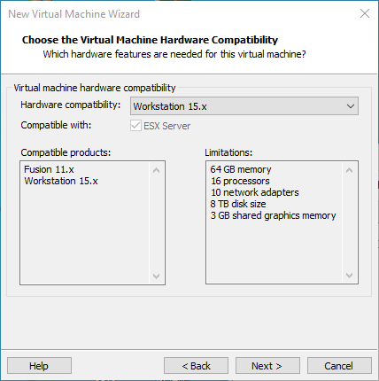
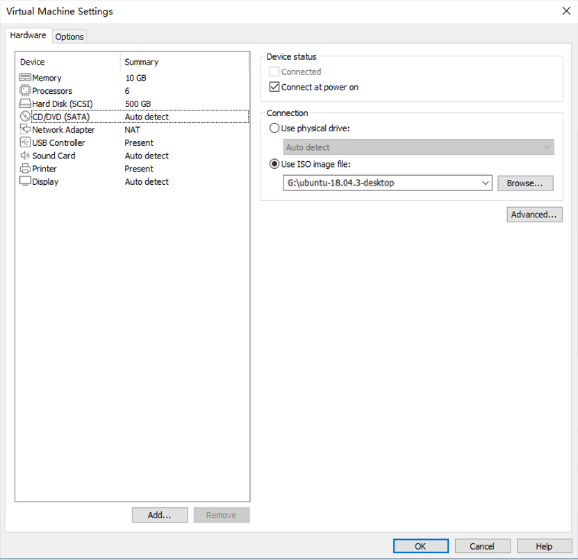
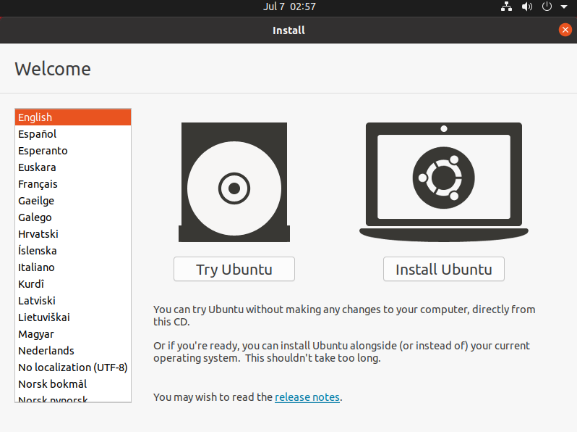

# Linux5.10.209_User's Compilation Manual_V1.0

Document classification: □ Top secret □ Secret □ Internal information ■ Open

## Copyright Notice

The copyright of this manual belongs to Baoding Folinx Embedded Technology Co., Ltd. Without the written permission of our company, no organizations or individuals have the right to copy, distribute, or reproduce any part of this manual in any form, and violators will be held legally responsible.

Forlinx adheres to copyrights of all graphics and texts used in all publications in original or license-free forms.

The drivers and utilities used for the components are subject to the copyrights of the respective manufacturers. The license conditions of the respective manufacturer are to be adhered to. Related license expenses for the operating system and applications should be calculated/declared separately by the related party or its representatives.

## Overview

<font style="color:#333333;">This manual is designed to enable users of the Forlinx Embedded development board to quickly understand the</font><font style="color:#333333;">compilation process</font><font style="color:#333333;">of the products and familiarize themselves with the </font><font style="color:#333333;">compilation</font> <font style="color:#333333;">methods </font><font style="color:#333333;">of</font> <font style="color:#333333;">Forlinx</font><font style="color:#333333;"> products. The application needs to be cross-compiled on an </font><font style="color:#333333;">ubuntu</font><font style="color:#333333;">host before it can run on the development board. </font>By following the methods provided in the compilation manual and performing practical operations, you will be able to successfully compile your own software code.

The manual will provide instructions for setting up the environment but there may be some unforeseen issues during the environment setup process. For beginners, it is recommended to use the pre-configured development environment provided by Forlinx. This will allow you to quickly get started and reduce development time.

Linux systems are typically installed in three ways: Dual system on a real machine, single system on a real machine, and virtual machine. Different installation methods have their advantages and disadvantages. This manual only provides methods to build ubuntu in a virtual machine.

Hardware Requirements: It is recommended to have at least<font style="color:black;background-color:#ffffff;">16GB</font><font style="color:black;background-color:#ffffff;"> memory or above.It allows for allocating a sufficient memory to the virtual machine (recommended to allocate</font><font style="color:black;background-color:#ffffff;">10GB</font><font style="color:black;background-color:#ffffff;">or above), while still leaving enough resources for other operations on</font><font style="color:black;background-color:#ffffff;">Windows</font><font style="color:black;background-color:#ffffff;">. Insufficient memory allocation may result in slower performance on</font><font style="color:black;background-color:#ffffff;">Windows.</font>

The manual is mainly divided into four chapters:

+ Chapter 1. Virtual Machine software installation - introduction to downloading and installing Vmware software;
+ Chapter 2. provides the loading of the ubuntu system;
+ Chapter 3. Building, setting up, and installing necessary tools for the Ubuntu system and common issues in development environments;
+ Chapter 4. Compiling the kernel and Linux-related source code.

A description of some of the symbols and formats associated with this manual:

| **Format**| **Meaning**|
|:----------:|----------|
| **Note** | Note or information that requires special attention, be sure to read carefully|
| 📚 | Relevant notes on the test chapters|
| ️️🛤️ ️ | Indicates the related path.|
| <font style="color:blue;">Blue font on gray background</font>| Refers to commands entered at the command line(Manual input required).|
| <font style="color:black;">Black font</font>| Serial port output message after entering a command|
| **<font style="color:black;">Bold black</font>**| Key information in the serial port output message|
| //| Interpretation of input instructions or output information|
| Username@Hostname| forlinx @ ubuntu: Development environment ubuntu account information, which can be used to determine the environment in which the function operates.|

After packaging the file system, you can use the “ls” command to view the generated files.

```plain
forlinx@ubuntu:~/3588$ ls                                  //List the files in this directory
OK3588-linux-source  OK3588-linux-source.tar.bz2
```

+ forlinx@ubuntu: the username is forlinx and the hostname is ubuntu, indicating that the operation is performed in the development environment ubuntu;
+ //: Explanation of the instruction, no input required;
+ <font style="color:blue;">ls</font>：Blue font, indicating the relevant commands that need to be manually entered;
+ **<font style="color:black;">OK3588-linux-source</font>**：Black font is the output information after entering the command; bold font is the key information; here is the packaged file system.

## Application Scope

This manual is mainly applicable to the Linux5.10.209 operating system on the Forlinx OK3588-C platform. Other platforms can also refer to it, but there will be differences between different platforms. Please make modifications according to the actual conditions.

## Revision History

| **Date**| **Manual Version**| **SoM Version**| **Carrier Board Version**| **Revision History**|
|:----------:|:----------:|:----------:|:----------:|----------|
| 25/11/2024 | V1.0| V1.1| V1.3 and Above| OK3588-C Linux User Compilation Manual Initial Version|


## 1. VMware Virtual Machine  Installation

<font style="color:#000000;">This chapter mainly introduces the installation of </font>VMware virtual machines, using VMware Workstation 17 Pro v17.0.0 <font style="color:#000000;">as an example to demonstrate the installation and configuration process of the operating system.</font>

### <font style="color:#000000;">1.1 VMware Software Downloads and Purchase</font>

Go to the VMware website https://www.vmware.com/cn.html to download Workstation Pro and get the product key. VMware is a paid software that requires purchasing, or you can choose to use a trial version.


<font style="color:#000000;">After the download is complete, double-click the startup file to start the installer.</font>

### <font style="color:#000000;">1.2 VMware Software Installation</font>

<font style="color:#000000;">Double-click the startup program to enter the installation wizard, and click on "Next".</font>


<font style="color:#000000;">Check I accept the terms in the license agreement and click Next.</font>


<font style="color:#000000;">Modify the installation location to the partition of your computer where the software is installed, and click "Next".</font>


<font style="color:#000000;">Uncheck and click on "Next".</font>


<font style="color:#000000;">Check Add Shortcut and click "Next".</font>


<font style="color:#000000;">Click "Install"</font>


<font style="color:#000000;">Wait for the installation to complete.</font>


<font style="color:#000000;">Click "Finish" to try it out. If users need to use it for a long time, they need to buy it from the official and fill in the license.</font>


<font style="color:#000000;">     </font>


## 2. Ubuntu Development Environment Loading

**Note:**

+ **It is recommended for beginners to directly use the pre-built virtual machine environment provided by Forlinx, which already includes installed cross-compiler and Qt environment. After understanding this chapter, you can directly jump to the compilation chapter for further study;**
+ **The development environment provided for general users is: forlinx (username), forlinx (password);**
+ **Please ask your sales representative for the download link.**

There are two ways to use a virtual machine environment in VMware: One is to directly load an existing environment, and the other is to create a new environment. Let's first talk about how to load an existing environment.

First, download the development environment provided by Forlinx. In the development environment documentation, there should be an MD5 checksum file. After downloading the development environment, you should verify the integrity of the compressed package using the MD5 checksum. (You can use an on-line MD5 checksum tool or download a specific MD5 checksum tool for this purpose). To check if the checksum in the verification file matches the checksum of the file itself. If they match, the file download is successful. If they don't match, it suggests that the file may be corrupt, and you should consider downloading it again.


Select all compressed files, right-click and extract to the current folder or your own directory: Unzip it and get the development environment 3588.

3588 development environment.vmx in the 3588 folder is the file to be opened by the virtual machine.

Open the installed virtual machine.


Navigate to the directory where the recently extracted OK3588-VM15.1.0-ubuntu20.04 virtual machine file is located, and double-click on the startup file to open it.


Turn on this virtual machine after loading is complete to run it and enter the system's interface.


The default automatic login account is "forlinx", and the password is "forlinx".


## 3. New Ubuntu Development Environment Setup

**Note: Beginners are not recommended to set up a system on your own. It is recommended to use an existing virtual machine environment. If you do not need to set up the environment, you can skip this section.**

### <font style="color:#000000;">3.1 Ubuntu System Setup </font>

#### 3.1.1 Creating an Ubuntu Virtual Machine

Step 1: Open the VMware software and click [File]/ [New Virtual Machine].
Enter the following interface:


Step 2: Select Custom and click “Next”.



Select the compatibility with the corresponding version of VMware, which can be found in Help->About VMware Workstation, and click “Next”.


Select Install the operating system later and click “Next”.


Keep the default settings and click “Next”.


Modify the name and installation location of your virtual machine, and click “Next”.


Configure the number of CPU based on your computer's actual specifications.


Set the memory size according to the actual situation. It is recommended to use 16G.


Set the network type, default to NAT mode then click “Next”. Keep the default values for the remaining steps until you reach the step to specify the disk capacity.


The default selection for the IO controller type here is LSI.


The default selection here is also SCSI.


Choose to create a new virtual disk here.


Set the disk size to 500GB, select the disk provisioning format, and then click “Next”.


Specify the disk file, the default one here is OK.


Click “Finish” by default.


The virtual machine creation is now complete.


In the next section, the installation of the Ubuntu system in a virtual machine will be introduced. The installation method on a real machine is similar to that in a virtual machine. Here, the method of installing the Ubuntu system in a virtual machine is presented. 

#### <font style="color:#000000;">3.1.2 System Installation</font>
In the previous section, a virtual machine was created, but no operating system was installed, so the virtual machine still cannot be started. Next, the Ubuntu operating system will be installed in the newly created virtual machine.

Step 1: First, go to the official Ubuntu website to obtain the 64-bit image of Ubuntu 22.04. The download address is:

[https://old-releases.ubuntu.com/releases/22.04.4/](https://old-releases.ubuntu.com/releases/22.04.4/)

The installed Ubuntu version is 22.04. The reason for choosing 22.04 is that all our source code compilation operations have been compiled and verified on this version. These operations may vary slightly between Ubuntu system versions.

Download “ubuntu-22.04.4-desktop-amd64.iso”

After downloading the image, you can proceed with the system installation operation.

Right-click on the created virtual machine name and select “Settings” from the pop-up menu.


The “Virtual Machine Settings” menu will pop up.
Click on CD/DVD (SATA), select “Use ISO image file,” browse and choose the previously downloaded Ubuntu image, then click “OK” to confirm.



After setting up the image, ensure that the network is available. Then, start the virtual machine and proceed with the installation of the Ubuntu image.


After starting the virtual machine, wait for the installation interface to appear as shown below:



After selecting the language on the left side as shown in the image, click “Install Ubuntu”, and the language selection interface will pop up. The default language of Ubuntu is English, but of course, you can also choose others.


The default selected language can also be reset later, after the selection is complete continue.


Next, select "Continue" as the default option to proceed with the installation. The installation process might be slow. Then, click "Continue" again.


By default, when you click on "Install Now", a dialog box will appear as shown in the image. Simply click "Continue" to proceed.


Next, select the timezone. You can either click on the Shanghai timezone or enter "Shanghai" (or choose the appropriate timezone based on your location). Then, click "Continue" to proceed. Finally, set your username and password. You can choose either automatic login or login with a username and password. Click "Continue" to start the automatic installation.


If the network is not good, it can be skipped without affecting the installation.


Click “Restart Now”  to reboot.


The system interface after the reboot is complete.


The ubuntu system installation is complete.

#### <font style="color:#000000;">3.1.3 Ubuntu Basic Configuration</font>
After installing the Ubuntu20.04 operating system, there are a few configurations to make.

VMware Tools Installation：

Next, install VMware Tools. Without installing this tool, you won't be able to copy and paste and drag file between the Windows host and the virtual machine. First click on "Virtual Machine" on the VMware navigation bar, then click "Install VMware Tools" in the drop-down box.


Once done, enter Ubuntu and the VMware Tools CD will appear on your desktop and click into it.


Enter and see a compressed file VMwareTools-10.3.10-12406962.tar.gz (it may be different for different VM versions); copy the file under the home directory (i.e. the directory with the home personal username)


Press [Ctrl+Alt+T] to bring up the Terminal Command Interface and enter the command:

forlinx@ubuntu:~$ sudo tar xvf VMwareTools-10.3.10-12406962.tar.gz 


After the extraction is complete, a file named “vmware-tools-distrib" will appear.


Go back to the terminal and type: <font style="color:#0000ff;">cd vmware-tools-distrib</font> to enter the directory.

Enter: <font style="color:#0000ff;">sudo ./vmware-install.pl</font>  press enter to input the password, then the installation will begin. For any other inquiries, simply press Enter to go with the default installation settings.


Once the VMware tools is complete, you can implement file copy and paste between Windows and Ubuntu.

The virtual machine is displayed full screen:

If the virtual machine is not able to be displayed in full screen, you can resolve this issue by clicking on "View" and selecting "Autofit Guest." This will adjust the display to fit the screen automatically, enabling you to have a full-screen experience in the virtual machine.


Make most of the system settings in the location shown. A lot of the setup requirements on Ubuntu can be done here.


Virtual machine hibernation settings:

Also, the default hibernation is 5min, if you don't want to set hibernation, just set it to Never by setting Power->Blank screen.


#### <font style="color:#000000;">3.1.4 Network Settings for Virtual Machine</font>
##### <font style="color:#000000;">3.1.4.1 NAT Connection Method</font>

By default, after the virtual machine is installed, the network connection method is set to NAT, which shares the host machine's IP address. 

This configuration does not need to be changed when performing tasks like installing dependencies or compiling code.

When the VMware virtual NIC is set to NAT mode in a virtual machine, the network in the Ubuntu environment can be set to dynamic IP. In this mode the virtual NAT device and the host NIC are connected to communicate for Internet access. This is the most common way to access the external network.


##### <font style="color:#000000;">3.1.4.2 Connections for Bridges</font>
When the VMware virtual NIC device is in bridge mode, the host NIC and the virtual machine NIC communicate through the virtual bridge, and the network IP and the host need to be set in the same network segment in the Ubuntu environment. If accessing an external network, you need to set the DNS to be consistent with the host NIC. If TFTP, SFTP and other servers are used, the network contact mode of the virtual machine needs to be set as the bridge mode.


### 3.2 Libraries for Installing Linux Compilation System
**Note: If you use the development environment provided by us, this section can be skipped directly.**

Compiling for Linux requires the installation of a number of toolkits.
Make sure that your computer or virtual machine can be connected to the Internet normally before the operation in this section. If the network is disconnected during the installation, please follow the following steps to install.

1. Install the necessary packages for compiling Linux.

```plain
forlinx@ubuntu:~$ sudo apt-get update
forlinx@ubuntu:~$ sudo apt-get install openssh-server vim git fakeroot    //Necessary toolkit installation
forlinx@ubuntu:~$ sudo apt-get install ssh make gcc libssl-dev liblz4-tool expect expect-dev g++ patchelf chrpath gawk texinfo chrpath diffstat binfmt-support qemu-user-static live-build bison flex cmake gcc-multilib g++-multilib unzip device-tree-compiler ncurses-dev libgucharmap-2-90-dev bzip2 expat gpgv2 cpp-aarch64-linux-gnu libgmp-dev libmpc-dev bc python-is-python3 python2
```

2. The following libraries also need to be installed when using the Network Configuration Tool and menuconfig:

```plain
forlinx@ubuntu:~$ sudo apt-get update                      //Update the download source information
forlinx@ubuntu:~$ sudo apt-get install libncurses*             //For building text-based user interfaces
forlinx@ubuntu:~$ sudo apt-get install net-tools               //Network configuration tool
```

### 3.3 Cross-compilation Chain Installation 

Use account information/2-Image and source code/2-Test procedure/aarch64-buildroot-linux-gnu_sdk-buildroot.tar.gz

Copy the above compressed package to the development environment/home/forlinx/, and decompress it in this directory:

```plain
forlinx@ubuntu:~$ tar -zvxf aarch64-buildroot-linux-gnu_sdk-buildroot.tar.gz   
```

Go to the aarch64-buildroot-linux-gnu _ sdk -buildroot directory and execute relocate-sdk. Sh.

```plain
forlinx@ubuntu:~/aarch64-buildroot-linux-gnu_sdk-buildroot$ ./relocate-sdk.sh
```

### <font style="color:#000000;">3.4 Qt Creator Installation</font>
Copy qt-creator-opensource-linux-x86_64-4.1.0.run to any directory within the current user’s home directory, and then run the following command.

Path: OK3588-C-C（Linux）user’s profile\Linux\source code\qt-creator-opensource-linux-x86_64-4.7.0.run

```plain
forlinx@ubuntu:~/3588$ ./qt-creator-opensource-linux-x86_64-4.7.0.run
```


Then the installation window of the graphical interface will pop up, and install according to the instructions:


For online installation, register a Qt account (log in directly if you already have one). Password must include capital letters, uppercase, lowercase letters and numbers. After successful registration/login, click next. Skip this step for offline installation. 


Click "Next".


You can set the installation path according to your own habits. It is set by default here, so click "Next".


Installation completes, click "Next".


Click "Install" and wait for the installation to complete.


At this time, the Qt interface will be opened automatically. You can also start it through the command line. Execute the following command to open Qt Creator in the backstage. When the you open it, the actual installation path shall prevail:

```plain
forlinx@ubuntu:~$ cd /home/forlinx/qtcreator-4.7.0/bin
forlinx@ubuntu:~$ ./qtcreator &
```


The Qt Creator tool screen appears. Qt Creator is installed.


## 4. Related Code Compilation

Linux system is a desktop operating system built by Forlinx on the basis of buildroot.

This chapter mainly describes the compiling method of the source code related to the development board, including the kernel source code compilation and the application program compilation.

### <font style="color:#000000;">4.1 Preparation Before Compilation</font>

#### <font style="color:#000000;">4.1.1 Environment Description</font>

+ Development environment OS: Ubuntu22.04 64-bit version
+ The board uses the Bootloader version: u-boot-2017.09
+ Development Board Kernel: Linux-5.10.209
+ Development board porting QT version: qt5.15.10

#### <font style="color:#000000;">4.1.2 Source Code Copy  </font>

️Source Code: User Information \\ Linux \\ Source Code \\OK3588\_Linux\_fs.tar.bz2.0\*

Create a working directory

```plain
forlinx@ubuntu:~$ cd /home/forlinx/3588								//Switch to working directory
forlinx@ubuntu:~/3588$ cat OK3588-linux-source.tar.bz2.0* > OK3588-linux-source.tar.bz2
forlinx@ubuntu:~/3588$ tar -xvf OK3588-linux-source.tar.bz2			//Unzip the package in the current directory
```

Just run the command and wait for it to complete.

### <font style="color:#000000;">4.2 Source Code Compilation</font>

**Note:**

+ **After the kernel source code is decompressed for the first time, the source code needs to be compiled as a whole;**
+ **After compiling as a whole, you can compile separately according to the actual situation;**
+ **The source code compilation requires a development environment with a running memory of 8G or above. Please do not modify the VM virtual machine image configuration provided by us.**

#### <font style="color:#000000;">4.2.1 Full Compilation Test</font>

In the source code path, the compilation script build. sh is provided. Run the script to compile the entire source code. You need to switch to the decompressed source code path at the terminal and find the build. Sh films

```plain
forlinx@ubuntu:~$ cd /home/forlinx/3588/OK3588-linux-source
forlinx@ubuntu: ~/3588/OK3588-linux-source$ rm output/defconfig
```

The following operations need to be operated under the source code directory, and the full compilation method is:

Full Compilation

```plain
forlinx@ubuntu: ~/3588/OK3588-linux-source$ ./build.sh
```


After successful compilation, the system image will be generated under the rockdev folder, as shown in the following figure:


**Note: The update. img is packaged for full programming of OTG or TF card, and other files are programmed step by step.**

#### <font style="color:#000000;">4.2.2 Separate Compilation</font>

Perform the operation in the kernel source code path.

```plain
forlinx@ubuntu: ~/3588/OK3588-linux-source$ ./build.sh kernel
```


The kernel in the update. img is not updated after successful compilation. Please flash the kernel/boot. img file step by step.

#### <font style="color:#000000;">4.2.3 Clearing Compilation File</font>

Perform the operation in the source code path.

```plain
forlinx@ubuntu: ~/3588/OK3588_Linux_fs$ sudo ./build.sh cleanall
```


This operation clears all intermediate files. However, it does not affect the source files, including those that have already had changes made to them.

### <font style="color:#000000;">4.3 Image File Use</font>

The update. img is packaged for full programming of OTG or TF card, and other files are programmed step by step. The Image file generated by separate compilation will not be updated in the update. img file, and it needs to be flashed by single-step. (see the software manual OTG flashing for details).

### <font style="color:#000000;">4.4 Qt Creator Environment Configuration</font>

Qt is a cross-platform graphics development library, which supports many operating systems. Before compiling, you need to configure the compiling environment of Qt Creator.

#### 4.4.1 Cross Compiler Configuration

**Note: The cross-compilation chain has been installed in the default development environment. If you build your own development environment, you need to refer to 3.3 Cross-compilation Chain Installation (Default installation path: /home/forlinx/aarch64-buildroot-linux-gnu\_sdk-buildroot).**

**Enter aarch64-buildroot-linux-gnu\_sdk-buildroot to execute relocate-sdk.sh**

```plain
forlinx@ubuntu:~/aarch64-buildroot-linux-gnu_sdk-buildroot$ ./relocate-sdk.sh
```

1. Enter the installation path of qtcreator and open it;

```plain
forlinx@ubuntu: ~/qtcreator-4.7.0/bin$ ./qtcreator &
```

2.  Click Tools-> Options-> Kits-> Compilers in Qt Creator, and then click Add-> GCC-> C;

3. Name enters GCC;

4. Paste the path of the compilation chain to the Compiler Path, as shown in the following figure:

Path: /home/forlinx/aarch64-buildroot-linux-gnu\_sdk-buildroot/bin/aarch64-linux-gcc


Follow the same method to add GCC compiler and click "Add->GCC->C" on the right side; as shown in the figure:

Path: /home/forlinx/aarch64-buildroot-linux-gnu\_sdk-buildroot/bin/aarch64-linux-g++


#### 4.4.2 Qt Versions Configuration

1\. Click Tools- > Options- > Qt Versions in Qt Creator;

2\. Then click Add to pop up a dialog box to select<font style="color:#0000ff;">/home/forlinx/aarch64-buildroot-linux-gnu\_sdk-buildroot/bin/qmake</font>;

3\. Click open to add;

4\. Then it will return to the Qt Version configuration box, and the Version name can be changed by itself;

5\. Then click Apply and OK.


#### 4.4.3 Kits Configuration

Kits is a build kit for building and selecting development build environments useful for projects with multiple QT libraries. Add the previously added cross-compiler and QT Version to Kits to build a compilation environment suitable for the development board.

1\. Click Tools- > Options- > Kits in Qt Creator, and then click Add to display the configuration section;

2\. Name changes by itself;

3\. Compiler selects GCC;

4\. Qt version selects the name entered when the Qt version was created;

5\. Then click Apply and OK.


### 4.5 Application Compilation and Operation

#### 4.5.1 Command Line Application Compilation and Operation

This section uses the watchdog test program. By default, the source code is copied to the/home/forlinx/3588 directory.

1\. Use the cd command to enter the test source code directory;

```plain
forlinx@ubuntu:~$ cd /home/forlinx/3588/OK3588_Linux_fs/app/forlinx/forlinx_cmd/fltest_watchdog
```

2\. Add the cross-compiler path and use make to cross-compile;

```plain
forlinx@ubuntu: ~/3588/OK3588_Linux_fs/app/forlinx/forlinx_cmd/fltest_watchdog$ export PATH=/home/forlinx/aarch64-buildroot-linux-gnu_sdk-buildroot/bin/:$PATH
forlinx@ubuntu: ~/3588/OK3588_Linux_fs/app/forlinx/forlinx_cmd/fltest_watchdog$ aarch64-linux-gcc watchdog.c -o fltest_watchdog  
generate fltest_watchdog success!!!
```

Use the file command to view the generated file information

```plain
forlinx@ubuntu:~/3588/OK3588_Linux_fs/app/forlinx/forlinx_cmd/fltest_watchdog$ file fltest_watchdog
fltest_watchdog: ELF 64-bit LSB executable, ARM aarch64, version 1 (SYSV), dynamically
linked, interpreter /lib/ld-linux-aarch64.so.1, for GNU/Linux 3.7.0, not stripped
```

From the result, we can see that the compiled 64-bit ARM file.

3\. Copy the fltest \_ watchdog generated by compiling to the board through U disk or FTP, for example, under the/forlinx path. Take the TF card as an example, and copy it to the development board and run the test;

```plain
root@ok3588:/# cp /run/media/sda1/fltest_watchdog /home/forlinx/
root@ok3588:/# cd /home/forlinx/
root@ok3588:/home/forlinx# ./fltest_watchdog
Watchdog Ticking Away!
```

4. Refer to the chapter "Watchdog Test" in the user's manual for the test.

#### 4.5.2 QT Application Compilation and Operation

Open Qt Creator in the development environment (the user opens it according to his actual path), click File-> Open File or Project of Qt Creator to pop up a window, and select/forlinx/3588/OK3588\_Linux\_fs/app/forlinx/forlinx\_qt/watchdog/watchdog.pro

```plain
forlinx@ubuntu:~$ cd qtcreator-4.7.0/bin/
forlinx@ubuntu~/qtcreator-4.7.0/bin$ ./qtcreator &
```


After opening the project, the interface is as follows: (If the page is not automatically changed, please select as shown in the screenshot).


Click Configure Project to adapt to the build environment described in the “Qt Creator Environment Configuration” section of this manual.

After selection, the interface is as follows:


Click Build->Clean All to clear it. (If the intermediate file is not cleared, it can be deleted manually).

Click Projects to uncheck Shadow build.


Then click Build-> Build All to compile.


After the Build progress bar in the bottom right corner finishes running, it indicates that the compilation is complete. At this time, you will see the newly generated binary file fltest\_qt\_watchdog in the directory home/forlinx/3588/OK3588\_Linux\_fs/app/forlinx/forlinx\_qt\_out/, as follows:


Copy the executable file generated by compiling to the board through U disk or FTP, copy it to the development board, and run the test.

