# User's Hardware Manual_V1.3

Document classification: □ Top secret □ Secret □ Internal information ■ Open

## Copyright

The copyright of this manual belongs to Baoding Folinx Embedded Technology Co., Ltd. Without the written permission of our company, no organizations or individuals have the right to copy, distribute, or reproduce any part of this manual in any form, and violators will be held legally responsible.

Forlinx adheres to copyrights of all graphics and texts used in all publications in original or license-free forms.

The drivers and utilities used for the components are subject to the copyrights of the respective manufacturers. The license conditions of the respective manufacturer are to be adhered to. Related license expenses for the operating system and applications should be calculated/declared separately by the related party or its representatives.

## Overview

This manual is designed to help users quickly familiarize themselves with the product, understand interface functions and configuration, and primarily discusses the interface functions of the development board, interface introductions, product power consumption, and troubleshooting issues that may arise during use. Some commands were commented to make it easier for you to understand (Adequate and practical for the purpose). For information on pin function multiplexing, hardware troubleshooting methods, etc., please refer to Forlinx’s “FET3588 Pin Function Comparison Table”.

There are total four chapters:

+ Chapter 1. is CPU overview, briefly introducing its performance and applications;
+ Chapter 2. is comprehensive introduction to the SoM, including connector pins explanations and function introductions;
+ Chapter 3. is comprehensive introduction to the development board, divided into multiple chapters, including both hardware principles and simple design ideas;
+ Chapter 4. mainly describes the board’s power consumption performance and other considerations.

A description of some of the symbols and formats associated with this manual:

| **Format** | **Meaning**                                                  |
| :--------: | -----|
|  ⁉️  | Note or information that requires special attention, be sure to read carefully. |
|     📚    | Relevant notes on the test chapters.                         |
|     🛤️ ️   | Indicates the related path.                                  |

## Revision History

|    Date    | User Manual Version | SoM Version |   Carrier Board Version    | Revision History |
| :---: | :---: | :---: | :---: | --- |
| 12/06/2024 |V1.3|V1.1| V1.1 and above | 1. Updating the manual format;                                                                                                            2. Deleting the naming convention and ordering information of the SoM;                                      3. Deleting the section on SoM pin descriptions (categorized by function);                                              4. Adding the "Overview" and "Documentation Description" sections;                                              5. Updating the power consumption table. |
| 24/07/2023 | V1.3| V1.1| V1.1 and above | 1. Updating the front photo of the development board;                                                                  2. Modifying the description of pull - up and pull - down in the boot item section. |
| 23/04/2023 | V1.2| V1.1| V1.1 and above | Adding an ESD characteristics section and increasing the description of the ESD characteristics of the SoM pins. |
| 27/03/2023 | V1.1 | V1.1 | V1.1 and above | Correcting the description of the SoM pin functions. |
| 01/12/2022 | V1.0| V1.1| V1.1| Initial Version|

## 1\. RK3588 Description

The RK3588 is a general-purpose SoC with ARM architecture, integrating quad-core Cortex-A76 and quad-core Cortex-A55 CPU in a typical size core architecture, and the GPU is equipped with G610 MP4 GPU to run complex graphics processing smoothly. The embedded 3D GPU makes the RK3588 fully compatible with OpenGLES 1.1, 2.0, and 3.2, OpenCL up to 2.2, and Vulkan 1.2. The unique 2D hardware engine with MMU can maximize display performance and provide smooth operation. 6 TOPs NPU empowers various AI scenarios, offering a wide range of possibilities for applications such as local offline AI computing in complex scenarios and sophisticated video stream analysis. Built-in a variety of powerful embedded hardware engines, which supports 8K@60fps H.265 and VP9 decoder, 8K@30fps H.264 and 4K@60fps AV1 decoder, 8K@30fps H.264 and H.265 encoders, high-quality JPEG encoders/decoders, and specialized image pre-processors \& post-processors.

The RK3588 introduces a new generation of fully hardware-based maximum 48-megapixel ISP, which implements many computing accelerators such as HDR,3A, LSC,3DNR, 2DNR, sharpening, dehaze, fish-eye correction, gamma correction, etc., and is widely-used in graphics post-processing. The RK3588 integrates a new generation NPU processor of Rockchip, which can support INT4/INT8/INT16/FP16 mixed operation; its powerful compatibility makes it easy to convert a series framework network models based on TensorFlow/ MXNet/PyTorch/Caffe etc. The RK3588 features high-performance, 4-channel external memory connectivity (LPDDR4/LPDDR4X/LPDDR5), which can support harsh memory bandwidths.

Target Applications:

+ Information Release Terminals
+ Intelligent Cabin
+ Smart Screen
+ AR/VR
+ Edge Computing
+ High-end IPC
+ Smart NVR
+ Premium Pad
+ ARM PC

……

**RK3588 Block Diagram**

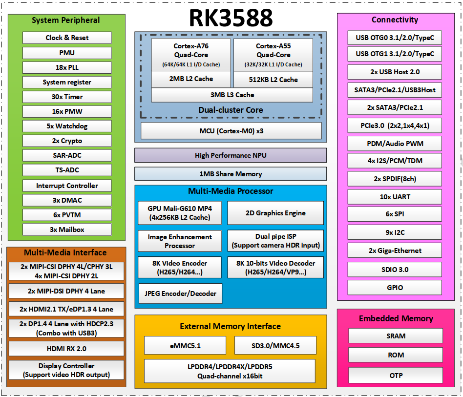

## 2\. FET3588-C SoM Description

### 2.1 FET3588-C SoM

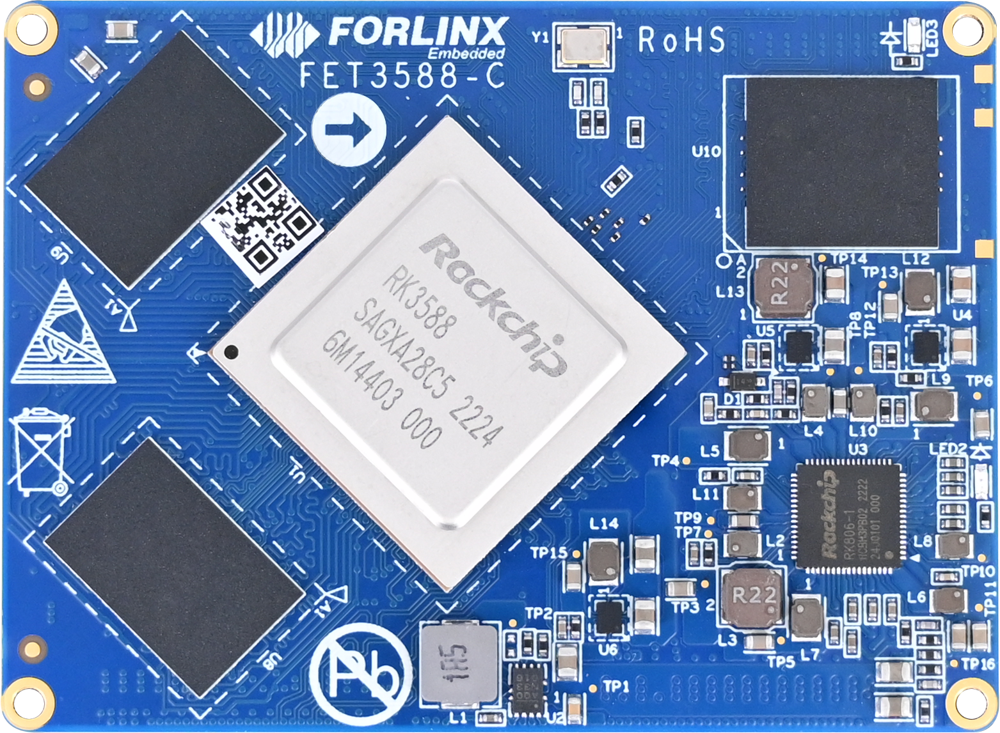

**Front**

**Back**

### 2.2 FET3588-C SoM Dimension Diagram

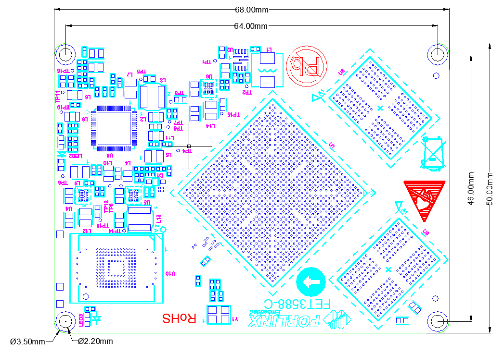

**Top Layer Dimension Diagram**

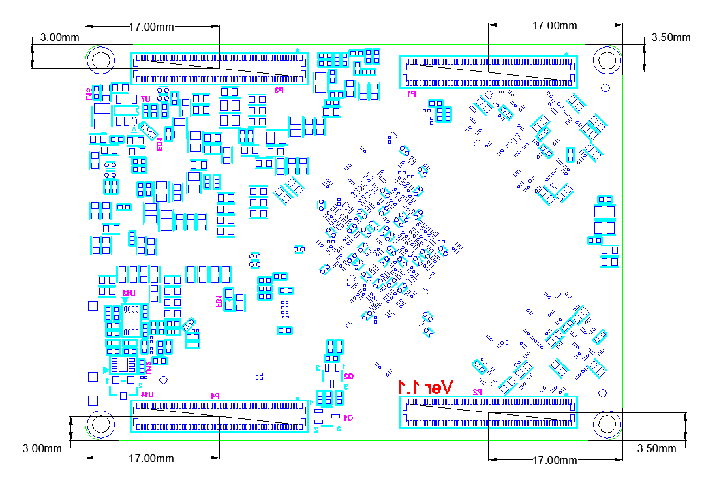

**Bottom Layer Dimension Diagram**

Structure size: 68mm × 50mm, dimensional tolerance ± 0.15mm, refer to DXF file for more dimensional information.

Plate making process: 1.6mm thickness, 10-layer immersion gold PCB.

Connectors: Four 0.4mm pitch, 100pin board-to-board connectors.  See the appendix for the connector dimension drawing.

Four mounting holes with a diameter of 2.2 mm are reserved at the four corners of the core board. For use in a vibrating environment, fixing screws can be installed to improve the reliability of the product connection.

You can refer to the development board design and use M2, L=1.5mm patch nuts on the carrier board.

### 2.3 Performance Parameters

#### 2.3.1 System Main Frequency

| **Name**| **Specification**| | | | **Description**|
|:----------:|:----------:|----------|----------|----------|:----------:|
| | **Minimum**| **Typical**| **Maximum** | **Unit**||
| System Frequency Arm® Cortex®-A76| \-| \-| 2400 | MHz| \-|
| System Frequency Arm® Cortex®-A55| \-| \-| 1800 | MHz||
| System Frequency Arm® Cortex®-M0| \-| \-| \-| \-| \-|

#### 2.3.2 Power Parameter

| **Parameter**| **Pin Number**| **Specification**| | | | **Description**|
|:----------:|:----------:|:----------:|----------|----------|----------|:----------:|
| | | **Minimum**| **Typical**| **Maximum**| **Unit**||
| Main Power Supply Voltage| 12V| 11.5| 12| 12.5| V| \-|

#### 2.3.3 Operating Environment

| **Parameter**| | **Specification**| | | | **Description**
|:----------:|----------|:----------:|----------|----------|----------|:----------:
| | | **Minimum**| **Typical**| **Maximum**| **Unit**| 
| Operating Temperature| Operating environment| 0| 25| +80| ℃| Commercial level
| | Storage Environment| -40| 25| +125| ℃| 
| | Operating Environment| -40| 25| +85| ℃| Industrial-grade
| | Storage Environment| -40| 25| +125| ℃| 
| Humidity| Operating Environment| 10| \-| 90| ％RH| No condensation
| | Storage Environment| 5| \-| 95| ％RH| 

#### 2.3.4 SoM Interface Speed

| **Parameter**| **Specification**| | | | **Description**
|:----------:|:----------:|----------|----------|----------|:----------:
| | **Minimum**| **Typical**| **Maximum**| **Unit**| 
| Serial Port Communication Speed| \-| 115200| 4M| bps| \-
| SPI Clock Frequncey| \-| \-| 50| MHz| \-
| I2C Communication Speed| \-| 100| 400| Kbps| \-
| USB3.0 Interface Speed| \-| \-| 5| Gbps| \-
| USB2.0 Interface Speed| \-| \-| 480| Mbps| \-
| CAN Communication Speed| \-| \-| 1| Mbps| \-
| PCIe2.1| \-| \-| 5| Gbps| \-
| PCIe3.0| \-| \-| 8| Gbps| \-

#### 2.3.5 ESD  Features

| Parameter| Specification| | Unit| Application Scope
|:----------:|:----------:|----------|:----------:|:----------:
| | Minimum| Maximum| | 
| ESD HBM(ESDA/JEDEC JS-001-2017)| -2000| 2000| V| Signals exported from SoM
| ESD CDM(ESDA/JEDEC JS-002-2018)| -250| 250| V| Signals exported from SoM

**Note：**

**1\. The above data is provided by Rockchip;**

**2\. As all the signals exported from SoM are electrostatic sensitive signals, the interfaces should be well protected from static electricity in the carrier board design and the SoM transportation, assembling, and use.**

### 2.4 SoM Interface Speed

| **Function**| **Quantity**| **Parameter**|
|:----------:|:----------:|----------|
| MIPI DC PHY (DPHY/CPHY) \*1| 2| • Supports DPHY or CPHY; • 4-lane MIPI DPHY V2.0, with a maximum data rate of 4.5 Gbps per lane; • 3-lane MIPI CPHY V1.1, with a maximum data rate of 2.5 Gbps per lane;|
| MIPI CSI DPHY\*1| 4| • 2-lane MIPI DPHY V1.2, with a maximum data rate of 2.5 Gbps per lane;  • Every two 2-lane DPHY can be combined into a single 4-lane DPHY for use with a parallel display interface, supporting a maximum resolution of WUXGA (1920 x 1200@60fps, with a 165 MHz pixel clock).|
| DVP| 1| •8/10/12/16-bit standard DVP interface, maximum data input of 150MHz; •Support BT.601/BT.656 and BT.1120 VI interface; |
| HDMI RX| 1| •Supports 3.4Gbps~6Gbps HDMI 2.0； •Supports 250Mbps~3.4Gbps HDMI 1.4b； •Supports HDCP2.3及HDCP1.4； |
| HDMI/eDP TX| ≤2| • Supports 2 x combined HDMI/eDP TX interfaces (HDMI and eDP cannot operate simultaneously), with each interface supporting x1, x2, and x4 configurations; • HDMI supports a resolution of 7680x4320@60Hz, bandwidths of 3, 6, 8, 10, and 12 Gbps, and HDCP 2.3;  • eDP supports a resolution of 4K@60Hz, bandwidths of 1.62 Gbps, 2.7 Gbps, and 5.4 Gbps, and HDCP 1.3; |
| DP TX| 2| • Supports 2 x DP TX 1.4a interfaces, which can be connected to USB 3.1 Gen1 and support 1/2/4 lanes;  • Resolution up to 7680x4320@30Hz;  • Supports DP Alt Mode under USB Type-C; |
| MIPI DSI| 2| •Supports 2 x MIPI DPHY 2.0 or CPHY 1.1, with a resolution up to 4K@60Hz; ·Supports dual MIPI displays in left - right mode and RGB/YUV formats (up to 10 bits); |
| BT.1120 Output| 1| •Supports RGB format (up to 8 bit), with a data speed up to 150 MHz; •Resolution up to 1920x1080@60 Hz; |
| I2S| ≤4| •The sending and receiving clocks can reach up to 50 MHz;  •Supports Time - Division Multiplexing (TDM), Inter - IC Sound (I2C), and similar formats;  •Supports digital audio interface transmission (SPDIF, IEC60958 - 1, and AES - 3 formats);  •Supports an audio reference output clock; |
| SPDIF| 2| •Supports 2 x 16bit audio data storage;  •Supports dual - phase stereo output; |
| PDM| 2| •Up to 8 channels, with audio resolution ranging from 16 to 24 bits and a sampling rate of up to 192 KHz;  •Supports the PDM master receive mode; |
| DSM PWM| 1| •Convert audio PCM data into direct bitstream digital coding to output 1bit signal data stream, and the output digital signal is filtered to obtain an audio signal; |
| Ethernet| 2| •2 x GMAC, with led out RGMII / RMII interfaces ;  •Supports data transfer rates of 10/100/1000 Mbps; |
| USB3.1 Gen1\*2| 3| •The USB3.1 Gen1 data rate can reach up to 5 Gbps; •2 x USB3.1 OTG are multiplexed with DP TX (USB3OTG\_0 and USB3OTG\_1). USB3OTG\_0 and USB3OTG\_1 support USB Type - C and DP Alt;   •1 x USB3.1 Host is multiplexed with PIPE PHY2 (USB3OTG\_2); |
| USB 2.0 Host| 2| •Supports 2 x USB2.0 Host; |
| PCIe 2.0\*2| ≤3| •Each PCIe 2.1 interface supports 1 lane, with data rate up to 5 Gbps; |
| PCIe 3.0\*2| ≤4| •Supports RC and EP, with data rate up to 8 Gbps  •Supports four combination modes: 1 lane x4, 2 lanes x2, 4 lanes x1, 1 lane x2 + 2 lanes x1; |
| SDMMC| 1| •Integration of one SDMMC controller and one SDIO controller, both supporting SDIO 3.0 protocol, and MMC V4.51 protocol; |
| SDIO| 1||
| SPI| ≤5| •Each controller supports two chip - select output channels; •Supports both serial master and serial slave modes, which can be configured via software; |
| I2C| ≤9| •Supports both 7 - bit and 10 - bit address modes;  •The data transfer rate can reach 100 k bits/s in standard mode and up to 400 k bits/s in fast mode; |
| UART| ≤10| •2 x built - in 64 - bit FIFO, which can be used for TX and RX respectively; •Supports the 5 - bit, 6 - bit, 7 - bit, and 8 - bit serial data sending and receiving, with a baud rate of up to 4 Mbps;  •All 10 x UART support the automatic flow control mode; |
| SATA\*2| ≤3| •3 x SATA 3.0 controllers, which are multiplexed with PCIe and USB3\_HOST2 controllers for PIPE PHY0/1/2;  •Supports eSATA, with a maximum data rate of 6 Gbps; |
| PWM| ≤16| •Support up to 16 on-chip PWM with interrupt-based operation and capture mode; |
| ADC| ≤8| •Support 8 x12bit single-ended input SAR-ADC with sampling rate up to 1MS/s; |

**Note: The interface number listed in the table is the hardware design or CPU theoretical maximum quantity, and most of the function pins are multiplexed. Please refer to the PinMux table for easy configuration.**

1\. Supported MIPI camera combination:

2 MIPI DCPHY + 4 x 2 lanes MIPI CSI DPHY

2 MIPI DCPHY + 1 x 4 lanes MIPI CSI DPHY

2 MIPI DCPHY + 2 x 4 lanes MIPI CSI DPHY

2\. USB3.1, PCIe2.0 and SATA 3.0 are multiplexed, please refer to the following carrier board design chapters for more information.

### 2.5  FET3588-C SoM Pins Definition

#### 2.5.1  FET3588-C SoM Pins Schematic

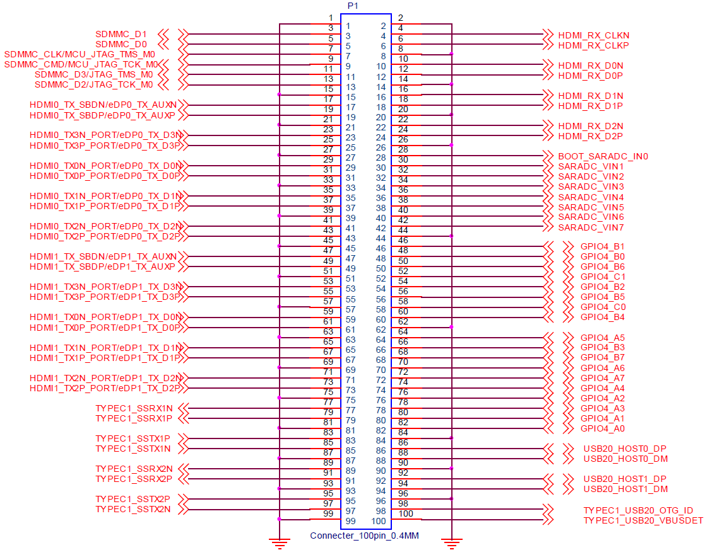

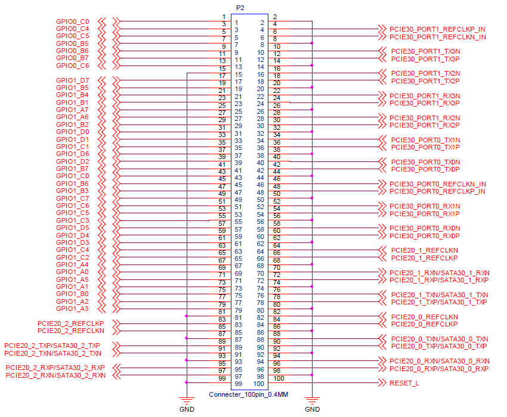

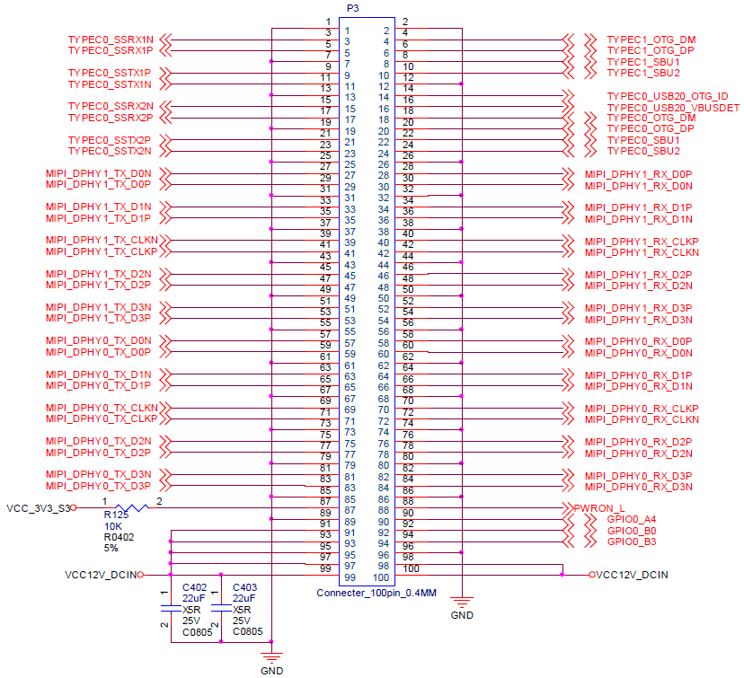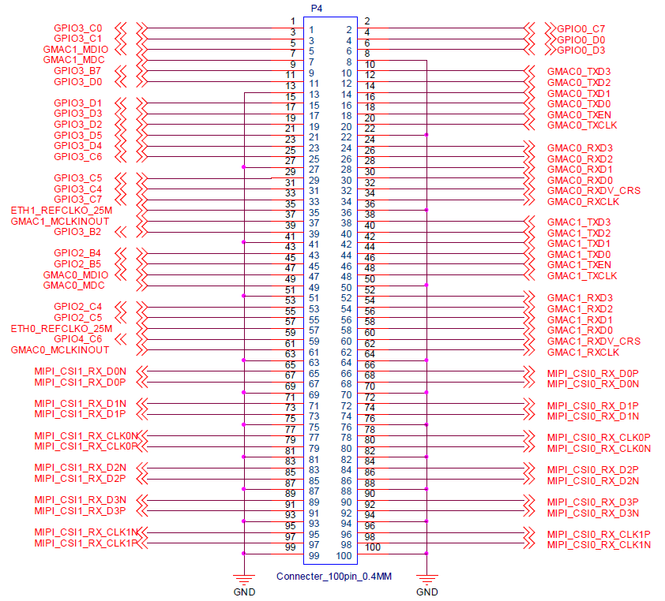

#### 2.5.2 FET3588-C SoM Pins Description

**Note1:**

Num ——SoM connector pin no.:

Ball —— CPU pin ball no.

GPIO ——CPU pin general I/O port serial number

Vol  ——Pin signal level

**Note 2:**

Signal Name——SoM connector network name

Pin Description—— SoM Pin Signal Descriptions

Default Function——Please don’t make any modifications for all SoM pin functions regulated in the “default functions” of the following table, otherwise, it may have conflicts with the factory driver. Please contact us with any questions in time.

**Note 3: The pins marked with "Do not use for carrier board" in the "Pin Description" are those used by the SoM, and should not be used in the carrier board design.**

**Table 1 RIGHT _ DOWN (P1) Connector Interface (Odd) Pin Definition**

| **NUM**| **BALL**| **Signal Name**| **GPIO**| **VOL**| **Pin Description**| **Default Function**
|:----------:|:----------:|:----------:|:----------:|:----------:|----------|:----------:
| 1| \-| GND| \-| \-| Ground| GND
| 3| AD1| SDMMC\_D1| GPIO4\_D1\_u| 3.3V| SD/MMC Interface data signal 1| SDMMC\_D1
| 5| AD2| SDMMC\_D0| GPIO4\_D0\_u| 3.3V| SD/MMC Interface data signal 0| SDMMC\_D0
| 7| AE1| SDMMC\_CLK/MCU\_JTAG\_TMS\_M0| GPIO4\_D5\_d| 3.3V| SD/MMC Interface clock signal| SDMMC\_CLK
| 9| AE2| SDMMC\_CMD/MCU\_JTAG\_TCK\_M0| GPIO4\_D4\_u| 3.3V| SD/MMC Interface order signal| SDMMC\_CMD
| 11| AF1| SDMMC\_D3/JTAG\_TMS\_M0| GPIO4\_D3\_u| 3.3V| SD/MMC Interface data signal 3| SDMMC\_D3
| 13| AF2| SDMMC\_D2/JTAG\_TCK\_M0| GPIO4\_D2\_u| 3.3V| SD/MMC Interface data signal 2| SDMMC\_D2
| 15| \-| GND| \-| \-| Ground| GND
| 17| AG1| HDMI0\_TX\_SBDN/EDP0\_TX\_AUXN| \-| \-| HDMISBD signal-| HDM0\_TX0\_SBD\_N
| 19| AG2| HDMI0\_TX\_SBDP/EDP0\_TX\_AUXP| \-| \-| HDMISBD signal+| HDM0\_TX0\_SBD\_P
| 21| \-| GND| \-| \-| Ground| GND
| 23| AH2| HDMI0\_TX3N\_PORT/EDP0\_TX\_D3N| \-| \-| HDMI differential signal 3-| HDMI\_TX0\_D3\_N
| 25| AH3| HDMI0\_TX3P\_PORT/EDP0\_TX\_D3P| \-| \-| HDMI differential signal 3+| HDMI\_TX0\_D3\_P
| 27| \-| GND| \-| \-| Ground| GND
| 29| AJ1| HDMI0\_TX0N\_PORT/EDP0\_TX\_D0N| \-| \-| HDMI differential signal 0-| HDMI\_TX0\_D0\_N
| 31| AJ2| HDMI0\_TX0P\_PORT/EDP0\_TX\_D0P| \-| \-| HDMI differential signal 0+| HDMI\_TX0\_D0\_P
| 33| \-| GND| \-| \-| Ground| GND
| 35| AK2| HDMI0\_TX1N\_PORT/EDP0\_TX\_D1N| \-| \-| HDMI differential signal 1-| HDMI\_TX0\_D1\_N
| 37| AK3| HDMI0\_TX1P\_PORT/EDP0\_TX\_D1P| \-| | HDMI Differential signal 1+| HDMI\_TX0\_D1\_P
| 39| \-| GND| \-| \-| Ground| GND
| 41| AL1| HDMI0\_TX2N\_PORT/EDP0\_TX\_D2N| \-| \-| HDMI differential signal 2-| HDMI\_TX0\_D2\_N
| 43| AL2| HDMI0\_TX2P\_PORT/EDP0\_TX\_D2P| \-| \-| HDMI differential signal 2+| HDMI\_TX0\_D2\_P
| 45| \-| GND| \-| \-| Ground| GND
| 47| AP2| HDMI1\_TX\_SBDN/EDP1\_TX\_AUXN| \-| \-| eDP auxiliary data-| EDP\_TX1\_AUX\_N
| 49| AN2| HDMI1\_TX\_SBDP/EDP1\_TX\_AUXP| \-| \-| eDP Auxiliary data +| EDP\_TX1\_AUX\_P
| 51| \-| GND| \-| \-| Ground| GND
| 53| AN3| HDMI1\_TX3N\_PORT/EDP1\_TX\_D3N| \-| \-| eDP Differential signal 3-| EDP\_TX1\_D3\_N
| 55| AM3| HDMI1\_TX3P\_PORT/EDP1\_TX\_D3P| \-| \-| eDP Differential signal 3+| EDP\_TX1\_D3\_P
| 57| \-| GND| \-| \-| Ground| GND
| 59| AP4| HDMI1\_TX0N\_PORT/EDP1\_TX\_D0N| \-| \-| eDP Differential signal 0-| EDP\_TX1\_D0\_N
| 61| AN4| HDMI1\_TX0P\_PORT/EDP1\_TX\_D0P| \-| \-| eDP Differential signal 0+| EDP\_TX1\_D0\_P
| 63| \-| GND| \-| \-| Ground| GND
| 65| AN5| HDMI1\_TX1N\_PORT/EDP1\_TX\_D1N| \-| \-| eDP Differential signal 1-| EDP\_TX1\_D1\_N
| 67| AM5| HDMI1\_TX1P\_PORT/EDP1\_TX\_D1P| \-| \-| eDP Differential signal 1+| EDP\_TX1\_D1\_P
| 69| \-| GND| \-| \-| Ground| GND
| 71| AP6| HDMI1\_TX2N\_PORT/EDP1\_TX\_D2N| \-| \-| eDP Differential signal 2-| EDP\_TX1\_D2\_N
| 73| AN6| HDMI1\_TX2P\_PORT/EDP1\_TX\_D2P| \-| \-| eDP Differential signal 2+| EDP\_TX1\_D2\_P
| 75| \-| GND| \-| \-| Ground| GND
| 77| AP8| TYPEC1\_SSRX1N| \-| \-| TYPEC1 Receiving differential signals1-| TYPEC1\_SSRX1\_N
| 79| AN8| TYPEC1\_SSRX1P| \-| \-| TYPEC1 Receiving differential signals 1+| TYPEC1\_SSRX1\_P
| 81| \-| GND| \-| \-| Ground| GND
| 83| AP9| TYPEC1\_SSTX1P| \-| \-| TYPEC1 Sending differential signals 1+| TYPEC1\_SSTX1\_P
| 85| AN9| TYPEC1\_SSTX1N| \-| \-| TYPEC1 Sending differential signals 1-| TYPEC1\_SSTX1\_N
| 87| \-| GND| \-| \-| Ground| GND
| 89| AP10| TYPEC1\_SSRX2N| \-| \-| TYPEC1 Receiving differential signals2-| TYPEC1\_SSRX2\_N
| 91| AN10| TYPEC1\_SSRX2P| \-| \-| TYPEC1 Receiving differential signals2+| TYPEC1\_SSRX2\_P
| 93| \-| GND| \-| \-| Ground| GND
| 95| AP11| TYPEC1\_SSTX2P| \-| \-| TYPEC1 Sending differential signals2+| TYPEC1\_SSTX2\_P
| 97| AN11| TYPEC1\_SSTX2N| \-| \-| TYPEC1 Sending differential signals2-| TYPEC1\_SSTX2\_N
| 99| \-| GND| \-| \-| Ground| GND

**Table 2 RIGHT \_ DOWN (P1) Connector Interface (Even) Pin Definition**

| **NUM**| **BALL**| **Signal Name**| **GPIO**| **VOL**| **Pin Description**| **Default Function**
|:----------:|:----------:|:----------:|:----------:|:----------:|----------|:----------:
| 2| \-| GND| \-| \-| Ground| GND
| 4| AF5| HDMI\_RX\_CLKN| \-| \-| HDMI Differential Clock Signals-| HDMI\_RX\_CLK\_N
| 6| AF6| HDMI\_RX\_CLKP| \-| \-| HDMI Differential Clock Signals+| HDMI\_RX\_CLK\_P
| 8| \-| GND| \-| \-| Ground| GND
| 10| AG4| HDMI\_RX\_D0N| \-| \-| HDMI Receiving differential signals0-| HDMI\_RX\_D0\_N
| 12| AG5| HDMI\_RX\_D0P| \-| \-| HDMI Receiving differential signals 0+| HDMI\_RX\_D0\_P
| 14| \-| GND| \-| \-| Ground| GND
| 16| AH5| HDMI\_RX\_D1N| \-| \-| HDMI Receiving differential signals1-| HDMI\_RX\_D1\_N
| 18| AH6| HDMI\_RX\_D1P| \-| \-| HDMI Receiving differential signals 1+| HDMI\_RX\_D1\_P
| 20| \-| GND| \-| \-| Ground| GND
| 22| AJ4| HDMI\_RX\_D2N| \-| \-| HDMI Receiving differential signals2-| HDMI\_RX\_D2\_N
| 24| AJ5| HDMI\_RX\_D2P| \-| \-| HDMI Receiving differential signals 2+| HDMI\_RX\_D2\_P
| 26| \-| GND| \-| \-| Ground| GND
| 28| AM16| BOOT\_SARADC\_IN0| \-| 1.8V| BOOT start configuration input| BOOT\_SARADC\_IN0
| 30| AL16| SARADC\_VIN1| \-| 1.8V| General ADC1| SARADC\_VIN1\_KEY/RECOVERY
| 32| AK16| SARADC\_VIN2| \-| 1.8V| General ADC2| SARADC\_VIN2
| 34| AN17| SARADC\_VIN3| \-| 1.8V| General ADC3| SARADC\_VIN3\_HP\_HOOK
| 36| AM17| SARADC\_VIN4| \-| 1.8V| General ADC4| SARADC\_VIN4
| 38| AK15| SARADC\_VIN5| \-| 1.8V| General ADC5| SARADC\_VIN5
| 40| AL17| SARADC\_VIN6| \-| 1.8V| General ADC6| SARADC\_VIN6
| 42| AK17| SARADC\_VIN7| \-| 1.8V| General ADC7| SARADC\_VIN7
| 44| \-| GND| \-| \-| Ground| GND
| 46| AL24| GPIO4\_B1| GPIO4\_B1\_u| 3.3V| HDMI0\_TX  ON signal| HDMI0\_TX\_ON\_H
| 48| AK26| GPIO4\_B0| GPIO4\_B0\_d| 3.3V| TYPEC0\_SBU2 signal| TYPEC0\_SBU2\_DC
| 50| AJ27| GPIO4\_B6| GPIO4\_B6\_d| 3.3V| PCIE30X4 Reset| PCIE30X4\_PERSTn\_M1\_L
| 52| AK24| GPIO4\_C1| GPIO4\_C1\_d| 3.3V| HDMICEC signal| HDMITX0\_CEC\_M0
| 54| AK25| GPIO4\_B2| GPIO4\_B2\_u| 3.3V| CAN1 data receiving| CAN1\_RX\_M1
| 56| AJ26| GPIO4\_B5| GPIO4\_B5\_d| 3.3V| PCIE30X4 link insertion detection| PCIE30X4\_WAKEn\_M1\_L
| 58| AJ25| GPIO4\_C0| GPIO4\_C0\_u| 3.3V| HDMI serial data| HDMITX0\_SDA\_M0
| 60| AL26| GPIO4\_B4| GPIO4\_B4\_u| 3.3V| PCIE30X4\_CLKREQn signal| PCIE30X4\_CLKREQn\_M1\_L
| 62| \-| GND| \-| \-| Ground| GND
| 64| AK27| GPIO4\_A5| GPIO4\_A5\_d| 3.3V| PCIEx1 Reset| PCIEx1\_0\_PERSTn\_M1\_L
| 66| AM25| GPIO4\_B3| GPIO4\_B3\_u| 3.3V| CAN1 data sending| CAN1\_TX\_M1
| 68| AJ28| GPIO4\_B7| GPIO4\_B7\_u| 3.3V| HDMI Serial clock| HDMITX0\_SCL\_M0
| 70| AL27| GPIO4\_A6| GPIO4\_A6\_d| 3.3V| I2C5 clock| I2C5\_SCL\_M2
| 72| AM27| GPIO4\_A7| GPIO4\_A7\_d| 3.3V| I2C5 Data| I2C5\_SDA\_M2
| 74| AL28| GPIO4\_A4| GPIO4\_A4\_d| 3.3V| PCIEx1 link insertion detection| PCIEx1\_0\_WAKEn\_M1\_L
| 76| AM29| GPIO4\_A2| GPIO4\_A2\_d| 3.3V| TYPEC1\_SBU2 signal| TYPEC1\_SBU2\_DC
| 78| AL29| GPIO4\_A3| GPIO4\_A3\_d| 3.3V| PCIEx1\_0\_CLKREQn signal| PCIEx1\_0\_CLKREQn\_M1\_L
| 80| AL30| GPIO4\_A1| GPIO4\_A1\_d| 3.3V| TYPEC1\_SBU1 signal| TYPEC1\_SBU1\_DC
| 82| AK30| GPIO4\_A0| GPIO4\_A0\_d| 3.3V| TYPEC0\_SBU1 signal| TYPEC0\_SBU1\_DC
| 84| \-| GND| \-| \-| Ground| GND
| 86| AK6| USB20\_HOST0\_DP| \-| \-| USB20\_HOST0 data+| USB20\_HOST0\_D\_P
| 88| AL6| USB20\_HOST0\_DM| \-| \-| USB20\_HOST0 data-| USB20\_HOST0\_D\_N
| 90| \-| GND| \-| \-| Ground| GND
| 92| AL7| USB20\_HOST1\_DP| \-| \-| USB20\_HOST1 data+| USB20\_HOST1\_D\_P
| 94| AM7| USB20\_HOST1\_DM| \-| \-| USB20\_HOST1 data-| USB20\_HOST1\_D\_N
| 96| \-| GND| \-| \-| Ground| GND
| 98| AK8| TYPEC1\_USB20\_OTG\_ID| \-| \-| | x
| 100| AL8| TYPEC1\_USB20\_VBUSDET| \-| \-| TYPEC1\_USB20\_Insertion detection| TYPEC1\_USB20\_VBUSDET

**Table 3 Left \_ DOWN (P2) Connector Interface (Odd) Pin Definition**

| **NUM**| **BALL**| **Signal Name**| **GPIO**| **VOL**| **Pin Description**| **Default Function**
|:----------:|:----------:|:----------:|:----------:|:----------:|----------|:----------:
| 1| T31| GPIO0\_C0| GPIO0\_C0\_d| 3.3V| I2C2 data| I2C2\_SDA\_M0
| 3| R30| GPIO0\_C4| GPIO0\_C4\_d| 3.3V| PWM2| PWM2\_M0
| 5| P30| GPIO0\_C5| GPIO0\_C5\_u| 3.3V| PWM4| PWM4\_M0
| 7| P29| GPIO0\_B5| GPIO0\_B5\_d| 3.3V| UART2 sending| UART2\_TX\_M0\_DEBUG
| 9| R29| GPIO0\_B6| GPIO0\_B6\_d| 3.3V| UART2 receiving| UART2\_RX\_M0\_DEBUG
| 11| T28| GPIO0\_B7| GPIO0\_B7\_d| 3.3V| I2C2 clock| I2C2\_SCL\_M0
| 13| T29| GPIO0\_C6| GPIO0\_C6\_u| 3.3V| PWM5| PWM5\_M1
| 15| \-| GND| \-| \-| Ground| GND
| 17| F25| GPIO1\_D7| GPIO1\_D7\_u| 1.8V| HDMI serial data| HDMI\_RX\_SDA\_M2
| 19| E25| GPIO1\_B5| GPIO1\_B5\_u| 1.8V| GMAC1 Interrupt| GMAC1\_INT
| 21| E24| GPIO1\_B4| GPIO1\_B4\_u| 1.8V| GMAC1 Reset| GMAC1\_RESET
| 23| D25| GPIO1\_B1| GPIO1\_B1\_d| 1.8V| BT Link activation| BT\_WAKE\_HOST(1.8V)
| 25| C25| GPIO1\_A7| GPIO1\_A7\_u| 1.8V| WLAN Link activation| WLAN WAKE\_1.8V\_IN
| 27| C24| GPIO1\_A6| GPIO1\_A6\_d| 1.8V| BT Link activation| BT WAKE\_1.8V\_IN
| 29| D26| GPIO1\_B2| GPIO1\_B2\_d| 1.8V| Headphone insertion detection| HP\_DET\_L
| 31| F26| GPIO1\_D0| GPIO1\_D0\_d| 1.8V| I2C7 clock| I2C7\_SCL\_M0
| 33| F27| GPIO1\_D1| GPIO1\_D1\_d| 1.8V| I2C7 data| I2C7\_SDA\_M0
| 35| G27| GPIO1\_C1| GPIO1\_C1\_z| 1.8V| I2C3 clock| I2C3\_SCL\_M0
| 37| F24| GPIO1\_D6| GPIO1\_D6\_u| 1.8V| HDMI Serial clock| HDMI\_RX\_SCL\_M2
| 39| F28| GPIO1\_D2| GPIO1\_D2\_d| 1.8V| UART4 Sending data| UART4\_TX\_M0
| 41| E27| GPIO1\_B7| GPIO1\_B7\_u| 1.8V| HDMI\_RXCEC signal| HDMI\_RX\_CEC\_M2
| 43| G29| GPIO1\_C0| GPIO1\_C0\_z| 1.8V| I2C3 data| I2C3\_SDA\_M0
| 45| E26| GPIO1\_B6| GPIO1\_B6\_d| 1.8V| HDMI Receiving link detection| HDMI\_RX\_HPDOUT\_M2
| 47| D27| GPIO1\_B3| PIO1\_B3\_d| 1.8V| TYPEC1 Interrupt| TYPEC1\_INT
| 49| E29| GPIO1\_C7| GPIO1\_C7\_d| 1.8V| I2S Data output| I2S0\_SDO0
| 51| D29| GPIO1\_C6| GPIO1\_C6\_d| 1.8V| 4G/5G Reset| 4G/5G RESET
| 53| D30| GPIO1\_C5| GPIO1\_C5\_d| 1.8V| I2S Sending frame clock| I2S0\_LRCK\_TX
| 55| E31| GPIO1\_C3| GPIO1\_C3\_d| 1.8V| I2S bit clock| I2S0\_SCLK\_TX
| 57| G26| GPIO1\_D5| GPIO1\_D5\_d| 1.8V| HDMIIRX insertion detection| HDMIIRX\_DET\_L
| 59| D28| GPIO1\_D4| GPIO1\_D4\_d| 1.8V| I2S data input| I2S0\_SDI0
| 61| E28| GPIO1\_D3| GPIO1\_D3\_d| 1.8V| UART4 receiving data：| UART4\_RX\_M0
| 63| E30| GPIO1\_C4| GPIO1\_C4\_d| 1.8V| 4G/5G Reset| 4G/5G\_RESET\_1V8
| 65| F30| GPIO1\_C2| GPIO1\_C2\_\_d| 1.8V| I2S main clock| I2S0\_MCLK
| 67| B25| GPIO1\_A4| GPIO1\_A4\_d| 1.8V| IIC interrupt| IIC\_GPIO\_INT
| 69| A24| GPIO1\_A0| GPIO1\_A0\_d| 1.8V| UART6 receiving data：| UART6\_RX\_M1
| 71| B26| GPIO1\_A5| GPIO1\_A5\_d| 1.8V| HDMI Sending link detection| HDMITX0\_HPDIN\_M0
| 73| A25| GPIO1\_A1| GPIO1\_A1\_d| 1.8V| UART6 Sending data| UART6\_TX\_M1
| 75| C27| GPIO1\_B0| GPIO1\_B0\_u| 1.8V| TYPEC0 Interrupt| TYPEC0\_INT
| 77| A26| GPIO1\_A2| GPIO1\_A2\_d| 1.8V| UART6 request sending| UART6\_RTSN\_M1
| 79| A27| GPIO1\_A3| GPIO1\_A3\_d| 1.8V| UART6 clear sending| UART6\_CTSN\_M1
| 81| \-| GND| \-| \-| Ground| GND
| 83| G31| PCIE20\_2\_REFCLKP| \-| \-| | x
| 85| G30| PCIE20\_2\_REFCLKN| \-| \-| | x
| 87| \-| GND| \-| \-| Ground| GND
| 89| H30| PCIE20\_2\_TXP/SATA30\_2\_TXP| \-| \-| USB30\_2 sending differential+| USB30\_2\_SSTX\_P
| 91| H29| PCIE20\_2\_TXN/SATA30\_2\_TXN| \-| \-| USB30\_2 sending differential-| USB30\_2\_SSTX\_N
| 93| \-| GND| \-| \-| Ground| GND
| 95| J31| PCIE20\_2\_RXP/SATA30\_2\_RXP| \-| | USB30\_2 receiving differential+| USB30\_2\_SSRX\_P
| 97| J30| PCIE20\_2\_RXN/SATA30\_2\_RXN| \-| \-| USB30\_2 receiving differential-| USB30\_2\_SSRX\_N
| 99| \-| GND| \-| \-| Ground| GND

**Table 4 Left \_ DOWN (P2) Connector Interface (Even) Pin Definition**

| **NUM**| **BALL**| **Signal Name**| **GPIO**| **VOL**| **Pin Description**| **Default Function**
|:----------:|----------|:----------:|:----------:|:----------:|----------|:----------:
| 2| \-| GND| \-| \-| Ground| GND
| 4| A28| PCIE30\_PORT1\_REFCLKP\_IN| \-| \-| PCIE3.0 clock input+| PCIE30\_PORT1\_REFCLK\_IN\_P
| 6| B28| PCIE30\_PORT1\_REFCLKN\_IN| \-| \-| PCIE3.0 clock input-| PCIE30\_PORT1\_REFCLK\_IN\_N
| 8| \-| GND| \-| \-| Ground| GND
| 10| B29| PCIE30\_PORT1\_TX3N| \-| \-| PCIE3.0 sending data 3-| PCIE30\_PORT1\_TX3\_N
| 12| C29| PCIE30\_PORT1\_TX3P| \-| \-| PCIE3.0 data sending 3+| PCIE30\_PORT1\_TX3\_P
| 14| \-| GND| \-| \-| Ground| GND
| 16| A30| PCIE30\_PORT1\_TX2N| \-| \-| PCIE3.0 sending data 2-| PCIE30\_PORT1\_TX2\_N
| 18| B30| PCIE30\_PORT1\_TX2P| \-| \-| PCIE3.0 data sending 2+| PCIE30\_PORT1\_TX2\_P
| 20| \-| GND| \-| \-| Ground| GND
| 22| B31| PCIE30\_PORT1\_RX3N| \-| \-| PCIE3.0 data receiving 3-| PCIE30\_PORT1\_RX3\_N
| 24| C31| PCIE30\_PORT1\_RX3P| \-| \-| PCIE3.0 data receiving 3+| PCIE30\_PORT1\_RX3\_P
| 26| \-| GND| \-| \-| Ground| GND
| 28| A32| PCIE30\_PORT1\_RX2N| \-| \-| PCIE3.0 data receiving-| PCIE30\_PORT1\_RX2\_N
| 30| B32| PCIE30\_PORT1\_RX2P| \-| \-| PCIE3.0 data receiving 2+| PCIE30\_PORT1\_RX2\_P
| 32| \-| GND| \-| \-| Ground| GND
| 34| C34| PCIE30\_PORT0\_TX1N| \-| \-| PCIE3.0 sending data 1-| PCIE30\_PORT0\_TX1\_N
| 36| C33| PCIE30\_PORT0\_TX1P| \-| \-| PCIE3.0 data sending 1+| PCIE30\_PORT0\_TX1\_P
| 38| \-| GND| \-| \-| Ground| GND
| 40| D33| PCIE30\_PORT0\_TX0N| \-| \-| PCIE3.0 sending data 0-| PCIE30\_PORT0\_TX0\_N
| 42| D32| PCIE30\_PORT0\_TX0P| \-| \-| PCIE3.0 data sending 0+| PCIE30\_PORT0\_TX0\_P
| 44| \-| GND| \-| \-| Ground| GND
| 46| E34| PCIE30\_PORT0\_REFCLKN\_IN| \-| \-| PCIE3.0 clock input-| PCIE30\_PORT0\_REFCLK\_IN\_N
| 48| E33| PCIE30\_PORT0\_REFCLKP\_IN| \-| \-| PCIE3.0 clock input+| PCIE30\_PORT0\_REFCLK\_IN\_P
| 50| \-| GND| \-| \-| Ground| GND
| 52| F33| PCIE30\_PORT0\_RX1N| \-| \-| PCIE3.0 data receiving 1-| PCIE30\_PORT0\_RX1\_N
| 54| F32| PCIE30\_PORT0\_RX1P| \-| \-| PCIE3.0 data receiving 1+| PCIE30\_PORT0\_RX1\_P
| 56| \-| GND| \-| \-| Ground| GND
| 58| G34| PCIE30\_PORT0\_RX0N| \-| \-| PCIE3.0 data receiving 0-| PCIE30\_PORT0\_RX0\_N
| 60| G33| PCIE30\_PORT0\_RX0P| \-| \-| PCIE3.0 data receiving 0+| PCIE30\_PORT0\_RX0\_P
| 62| \-| GND| \-| \-| Ground| GND
| 64| H33| PCIE20\_1\_REFCLKN| \-| \-| PCIE2.0 clock input-| PCIE20\_1\_REFCLK\_N
| 66| H32| PCIE20\_1\_REFCLKP| \-| \-| PCIE2.0 clock input+| PCIE20\_1\_REFCLK\_P
| 68| \-| GND| \-| \-| Ground| GND
| 70| J34| PCIE20\_1\_RXN/SATA30\_1\_RXN| \-| \-| PCIE2.0 data receiving-| PCIE20\_1\_RX\_N
| 72| J33| PCIE20\_1\_RXP/SATA30\_1\_RXP| \-| \-| PCIE2.0 data receiving+| PCIE20\_1\_RX\_P
| 74| \-| GND| \-| \-| Ground| GND
| 76| K34| PCIE20\_1\_TXN/SATA30\_1\_TXN| \-| \-| PCIE2.0 data sending-| PCIE20\_1\_TX\_N
| 78| K33| PCIE20\_1\_TXP/SATA30\_1\_TXP| \-| \-| PCIE2.0 data sending+| PCIE20\_1\_TX\_P
| 80| \-| GND| \-| \-| Ground| GND
| 82| L33| PCIE20\_0\_REFCLKN| \-| \-| PCIE2.0 clock input-| PCIE20\_0\_REFCLK\_N
| 84| L32| PCIE20\_0\_REFCLKP| \-| \-| PCIE2.0 clock input+| PCIE20\_0\_REFCLK\_P
| 86| \-| GND| \-| \-| Ground| GND
| 88| M33| PCIE20\_0\_TXN/SATA30\_0\_TXN| \-| \-| PCIE2.0 data sending-| PCIE20\_0\_TX\_N
| 90| M34| PCIE20\_0\_TXP/SATA30\_0\_TXP| \-| \-| PCIE2.0 data sending+| PCIE20\_0\_TX\_P
| 92| \-| GND| \-| \-| Ground| GND
| 94| N34| PCIE20\_0\_RXN/SATA30\_0\_RXN| \-| \-| PCIE2.0 data receiving-| PCIE20\_0\_RX\_N
| 96| N33| PCIE20\_0\_RXP/SATA30\_0\_RXP| \-| \-| PCIE2.0 data receiving+| PCIE20\_0\_RX\_P
| 98| \-| GND| \-| \-| Ground| GND
| 100| | RESET\_L| \-| \-| Reset| RESET\_L

**Table 5 Right\_UP（P3） Connector Interface(Odd) Pin Definition**

| **NUM**| **BALL**| **Signal Name**| **GPIO**| **VOL**| **Pin Description**| **Default Function**
|:----------:|:----------:|----------|:----------:|:----------:|----------|:----------:
| 1| \-| GND| \-| \-| Ground| GND
| 3| AP13| TYPEC0\_SSRX1N| \-| \-| TYPEC0 Receiving differential signals1-| TYPEC0\_SSRX1\_N
| 5| AN13| TYPEC0\_SSRX1P| \-| \-| TYPEC0 Receiving differential signals 1+| TYPEC0\_SSRX1\_P
| 7| \-| GND| \-| \-| Ground| GND
| 9| AP14| TYPEC0\_SSTX1P| \-| \-| TYPEC0 Sending differential signals 1+| TYPEC0\_SSTX1\_P
| 11| AN14| TYPEC0\_SSTX1N| \-| \-| TYPEC0 Sending differential signals 1-| TYPEC0\_SSTX1\_N
| 13| \-| GND| \-| \-| Ground| GND
| 15| AP15| TYPEC0\_SSRX2N| \-| \-| TYPEC0 Receiving differential signals2-| TYPEC0\_SSRX2\_N
| 17| AN15| TYPEC0\_SSRX2P| \-| \-| TYPEC0 Receiving differential signals2+| TYPEC0\_SSRX2\_P
| 19| \-| GND| \-| \-| Ground| GND
| 21| AP16| TYPEC0\_SSTX2P| \-| \-| TYPEC0 Sending differential signals2+| TYPEC0\_SSTX2\_P
| 23| AN16| TYPEC0\_SSTX2N| \-| \-| TYPEC0 Sending differential signals2-| TYPEC0\_SSTX2\_N
| 25| \-| GND| \-| \-| Ground| GND
| 27| AP18| MIPI\_DPHY1\_TX\_D0N| \-| \-| MIPI\_DPHY 1 data sending 0-| MIPI\_DPHY1\_TXD0\_N
| 29| AN18| MIPI\_DPHY1\_TX\_D0P| \-| \-| MIPI\_DPHY 1 data sending 0+| MIPI\_DPHY1\_TXD0\_P
| 31| \-| GND| \-| \-| Ground| GND
| 33| AP19| MIPI\_DPHY1\_TX\_D1N| \-| \-| MIPI\_DPHY 1 data sending 1-| MIPI\_DPHY1\_TXD1\_N
| 35| AN19| MIPI\_DPHY1\_TX\_D1P| \-| \-| MIPI\_DPHY 1 data sending 1+| MIPI\_DPHY1\_TXD1\_P
| 37| \-| GND| \-| \-| Ground| GND
| 39| AP20| MIPI\_DPHY1\_TX\_CLKN| \-| \-| MIPI\_DPHY 1 clock sending-| MIPI\_DPHY1\_TXCLK\_N
| 41| AN20| MIPI\_DPHY1\_TX\_CLKP| \-| \-| MIPI\_DPHY 1 clock sending+| MIPI\_DPHY1\_TXCLK\_P
| 43| | GND| \-| \-| Ground| GND
| 45| AP21| MIPI\_DPHY1\_TX\_D2N| \-| \-| MIPI\_DPHY 1 data sending 2-| MIPI\_DPHY1\_TXD2\_N
| 47| AN21| MIPI\_DPHY1\_TX\_D2P| \-| \-| MIPI\_DPHY 1 data sending 2+| MIPI\_DPHY1\_TXD2\_P
| 49| \-| GND| \-| \-| Ground| GND
| 51| AP22| MIPI\_DPHY1\_TX\_D3N| \-| \-| MIPI\_DPHY 1 data sending 3-| MIPI\_DPHY1\_TXD3\_N
| 53| AN22| MIPI\_DPHY1\_TX\_D3P| \-| \-| MIPI\_DPHY 1 data sending 3+| MIPI\_DPHY1\_TXD3\_P
| 55| \-| GND| \-| \-| Ground| GND
| 57| AP24| MIPI\_DPHY0\_TX\_D0N| \-| \-| MIPI\_DPHY 0 data sending 0-| MIPI\_DPHY0\_TXD0\_N
| 59| AN24| MIPI\_DPHY0\_TX\_D0P| \-| \-| MIPI\_DPHY 0 data sending 0+| MIPI\_DPHY0\_TXD0\_P
| 61| \-| GND| \-| \-| Ground| GND
| 63| AP25| MIPI\_DPHY0\_TX\_D1N| \-| \-| MIPI\_DPHY 0 data sending 1-| MIPI\_DPHY0\_TXD1\_N
| 65| AN25| MIPI\_DPHY0\_TX\_D1P| \-| \-| MIPI\_DPHY 0 data sending 1+| MIPI\_DPHY0\_TXD1\_P
| 67| \-| GND| \-| \-| Ground| GND
| 69| AP26| MIPI\_DPHY0\_TX\_CLKN| \-| \-| MIPI\_DPHY 0 clock sending-| MIPI\_DPHY0\_TXCLK\_N
| 71| AN26| MIPI\_DPHY0\_TX\_CLKP| \-| \-| MIPI\_DPHY 0 clock sending+| MIPI\_DPHY0\_TXCLK\_P
| 73| \-| GND| \-| \-| Ground| GND
| 75| AP27| MIPI\_DPHY0\_TX\_D2N| \-| \-| MIPI\_DPHY 0 data sending 2-| MIPI\_DPHY0\_TXD2\_N
| 77| AN27| MIPI\_DPHY0\_TX\_D2P| \-| \-| MIPI\_DPHY 0 data sending 2+| MIPI\_DPHY0\_TXD2\_P
| 79| \-| GND| \-| \-| Ground| GND
| 81| AP28| MIPI\_DPHY0\_TX\_D3N| \-| \-| MIPI\_DPHY 0 data sending 3-| MIPI\_DPHY0\_TXD3\_N
| 83| AN28| MIPI\_DPHY0\_TX\_D3P| \-| \-| MIPI\_DPHY 0 data sending 3+| MIPI\_DPHY0\_TXD3\_P
| 85| \-| GND| \-| \-| Ground| GND
| 87| | CARRIER\_BOARD\_EN| \-| \-| CARRIER enable| CARRIER\_BOARD\_EN
| 89| \-| GND| \-| \-| Ground| GND
| 91| | VCC12V\_DCIN| \-| \-| 12V power input| VCC12V\_DCIN
| 93| | VCC12V\_DCIN| \-| \-| 12V power input| VCC12V\_DCIN
| 95| | VCC12V\_DCIN| \-| \-| 12V power input| VCC12V\_DCIN
| 97| | VCC12V\_DCIN| \-| \-| 12V power input| VCC12V\_DCIN
| 99| | VCC12V\_DCIN| \-| \-| 12V power input| VCC12V\_DCIN

**Table 6 Right\_UP（P3） Connector Interface(Even) Pin Definition**

| **NUM**| **BALL**| **Signal Name**| **GPIO**| **VOL**| **Pin Description**| **Default Function**
|:----------:|:----------:|----------|:----------:|:----------:|----------|:----------:
| 2| \-| GND| \-| \-| Ground| GND
| 4| AL9| TYPEC1\_OTG\_DM| \-| \-| TYPEC1 data-| TYPEC1\_OTG\_D\_N
| 6| AK9| TYPEC1\_OTG\_DP| \-| \-| TYPEC1 data+| TYPEC1\_OTG\_D\_P
| 8| AL10| TYPEC1\_SBU1| \-| \-| TYPEC1\_SBU1 signal| TYPEC1\_SBU1
| 10| AM10| TYPEC1\_SBU2| \-| \-| TYPEC1\_SBU2 signal| TYPEC1\_SBU2
| 12| \-| GND| \-| \-| Ground| GND
| 14| AL14| TYPEC0\_USB20\_OTG\_ID| \-| \-| | X
| 16| AM14| TYPEC0\_USB20\_VBUSDET| \-| \-| TYPEC0\_USB20 insertion detection| TYPEC0\_USB20\_VBUSDET
| 18| AM12| TYPEC0\_OTG\_DM| \-| \-| TYPEC0 data-| TYPEC0\_OTG\_D\_N
| 20| AL12| TYPEC0\_OTG\_DP| \-| \-| TYPEC0 data+| TYPEC0\_OTG\_D\_P
| 22| AL15| TYPEC0\_SBU1| \-| \-| TYPEC0\_SBU1 signal| TYPEC0\_SBU1
| 24| AM15| TYPEC0\_SBU2| \-| \-| TYPEC0\_SBU2 signal| TYPEC0\_SBU2
| 26| \-| GND| \-| \-| Ground| GND
| 28| AK18| MIPI\_DPHY1\_RX\_D0P| \-| \-| MIPI\_DPHY 1 data receiving 0+| MIPI\_DPHY1\_RXD0\_P
| 30| AL18| MIPI\_DPHY1\_RX\_D0N| \-| \-| MIPI\_DPHY 1 data receiving 0-| MIPI\_DPHY1\_RXD0\_N
| 32| \-| GND| \-| \-| Ground| GND
| 34| AK19| MIPI\_DPHY1\_RX\_D1P| \-| \-| MIPI\_DPHY 1 data receiving 1+| MIPI\_DPHY1\_RXD1\_P
| 36| AL19| MIPI\_DPHY1\_RX\_D1N| \-| \-| MIPI\_DPHY 1 data receiving 1-| MIPI\_DPHY1\_RXD1\_N
| 38| \-| GND| \-| \-| Ground| GND
| 40| AK20| MIPI\_DPHY1\_RX\_CLKP| \-| \-| MIPI\_DPHY 1 clock receiving+| MIPI\_DPHY1\_RXCLK\_P
| 42| AL20| MIPI\_DPHY1\_RX\_CLKN| \-| \-| MIPI\_DPHY 1 clock receiving-| MIPI\_DPHY1\_RXCLK\_N
| 44| \-| GND| \-| \-| Ground| GND
| 46| AK21| MIPI\_DPHY1\_RX\_D2P| \-| \-| MIPI\_DPHY 1 data receiving 2+| MIPI\_DPHY1\_RXD2\_P
| 48| AL21| MIPI\_DPHY1\_RX\_D2N| \-| \-| MIPI\_DPHY 1 data receiving 2-| MIPI\_DPHY1\_RXD2\_N
| 50| \-| GND| \-| \-| Ground| GND
| 52| AK22| MIPI\_DPHY1\_RX\_D3P| \-| \-| MIPI\_DPHY 1 data receiving 3+| MIPI\_DPHY1\_RXD3\_P
| 54| AL22| MIPI\_DPHY1\_RX\_D3N| \-| \-| MIPI\_DPHY 1 data receiving 3-| MIPI\_DPHY1\_RXD3\_N
| 56| \-| GND| \-| \-| Ground| GND
| 58| AN29| MIPI\_DPHY0\_RX\_D0P| \-| \-| MIPI\_DPHY 0 data receIving 0+| MIPI\_DPHY0\_RXD0\_P
| 60| AP29| MIPI\_DPHY0\_RX\_D0N| \-| \-| MIPI\_DPHY 0 data receiving 0-| MIPI\_DPHY0\_RXD0\_N
| 62| \-| GND| \-| \-| Ground| GND
| 64| AN30| MIPI\_DPHY0\_RX\_D1P| \-| \-| MIPI\_DPHY 0 data receiving 1+| MIPI\_DPHY0\_RXD1\_P
| 66| AP30| MIPI\_DPHY0\_RX\_D1N| \-| \-| MIPI\_DPHY 0 data receiving 1-| MIPI\_DPHY0\_RXD1\_N
| 68| | GND| \-| \-| Ground| GND
| 70| AN32| MIPI\_DPHY0\_RX\_CLKP| \-| \-| MIPI\_DPHY 0 clock receiving+| MIPI\_DPHY0\_RXCLK\_P
| 72| AP31| MIPI\_DPHY0\_RX\_CLKN| \-| \-| MIPI\_DPHY 0 clock receiving-| MIPI\_DPHY0\_RXCLK\_N
| 74| | GND| \-| \-| Ground| GND
| 76| AN33| MIPI\_DPHY0\_RX\_D2P| \-| \-| MIPI\_DPHY 0 data receiving 2+| MIPI\_DPHY0\_RXD2\_P
| 78| AP32| MIPI\_DPHY0\_RX\_D2N| \-| \-| MIPI\_DPHY 0 data receiving 2-| MIPI\_DPHY0\_RXD2\_N
| 80| \-| GND| \-| \-| Ground| GND
| 82| AN34| MIPI\_DPHY0\_RX\_D3P| \-| \-| MIPI\_DPHY 0 data receiving 3+| MIPI\_DPHY0\_RXD3\_P
| 84| AP33| MIPI\_DPHY0\_RX\_D3N| \-| \-| MIPI\_DPHY 0 data receiving 3-| MIPI\_DPHY0\_RXD3\_N
| 86| \-| GND| \-| \-| Ground| GND
| 88| | PWRON\_L| \-| \-| Power on control| PWRON\_L
| 90| P31| GPIO0\_A4| GPIO0\_A4\_u| 1.8V| SDMMC card detection signal| SDMMC\_DET\_L
| 92| L30| GPIO0\_B0| GPIO0\_B0\_z| 1.8V| GMAC0 Reset| GMAC0\_RESET
| 94| L29| GPIO0\_B3| GPIO0\_B3\_z| 1.8V| GMAC0 Interrupt| GMAC0\_INT
| 96| \-| GND| \-| \-| Ground| GND
| 98| | VCC12V\_DCIN| \-| \-| 12V power input| VCC12V\_DCIN
| 100| | VCC12V\_DCIN| \-| \-| 12V power input| VCC12V\_DCIN

**Table7 LEFT\_UP（P4） Connector Interface(Odd) Pin Definition**

| **NUM**| **BALL**| **Signal Name**| **GPIO**| **VOL**| **Pin Description**| **Default Function**
|:----------:|:----------:|----------|:----------:|:----------:|----------|:----------:
| 1| Y29| GPIO3\_C0| GPIO3\_C0\_d| 3.3V| MIPI\_DSI1 Interrupt| MIPI\_DSI1\_INT
| 3| Y27| GPIO3\_C1| GPIO3\_C1\_d| 3.3V| EDP\_LED enable| EDP\_LED\_EN
| 5| Y30| GMAC1\_MDIO| GPIO3\_C3\_d| 3.3V| GMAC1 Serial Management Data| GMAC1\_MDIO
| 7| Y31| GMAC1\_MDC| GPIO3\_C2\_d| 3.3V| GMAC1 Serial Management Clock| GMAC1\_MDC
| 9| AA28| GPIO3\_B7| GPIO3\_B7\_d| 3.3V| MIPI\_DSI1 Reset| MIPI\_DSI1\_RESET
| 11| AH24| GPIO3\_D0| GPIO3\_D0\_u| 3.3V| PCIE20 link activation signal| PCIE20X1\_2\_WAKEN\_M0
| 13| \-| GND| \-| \-| Ground| GND
| 15| AG23| GPIO3\_D1| GPIO3\_D1\_d| 3.3V| PCIE20 Reset| PCIE20X1\_2\_PERSTN\_M0
| 17| AG24| GPIO3\_D3| GPIO3\_D3\_d| 3.3V| MIPI\_DSI2 interrupt signal| MIPI\_DSI2\_INT
| 19| AG25| GPIO3\_D2| GPIO3\_D2\_d| 3.3V| MIPI\_DSI2 reset signal| MIPI\_DSI2\_RESET
| 21| AB28| GPIO3\_D5| GPIO3\_D5\_d| 3.3V| UART9 sending| UART9\_TX\_M2
| 23| AA27| GPIO3\_D4| GPIO3\_D4\_d| 3.3V| UART9 receiving| UART9\_RX\_M2
| 25| AG26| GPIO3\_C6| GPIO3\_C6\_u| 3.3V| MIPI\_DSI2 enable signal| MIPI\_DSI2\_EN
| 27| \-| GND| \-| \-| Ground| GND
| 29| AH25| GPIO3\_C5| GPIO3\_C5\_u| 3.3V| CAN2 data sending| CAN2\_TX\_M0
| 31| AH26| GPIO3\_C4| GPIO3\_C4\_u| 3.3V| CAN2 data receiving| CAN2\_RX\_M0
| 33| AJ24| GPIO3\_C7| GPIO3\_C7\_u| 3.3V| PCIE20X1\_2\_CLKREQN signal| PCIE20X1\_2\_CLKREQN\_M0
| 35| AH27| ETH1\_REFCLKO\_25M| GPIO3\_A6\_d| 3.3V| PHY 25MHz reference clock output| ETH1\_REFCLKO\_25M
| 37| AE29| GMAC1\_MCLKINOUT| GPIO3\_B6\_d| 3.3V| PHY 125MHz Sync Clock Input| GMAC1\_MCLKINOUT
| 39| AE28| GPIO3\_B2| GPIO3\_B2\_d| 3.3V| MIPI\_DSI1 enable signal| MIPI\_DSI1\_EN
| 41| \-| GND| \-| \-| Ground| GND
| 43| AB31| GPIO2\_B4| GPIO2\_B4\_u| 1.8V| I2C4 data| I2C4\_SDA\_M1
| 45| AB30| GPIO2\_B5| GPIO2\_B5\_u| 1.8V| I2C4 clock| I2C4\_SCL\_M1
| 47| AB33| GMAC0\_MDIO| GPIO4\_C5\_d| 1.8V| GMAC0 Serial Management Data| GMAC0\_MDIO
| 49| AB34| GMAC0\_MDC| GMAC0\_MDC| 1.8V| GMAC0 Serial Management Clock| GMAC0\_MDC
| 51| \-| GND| \-| \-| Ground| GND
| 53| AC30| GPIO2\_C4| GPIO2\_C4\_d| 1.8V| eDP plug detection| EDP\_HPD
| 55| AE30| GPIO2\_C5| GPIO2\_C5\_d| 1.8V| PCIE20X1 insertion detection| PCIE20X1\_PRSNT\_L\_1V8
| 57| AD30| ETH0\_REFCLKO\_25M| GPIO2\_C3\_d| 1.8V| PHY 25MHz reference clock output| ETH0\_REFCLKO\_25M
| 59| AF33| GPIO4\_C6| GPIO4\_C6\_d| 1.8V| PCIe30x4 Hot-plug detection| PCIe30x4\_PRSNT\_L\_1V8
| 61| AF34| GMAC0\_MCLKINOUT| GPIO4\_C3\_d| 1.8V| PHY 125MHz Sync Clock Input| GMAC0\_MCLKINOUT
| 63| \-| GND| \-| \-| Ground| GND
| 65| AG32| MIPI\_CSI1\_RX\_D0N| \-| \-| CSI1 data receiving 0-| MIPI\_CSI1\_RXD0\_N
| 67| AG31| MIPI\_CSI1\_RX\_D0P| \-| \-| CSI1 data receiving 0+| MIPI\_CSI1\_RXD0\_P
| 69| \-| GND| \-| \-| Ground| GND
| 71| AH32| MIPI\_CSI1\_RX\_D1N| \-| \-| CSI1 data receiving 1-| MIPI\_CSI1\_RXD1\_N
| 73| AH31| MIPI\_CSI1\_RX\_D1P| \-| \-| CSI1 data receiving 1+| MIPI\_CSI1\_RXD1\_P
| 75| \-| GND| \-| \-| Ground| GND
| 77| AJ32| MIPI\_CSI1\_RX\_CLK0N| | \-| CSI1 clock 0-| MIPI\_CSI1\_RXCLK0\_N
| 79| AJ31| MIPI\_CSI1\_RX\_CLK0P| \-| \-| CSI1 clock 0+| MIPI\_CSI1\_RXCLK0\_P
| 81| \-| GND| \-| \-| Ground| GND
| 83| AK32| MIPI\_CSI1\_RX\_D2N| \-| \-| CSI1 data receiving 2-| MIPI\_CSI1\_RXD2\_N
| 85| AK31| MIPI\_CSI1\_RX\_D2P| \-| \-| CSI1 data receiving 2+| MIPI\_CSI1\_RXD2\_P
| 87| \-| GND| \-| \-| Ground| GND
| 89| AL32| MIPI\_CSI1\_RX\_D3N| \-| \-| CSI1 data receiving 3-| MIPI\_CSI1\_RXD3\_N
| 91| AL31| MIPI\_CSI1\_RX\_D3P| \-| \-| CSI1 data receiving 3+| MIPI\_CSI1\_RXD3\_P
| 93| \-| GND| \-| \-| Ground| GND
| 95| AM32| MIPI\_CSI1\_RX\_CLK1N| \-| \-| CSI1 clock 1-| MIPI\_CSI1\_RXCLK1\_N
| 97| AM31| MIPI\_CSI1\_RX\_CLK1P| \-| \-| CSI1 clock 1+| MIPI\_CSI1\_RXCLK1\_P
| 99| \-| GND| \-| \-| Ground| GND

**Table8 LEFT\_UP（P4） Connector Interface(Even) Pin Definition**

| **NUM**| **BALL**| **Signal Name**| **GPIO**| **VOL**| **Pin Description**| **Default Function**
|:----------:|:----------:|:----------:|:----------:|:----------:|----------|:----------:
| 2| V31| GPIO0\_C7| GPIO0\_C7\_d| 3.3V| PWM6| PWM6\_M0
| 4| W31| GPIO0\_D0| GPIO0\_D0\_d| 3.3V| TYPEC0 enable| TYPEC0\_PWREN
| 6| U33| GPIO0\_D3| GPIO0\_D3\_u| 3.3V| TYPEC1 enable| TYPEC1\_PWREN
| 8| \-| GND| \-| \-| Ground| GND 
| 10| AC34| GMAC0\_TXD3| GPIO2\_B2\_u| 1.8V| GMAC0 data sending 3| GMAC0\_TXD3
| 12| AC33| GMAC0\_TXD2| GPIO2\_B1\_u| 1.8V| GMAC0 data sending 2| GMAC0\_TXD2
| 14| AD34| GMAC0\_TXD1| GPIO2\_B7\_d| 1.8V| GMAC0 data sending 1| GMAC0\_TXD1
| 16| AD33| GMAC0\_TXD0| GPIO2\_B6\_d| 1.8V| GMAC0 data sending 0| GMAC0\_TXD0
| 18| AE34| GMAC0\_TXEN| GPIO2\_C0\_d| 1.8V| GMAC0 sending control| GMAC0\_TXEN
| 20| AE33| GMAC0\_TXCLK| GPIO2\_B3\_d| 1.8V| GMAC0 clock sending| GMAC0\_TXCLK
| 22| \-| GND| \-| \-| Ground| GND
| 24| AC31| GMAC0\_RXD3| GPIO2\_A7\_u| 1.8V| GMAC0 data receiving 3| GMAC0\_RXD3
| 26| AC32| GMAC0\_RXD2| GPIO2\_A6\_u| 1.8V| GMAC0 data receiving 2| GMAC0\_RXD2
| 28| AD31| GMAC0\_RXD1| GPIO2\_C2\_d| 1.8V| GMAC0 data receiving 1| GMAC0\_RXD1
| 30| AD32| GMAC0\_RXD0| GPIO2\_C1\_d| 1.8V| GMAC0 data receiving 0| GMAC0\_RXD0
| 32| AE31| GMAC0\_RXDV\_CRS| GPIO4\_C2\_d| 1.8V| GMAC0 receiving control| GMAC0\_RXDV\_CRS
| 34| AE32| GMAC0\_RXCLK| GPIO2\_B0\_u| 1.8V| GMAC0 clock receiving| GMAC0\_RXCLK
| 36| \-| GND| \-| \-| Ground| GND
| 38| AA30| GMAC1\_TXD3| GPIO3\_A1\_u| 3.3V| GMAC1 data sending 3| GMAC1\_TXD3
| 40| AA29| GMAC1\_TXD2| GPIO3\_A0\_u| 3.3V| GMAC1 data sending 2| GMAC1\_TXD2
| 42| AC29| GMAC1\_TXD1| GPIO3\_B4\_u| 3.3V| GMAC1 data sending 1| GMAC1\_TXD1
| 44| AC28| GMAC1\_TXD0| GPIO3\_B3\_u| 3.3V| GMAC1 data sending 0| GMAC1\_TXD0
| 46| AD29| GMAC1\_TXEN| GPIO3\_B5\_u| 3.3V| GMAC1 sending control| GMAC1\_TXEN
| 48| AD28| GMAC1\_TXCLK| GPIO3\_A4\_d| 3.3V| GMAC1 clock sending| GMAC1\_TXCLK
| 50| \-| GND| \-| \-| Ground| GND
| 52| AE27| GMAC1\_RXD3| GPIO3\_A3\_u| 3.3V| GMAC1 data receiving 3| GMAC1\_RXD3
| 54| AD27| GMAC1\_RXD2| GPIO3\_A2\_u| 3.3V| GMAC1 data receiving 2| GMAC1\_RXD2
| 56| AG28| GMAC1\_RXD1| GPIO3\_A2\_u| 3.3V| GMAC1 data receiving 1| GMAC1\_RXD1
| 58| AG29| GMAC1\_RXD0| GPIO3\_A7\_u| 3.3V| GMAC1 data receiving 0| GMAC1\_RXD0
| 60| AH29| GMAC1\_RXDV\_CRS| GPIO3\_B1\_d| 3.3V| GMAC1 receiving control| GMAC1\_RXDV\_CRS
| 62| AH30| GMAC1\_RXCLK| GPIO3\_A5\_d| 3.3V| GMAC1 clock receiving| GMAC1\_RXCLK
| 64| \-| GND| \-| \-| Ground| GND
| 66| AG33| MIPI\_CSI0\_RX\_D0P| \-| \-| CSI0 data receiving 0+| MIPI\_CSI0\_RXD0\_P
| 68| AG34| MIPI\_CSI0\_RX\_D0N| \-| \-| CSI0 data receiving 0-| MIPI\_CSI0\_RXD0\_N
| 70| \-| GND| \-| \-| Ground| GND
| 72| AH33| MIPI\_CSI0\_RX\_D1P| \-| \-| CSI0 data receiving 1+| MIPI\_CSI0\_RXD1\_P
| 74| AH34| MIPI\_CSI0\_RX\_D1N| \-| \-| CSI0 data receiving 1-| MIPI\_CSI0\_RXD1\_N
| 76| \-| GND| \-| \-| Ground| GND
| 78| AJ33| MIPI\_CSI0\_RX\_CLK0P| \-| \-| CSI0 clock 0+| MIPI\_CSI0\_RXCLK0\_P
| 80| AJ34| MIPI\_CSI0\_RX\_CLK0N| \-| \-| CSI0 clock 0-| MIPI\_CSI0\_RXCLK0\_N
| 82| \-| GND| \-| \-| Ground| GND
| 84| AK33| MIPI\_CSI0\_RX\_D2P| \-| \-| CSI0 data receiving 2+| MIPI\_CSI0\_RXD2\_P
| 86| AK34| MIPI\_CSI0\_RX\_D2N| \-| \-| CSI0 data receiving 2-| MIPI\_CSI0\_RXD2\_N
| 88| \-| GND| \-| \-| Ground| GND
| 90| AL33| MIPI\_CSI0\_RX\_D3P| \-| \-| CSI0 data receiving 3+| MIPI\_CSI0\_RXD3\_P
| 92| AL34| MIPI\_CSI0\_RX\_D3N| \-| \-| CSI0 data receiving 3-| MIPI\_CSI0\_RXD3\_N
| 94| \-| GND| \-| \-| Ground| GND
| 96| AM33| MIPI\_CSI0\_RX\_CLK1P| \-| \-| CSI0 clock 1+| x
| 98| AM34| MIPI\_CSI0\_RX\_CLK1N| \-| \-| CSI0 clock 1-| x
| 100| \-| GND| \-| \-| Ground| GND

### 2.6 SoM Hardware Design Description

The FET3588-C SoM integrates power and storage circuits into a compact module, requiring minimal external circuitry. A minimum system can operate with just power supply and boot configuration, as shown in the figure below:

Please refer to “Appendix IV“ for the minimal system schematic diagram However, in most cases, it is recommended to connect some external devices in addition to the minimal system, such as a debugging serial port, otherwise, the user can not check whether the system is booted. After completing these steps, additional user-specific functions can be added based on the default interface definitions provided by Forlinx for the SoM.

Please refer to section 3.5 in “Chapter 3. OK3588-C Carrier Board Description” for the peripheral circuits.

## 3\. OK3588-C Development Platform Description

### 3.1 OK3588-C Development Board Interface Diagram

Connection method is board-to-board, and main interfaces are shown in the figure below:

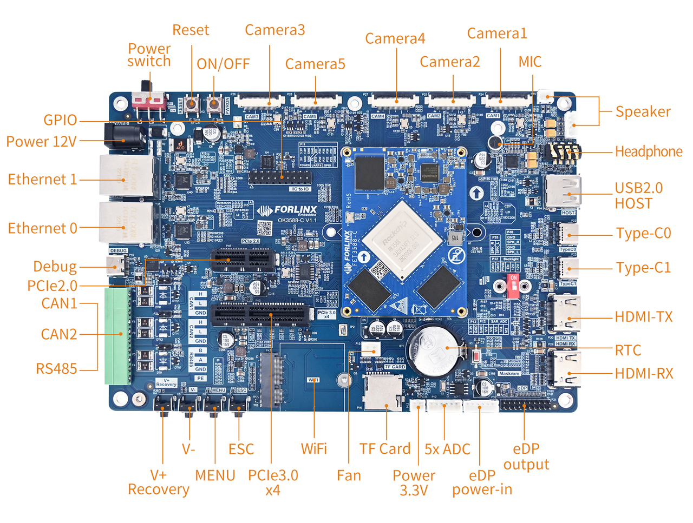

Front

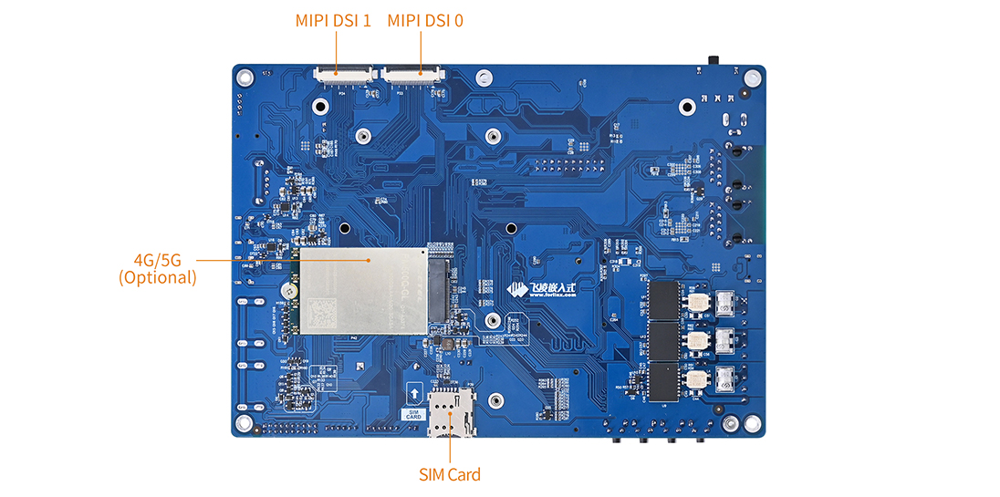

Back

### 3.2 OK3588-C SoM Dimension Diagram

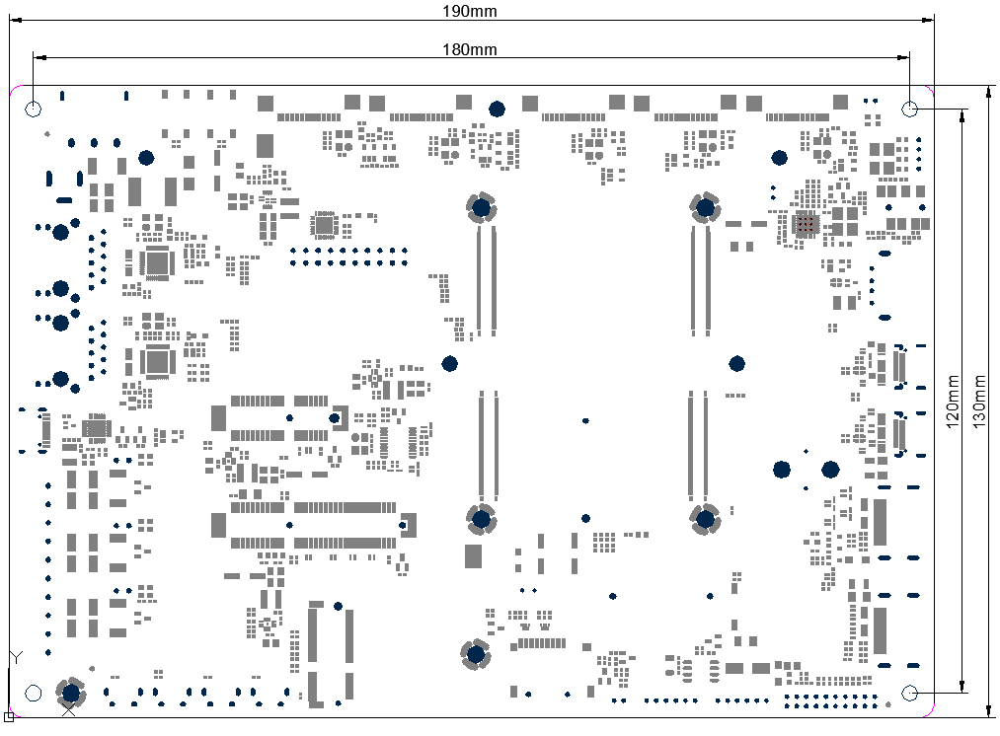

PCB Size: 190mm × 130mm.

Fixed hole size: spacing: 180mm × 120mm, hole diameter: 3.2mm.

Plate making process: thickness 1.6mm, 4-layer PCB.

The OK3588-C carrier board reserves an installation hole with a diameter of 3.2 mm for a heat sink. You can choose to install the heat sink according to the on - site environment. Please add a layer of insulating thermal conductive silicone pad on the contact surface between the heat sink and the SoM. 38Mm×38mm×23mm. For more detailed dimensions, please refer to the following figure.

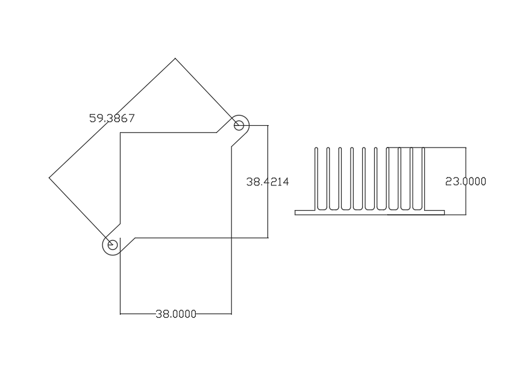

### 3.3 Carrier Board Naming Rules

A - B - C + D E F : G - H

| Field| Field Description| Value| Description
|----------|----------|----------|----------
| A| Product Line Identification| OK| Forlinx Embedded carrier board
| \-| Separator| \-| The separator "-" is omitted between the product line  
| B| CPU Name| 3588| RK3588
| \-| Segment Identification| \-| Parameter segment sign
| C| Connection| C| Board to Board Connector
| \+| Segment Identification| \+| The configuration parameter section follows this identifier.
| D| Type| M| Carrier board(Note: carrier board identification M, not filled by default)
| E| Operating Temperature| C| 0 to 80℃   Commercial-grade
| F| PCB Version| 11| V1.1
| :| Separator| :| It’s followed by the manufacture’s internal identification.
| G| Connector origin| 1| Imported connector
| \-| Connector| \-| Grade Mark Connector
| H| Grade Identification| PC| Prototype Sample
| | | Blank| Mass Production
| | | SC| Special-purpose use: According to the customer's special requirements for special modifications (according to a function to modify a material,etc.)

### 3.4 Carrier Board Resources

| **Function**| **Quantity**| **Parameter**|
|:----------:|:----------:|----------|
| MIPI CSI| 5| •2 × MIPI DPHY V1.2 4-lane interfaces, each lane supporting up to 2.5 Gbps; routed via 2 x 26-pin FPC connectors, with OV13850 cameras mounted by default;  •2 × MIPI DPHY V1.2 2-lane interfaces, each lane supporting up to 2.5 Gbps; routed via three 26-pin FPC connectors, with OV5645 cameras mounted by default;  •1 × MIPI DPHY V1.2 4-lane interface, each lane supporting up to 2.5 Gbps. |
| MIPI DSI| 2| •Each MIPI interface supports 4lane output with a maximum resolution of 4K@60fps;  •Compatible with Forlinx's 7-inch MIPI display, featuring a resolution of 1024x600@30fps; |
| HDMI RX| 1| •Led out via standard HDMI socket; •Supports up to 4K @ 60Hz; |
| HDMI TX| 1| •Led out via standard HDMI socket; •Supports up to 7680x4320 @ 60Hz; |
| eDP TX| 1| •Adapt to 1080p @ 60Hz display; •Support up to 4K @ 60Hz; |
| DP TX| 2| •2 x DP interfaces are used in combination with USB3.1 Gen1 and led out through Type-C interface; •Support up to 7680x4320 @ 30Hz; |
| USB3.1 Gen1| 2| •Led out via Type-C interface; •Used with DP TX up to 5Gbps; |
| USB2.0 Host| 1| •Led out via Type-A USB interface; •Supports three modes of high speed (480Mbps), full speed (12Mbps) and low speed (1.5M bps); |
| PCIe3.0| 1| •1x 4lanes PCIe signals  led out via PCIe X 4 slots; •Supports 2.5g bps (PCIe 1.1), 5Gbps (PCIe 2.1), 8Gbps (PCIe 3.0); |
| PCIe2.0| 1| •Led out via PCIe X 1 slot; •Supports 5Gbps speed; |
| Ethernet| 2| •Led out via 2 x RJ45 interfaces; •Support 10/100/1000 Mbps data transmission rate; |
| TF card| 1| •TF card is available, rate up to 150MHz，support SDR104 mode; |
| Audio| 1| •Codec chip on board, support headphone output, MIC input level Speaker； |
| RS485| 1| •1 x RS485 CAN bus led out through RS485 transceiver; |
| UART| 1| •Led out via 2.54 mm pitch; •Up to 4Mbps baud rate; |
| 4G/5G| 1| •Supports 4G/5G modules packaged in M.2 format; |
| WIFI\&BT| 1| • Supports M.2-packaged Wi-Fi \& BT modules;  • Forlinx has adapted a module supporting Wi-Fi 6 SU/MU-MIMO + Bluetooth 5.3;|
| ADC| 5| • Led out via PH2.0 socket; • 12-bit resolution and up to 1MS/s sampling rate;|
| RTC| 1| •Onboard RTC chip and battery socket; |
| FAN| 1| •Onboard fan connector; |
| GPIO| 9| •9 x GPIO (3.3 V level) and 5V, 3.3 V, and 1.8 V power led out via a 2.54 mm pitch header pin; |

**Note: "TBD" means the function has not been developed in this phase;**

**The parameters in the table are hardware design or theoretical CPU values.**

### 3.5 OK3588-C Carrier Board Description

**Note: The component UID with "\_DNP" mark in the diagram below represents it is not soldered by default**.

#### 3.5.1 Carrier Board Power

It uses a 12V power adapter for the power supply, and the power connector is a DC005 socket. S1(DIP switch) is the power switch, which moves according to the screen printing indication on the board. The rear of S1 has TVS for electrostatic protection, F1 for over-current protection, and D1 and F1 cooperate for anti-reverse connection protection. VCC12V\_ DCIN supplies power to SoM and carrier board at the same time.

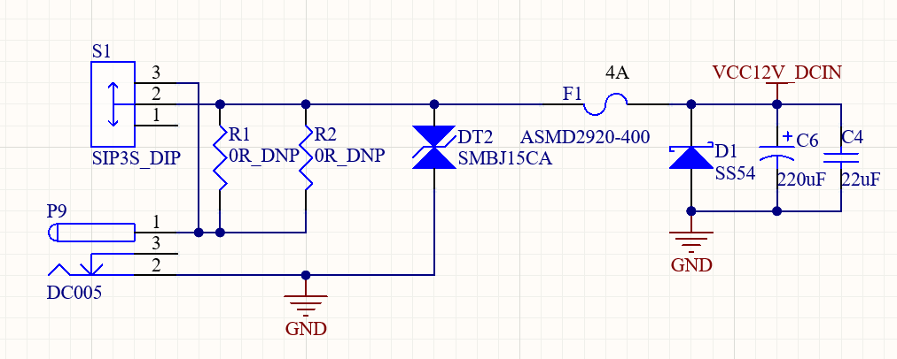

VCC12V\_ DCIN is decreased to VCC \_ 5V via U2. VCC\_ 5V supplies power for some of the peripherals on  the carrier board. To meet the power-up timing, the carrier board power-up is controlled by  CARRIER\_BOARD\_EN--a signal of SoM. (the electrical level is 3.3V, and the driving ability is 10K pull-up. If the required driving ability of the enabling pin of the enabling device exceeds this range, a buffer or gate circuit needs to be added for increasing the driving ability to ensure SoM and carrier board power-up normally).

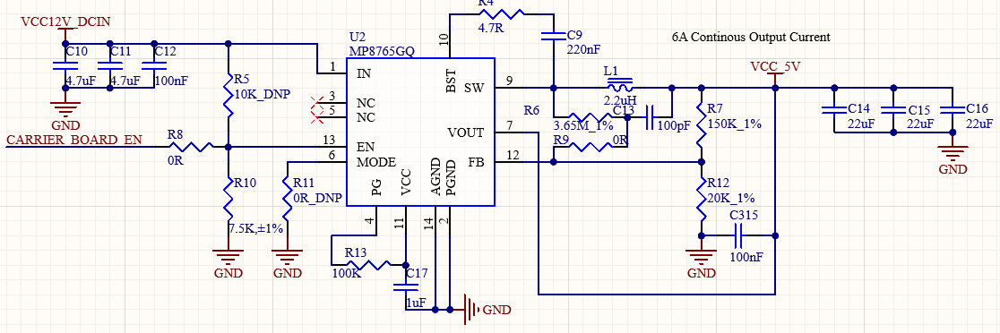

VCC\_5V is decreased to VCC\_3V3 via U3 VCC\_3V3 supplies power for partial carrier board configurations.

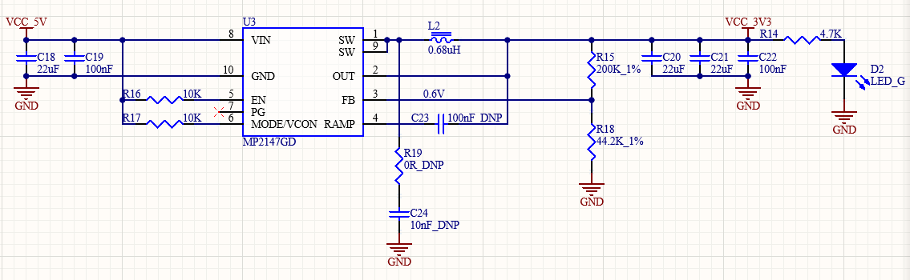

VCC\_3V3 is decreased to VCC\_1V8 via U1. VCC\_1V8 supplies power for partial carrier board configurations.

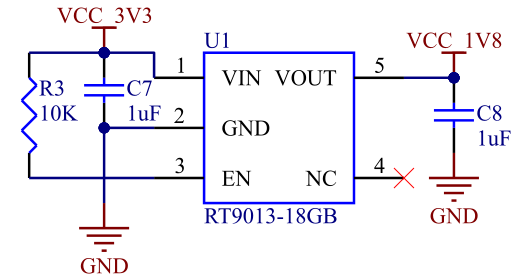

**Note:**

**1**. **When undertaking independent design, it is crucial to ensure proper power sequencing during power-up;**
**2. For the device selection and external layout of the buck - boost chip, you need to refer to the corresponding chip manual to ensure a good power supply loop.**

#### 3.5.2 Reset and Startup/Shutdown Signal

RESET\_L is SoM resetting signal input connected to the key for convenient debugging.

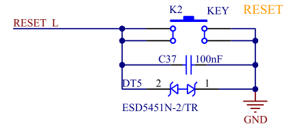

PWRON\_L is an On/Off signal input connected to the key for convenient debugging.

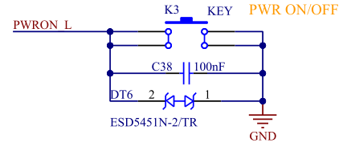

#### 3.5.3 Boot Configuration

RK3588 supports multiple boot modes. After resetting the chip reset, the boot code integrated inside the chip can be booted on the following interface devices, and the specific boot sequence can be selected according to actual application requirements:

·Serial Flash(FSPI)

·eMMC

SDMMC Card

If there is no boot code in the above devices, the system code can be downloaded to these devices by the USB2.0 OTG0 interface TYPEC0\_OTG\_DM / TYPEC0 \_OTG\_DP signal.

Boot Sequence Selection:

The boot sequence of RK3588 can be set by BOOT\_SARADC\_IN0 (PIN: P1\_28), and it can boot from the peripheral corresponding to the different interfaces. As shown in the table below, the hardware is configured with different up and down resistance values to design the peripheral boot sequence of LEVEL1-LEVEL7 in seven modes that can configurable according to actual application requirements

Table 3.5.2.1 Boot Sequence Configuration

| Item| Rup| Rdown| ADC| VOL| BOOT MODE
|:----------:|:----------:|:----------:|:----------:|:----------:|----------
| LEVEL1| DNP| 1K| 0| 0V| USB (Maskrom mode)
| LEVEL2| 10K| 2K| 682| 0.3V| SD Card-USB
| LEVEL3| 10K| 5.1K| 1365| 0.6V| EMMC-USB
| LEVEL4| 10K| 10K| 2047| 0.9V| FSPI M0-USB
| LEVEL5| 10K| 20K| 2730| 1.2V| FSPI M1-USB
| LEVEL6| 10K| 50K| 3412| 1.5V| FSPI M2-USB
| LEVEL7| 10K| DNP| 4095| 1.8V| FSPI M2-FSPI M1-FSPI M0-EMMC-SD Card-USB

BOOT\_SARADC\_IN0 on SoM is 10K pull-up, so the SoM defaults to start from eMMC The pull-down resistor can be added to the carrier board to achieve other boot sequences. According to the above LEVEL1 setting, OK3588-C connects BOOT\_ SARADC\_ IN0 to GND by the touch key to achieve Maskrom mode.

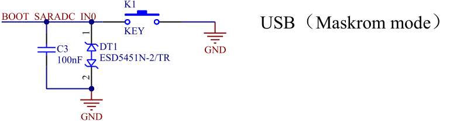

SARADC\_ VIN1 is used to enter the recovery state due to a short circuit to the ground, and the SoM pulls it up to a 1.8V power supply using a 10K resistor. On RK3588, the key array adopts a parallel type, which can adjust the input key value by increasing or decreasing the keys and adjusting the proportion of the voltage divider resistor to achieve multi-key input to meet customer product requirements; It is recommended in the design that any two key values must be greater than ± 35, i.e. the center voltage difference must be greater than 123mV. As shown below:

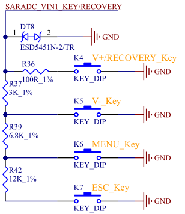

**Note:**

**1\. When doing key acquisition, ESD protection is required near the keys. And 0 key value must be connected in series with a 100ohm resistor to strengthen the anti-static surge capacity (If there is only one button, ESD must be close to the button, ESD → 100ohm resistor → 1nF → chip pin);**

#### 3.5.4 System Initialization Configuration Signal

There is one important signal in the FET3588 that affects the system boot configuration and needs to be configured and kept in a stable state before power-up:

GPIO0\_A4 (PIN: P3\_90) (default function is SDMMC\_DET): determines whether P1\_7, P1\_9, P1\_11, P1\_13 are SDMMC or JTAG functions.

The ARM JTAG function of RK3588 is multiplexed with SDMMC function, and IOMUX function is switched via SDMMC\_DET pin, so this pin also needs to be configured before power-up, otherwise, no output of the ARM JTAG function will affect the debugging of the boot stage, while no output of SDMMC will affect the SDMMC boot function.

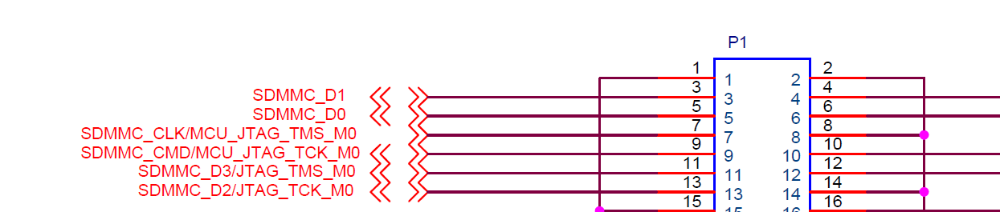

·When this pin detects high level, the corresponding IO switches to the ARM JTAG function;
·When this pin detects low level (Most SD cards inserted will pull down this pin, if not need special treatment), the corresponding IO switches to SDMMC function;
·After the system is up, it can be switched to have registers to control IOMUX, then the pin can be released;
·For easy reference, the configuration status of this pin corresponds to its function shown as follows:

Table 3.5.4.1 FET3588 System Initialization Configuration Signal Description

| Signal| Internal Pull-up\&down| Description
|:----------:|:----------:|----------
| GPIO0\_A4| Pull-up| SDMMC/ARM JTAG pin multiplexing selection control signal: 0: SD card insertion, SDMMC/ARM JTAG pin multiplexing as SDMMC function; 1: SD card insertion, SDMMC/ARM JTAG pin multiplexing as ARM JTAG function (Default).

#### 3.5.5  JTAG \& UART Debug Circuit

The ARM JTAG interface of the RK3588 chip complies with IEEE1149.1 standard, and the PC can connect to the DSTREAM emulator via SWD mode (two-wire mode) to debug the ARM Core inside the chip.

ARM JTAG interface description is as follows:

Table 3.5.5.1 RK3588 JTAG Debug

| Signal| Description
|----------|----------
| JTAG\_TCK\_M0/M1| SWD mode clock input
| JTAG\_TMS\_M0/M1| SWD mode data input and output

The JTAG connections and standard connector pin definitions are shown as follows:

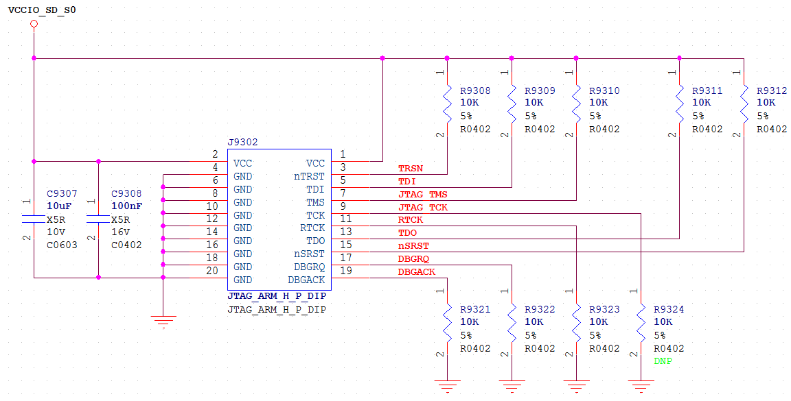

FET3588 UART Debug selects UART2\_TX\_M0\_DEBUG (P2\_7)/UART2\_RX\_M0\_DEBUG (P2\_9) by default. UART Debug signal needs to be connected with 100ohm resistor in series, if plug-in is used, and TVS tube needs to be added near the plug-in position.

To facilitate user debugging, OK3588 uses a USB to UART chip to convert the UART signal into a USB signal and leads it out through a Type-C socket. You can connect OK3588-C P10 to PC with USB Type-A to UAB Type-C cable and install a CP2102 driver. 

The schematic is as follows:

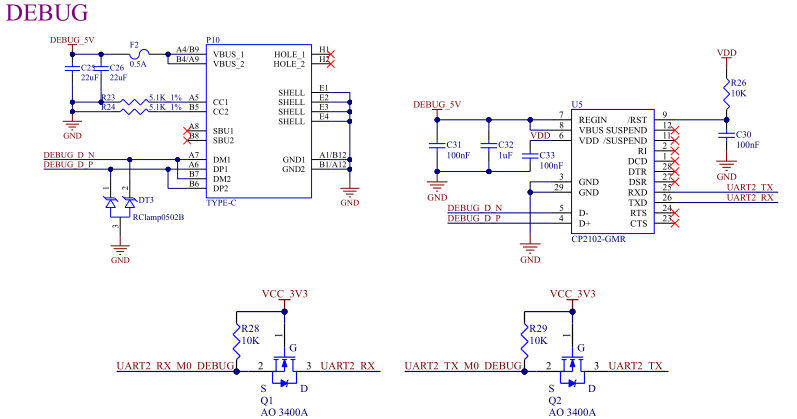

**Note:**

**1\. For the convenience of later debugging, please lead out the debugging serial port when designing the carrier board;**

**2\. It is recommended to keep Q1 and Q2, which can effectively prevent the U5 current from flowing back to the CPU through UART2\_TX/RX when the core board is not powered-up, affecting the startup and even causing damage;**

#### 3.5.6 IIC Extending IO

To introduce more diverse interfaces, the enable and reset signals of the carrier board are completed by the IIC to IO chip U4. At the same time, the U4 spare part of IO is led out by P11 to facilitate the expansion. The principle is as follows:

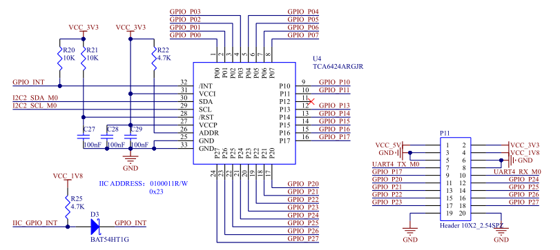

#### 3.5.7 SARADC

The OK3588 introduces SARADC\_VIN2/VIN4/VIN5/VIN6/VIN7 through P12, while P13 can provide 3.3V power output for peripherals. 

As shown in the figure below:

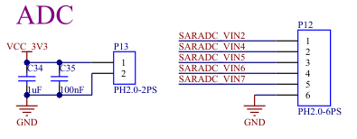

**Note: When using the SARADC\_VINx, 1nF capacitor must be added near the pin to eliminate jitter.**

#### 3.5.8 FAN Interface

The OK3588-C has a fan power interface, which can adjust the power supply current through PWM to achieve fan speed adjustment. 

As shown in the figure below:

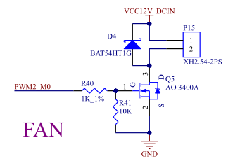

#### 3.5.9 TF Card

The carrier board P16 is a TF Card interface, which can support system boot and flash.

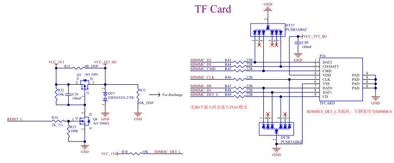

**Note:**

**1\. The power supply for the TF card must be controlled; refer to the carrier board circuit for implementation;**

**2.** **Impedance requirements: Single-ended 50ohm.**

#### 3.5.10 RTC Circuit

The OK3588 provides an on-board external RTC function for more accurate timing and lower power consumption. As shown in the figure below:

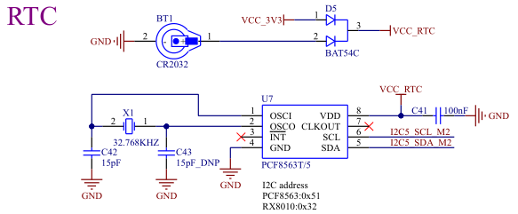

#### 3.5.11  Ethernet Circuit

The carrier board supports dual 1000/100/10M Ethernet interfaces, which are led out via RJ45.

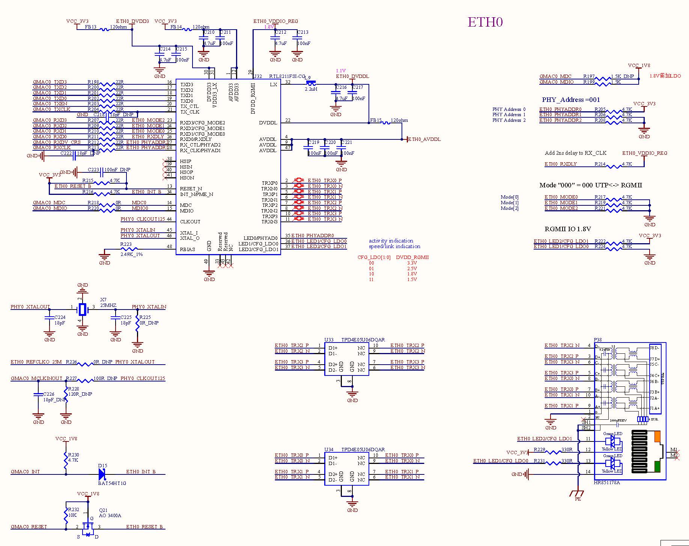

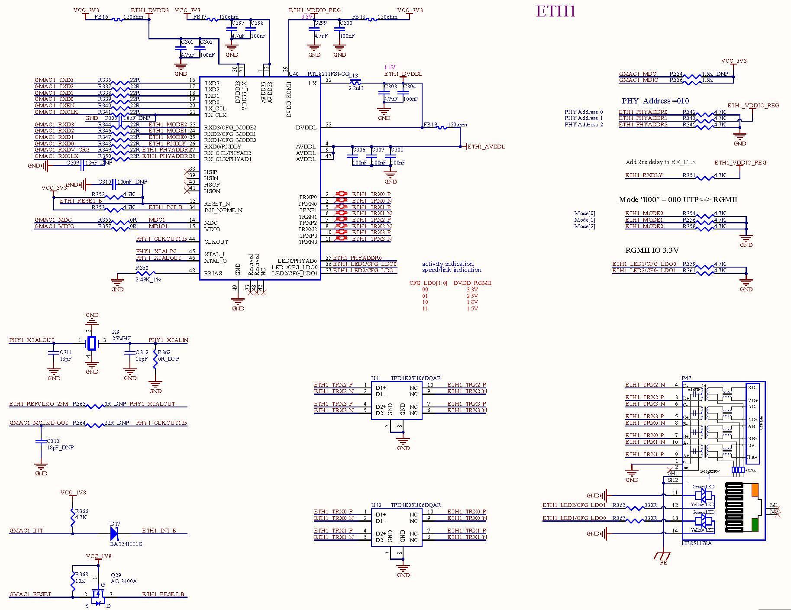

**Note:**

**1.The following table shows the RK3588 RGMII/RMII interface design:**

**Table 3.5.11.1 RK3588 RGMII/RMII Interface**

| **Signal**| **IO Type** **（Chip-side）**| **RGMII Interface**| **Signal Description**| **RMII Interface**| **Signal Description**
|:----------:|:----------:|:----------:|:----------:|:----------:|:----------:
| GMACx\_TXD\[3:0]| Output| RGMIIxTXD\[3:0]| Data sending| RMIIx\_TXD\[1:0]| Data sending
| GMACx\_TXCLK| Output| RGMIIx\_TXCLK| Reference clock for data sending| --| --
| GMACx\_TXEN| Output| RGMIIx\_TXEN| Data sending enable (rising edge) and data transmission error (falling edge)| RMIIx\_TXEN| Data sending enable (
| GMACx\_RXD\[3:0]| Input| RGMIIx\_RXD\[3:0]| Data receiving| RMIIx\_RXD\[1:0]| Data receiving
| GMACx\_RXCLK| Input| RGMIIx\_RXCLK| Data receiving reference clock| --| --
| GMACx\_RXDV| Input| RGMIIx\_RXDV| Effective data receiving (rising edge) and receiving error (falling edge)| RMIIx\_RXDV\_ CRS| Data receiving validity and carrier sense
| GMACx\_MCLKINOUT| Input/Output| RGMIIx\_MCLKIN\_ 125M| PHY sends 125MHz to MAC, optional| RMII\_MCLKIN\_50M or RMII\_MCLKOUT\_50M| RMII data sending and data receiving reference clock
| ETHx\_REFCLKO\_ 25M| Output| ETHx\_REFCLKO\_ 25M| RK3588 provides 25MHz clock to replace PHY crystal| ETHx\_REFCLKO\_ 25M| RK3588 provides 25MHz clock to replace PHY crystal
| GMACx\_MDC| Output| RGMIIx\_MDC| Manage the data clock| RMIIx\_MDC| Manage the data clock
| GMACx\_MDIO| Input/Output| RGMIIx\_MDIO| Manage data output/input| RMIIx\_MDIO| Manage data output/input

**2. In RGMII mode, the TX/RX clock paths inside the RK3588 chip are integrated with a delay line, which supports adjustment. The default configuration in the reference diagram is as follows: The timing between TXCLK and data is controlled by the MAC, and the timing between RXCLK and data is controlled by the PHY. (For example, when using RTL8211F/FI, a 2ns delay for RXCLK is enabled by default. Please pay attention to other PHY configurations;**

**3. The GMAC0 interface level only supports 1.8V. The GMAC1 interface level is 3.3V by default (if it must be changed to 1.8V, please contact Forlinx). It should be noted whether the power - supply voltage of the RGMII signal power domain of the PHY chip matches the level of the GMACx interface;**

**4. The Reset signal of the Ethernet PHY needs to be controlled by GPIO. The level of the GPIO must match the PHY IO level. A 100nF capacitor must be added close to the PHY pins to enhance the anti - static ability. Note: The reset pin of RTL8211F/FI only supports a 3.3V level;**

**5. For TXD0 - TXD3, TXCLK, and TXEN, a 0ohm series resistor should be reserved at the FET3588 end to improve the signal quality conditionally according to the actual situation;**

**6. For RXD0 - RXD3, RXCLK, and RXDV, a 22ohm series resistor should be connected at the PHY end to improve the signal quality；**

**7. When the PHY uses an external crystal, the crystal capacitor should be selected according to the load capacitance value of the actually used crystal, and the frequency deviation should be controlled within ±20ppm；**

**8.** **The external resistor connected to the RBIAS pin of RTL8211F/FI is 2.49K ohms with an accuracy of 1%. Do not modify it casually;**

**9.** **An external pull - up resistor must be added to MDIO, with a recommended value of 1.5 - 1.8K ohm. The pull - up power supply must be consistent with the IO power supply;**

**10.The PCB layout needs to ensure the integrity of the RGMII signal reference plane and the integrity of the power supply reference plane around the PHY chip;**

**11.Equal - length requirement: The receiving and sending signals of RGMII can be grouped for equal - length processing, and the equal - length requirement is ≤12.5mil;**

**12. Impedance requirement: 50 ohm for single - ended signals.**

#### 3.5.12 RS485 Interface

The OK3588 has an RS485 transceiver chip U9 on board, and its signal is TDH341S485S, with isolation withstand voltage up to 5000VDC, bus static protection up to 15kV (HBM), and transient immunity >25Kv/us. Meanwhile, the OK3588 carrier board is compatible with a higher level of surge pulse group multi-level protection circuit, as shown in the following figure:

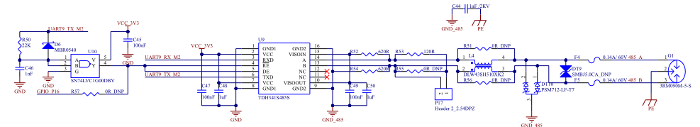

#### 3.5.13 Audio

The OK3588 has an I2S interface Codec chip U29 on board, which supports MIC input, headphone output, and 1W 8Ω speaker output. The principle shown as follows:

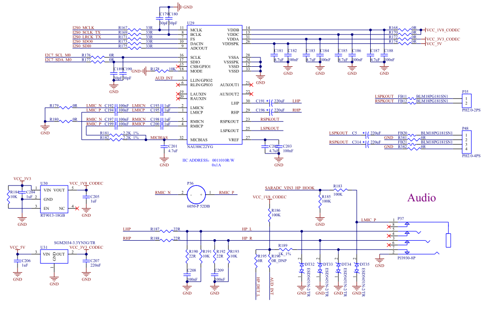

#### 3.5.14 4G\&5G Interface

The OK3588 integrates an M.2 Key-B interface that is compatible with 4G and 5G modules. Since 4G and 5G modules have different power supply voltages, you need to toggle S2 to select the corresponding power supply voltage.

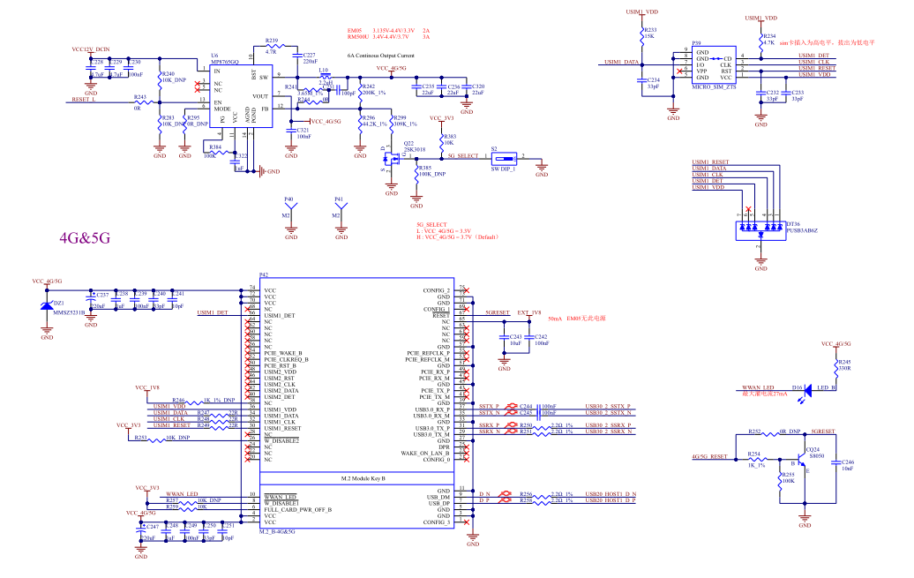

#### 3.5.15 USB2.0/USB3.0 Circuit

The RK3588 chip has 2 x built-in USB 3.0 OTG controllers (with 2 x USB 2.0 OTG built-in, shown in green below), 1 x USB 3.0 HOST controller, and 2 x USB 2.0 HOST controllers.

The internal multiplexing diagram of these controllers with the PHY is as follows:

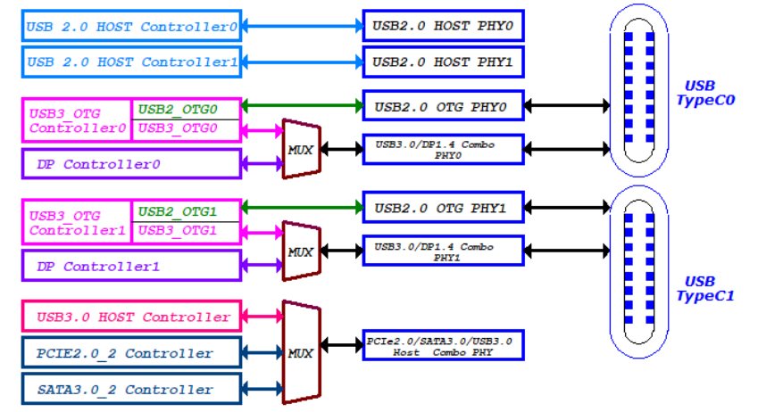

USB3.0 OTG0 controller supports SS/HS/FS/LS, and the embedded USB2.0 (HS/FS/LS) signal uses USB2.0 OTG PHY (the signal names are shown in the red box as follows); RK3588 currently only TYPEC0\_OTG\_DM/TYPEC0\_OTG\_DP supports Fireware Download, please be sure to reserve this interface in the application (at the same time TYPEC0\_USB20\_VBUSDET must also be connected).

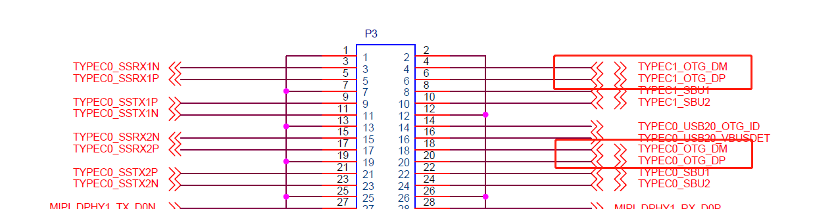

The SS signal (5Gbps) of USB3.0 is multiplexed with DP1.4, using the Combo PHY of USB/DP; the signal is in the red box as follows.

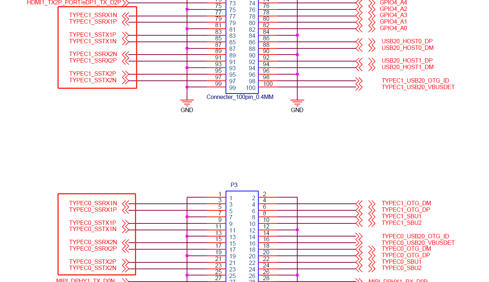

The multiplexing relationship of the USB and DP is as follows:Table

3.5.15.1 USB 3.0 and DP Multiplexing Relationship

| USB3.0| DP
|:----------:|:----------:
| TYPECx\_SBU1| DP0\_AUXP
| TYPECx\_SBU2| DP0\_AUXN
| TYPECx\_SSRX1N| DP0\_TX0N
| TYPECx\_SSRX1P| DP0\_TX0P
| TYPECx\_SSTX1P| DP0\_TX1P
| TYPECx\_SSTX1N| DP0\_TX1N
| TYPECx\_SSRX2N| DP0\_TX2N
| TYPECx\_SSRX2P| DP0\_TX2P
| TYPECx\_SSTX2P| DP0\_TX3P
| TYPECx\_SSTX2N| DP0\_TX3N

Since the USB3.0 OTG and USB2.0 OTG are the same USB3.0 controller, the USB3.0 and USB2.0 OTG can only do Device or HOST at the same time, not USB3.0 OTG for HOST, USB2.0 OTG for Device or USB3.0 OTG for Device and USB2.0 OTG to do HOST.

USB3.0 Controller and DP1.4 Controller are combined into a complete TYPEC port through USB3.0/DP1.4 Combo PHY, and this Combo PHY supports Display Alter mode. Lane0 and Lane2 do TX in DP mode and RX in USB mode; TX and RX share Lane0 and Lane2.

This USB3.0/DP1.4 Combo PHY supports inter-Lane switching (SWAP), so a TYPEC standard port can have the following five configurations:

Configuration I: Type-C 4Lane (with DP function)

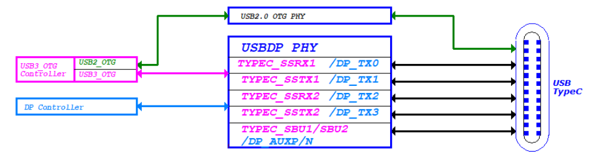

Configuration II: USB2.0 OTG+DP 4Lane（Swap OFF）

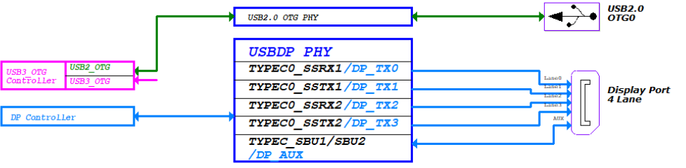

Configuration III: USB2.0 OTG+DP 4Lane(Swap ON)

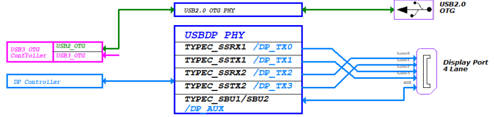

Configuration IV: USB3.0 OTG0+DP 2Lane（Swap OFF）

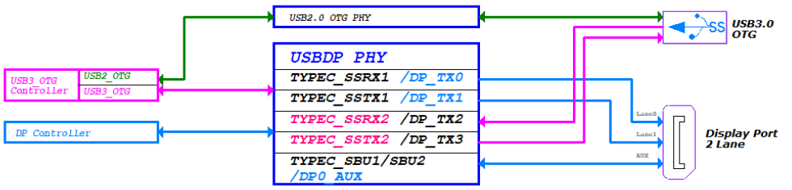

Configuration V: USB3.0 OTG+DP 2Lane（Swap ON）

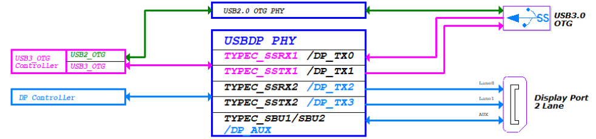

The default configuration of OK3588 is dual Type-C 4Lane (with DP function) , schematic is as follows:

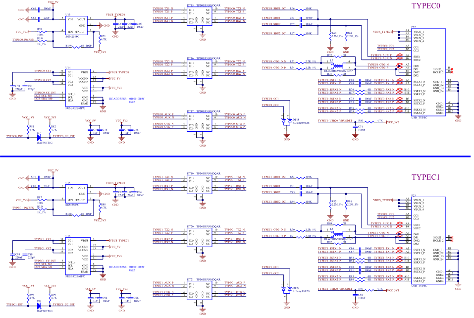

As the USB3.0 HOST controller only has USB3.0 HOST without built-in USB2.0, it needs to be combined with USB2.0 HOST Controller1 (configuration 1) or USB2.0 HOST Controller0 (configuration 2) to form a standard USB3.0 HOST. The internal link block diagram is as follows:

Configuration I: USB3.0 HOST2+USB2.0 HOST1

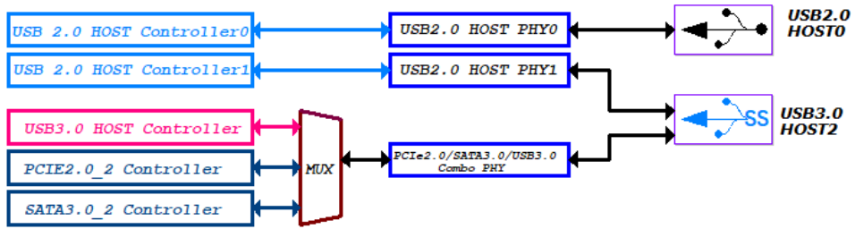

Configuration II: USB3.0 HOST2+USB2.0 HOST0

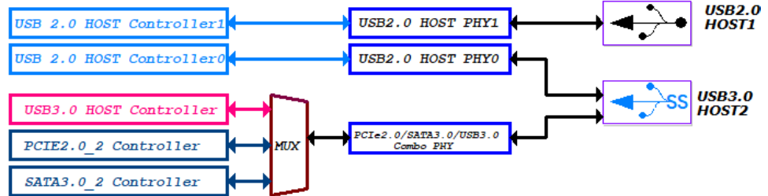

USB2.0 HOST controller, using USB2.0 HOST0PHY, the signals in the box below make up the USB2.0 HOST interface:

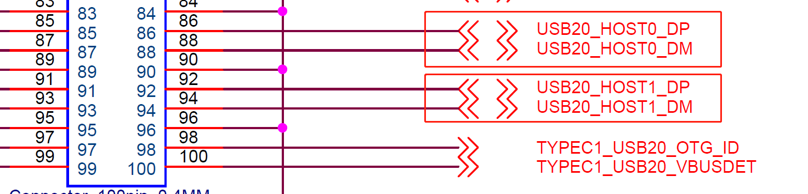

**Note:**

**1.** **TYPEC0\_OTG\_DM/TYPEC0\_OTG\_DP is the system firmware programming port. If this interface is not used in the product, it must be reserved during the debugging and production processes. Otherwise, debugging and firmware programming during production will not be possible;**

**2.** **There is approximately a 200K ohm pull - up resistor to 1.8V inside the TYPEC0\_USB20\_OTG\_ID;**

**3. TYPEC\_USB20\_VBUSDET is the detection pin for OTG and Device modes. It is active high, with a voltage range of 2.7 - 3.3V (Typical: 3.0V). It is recommended to place a 100nF capacitor at the pin;**

**4. The OTG mode can be set to the following three modes:**
**·OTG mode: Automatically switch between the device mode and the HOST mode according to the state of the ID pin. When the ID is high, it is in the device mode; when the ID is pulled low, it is in the HOST mode. In the device mode, it will also check whether the VBUSDET pin is high (greater than 2.3V). Only when it is high will the DP be pulled high to start the enumeration process；**
**Device mode: When set to this mode, there is no need to use the ID pin. It only needs to check whether the VBUSDET pin is high (greater than 2.3V). Only when it is high will the DP be pulled high to start the enumeration process;**
**·HOST mode: When set to this mode, there is no need to care about the states of the ID and VBUSDET pins. ( In the case that the product only needs HOST mode, the system firmware burning port is only TYPEC0\_OTG\_DM/TYPEC0\_OTG\_DP, which is also used in the production and debugging, so when burning and abd debugging, we need to set it to device mode and connect TYPEC0\_USB20\_VBUSDET signal.**
**If a TYPE - C interface is used, the TYPEC0\_USB20\_VBUSDE signals can be pulled high through a 4.7K resistor;**

**5. To enhance the anti - static and anti - surge capabilities, ESD devices must be reserved on the signals. The parasitic capacitance of the ESD for USB 2.0 signals shall not exceed 3pF. Additionally, a 2.2 - ohm resistor should be connected in series with the DP/DM of the USB 2.0 signals to enhance the anti - static and anti - surge capabilities;**

**6. To suppress electromagnetic radiation, a common - mode choke can be reserved on the signal lines. During the debugging process, a resistor or a common - mode choke can be selected according to the actual situation；**

**7.** **If the TYPECx\_USB20\_OTG\_ID signal is used, to enhance the anti - static and anti - surge capabilities, ESD devices must be reserved on the signal, and a 100ohm resistor should be connected in series and shall not be removed；**

**8.** **When using the HOST function, it is recommended to add a current - limiting switch to the 5V power supply. The current - limiting value can be adjusted according to the application requirements. The current - limiting switch is controlled by a 3.3V GPIO. It is recommended to add capacitors of 22μF and over 100nF for filtering to the 5V power supply. If the USB port may be connected to a mobile hard disk, it is recommended to increase the filtering capacitor to over 100μF；**

**9.** **According to the TYPE - C protocol, a 100nF AC - coupling capacitor should be added to the SSTXP/N lines. It is recommended to use a 0201 package for the AC - coupling capacitor, which has lower ESR and ESL and can also reduce the impedance change on the line；**

**10. ESD devices must be added to all signals of the TYPE - C socket and should be placed close to the USB connector during layout. For the SSTXP/N and SSRXP/N signals, the parasitic capacitance of the ESD shall not exceed 0.3pF; **

**11.The differential impedance of USB 2.0 control signals should be 90 ohms ± 10%, and the maximum time delay within the differential pair should be ＜10mil；**

**12. The differential impedance of USB 3.0 control signals should be 90 ohms ± 10%, and the maximum time delay within the differential pair should be＜3mil. **

#### 3.5.16 SATA3.0 Circuit

The RK3588 chip has 3 SATA3.0 controllers and multiplexes PIPE PHY0/1/2 with PCIe and USB3\_HOST2 controllers. Please see the specific path as follows:

- Support SATA PM function, and each port can support up to 5 devices;

- Support SATA 1.5Gb/s, SATA 3.0Gb/s, SATA 6.0Gb/s speeds;

- Support eSATA.

SATA0 controller uses PIPE\_PHY0 (multiplexes with PCIe3.0x1\_2 Controller).

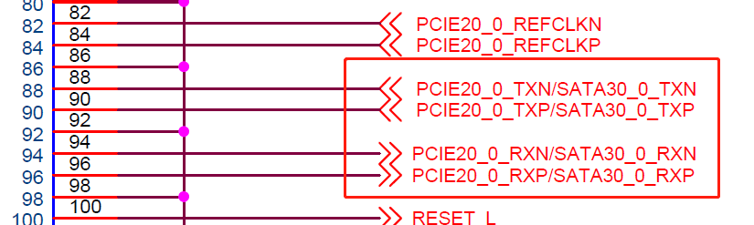

SATA1 controller uses PIPE\_PHY1 (multiplexes with PCIe3.0x1\_0 Controller).

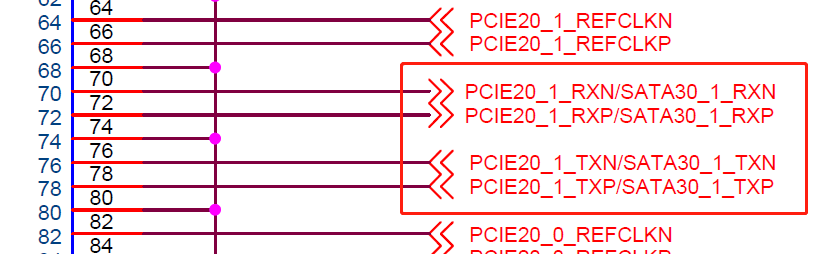

SATA2 controller uses PIPE\_PHY2 (multiplexes with the PCIe3.0x1\_1 Controller as well as the USB30 HOST2 Controller).

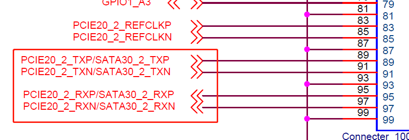

The control IO associated with the SATA0/1/2 controller are:

- -SATA0\_ACT\_LED: SATA0 interface with LED flicker control output during data transfer;
- -SATA1\_ACT\_LED: SATA1 interface with LED flicker control output during data transfer;

- -SATA2\_ACT\_LED: SATA2 interface with LED flicker control output during data transfer;

- -SATA\_CP\_DET: Plug detection input for SATA hot-plug devices;

- -SATA\_MP\_SWITCH: Switch detection input for SATA hot-plug devices;

- -SATA\_CP\_POD: SATA control the power output switch of the hot plug device;

Among them, SATA\_CP\_DET, SATA\_MP\_SWITCH, and SATA\_CP\_POD are shared interfaces for SATA0, SATA1, and SATA2. It can be configured through registers to select whether it is for SATA0, SATA1, or SATA2;

- -SATA0\_ACT\_LED, SATA1\_ACT\_LED, SATA2\_ACT\_LED multiplexed pins are shown in the Pin Mux table.

**Note:**

**During slot design, the peripheral circuitry and power supply must meet the specifications (Spec) requirements;**

**2.** **For the differential signals TXP/N and RXP/N of the SATA interface, a 10nF AC - coupling capacitor is connected in series. It is recommended to use a 0201 package for the AC - coupling capacitor, which has lower ESR and ESL and can also reduce the impedance change on the line;**

**3.** **ESD devices must be added to all signals of the eSATA interface socket. They should be placed close to the socket during layout, and the parasitic capacitance of the ESD shall not exceed 0.4pF.**

#### 3.5.17 PCIe2.0 and PCIe3.0 Circuit

The RK3588 has 5 PCIe 3.0 controllers: (DM stands for Dual Mode and RC stands for Root Complex.)

1. Controller 0(4L)，PCIe3.0x4 Controller x4 Lane(DM)

2. Controller 1(2L)，PCIe3.0x2 Controller x2 Lane(Only RC)

3. Controller 2(1L0)，PCIe3.0x1\_0 Controller x1 Lane(Only RC)

4. Controller 3(1L1)，PCIe3.0x1\_1 Controller x1 Lane(Only RC)

5. Controller 4(1L2)，PCIe3.0x1\_2 Controller x1 Lane(Only RC)

2 PCIe3.0 PHY, data bit 2Lane, PCIe3.0 PHY0 and PCIe3.0 PHY1.

3 PCIe2.0 Combo PHY with data bit 1Lane, PCIe2.0/SATA3.0 Combo PHY0, PCIe2.0/SATA3.0 Combo PHY1 and PCIe2.0/SATA3.0/USB3.0 HOST Combo PHY2.

Mapping diagram between Controller and PHY:

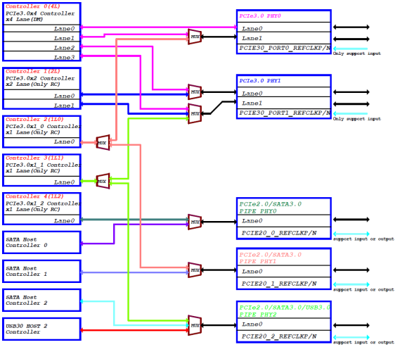

Controller 0(4L) Lane0 can only be combined with PCIe3.0 PHY0 Lane0;

Controller 1(2L) Lane0 can only be combined with PCIe3.0 PHY1 Lane0;

Controller 0(4L) + PCIe3.0 PHY0 + PCIe3.0 PHY1 to form PCIe3.0 X4Lane RC or EP mode for 4Lane. It is compatible with PCIe3.0 X2Lane RC or EP mode and PCIe3.0 X1Lane RC or EP mode;

| FET3588 PECI Signal| | PCIe3.0 x 4Lane RC or EP| PCIe3.0 x 2Lane RC or EP| PCIe3.0 x 1Lane RC or EP
|----------|----------|:----------:|:----------:|:----------:
| Port0| PCIE30\_PORT0\_TX0P/N| ✔| ✔| ✔
| | PCIE30\_PORT0\_RX0P/N| ✔| ✔| ✔
| | PCIE30\_PORT0\_TX1P/N| ✔| ✔| ✘
| | PCIE30\_PORT0\_RX1P/N| ✔| ✔| ✘
| | PCIE30\_PORT0\_REFCLKP/N\_IN| ✔| ✔| ✔
| Port1| PCIE30\_PORT1\_TX0P/N| ✔| ✘| ✘
| | PCIE30\_PORT1\_RX0P/N| ✔| ✘| ✘
| | PCIE30\_PORT1\_TX1P/N| ✔| ✘| ✘
| | PCIE30\_PORT1\_RX1P/N| ✔| ✘| ✘
| | PCIE30\_PORT1\_REFCLKP/N\_IN| ✔| ✘| ✘

Controller 1(2L) + PCIe3.0 PHY1 to form 2Lane for PCIe3.0 X2Lane RC mode. It is compatible with PCIe3.0 X1Lane RC mode;

| FET3588 PECI Signal| | PCIe3.0 x 2Lane RC| PCIe3.0 x 1Lane RC
|----------|----------|:----------:|:----------:
| Port1| PCIE30\_PORT1\_TX0P/N| ✔| ✔
| | PCIE30\_PORT1\_RX0P/N| ✔| ✔
| | PCIE30\_PORT1\_TX1P/N| ✔| ✘
| | PCIE30\_PORT1\_RX1P/N| ✔| ✘
| | PCIE30\_PORT1\_REFCLKP/N\_IN| ✔| ✔

Controller 2(1L0) + Lane1of PCIe3.0 PHY0 to form a PCIe3.0 X1Lane RC of 1Lane, or Controller 2(1L0) + PCIe2.0/SATA3.0 Combo PHY1 to form a PCIe2.0 X1Lane RC, so these two modes cannot be used at the same time;

♦ PCIe3.0 X1Lane RC mode corresponding signals in this mode:

| FET3588 PECI Signal| | PCIe3.0 x 1Lane RC
|----------|----------|:----------:
| Port0| PCIE30\_PORT0\_TX1P/N| ✔
| | PCIE30\_PORT0\_RX1P/N| ✔
| | PCIE30\_PORT0\_REFCLKP/N\_IN| ✔

♦ PCIe2.0 X1Lane RC mode corresponding signals in this mode:

| FET3588 PECI Signal| | PCIe3.0 x 1Lane RC
|----------|----------|:----------:
| PCIe2.0/SATA3.0 Combo PHY1| PCIE20\_1\_TXP/N| ✔
| | PCIE20\_1\_RXP/N| ✔
| | PCIE20\_1\_REFCLKP/N| ✔

Controller 3(1L1) + Lane1 of PCIe3.0 PHY1 to form 1Lane of PCIe3.0 X1Lane RC mode, or Controller 3(1L1) + PCIe2.0/SATA3.0/USB3.0 HOST Combo PHY2 to form PCIe2.0 X1Lane RC mode, so these two modes cannot be used at the same time.

♦ PCIe3.0 X1Lane RC mode corresponding signals in this mode:

| FET3588 PECI Signal| | PCIe3.0 x 1Lane RC
|----------|----------|:----------:
| Port1| PCIE30\_PORT1\_TX1P/N| ✔
| | PCIE30\_PORT1\_RX1P/N| ✔
| | PCIE30\_PORT1\_REFCLKP/N\_IN| ✔

♦ PCIe2.0 X1Lane RC mode corresponding signals in this mode:

| FET3588 PECI Signal| | PCIe3.0 x 1Lane RC
|----------|----------|:----------:
| PCIe2.0/SATA3.0/USB HOST Combo PHY2| PCIE20\_2\_TXP/N| ✔
| | PCIE20\_2\_RXP/N| ✔
| | PCIE20\_2\_REFCLKP/N| ✔

Controller 4(1L2)) + PCIe2.0/SATA3.0 Combo PHY0, to form the PCIe2.0 X1Lane RC mode for 1Lane;

♦ Corresponding signals in this mode:

| FET3588 PECI Signal| | PCIe3.0 x 1Lane RC
|----------|----------|:----------:
| PCIe2.0/SATA3.0 Combo PHY0| PCIE20\_0\_TXP/N| ✔
| | PCIE20\_0\_RXP/N| ✔
| | PCIE20\_0\_REFCLKP/N| ✔

Multiple modes can be supported based on the above description. If all use the PCIe function, the RK3588 can support multiple combinations of PCIe modes(up to 5 modes can be used simultaneously).

The RK3588 PCIe multiple combination modes are as follows:

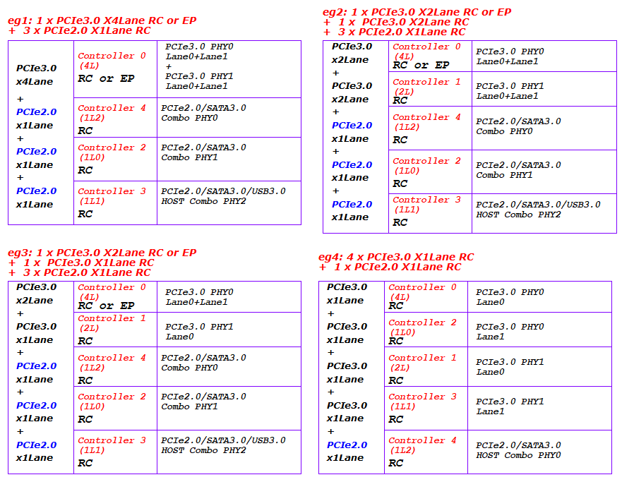

PCIE20\_REFCLKP/N can support either output or input, and the default output is provided to EP devices.

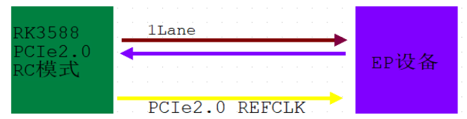

PCIE30\_REF\_CLKP/N only supports input

·HCSL electrical level clock input required

It is necessary to provide clocking requirements to meet PCIe 3.0 or higher

·RK3588 PCIe3.0 X4Lane RC mode. It is compatible with PCIe3.0 X2Lane RC mode and PCIe3.0 X1Lane RC mode. The reference clock path is as follows:

·Another case, if it is 2 RK3588 cascade docking, equivalent to the above figure EP device is also RK3588. Reference clock path is the same, data Lane TX docking RX, RX docking TX.

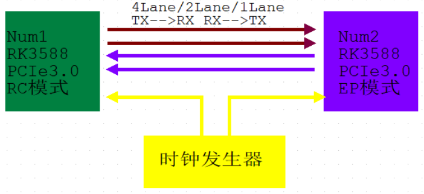

·RK3588 PCIe 3.0 x4 Lane EP mode. It is compatible with PCIe3.0 X2Lane EP mode and PCIe3.0 X1Lane EP mode. The reference clock path is as follows:

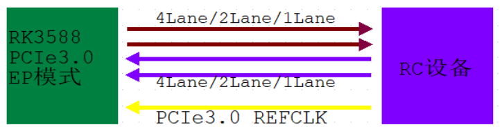

**OK3588-C development board configuration is as follows:**

Controller 0(4L) + PCIe3.0 PHY0 + PCIe3.0 PHY1 to form PCIe3.0 X4Lane RC or EP mode for 4Lane. The principle is as follows:

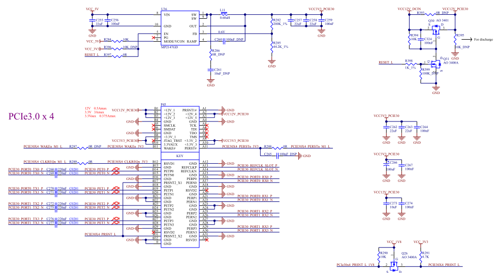

It should be noted that PCIE30\_REFCLK\_SLOT\_P/N, PCIE30\_PORT0\_REFCLK\_IN\_P/N, PCIE30\_PORT1\_REFCLK\_IN\_P/N are generated by the clock chip U38, and the principle is as follows:

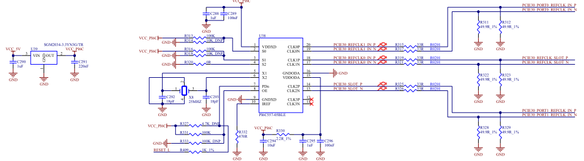

Controller 2(1L0) + PCIe2.0/SATA3.0 Combo PHY1 to form PCIe2.0 X1Lane RC mode. The principle is as follows:

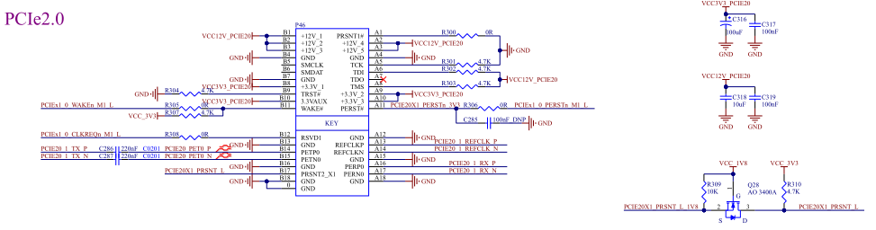

Controller 4(1L2)) + PCIe2.0/SATA3.0 Combo PHY0, to form the PCIe2.0 X1Lane RC mode for 1Lane; The principle of a WIFI module compatible with PCIe interface led out by M.2 Key E , the principle is as follows:

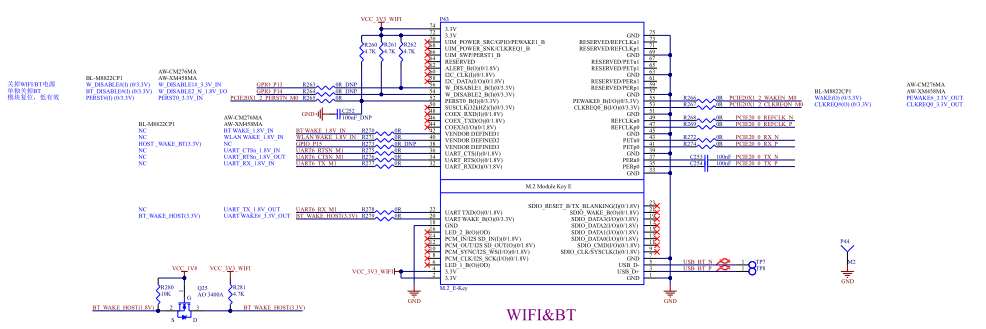

**PCIe2.0 Design Notes:**

**1. During slot design, the peripheral circuitry and power supply must meet the specifications (Spec) requirements;**

**2.** **For the TXP/N differential signals of the PCIe 2.0 interface, a 100 nF AC coupling capacitor is connected in series. It is recommended to use a 0201 package for the AC coupling capacitor due to its lower Equivalent Series Resistance (ESR) and Equivalent Series Inductance (ESL), which can also reduce impedance variations along the circuit;**

**3.** **The PCIE2.0\_CLKREQn and PCIE20\_WAKEn signals must utilize the designated functional pins and cannot be substituted with GPIO pins. Special note: When selecting these pins, both must be chosen from the same group, i.e., either \_M0, \_M1, or \_M2, and they cannot be mixed (e.g., one \_M0 and one \_M1);**

**4.** **PCIE20\_PERSTn can either utilize its designated functional pin or be substituted with a GPIO pin. However, when choosing the functional pin, it must be from the same \_Mx group as PCIE20\_CLKREQn and PCIE20\_WAKEn;**

**5.** **Voltage Levels: PCIE20\_CLKREQn, PCIE20\_WAKEn, and PCIE20\_PERSTn signals operate at a 3.3V level;**

**6.** **PCIE20\_PRSNT: This is the Add In Card insertion detection pin and can be implemented using a GPIO；**

**7.** **Multiplexing Consideration: When utilizing PCIE20 functionality, the multiplexed SATA/USB30 functions cannot be used simultaneously. Refer to the corresponding functional module descriptions for SATA/USB30；**

**8.** **If the PCIe 2.0 functional module is not in use, you can simply leave the data lines PCIE20\_TXP/TXN, PCIE20\_RXP/RXN and the reference clock lines PCIE20\_REFCLKP/REFCLKN floating;**

**9.** **Recommended Matching Design for PCIe2.0 Interface:**

| **Signal**| **Connection**| **Description**
|----------|----------|----------
| **PCIE20\_0/1/2\_TXP/TXN**| **Series Connection with 100nF Capacitor (0201 Package Recommended):**| **PCIe Data Output:**
| **PCIE20\_0/1/2\_RXP/RXN**| **Direct Connection:**| **PCIe Data Input**
| **PCIE20\_0/1/2\_REFCLKP/CLKN**| **Direct Connection:**| **PCIe Reference Clock:**
| **PCIE20\_CLKREQn**| **Series Connection with 0ohm Resistor:**| **PCIe Reference Clock Request Input (RC Mode):**
| **PCIE20\_WAKEn**| **Series Connection with 0ohm Resistor:**| **PCIe Wake Input (RC Mode):**
| **PCIE20\_PERSTn**| **Series Connection with 0ohm Resistor:**| **PCIe Global Reset Output (RC Mode):**
| **PCIE20\_PRSNT**| **Series Connection with 0ohm Resistor:**| **Add-In Card Insertion Detection Input (RC Mode):**

**10. The impedance of the data traces should be controlled at a differential 85 ohms ±10%;**

**11. The impedance of the clock traces should be controlled at a differential 100 ohms ±10%;**

**12. The maximum time - delay difference within differential pair should be \< 3mil;**

**13.The spacing between differential pairs should be ≥ 4 times the PCI-E trace width;**

**PCIe3.0 Design Notes:**

**1. During slot design, the peripheral circuitry and power supply must meet the specifications (Spec) requirements;**

**2.** **For PCIe3.0 interface differential signals TX0P/N, TX1P/N, a 220nF AC coupling capacitor should be connected in series. It is recommended to use a 0201 package for lower ESR and ESL, reducing impedance variations on the line;**

**3.** **The correspondence between PCIE30\_CLKREQn, PCIE30\_WAKEn, PCIE30\_PERSTn, PCIE30X4\_BUTTON\_RSTN control signals and the controller should be as per the provided diagram:**

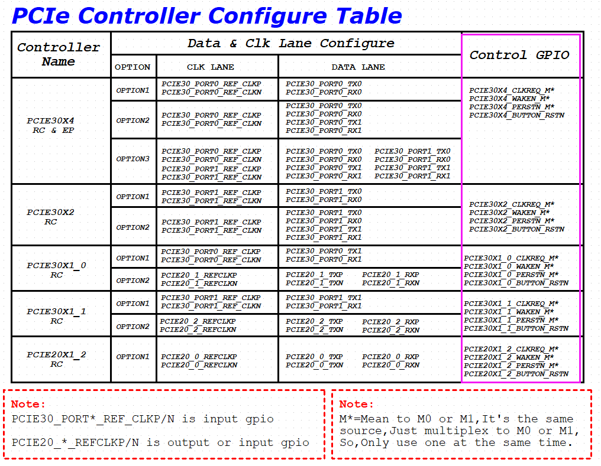

**4.** **The PCIE30\_CLKREQn and PCIE30\_WAKEn must use the functional pins and cannot be replaced by GPIOs. Specifically, when making a selection, you must choose either all \_M0, all \_M1, or all \_M2. You cannot choose one \_M0 and one \_M1;**

**5.** **PCIE30\_PERSTn can either use its designated functional pin or be replaced with a GPIO pin. However, when choosing the functional pin, it must be from the same \_Mx group as PCIE30\_CLKREQn and PCIE30\_WAKEn;**

**6.** **Standard PCIe: PCIE30X2\_CLKREQn, PCIE30X1\_WAKEn, and PCIE30\_PERSTn signals operate at a 3.3V level;**

**7.** **The PCIE30\_PRSNT is the Add In Card insertion detection pin and can be implemented using a GPIO;**

**8.** **The PCIE30\_BUTTON\_RSTN is for the external hardware reset and is reserved for future use and not to be used for now;**

**9.** **When two RK3588 PCIe are cascaded, the data lines should be cross - connected, that is, TX→RX and RX→TX. Control signals PCIE30\_CLKREQn and PCIE30\_PERSTn are connected one-to- one (e.g. Num1 and Num1 represent two RK3588 respectively.**

**Num1\_PCIE30\_CLKREQn connects to Num2\_PCIE30\_CLKREQn, Num1\_PCIE30\_PERSTn connects to Num2\_PCIE30\_PERSTn). three signals, PCIE30\_WAKEn, PCIE30\_PRSNT and PCIE30\_BUTTON\_RSTN may keep floating;**

**10.** **The PCIe30 functional module is not used. The data cables PCIE30\_TXP/TXN and PCIE30\_RXP/RXN are left floating. The reference clock lines PCIE30\_REFCLKP/REFCLKN are either grounded or left floating;**

**11.** ****The REFCLKP/N of the PCIe30 PHY and Slot/peripherals need to meet the requirement of the same - source clock. For example, in the design shown in the reference diagram, the three - way REFCLKP/N of PHY0/PHY1 and Slot are output from the same clock generator; **

**12.** **Recommended Matching Design for PCIe3.0 Interface:**

| **Signal**| **Connection**| **Description**
|----------|----------|----------
| **PCIE30\_TX0P/TX0N**| **Series Connection with 220nF Capacitor (0201 Package Recommended):**| **PCIe Data Output:**
| **PCIE30\_RX0P/RX0N**| **Direct Connection:**| **PCIe Data Input**
| **PCIE30\_TX1P/TX1N**| **Series Connection with 220nF Capacitor (0201 Package Recommended):**| **PCIe Data Output:**
| **PCIE30\_RX1P/RX1N**| **Direct Connection:**| **PCIe Data Input**
| **PCIE30\_REFCLKP/N\_IN**| **Direct Connection:**| **PCIe Reference Clock Input**
| **PCIE30\_CLKREQn**| **Series Connection with 0ohm Resistor:**| **PCIe Reference Clock Request Input (RC Mode)** **PCIe Reference Clock Request Output (EP Mode)**
| **PCIE30\_WAKEn**| **Series Connection with 0ohm Resistor:**| **PCIe Wake Input (RC Mode)** **PCIe Wake Output (EP Mode)**
| **PCIE30\_PERSTn**| **Series Connection with 0ohm Resistor:**| **PCIe Global Reset Output (RC Mode)** **PCIe Global Reset Input (EP Mode)**
| **PCIE30\_PRSNT**| **Series Connection with 0ohm Resistor:**| **Add-In Card Insertion Detection Input (RC Mode):**
| **PCIE30\_BUTTON\_RSTN**| **Series Connection with 0ohm Resistor:**| **PCIe External Hardware Reset Output (RC Mode)** **PCIe External Hardware Reset Input (EP Mode)**

**13. Data Trace Impedance: Differential 85ohm±10%;**

**14. Clock Trace Impedance: Differential 100ohm±10%;**

**15. Maximum Skew Within Differential Pair: \< 3mil;**

**16. Recommended Spacing Between Differential Pairs: ≥ 5 times the PCI-E trace width.**

#### 3.5.18 Video Input Interface

RK3588 video input interface includes three kinds of interfaces: MIPI RX, CIF, HDMI. Among them, MIPI RX includes two groups of interfaces, RXMIPI DPHY CSI RX and MIPI\_D/CPHY\_RX. A detailed description of each interface function is as follows

##### **3.5.18.1 MIPI DPHY CSI RX**

RK3588 has two MIPI DPHY CSI RX, both support MIPI V1.2 version, the maximum data rate of each channel is 2.5Gbps. The FET3588-C MIPI DPHY CSI RX pin division is as follows:

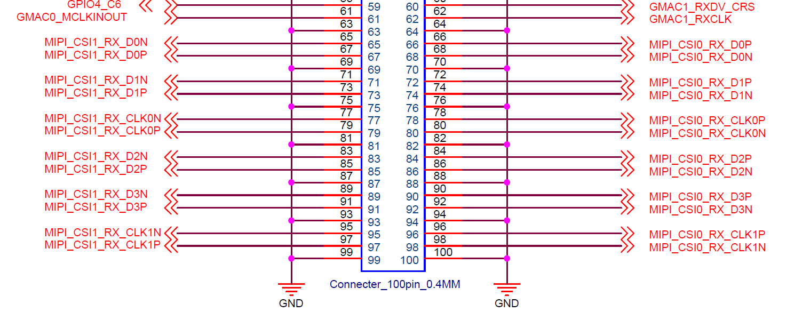

MIPI DPHY CSI0 RX interface mode:

Support x4Lane mode, MIPI\_CSI0\_D\[3:0] data reference MIPI\_CSI0\_CLK0

Support x2Lane+x2Lane mode:

♦ MIPI0\_CSI\_D\[1:0] data reference MIPI\_CSI0\_CLK0;

♦ MIPI0\_CSI\_D\[3:2] data refer to MIPI\_CSI0\_CLK1.

Two modes options：

| Option1| Sensor1    x4Lane| MIPI\_CSI\_RX\_D0-3 MIPI\_CSI\_RX\_CLK0
|:----------:|:----------:|:----------:
| Option2| Sensor1    x2Lane + Sensor2    x2Lane| MIPI\_CSI\_RX\_D0-1 MIPI\_CSI\_RX\_CLK0
| | | MIPI\_CSI\_RX\_D2-3 MIPI\_CSI\_RX\_CLK1

MIPI DPHY CSI1 RX interface mode:

- Support x4Lane mode, MIPI\_CSI1\_D\[3：0] data reference MIPI\_CSI0\_CLK0

- Support x2Lane+x2Lane mode:

♦ MIPI1\_CSI\_D\[1:0] data reference MIPI\_CSI1\_CLK0;

♦ MIPI1\_CSI\_D\[3:2] data refer to MIPI\_CSI1\_CLK1.

| Option1| Sensor1    x4Lane| MIPI\_CSI\_RX\_D0-3 MIPI\_CSI\_RX\_CLK0
|:----------:|:----------:|:----------:
| Option2| Sensor1    x2Lane + Sensor2    x2Lane| MIPI\_CSI\_RX\_D0-1 MIPI\_CSI\_RX\_CLK0
| | | MIPI\_CSI\_RX\_D2-3 MIPI\_CSI\_RX\_CLK1

##### **3.5.18.2 MIPI\_D/CPHY\_RX**

RK3588 has two MIPI D-PHY/C-PHY CSI RX Combo PHY

·D-PHY supports V1.2, D-PHY mode with 0/1/2/3 Lane, data transfer rate up to 2.5Gbps;

C-PHY supports V1.1 version, C-PHY mode has 0/1/2 Trio, 3 lines per Trio A/B/C, data transfer rate up to 5.7Gbps/Trio (2.5Gsps).

The OK3588 is configured for D-PHY function by default and the signal pins are as follows. If you need to configure it for C-PHY, please check the Pin Mux table for the multiplexing key.

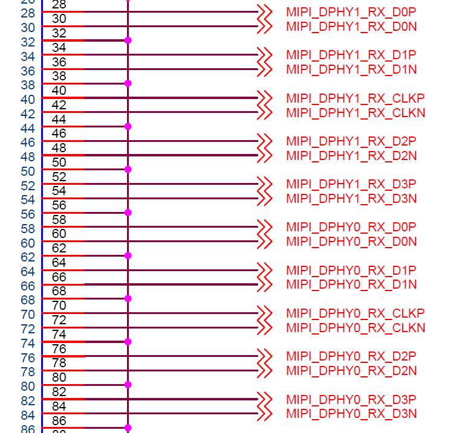

DPHY and CPHY configuration support:

The RK3588 has two D/CPHY Combo PHY, both supporting RX and TX interfaces, CPU pins are as follows:

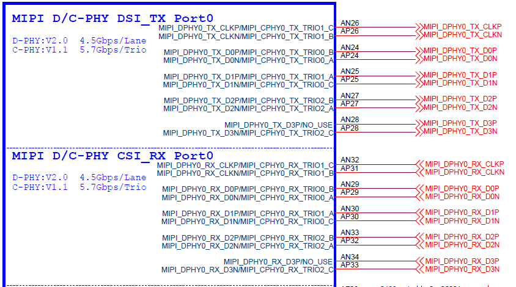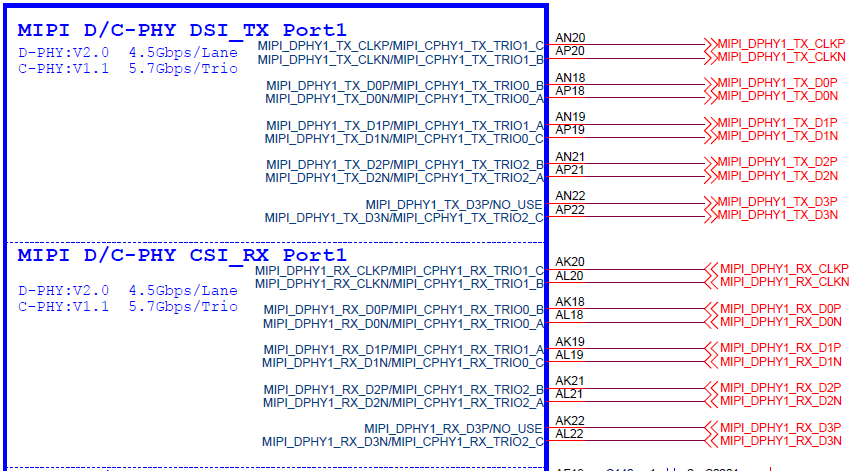

- MIPI D-PHY/C-PHY Combo PHY0 TX and RX can only be configured as DPHY0 TX, DPHY0 RX mode or CPHY0 TX, CPHY0 RX mode at the same time, and it does not support one configured as DPHY0 TX and another configured as CPHY0 RX;

- The TX and RX of MIPI D-PHY/C-PHY Combo PHY1 can only support being configured simultaneously in the DPHY1 TX and DPHY1 RX modes, or simultaneously in the CPHY1 TX and CPHY1 RX modes. It does not support one being configured as DPHY1 TX and the other as CPHY1 RX.

MIPI D/C-PHY0 support (In D-PHY time mode):

- Support x4Lane mode, MIPI\_DPHY0\_RX\_D\[3:0] data reference MIPI\_DPHY0\_RX\_CLK；

- Not support splitting into x2Lane+x2Lane mode;

MIPI D/C-PHY0 support (In C-PHY time mode):

- Support 0/1/2 Trio, 3 wires per Trio A/B/C, MIPI\_CPHY0\_RX\_TRIO\[2:0]\_A, MIPI\_CPHY0\_RX\_TRIO\[2:0]\_B, MIPI\_CPHY0\_RX\_TRIO\[2:0]\_C.

MIPI D/C-PHY1 support (In D-PHY time mode):

- Support x4Lane mode, MIPI\_DPHY1\_RX\_D\[3:0] data reference MIPI\_DPHY1\_RX\_CLK；

- Not support splitting into x2Lane+x2Lane mode;

MIPI D/C-PHY1 support (In C-PHY time mode):

- Support 0/1/2 Trio, 3 wires per Trio A/B/C, MIPI\_CPHY1\_RX\_TRIO\[2:0]\_A, MIPI\_CPHY1\_RX\_TRIO\[2:0]\_B, MIPI\_CPHY1\_RX\_TRIO\[2:0]\_C.

The OK3588 is configured with 5 Camera interfaces by default: MIPI\_DPHY0\_RX 4Lane, MIPI\_DPHY1\_RX 4Lane, MIPI CSI0 4Lane, MIPI CSI1 2Lane + MIPI CSI1 2Lane. The principle is as follows:

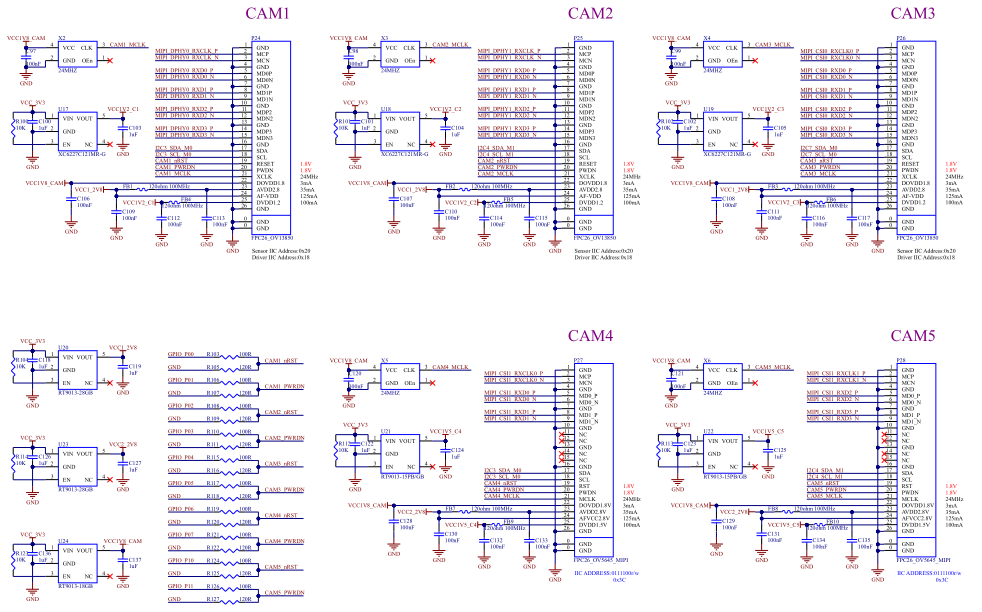

**MIPI RX Design Considerations:**

**1. Differential trace impedance requirement: 100 Ω ± 10%;**

**2. Single-ended trace impedance requirement: 50 Ω ± 10%;**

**3. Maximum time - delay difference within differential pair: \< 3mil;**

**4. Equal length between clock and data:＜6mil；**

**5. Spacing between differential pairs should be > 4 x MIPI trace, and at a minimum, it should be 3 times the MIPI trace;**

**6. Spacing between MIPI and other signals should be＞4 x MIPI trace, and at a minimum, it should be 3 times the MIPI trace;**

**7. For CPHY configuration, maximum delay difference within the group (TRIO \_ A \\ TRIO \_ B \\ TRIO \_ C):＜3mil；**

**8. Length matching requirement between groups (TRIO0\\TRIO1\\TRIO2) should be ＜50mil.**

##### **3.5.18.3 CIF**

Pin Multiplexing: Refer to the Pin Mux table for CIF interface reuse configurations. Voltage Level: The CIF interface operates at 3.3V; level shifting must be implemented to match the Camera module’s actual IO power supply requirements.

CIF support format:

- Support BT601 YCbCr 422 8bit input；

- Support BT656 YCbCr 422 8bit input；

- Support RAW 8/10/12bit input；

- Support BT1120 YCbCr 422 8/16bit input， single/dual-edge sampling；

- Support 2/4 mixed BT656/BT1120 YCbCr 422 8/16bit input；

- Support YUYV sequential configuration;

The 8/10/12/16bit data correspondence of CIF\[15:0] is shown in the table below, using high bit alignment.

| Mode| 16bit| 12bit| 10bit| 8bit
|:----------:|:----------:|:----------:|:----------:|:----------:
| CIF\_D0| D0 | -- | -- | -- |
| CIF\_D1| D1 | -- | -- | -- |
| CIF\_D2| D2 | -- | -- | -- |
| CIF\_D3| D3 | -- | -- | -- |
| CIF\_D4| D4 | D0 | -- | -- |
| CIF\_D5| D5 | D1 | -- | -- |
| CIF\_D6| D6 | D2 | D0 | -- |
| CIF\_D7| D7 | D3 | D1 | -- | 
| CIF\_D8| D8 | D4 | D2 | D0 | 
| CIF\_D9| D9 | D5 | D3 | D1 |
| CIF\_D10|D10| D6 | D4 | D2 |
| CIF\_D11|D11| D7 | D5 | D3 |
| CIF\_D12|D12| D8 | D6 | D4 |
| CIF\_D13| D13| D9| D7 | D5 |
| CIF\_D14| D14| D10| D8| D6 |
| CIF\_D15| D15| D11| D9| D7 |

Data correspondence relationship in BT1120 16-bit mode, supporting YC Swap.

| Pin Name| Default mode| | Swap open:| 
| :---: | :---: | --- | :---: |
| | Pixel #0 | Pixel #1 | Pixel #0 | Pixel #1 |
| CIF_D0 | Y0[0] | Y1[0] | Cb0[0] | Cr0[0] |
| CIF_D1 | Y0[1] | Y1[1] | Cb0[1] | Cr0[1] |
| CIF_D2 | Y0[2] | Y1[2] | Cb0[2] | Cr0[2] |
| CIF_D3 | Y0[3] | Y1[3] | Cb0[3] | Cr0[3] |
| CIF_D4 | Y0[4] | Y1[4] | Cb0[4] | Cr0[4] |
| CIF_D5 | Y0[5] | Y1[5] | Cb0[5] | Cr0[5] |
| CIF_D6 | Y0[6] | Y1[6] | Cb0[6] | Cr0[6] |
| CIF_D7 | Y0[7] | Y1[7] | Cb0[7] | Cr0[7] |
| CIF_D8 | Cb0[0] | Cr0[0] | Y0[0] | Y1[0] |
| CIF_D9 | Cb0[1] | Cr0[1] | Y0[1] | Y1[1] |
| CIF_D10 | Cb0[2] | Cr0[2] | Y0[2] | Y1[2] |
| CIF_D11 | Cb0[3] | Cr0[3] | Y0[3] | Y1[3] |
| CIF_D12 | Cb0[4] | Cr0[4] | Y0[4] | Y1[4] |
| CIF_D13 | Cb0[5] | Cr0[5] | Y0[5] | Y1[5] |
| CIF_D14 | Cb0[6] | Cr0[6] | Y0[6] | Y1[6] |
| CIF_D15 | Cb0[7] | Cr0[7] | Y0[7] | Y1[7] |

The CIF interface pull-up and pull-down, and matching design recommendations are as follows:

| Signal| Internal Pull-up\&down| Connection| Description (Chip side)
|:----------:|:----------:|----------|----------
| CIF\_D\[15:0]| Pull-down| Direct connection, it is recommended to leave a series resistance near the device end| CIF data input
| CIF\_HREF| Pull-down| Direct connection, it is recommended to leave a series resistance near the device end| CIF data input
| CIF\_VSYNC| Pull-down| Direct connection, it is recommended to leave a series resistance near the device end| CIF data input
| CIF\_CLKIN| Pull-down| Connect 22ohm resistors in series, near the device side| CIF data input
| CIF\_CLKOUT| Pull-down| Connect 22ohm resistor in series, near the chip side| CIF clock output, which can be provided to the device as MCLK

**Camera Design Considerations：**

**1. The Camera's DVDD power supply may vary (e.g., 1.2V/1.5V/1.8V). Provide the correct voltage as specified in the Camera datasheet (default reference: 1.2V)；**

**2. For Cameras with high DVDD current (>100mA), it’s recommended to use DCDC for power supply;**

**3. Follow the Camera's specified power-up sequence (default reference sequence: 1.8V → 1.2V → 2.8V). Adjust as per the datasheet；**

**4. The CIF interface defaults to 3.3 V, and level matching needs to be considered;**

**5. If the Camera includes an autofocus (AF) function, provide a separate VCC2V8\_AF supply or share it with AVCC2V8\_DVP using a ferrite bead for isolation；**

**6. All decoupling capacitors for the power supplies of the Camera must be retained and placed close to the connector (or socket) ;**

**7. The Camera's PWDN (power-down) signal must be controlled via a GPIO. Ensure the GPIO voltage level matches the Camera's IO level;**

**8. It is recommended to use GPIO to control the Reset signal of the Camera. The GPIO level must match the Camera IO level. The 100nF capacitor of the Reset signal should not be removed. Place it close to the connector to enhance the anti - static ability;**

**9.  MCLK Clock Source Options:**

**（1）CIF\_CLKOUT**

**（2）MIPI\_CAMERA0\_CLK**

**（3）MIPI\_CAMERA1\_CLK**

**（4）MIPI\_CAMERA2\_CLK**

**（5）MIPI\_CAMERA3\_CLK**

**（6）MIPI\_CAMERA4\_CLK**

**The clock level must match the Camera IO level. If not, the level must be matched by level conversion or resistance voltage division;**

**10. If two Cameras are of the same model, pay attention to whether the I2C address is the same. If the address is the same, two I2C buses are needed.**

##### **3.5.18.4 HDMI2.0 RX**

RK3588 chip supports HDMI 2.0 RX, downward compatible with HDMI 1.4b; supports RGB/YUV444/YUV422/YUV420 formats; up to 4K@60Hz input

HDMI RX TMDS signal is shown below and requires a 2.2ohm resistor to be reserved near the HDMI RX seat, which must not be removed to enhance anti-static surge capability.

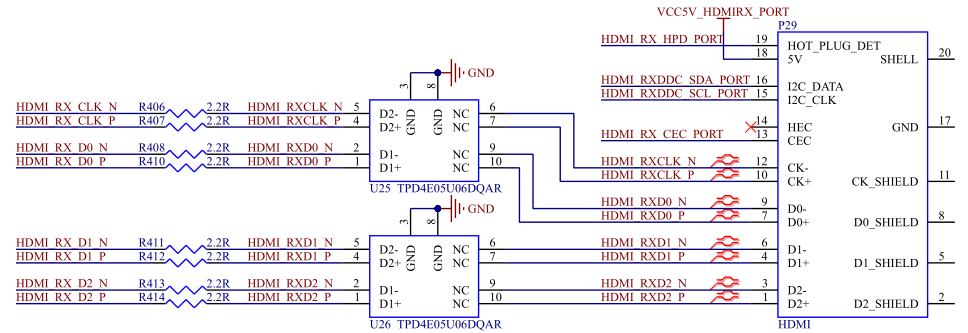

HDMI\_RX\_HPDOUT is a function where the HDMI RX controller is multiplexed to a general GPIO. Its level depends on the voltage of the power domain it's in. Check the Pin Mux table for specific multiplexed pins and levels. 

As the HDMI RX controller does not support hardware detection Source plug-in, detection can only be done on software, the hardware circuit is as follows:

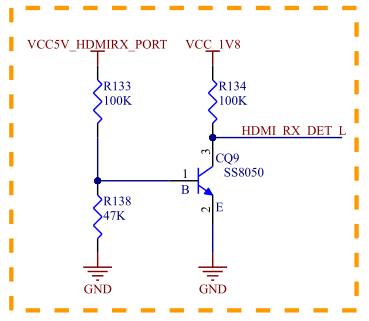

After detecting the HDMI\_RX\_DET\_L pull-down action, HDMI\_RX\_HPDOUT\_M2 outputs a high level, Q10 conducts, and VCC5V\_HDMIRX\_PORT sends 5V to HDMI\_RX\_HPD\_PORT to complete the handshaking action with the Source side.

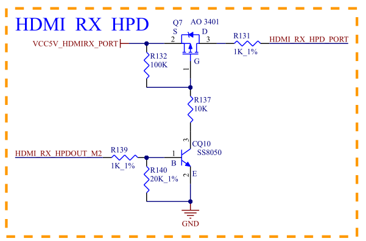

HDMI\_RX\_CEC is the HDMI controller CEC function multiplexed to the general GPIO, the specific pins, please check the Pin Mux table; level with the power domain voltage where the power domain supply voltage has changed, the peripheral circuit pull-up resistor power must also be adjusted synchronously.

The selected CEC signal for HDMI\_RX\_CEC\_M2; the pin level is 1.8V, so the external need to add a level conversion circuit, Q6 default selection 2SK3018, if you want to change other models, the junction capacitance must be equivalent; if the junction capacitance is too large, not only will affect the work, the certification will not pass. Reference schematic diagram as follows:

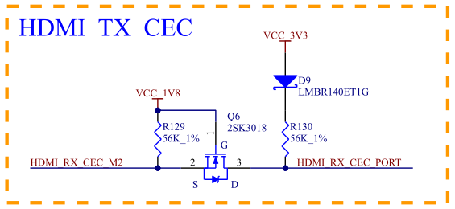

HDMI\_RX DDC\_SCL/DDC\_SDA is the HDMI RX controller I2C/DDC bus, which is led out from general GPIO, please refer to the Pin Mux table for the specific pins that can be multiplexed on IO; the level changes with the voltage of the power supply domain where it is located, and the pull-up resistor power supply of the peripheral circuit must also be adjusted simultaneously.

Although the DDC\_SCL/DDC\_SDA protocol specifies a 5V level, the RK3588 IO does not support a 5V level, so the level conversion circuit need to be added and can not be deleted. The default is to use MOS tube level conversion, and the MOS type is 2SK3018; If the model needs to be changed, the junction capacitance must be equivalent, because the junction capacitance is too large, not only affecting the work and also affect the certification leading to failing certification.

It is recommended to refer to the default value for the pull-up resistance and can not be modified arbitrarily.

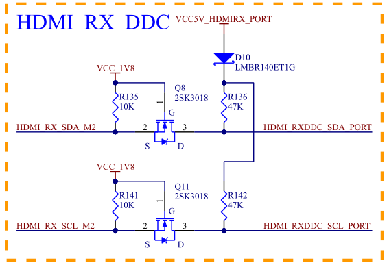

**Design Considerations:**

**1. It is recommended to place a 0.1 uF decoupling capacitor on the Pin18 pin of the HDMI socket, and place it close to the HDMI socket pin when routing out. To strengthen the anti-static capability, ESD devices must be reserved on the signal. ESD parasitic capacitance of HDMI 2.0 signal should not exceed 0.4pF. It is recommended to use no more than 1pF for other signals of ESD parasitic capacitance.**

**2. The differential impedance of the traces should be controlled within 100 ohms ± 10%;**

**3. The maximum time - delay difference within differential pair should be \< 3mil;**

**4. The clock and data equal length should be \< 200 mil;**

**5. The spacing between differential pairs should be at least 5 times the HDMI trace width;**

**4. The spacing between HDMI signals and other signals should be at least 4 times the HDMI trace width.**

#### 3.5.19  Video Output Interface

The VOP controller of RK3588 chip, with four Port outputs, supports DP0/DP1/HDMI0/eDP0/HDMI1/eDP1/MIPI DSI0/MIPI DSI1/BT656/BT1120 video interface outputs.

Up to 4 screens are allowed to be displayed differently, such as 4K+4K+4K+2K, and if supports 8K, then only supports 8K+4K+2K (where 8K is achieved by Post Process0+ Post Process1 merging).

VOP and video interface output path diagrams are as follows:

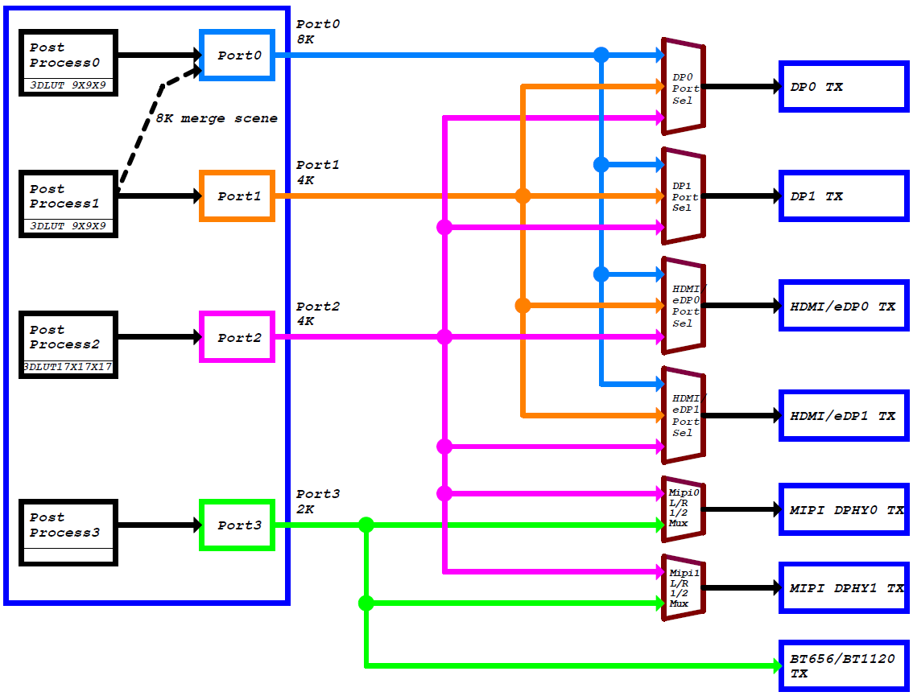

##### **3.5.19.1 HDMI2.1/eDP TX Interface**

RK3588 has 2 x built-in HDMI/eDP TX Combo PHY.

-HDMI/eDP TX Combo PHY supports the following two modes:

-HDMI TX mode: maximum resolution support 8K@60Hz, support RGB/YUV444/YUV420 (Up to 10bit) format;

-eDP TX mode: Maximum resolution support 4K@60Hz, support RGB/YUV422(Up to 10bit) format.

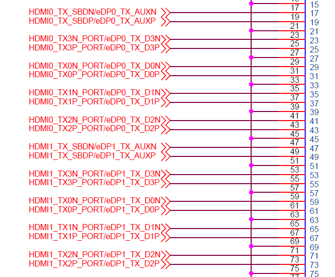

**·HDMI2.1 TX Mode**

RK3588 supports HDMI 2.1 and downward for HDMI 2.0, compatible with HDMI 1.4. Because HDMI 2.1 works in FRL mode and works in TMDS mode, when switching to HDMI 2.0 and below, it will work in TMDS mode, so the AC coupled voltage mode driver is used.

As shown in the figure below, the AC coupling capacitor capacitance is 220nF, which cannot be changed at will; because the lower ESR and ESL can also reduce the impedance change on the line, it is recommended to use the 0201 packaging for the AC coupling capacitor.

Taking HDMI TX0 as an example, HDMI TX1 and HDMI TX0 are consistent.

Operating in HDMI 2.1 mode, HDMI0\_TX\_ON\_H is configured low, Q15, Q16, Q17, Q18 are not on.

When operating in HDMI 2.0 and below mode, HDMI0\_TX\_ON\_H is configured high, Q15, Q16, Q17, and Q18 are on, and a DC bias of approximately 3V is formed by a 499ohm resistor to ground and a 50ohm pull-up resistor on the Sink side.

**Design Considerations:**

**When only HDMI 2.0 and lower modes need to be supported, components Q15, Q16, Q17, and Q18 must not be omitted. It is essential to ensure that the transistors remain non-conductive when the device is powered off, as the HDMI CTS Test ID 7-3 TMDS Voff test requires that the Voff voltage stays within ±10mV of AVcc when the Device Under Test (DUT) is unpowered; otherwise, this test item will fail.**

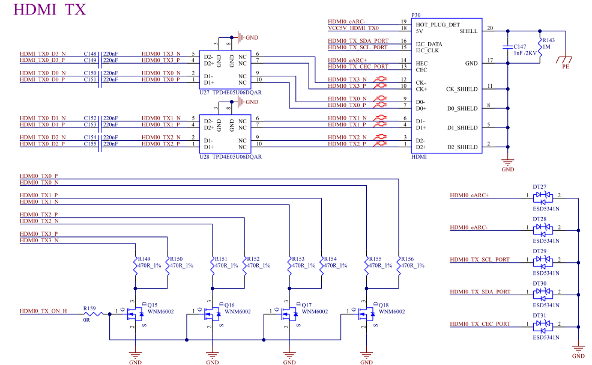

FRL mode: In the traditional TMDS architecture, a separate channel is used to transmit the Clock. But in the FRL architecture, the Clock is embedded in the Data channel, and the Clock is resolved at the Sink side through the Clock Recovery.

FRL rate vs. channel relationship:

| Channel Rate| Channel Quantity
|:----------:|:----------:
| 3Gbps| 3
| 6Gbps| 3
| 6Gbps| 4
| 8Gbps| 4
| 10Gbps| 4
| 12Gbps| 4

It supports ARC/eARC via HDMI0\_TX\_SBDP/HDMI0\_TX\_SBDN signal to parse out audio data inside RK3588.

HDMI\_TX0\_HPD is the HDMI TX controller multiplexed to the general GPIO; the level changes with the voltage of the power supply domain where it is located, and the pull-up resistor power supply of the peripheral circuit must also be adjusted simultaneously.

HDMI\_TX0\_CEC is the multiplexing of the HDMI controller's CEC function to a general GPIO. Its level varies with the power domain voltage. If the power domain supply voltage changes, the power supply of the pull-up resistor in the peripheral circuit must be adjusted synchronously.

The CEC protocol specifies a 3.3V level. However, the protocol requires that the leakage should not exceed 1.8uA when adding 3.3V to the CEC pin through a 27K resistor.

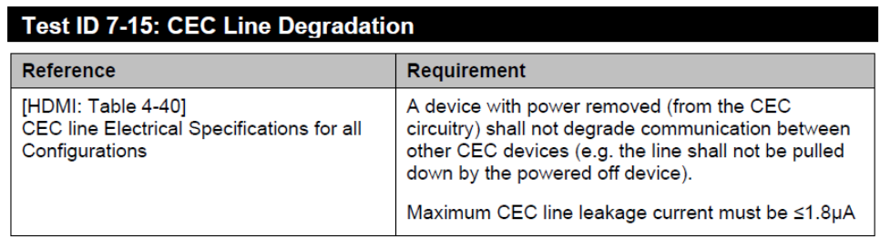

RK3588 IO Domain Leakage will occur if there is a voltage at IO in the power-down state. For example, the RK3588 is a power failure, and its HDMI cable is in connection to the Sink side (TV or monitor); meanwhile, the CEC at the Sink side has power and leaks through the HDMI cable to the RK3588 IO, which will cause the CEC to leak more than 1.8uA, so an external isolation circuit is necessary. We can not modify the R158 resistance at will, and we need to use 27Kohm, Q14 default, and selection 2SK3018. If needing to change other models, the junction capacitor must be the equivalent, if not, it will not only affect the work but will also affect the certification through.

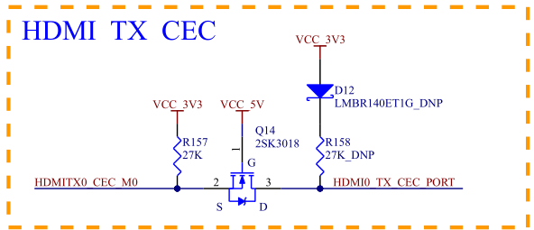

HDMI\_TX0/1 DDC\_SCL/DDC\_SDA is the HDMI TX0/1 controller I2C/DDC bus, which is led out from general GPIO; the level changes with the voltage of the power supply domain where it is located, and the pull-up resistor power supply of the peripheral circuit must also be adjusted simultaneously.

Although the DDC\_SCL/DDC\_SDA protocol specifies a 5V level, the RK3588 IO does not support a 5V level, so the level conversion circuit need to be added and can not be deleted. The default is to use MOS tube level conversion, and the MOS type is 2SK3018; If the model needs to be changed, the junction capacitance must be equivalent, because the junction capacitance is too large, not only affecting the work and also affect the certification leading to failing certification.

It is recommended to refer to the default value for the pull-up resistance and not to modify it arbitrarily.

The D11 diode cannot be removed and is used to prevent leakage from the Sink side to VCC\_5V0.

1K in series between MOS gate for SDA signal level conversion and power supply; A 100pF is connected in parallel between the MOS gate and source to improve the timing and can not be removed.

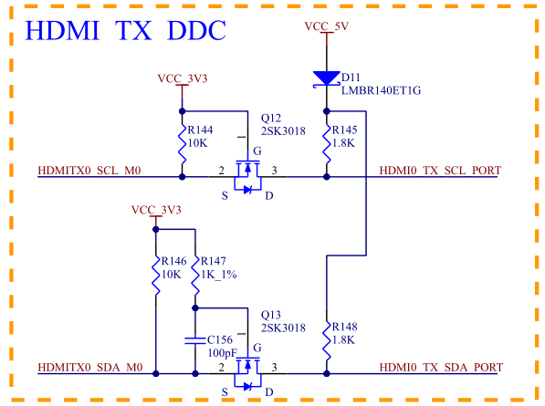

HDMI holder Pin18 voltage needs to be kept between 4.8-5.3V, 1uF decoupling capacitor needs to be placed on the pin, which must not be deleted, and the layout is placed close to the HDMI holder pin.

To strengthen the anti-static capability, ESD devices must be reserved on the signal. ESD parasitic capacitance of HDMI2.1 signal must not exceed 0.2pF.

ESD parasitic capacitance for other signals is recommended to use no more than 1pF.

**Design Considerations:**

**1. The Coss of the controlling MOSFET should not be excessively high, as it may degrade signal quality. It is recommended to select a MOSFET model as per the reference design or with a corresponding Coss value;**

**2.  Wire impedance control differential 100ohm ± 10%;**

**3. Maximum Skew Within Differential Pair: \< 3mil;**

**4. Equal Length Requirement Between Differential Pairs＜200mil;**

**5. Spacing Between Differential Pairs：no less than 7 times the width of the HDMI trace；**

**6. Spacing Between HDMI and other signals: ≥7 times the HDMI trace;**

**7.  It is recommended to avoid vias;**

**8.  I/O-to-ground capacitance： ≤0.2 pF.**

**-eDP TX Mode**

Support eDP V1.3 version, total 4Lane, eDP TX maximum output resolution up to 4K@60Hz

- Support 1.62/2.7/5.4Gbps per Lane rate;

- Support 1Lane or 2Lane or 4Lane mode;

- Support AUX channel with rate up to 1Mbps.

Take eDP TX0 as an example, eDP TX1 is the same as eDP TX0.

eDP\_TX0\_D0P/D0N, eDP\_TX0\_D1P/D1N, eDP\_TX0\_D2P/D2N, eDP\_TX0\_D3P/D3N need 100nF AC coupling capacitor in series; because the lower ESR and ESL can also reduce the impedance change on the line, it is recommended to use the 0201 packaging for the AC coupling capacitor, and the layout is placed close to the FET3588-C pin.

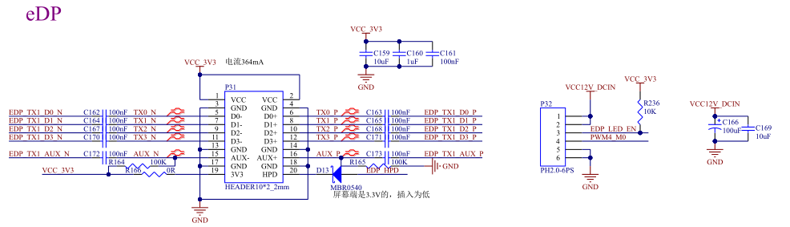

**Design Considerations:**

**1. The differential impedance of the traces should be controlled within 85 ohms ± 10%;**

**2. The maximum delay difference within each differential pair should be ＜3mil；**

**3. The spacing between differential pairs should be at least 4 times the EDP trace width;**

**4. The spacing between EDP signals and other signals should be at least 4 times the EDP trace width;**

**5.  It is recommended that the number of vias allowed for each signal does not exceed 2.**

##### **3.5.19.2 MIPI\_D/CPHY\_TX**

RK3588 has two MIPI D-PHY/C-PHY Combo PHY TX:

- D-PHY supports V1.2, D-PHY mode with 0/1/2/3 Lane, data transfer rate up to 2.5Gbps;

- C-PHY supports V1.1 version, C-PHY mode has 0/1/2 Trio, 3 lines per Trio A/B/C, data transfer rate up to 5.7Gbps/Trio (2.5Gsps).

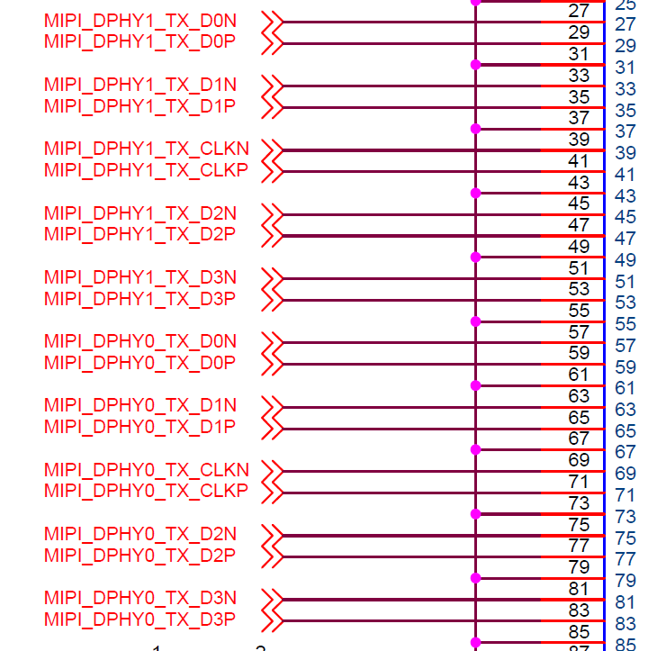

DPHY and CPHY configuration support:

- MIPI D-PHY/C-PHY Combo PHY0 TX and RX can only be configured as DPHY0 TX, DPHY0 RX mode or CPHY0 TX, CPHY0 RX mode at the same time, and it does not support one configured as DPHY0 TX and another configured as CPHY0 RX;

- The TX and RX of MIPI D-PHY/C-PHY Combo PHY1 can only support being configured simultaneously in the DPHY1 TX and DPHY1 RX modes, or simultaneously in the CPHY1 TX and CPHY1 RX modes. It does not support one being configured as DPHY1 TX and the other as CPHY1 RX.

MIPI D/C-PHY0 support (In D-PHY time mode):

- Support x4Lane mode, MIPI\_DPHY0\_TX\_D\[3：0] data reference MIPI\_DPHY0\_TX\_CLK;

MIPI D/C-PHY0 support (In C-PHY time mode):

- Support 0/1/2 Trio, 3 wires per Trio A/B/C, MIPI\_CPHY0\_TX\_TRIO\[2:0]\_A, MIPI\_CPHY0\_TX\_TRIO\[2:0]\_B, MIPI\_CPHY0\_TX\_TRIO\[2:0]\_C.

MIPI D/C-PHY1 support (In D-PHY time mode):

- Support x4Lane mode, MIPI\_DPHY1\_TX\_D\[3：0] data reference MIPI\_DPHY1\_TX\_CLK;

MIPI D/C-PHY1 support (In C-PHY time mode):

- Support 0/1/2 Trio, 3 wires per Trio A/B/C, MIPI\_CPHY1\_TX\_TRIO\[2:0]\_A, MIPI\_CPHY1\_TX\_TRIO\[2:0]\_B, MIPI\_CPHY1\_TX\_TRIO\[2:0]\_C.

**Design Considerations:**

**1.  Wire impedance control differential 100ohm ± 10%;**

**2. Maximum Skew Within Differential Pair: \< 3mil;**

**3. Equal length between clock and data＜6mil；**

**4. Recommended equal length between differential pairs: ≥ 4 times the MIPI trace width, and ≥ 3 times the MIPI trace width;**

**5.  Spacing between MIPI signals and other signals: Spacing ≥ 4 times MIPI trace width and ≥ 3 × MIPI trace width;**

**6.  For CPHY, the single-ended trace impedance should be controlled at 50 Ω ± 10%;**

**7. The maximum time delay difference within a group (TRIO\_A\\TRIO\_B\\TRIO\_C) should be \< 3 mil;**

**8. The length matching requirement between groups (TRIO0\\TRIO1\\TRIO2) should be \< 50 mil;**

**9. It is recommended that the number of vias allowed for each signal should ≤ 2;**

**10. It is recommended that the spacing between differential pairs should ≥ 4 × MIPI trace width;**

**11. It is recommended that the spacing between MIPI and other signals should ≥ 4 × MIPI trace width.**

##### **3.5.19.3 DP TX**

RK3588 supports two DP1.4 TX PHY (and USB3.0 Combo), output resolution up to 8K@30Hz

- Each Lane rate can support 1.62/2.7G/5.4/8.1Gbps;

- Supports 1Lane or 2Lane or 4Lane mode;

- Supports RGB/YUV (Up to 10bit) format;

- Supports Single Stream Transport (SST).

Please refer to section 3.5.15 for the USB pin multiplexing.

**Design Considerations:**

**1. The 100nF AC coupling capacitors need to be connected in series with DP0\_TX\_D0P/D0N, DP0\_TX\_D1P/D1N, DP0\_TX\_D2P/D2N, DP0\_TX\_D3P/D3N, DP1\_TX\_D0P/D0N, DP1\_TX\_D1P/D1N, DP1\_TX\_D2P/D2N, and DP1\_TX\_D3P/D3N. It is recommended to use the 0201 package for the AC coupling capacitors, as they have lower ESR and ESL and can also reduce the impedance variation on the line. During layout, place them close to the FET3588 - C pins;**

**DP1\_TX\_D0P/DON、DP1\_TX\_D1P/D1N、DP1\_TX\_D2P/D2N、DP1\_TX\_D3P/D3N需要串接的100nF交流耦合电容，交流耦合电容建议使用0201封装，更低的ESR和ESL，也可减少线路上的阻抗变化，布局时，靠近FET3588--C管脚放置；**

**2. The trace impedance should be controlled at a differential 100 ohm ± 10% (when used only as a DP interface without multiplexing), and a differential 95 ohm ± 10% (when USB3.0/DP1.4 is multiplexed);**

**3. The delay difference within the differential pair should be ＜3mil；**

**4. Equal Length Requirement Between Differential Pairs＜500mil；**

**5. Spacing Between Differential Pairs：no less than 6 times the width of the DP trace；**

**6. It is recommended that the spacing between DP and other signals should ≥ 6 × DP trace width.**

**7. It is recommended that the number of vias allowed for each signal should ≤ 2;**

**8.  I/O-to-ground capacitance： ≤0.2 pF.**

##### **3.5.19.4 BT1120 TX**

The RK3588 supports 16bit BT1120 output interface with maximum output resolution up to 1920X1080@60Hz; it is compatible with 8bit BT656 interface, supporting PAL and NTSC.

The OK3588 multiplexes this group of signals into other functions such as GPIO. If we want match it to BT1120 TX interface, please refer to the Pin Mux table for the multiplexing relationship.

The BT1120 and BT656 multiplexing relationships are as follows:

| Pin Name| BT656（8bit）| BT1120（16bit）
|:----------:|:----------:|:----------:
| :---: | :---: | :---: |
| BT1120_CLKOUT | CLKOUT | CLKOUT |
| BT1120_D15 | -- | D15 |
| BT1120_D14 | -- | D14 |
| BT1120_D13 | -- | D13 |
| BT1120_D12 | -- | D12 |
| BT1120_D11 | -- | D11 |
| BT1120_D10 | -- | D10 |
| BT1120_D9 | -- | D9 |
| BT1120_D8 | -- | D8 |
| BT1120_D7 | D7 | D7 |
| BT1120_D6 | D6 | D6 |
| BT1120_D5 | D5 | D5 |
| BT1120_D4 | D4 | D4 |
| BT1120_D3 | D3 | D3 |
| BT1120_D2 | D2 | D2 |
| BT1120_D1 | D1 | D1 |
| BT1120_D0 | D0 | D0 |

Data correspondence relationship in BT1120 output, supporting YC Swap.

| Pin Name| Default mode| | Swap open:| 
| :---: | :---: | --- | :---: |
| | Pixel #0 | Pixel #1 | Pixel #0 | Pixel #1 |
| BT1120_D0 | Y0[0] | Y1[0] | Cb0[0] | Cr0[0] |
| BT1120_D1 | Y0[1] | Y1[1] | Cb0[1] | Cr0[1] |
| BT1120_D2 | Y0[2] | Y1[2] | Cb0[2] | Cr0[2] |
| BT1120_D3 | Y0[3] | Y1[3] | Cb0[3] | Cr0[3] |
| BT1120_D4 | Y0[4] | Y1[4] | Cb0[4] | Cr0[4] |
| BT1120_D5 | Y0[5] | Y1[5] | Cb0[5] | Cr0[5] |
| BT1120_D6 | Y0[6] | Y1[6] | Cb0[6] | Cr0[6] |
| BT1120_D7 | Y0[7] | Y1[7] | Cb0[7] | Cr0[7] |
| BT1120_D8 | Cb0[0] | Cr0[0] | Y0[0] | Y1[0] |
| BT1120_D9 | Cb0[1] | Cr0[1] | Y0[1] | Y1[1] |
| BT1120_D10 | Cb0[2] | Cr0[2] | Y0[2] | Y1[2] |
| BT1120_D11 | Cb0[3] | Cr0[3] | Y0[3] | Y1[3] |
| BT1120_D12 | Cb0[4] | Cr0[4] | Y0[4] | Y1[4] |
| BT1120_D13 | Cb0[5] | Cr0[5] | Y0[5] | Y1[5] |
| BT1120_D14 | Cb0[6] | Cr0[6] | Y0[6] | Y1[6] |
| BT1120_D15 | Cb0[7] | Cr0[7] | Y0[7] | Y1[7] |

**Design Considerations:**

**1. The default pin level of BT1120 output interface is 3.3V, which needs to be matched according to the actual IO power supply requirements of the peripheral device. If you need to change it to 1.8V, please contact Forlinx;**

**2.  The following table is the recommended table for pull-up and pull-down and matching design of BT1120 output interface:**

| **Signal**| **Internal Pull-up\&down**| **Connection**| **Description (Chip side)**
|:----------:|:----------:|----------|----------
| **BT1120\_D\[15:0]**| **Pull-down**| **Direct connection is allowed. If feasible, reserve series resistors near the FET3588-C terminal.**| **BT1120 Data Output**
| **BT1120\_CLK**| **Pull-down**| **Series resistor: 22ohm, placed close to the device end.**| **BT1120 Clock Output**

**3.  When implementing board-to-board connection, it is recommended to connect a 22 - 100 ohm resistor in series (the resistance value should meet SI test requirements), and reserve space for TVS devices.**

## 4\. Connector Dimension Diagram

SoM Connector Dimension:

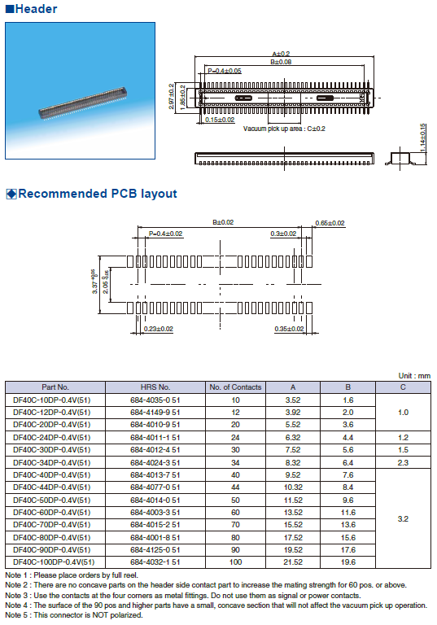

Carrier board Connector Dimension:

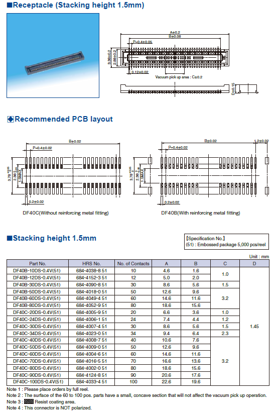

## 5\. OK3588-C Development Board Power Consumption Table

Table1. Android System Consumption

| **No.**| **Test Item**| **SoM Power (W)**| **Development board power（W）**
|:----------:|:----------:|:----------:|:----------:
| 1| No-load starting peak power| 7.09| 10.08
| 2| No-load standby peak power| 1.63| 4.10
| 3| Antutu running score| 6.60| 9.60
| 4| PWRON \_ L key sleep power consumption| 1.32| 3.56
| 5| PWRON \_ L key  shutdown consumption| 0.34| 0.36

Table 2. Linux system power consumption

| **No.**| **Test Item**| **SoM Power (W)**| **Development board power（W）**
|:----------:|:----------:|:----------:|:----------:
| 1| No-load starting peak power| 9.00| 9.60
| 2| No-load standby peak power| 2.37| 3.60
| 3| CPU Stress + Memory + eMMC Read/Write Stress Test| 6.98| 10.00
| 4| PWRPN\_L key sleep power consumption| 0.59| 2.53

**Note：**

**1. Peak Current: Maximum current value during booting;**

**2\. Stable Value: Current value stays on the boot screen after booting.**

****

## 6\. Minimum System Schematic

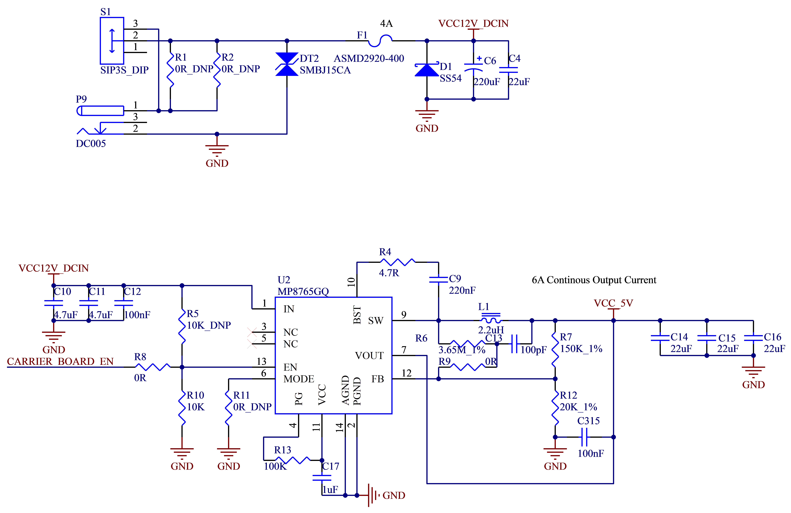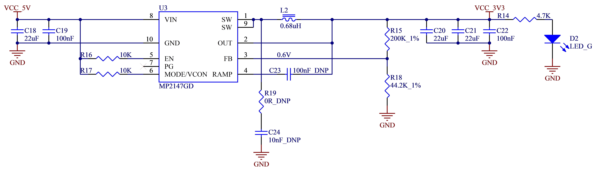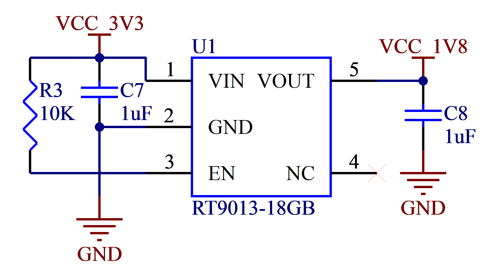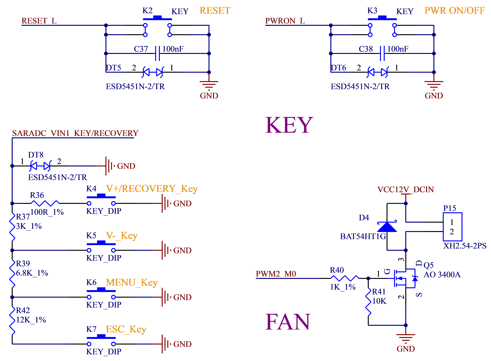

**Note: **

**1. The minimum system includes SoM power supply, system flash circuit, and debugging serial port circuit;**

**2. The factory image of OK3588 - C will load the PCIE3.0 driver during startup. At this time, it will detect the two external clock input signals PCIE30\_PORT0\\1\_REFCLK\_IN\_P\\N;**

**3. If these two clock inputs are not available, the system will be stuck in the process and fail to start. When the PCIE3.0 clock circuit is not designed, you can simply disable the corresponding function in the device tree.**